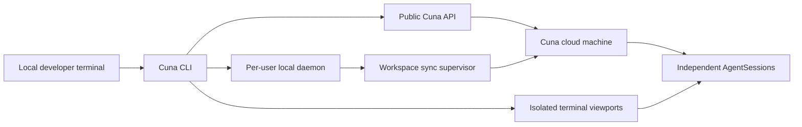

# Cuna CLI

[](https://github.com/Cuna-Labs/cuna-cli/actions/workflows/ci.yml)
[](https://github.com/Cuna-Labs/cuna-cli/actions/workflows/codeql.yml)
[](LICENSE)
[](package.json)

Run cloud development agents from a local terminal through Cuna's public,
policy-enforced control plane.

Cuna CLI is designed to make Claude Code, Codex, OpenClaw, and future agents
feel local while their processes, durable sessions, and isolated workspaces run
on Cuna cloud machines. The CLI keeps machine lifecycle, synchronization,
authorizations, and runtime evidence explicit instead of hiding them behind an
opaque remote shell.

> [!WARNING]
> Cuna CLI is under active implementation and is not GA. The npm, Bun, curl,
> Homebrew, and AUR commands below are the approved distribution interfaces;
> this repository does not claim that every channel is live yet.

## Current capabilities

- Versioned human and JSON output with stable error and exit-code categories.
- Exact public Cuna API-origin validation and bounded authenticated transport.
- Polling-only browser sign-in contracts with PKCE, OS-vault refresh rotation,
  and memory-only access tokens; native Windows browser and vault adapters are
  still blocked and fail closed.
- Capability discovery that treats absent, stale, contradictory, or unknown
  evidence as unauthorized for mutation.
- Machine and AgentSession command foundations over public Cuna contracts.
- Explicit Windows, macOS, and Linux path/configuration adapters.
- Network-free installed-artifact identity and self-test.
- Fail-closed gates for features whose producer contract or runtime is not yet
  available.

Foreground terminal attachment is implemented as a capability-gated preview and
fails before terminal ownership unless the server proves a current native
AgentSession terminal producer. Daemon integration, workspace synchronization, and
the local companion remain pre-release work. Browser authentication is
implemented against the local public 1.5.0 candidate contract. Its immutable
contract gitlink and provenance approval remain release-blocked.
Canonical contract approval, producer deployment and native Windows adapters
remain blocked. Source code or a documented interface is not evidence that a
capability is deployed.

The Windows native credential and browser boundary additionally requires an
owned `CreateProcessW` process handle to remain live through loaded-image
verification and protected-stdin handoff. PID-only or path-only checks are not
accepted. Until that authority is implemented, signed, and independently
verified, those native operations and the release remain blocked.

## Quick start for contributors

Node.js 22.17.1+ on the Node 22 line or Node.js 24.4.1+ on the Node 24 line is
required. The npm payload is architecture-neutral for x64 and arm64. The
release-admitted distribution matrix remains x64 until the non-authorizing
arm64 installed-artifact lanes produce reviewable receipts.

```sh
git clone https://github.com/Cuna-Labs/cuna-cli.git
cd cuna-cli
npm ci --ignore-scripts
npm run lint
npm run typecheck
npm test
```

Inspect the local build without making a network request:

```sh
node dist/bin/cuna.js self-test --offline --json
node dist/bin/cuna.js version --json
```

## Installation interfaces

| Surface | Command | Platform | Current status |
| --- | --- | --- | --- |
| npm | `npm install -g @cuna_labs/cli` | Architecture-neutral payload; Windows, macOS, and Linux arm64 remain observational | Not live; canonical publication is gated and x64 is the release-admitted matrix |
| Bun | `bun add --global @cuna_labs/cli` | Linux x64 and Intel macOS x64; Windows x64 is explicitly blocked | Not live; Windows must use the npm command until Bun proves clean global uninstall |
| curl | `curl -fsSL https://getcuna.com/install \| sh` | Intel macOS x64, Linux x64 | Not live; endpoint and recovery evidence are pending |
| Homebrew | `brew install Cuna-Labs/tap/cuna` | Intel macOS x64, Linux x64 | Not live; tap and installed-product evidence are pending |
| paru/AUR | `paru -S cuna-cli-bin` | Arch Linux x64 | Not live; AUR ownership and installed-product evidence are pending |

Every projection must install the exact admitted npm tarball. No channel may
rebuild, patch, or independently version the CLI.

Windows remains a Tier-1 Cuna platform through npm. Bun 1.3.14 removes the
global package record and package directory on Windows but leaves its generated
`cuna.exe` and `cuna.bunx` shims behind. Cuna does not claim ownership of those
package-manager paths and will not delete them from a lifecycle script. The Bun
Windows projection remains release-blocked until a supported Bun release proves
isolated install, public-shim execution, uninstall, and zero remaining managed
paths on every admitted Windows Node lane. Use
`npm install -g @cuna_labs/cli` on Windows.

## Command surface

The current foundation exposes:

```text
cuna capabilities
cuna login
cuna whoami
cuna logout
cuna machines list
cuna machines create --name NAME --idempotency-key KEY --yes
cuna machines start|pause|resume|stop ID --yes
cuna machines delete ID --yes
cuna agent-sessions list --machine ID
cuna agent-sessions create --machine ID --agent claude-code --idempotency-key KEY --yes
cuna config get
cuna self-test --offline --json
cuna version --json
```

Commands that depend on an unavailable producer or runtime return a stable
unsupported/capability error and do not simulate a machine, session, or
successful mutation.

### Foreground terminal keys

When the foreground terminal capability becomes available, `Ctrl+]` is Cuna's
local escape prefix. `Ctrl+] ?` toggles trusted in-terminal help; `Ctrl+] 1`…
`4` selects a tab, `Ctrl+] n` selects the next tab, `Ctrl+] d` detaches the
local view, and `Ctrl+] Ctrl+]` sends a literal prefix to the cloud session.
These keys are ignored as Cuna commands inside bracketed paste. Ordinary
`Ctrl+C` and `Ctrl+Z` continue to the selected cloud session.

## Exit codes

The exit code is the entire contract for a caller that is not a human, and this
build is used almost exclusively that way. `3`, `7` and `8` all mean "the command
did not do what you asked" and each demands a different response: replace the
credential, treat the answer as untrustworthy, or stop asking this deployment for
this operation. Reading them as one undifferentiated failure loses that.

The table is projected from the `EXIT_CODES` map in `src/core/errors.ts`; the
descriptions live beside it in `src/core/exit-codes.ts`, and
`test/exit-code-contract.test.mjs` pins every number against a literal so a code
cannot change meaning without a named test failing.

<!-- BEGIN GENERATED: exit-codes -->
| Exit code | Name | Meaning | One reachable path |
| --- | --- | --- | --- |
| `0` | `success` | The command completed and the record it printed is authoritative. | `cuna self-test --offline` verifies the installed artifact without a network request and returns. |
| `2` | `usage` | The invocation or the resolved configuration is invalid. | `cuna nonsense` fails the command preflight with `cuna.usage.invalid`. Nothing is sent to the server. |
| `3` | `auth` | No usable credential, a rejected credential, or an auth-mode conflict. | `cuna whoami` while `CUNA_API_KEY` is set mints `cuna.auth.mode_conflict`. A credential the server refuses arrives as `cuna.auth.rejected` from HTTP 401. |
| `4` | `policy` | Understood and refused by policy, including a required confirmation. | `cuna machines delete ID` without `--yes` mints `cuna.confirmation.required`. A server refusal arrives as `cuna.policy.denied` from HTTP 403. |
| `5` | `network` | No authoritative answer arrived: timeout, cancellation, 429, or 5xx. | a request exceeding `--timeout-ms` mints `cuna.network.timeout`. HTTP 429 and 5xx arrive as `cuna.network.rate_limited` and `cuna.network.service_unavailable`. |
| `6` | `conflict` | Current state contradicts the change; repeating it unchanged repeats this. | HTTP 409 mints `cuna.remote.conflict`. A foreground attach to a session already held mints `cuna.runtime.session_conflict`. |
| `7` | `remote` | The server answered, but not in a way the published contract allows. | `cuna account show` against a deployment whose body fails contract decoding mints `cuna.remote.malformed_response`. A 404 that does carry a JSON body is an absent resource and lands here as `cuna.remote.not_found`. |
| `8` | `unsupported` | This deployment does not serve or does not advertise the capability. | `cuna records list` against a deployment with no route for it mints `cuna.remote.operation_not_served`: HTTP 404 whose body is not JSON, which only a layer in front of the API writes. |
| `70` | `internal` | The CLI itself failed; no server outcome is implied. | any throw that is not a `CunaError` reaching the top of `runCli` is normalized to `cuna.internal.unexpected`. |
<!-- END GENERATED: exit-codes -->

Three properties a script may rely on:

- **The set is closed.** `runCli` returns the `ExitCode` union and catches every
  error before returning; anything that is not already a `CunaError` is
  normalized to `internal` first. A status outside this table did not come from
  the CLI's own handler.
- **`5` never proves the request was not applied.** A timeout or transport
  failure cannot establish whether a mutation reached the authority, so the CLI
  fails closed and does not retry a mutation on its own. Reconcile before
  repeating one.
- **`8` is not a transient condition.** It reports the deployed server contract,
  not load. Retrying the same call against the same deployment returns `8` again.

Every code is also listed under `Exit codes:` in `cuna --help`.

## Configuration and authentication

Configuration precedence is flag, environment, selected user profile, then the
canonical default. Production requests use exactly `https://api.getcuna.com`.
Custom origins require an explicit development profile; repository content is
never a configuration authority.

Every configuration environment variable is accepted under both `CUNA_` and
`RUNA_`, because keys issued under the earlier brand were never revoked and
their holders still export the earlier names: `CUNA_API_KEY` / `RUNA_API_KEY`,
`CUNA_BASE_URL` / `RUNA_BASE_URL`, `CUNA_PROFILE` / `RUNA_PROFILE`, and
`CUNA_CONFIG_FILE` / `RUNA_CONFIG_FILE`. `CUNA_` is canonical and wins whenever
it is set — including when it is set to an empty or malformed value, which
fails the command rather than falling back to the other spelling. Prefer the
`CUNA_` names in new automation. `CUNA_TERMINAL_MODE` is accepted under that one
name only; it postdates the rename and no earlier spelling was ever shipped.

`CUNA_API_KEY` is the only explicit automation credential environment variable
accepted by this pre-GA CLI. It is never persisted automatically. An automation
credential that is set but unusable is refused rather than ignored, and it is
refused only for commands that select a credential authority — `doctor`,
`self-test --offline` and `config get` still run and report it. Interactive
`cuna login` uses the browser
continuation contract without a local HTTP listener. Its renewable credential
and binding metadata are stored only in the operating-system vault; access
tokens remain process-memory-only. The automation and interactive credential
authorities never fall back to each other.

Never place API keys in command-line arguments, repository files, issue reports,
terminal captures, or diagnostics.

Keep endpoint protection enabled while installing or running Cuna. A security
detection blocks release and should be reported with the artifact digest and
product log; Cuna does not require antivirus exclusions.

## Architecture



The public OpenAPI contract is the wire authority. The CLI owns interactive
workflows, terminal behavior, local daemon coordination, and synchronization.
TypeScript and Python SDKs remain explicit programmatic REST clients and do not
absorb watchers, PTYs, browser control, or implicit login behavior.

## Release and security

Release workflows construct one immutable npm candidate, generate an SBOM and
provenance, install that exact artifact on the declared platform matrix, and
publish only through npm Trusted Publishing with short-lived OIDC. The current
workflow permits the `preview` dist-tag only; it cannot promote `latest` or GA.

Report vulnerabilities privately according to [`SECURITY.md`](SECURITY.md).
Do not open a public issue containing an exploit, credential, private URL, or
customer data.

## Contributing

Read [`CONTRIBUTING.md`](CONTRIBUTING.md) before proposing changes. Every
behavioral change needs executable test evidence, and every public contract
change must update producer and consumers through an expand-contract campaign.

## License

Copyright 2026 Cuna Labs. Licensed under the
[Apache License 2.0](LICENSE). See [`NOTICE`](NOTICE) for attribution.

## Project status

Active pre-release development. The authoritative completion rule is stricter
than compilation or green unit tests: release requires installed-artifact,
contract, security, recovery, runtime, support, and cross-platform evidence.
