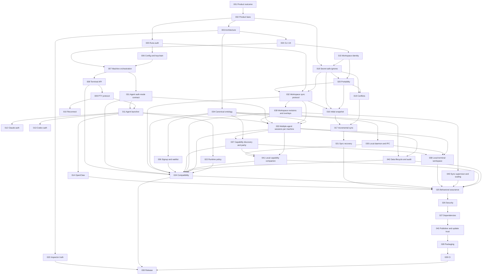
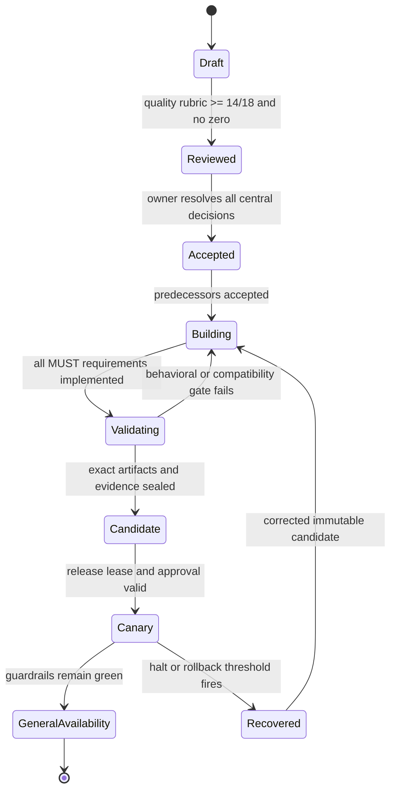

# Runa CLI PRD Index

| Field | Value |
| --- | --- |
| Status | Accepted baseline — implementation in progress |
| Initiative | Local-terminal experience backed by Runa cloud machines |
| Owner | Runa product and platform maintainers |
| Last updated | 2026-08-08 |
| Normative language | RFC 2119 / RFC 8174 |
| Approval basis | Product-owner authorization recorded 2026-08-08 |

## Product outcome

A developer working in a local project SHALL be able to run `runa claude`,
`runa codex`, or `runa openclaw` and experience a native local terminal while
the agent and workload execute in an isolated Runa cloud machine. Runa remains
the sole public control plane and preserves its policy, credential, metering,
and observability boundaries. Windows, macOS, and Linux are equal Tier-1 client
platforms; no platform inherits support merely because another passes.

These documents are requirements. A Draft or Accepted PRD is not evidence that
its behavior exists in code or production.

## Catalog

| ID | Document | Scope | Depends on | Class |
| ---: | --- | --- | --- | --- |
| 001 | [Product charter and PR/FAQ](PRD-001-product-charter-and-prfaq.md) | Customer problem, outcome, appetite, exclusions | — | Central |
| 002 | [Product laws and trust boundaries](PRD-002-product-laws-and-trust-boundaries.md) | Non-negotiable product/security invariants | 001 | Central |
| 003 | [System architecture and ownership](PRD-003-system-architecture-and-ownership.md) | Components, responsibilities, topology | 001, 002 | Central |
| 004 | [CLI command surface and UX](PRD-004-cli-command-surface-and-ux.md) | Commands, prompts, output and exit behavior | 001, 002, 003 | Central |
| 005 | [Runa human authentication](PRD-005-runa-human-authentication.md) | Browser login, PKCE, keychain and headless fallback | 002, 003 | Central |
| 006 | [Configuration and local credential storage](PRD-006-configuration-and-local-credential-storage.md) | Precedence, profiles, secure persistence | 002, 005 | Central |
| 007 | [Machine selection and lifecycle orchestration](PRD-007-machine-selection-and-lifecycle-orchestration.md) | Create/reuse/start/select/cost/cleanup | 003, 004, 005, 006 | Central |
| 008 | `PRD-008-terminal-session-rest-contract.md` | Additive CLI terminal-session API | 002, 003, 005, 007 | Central |
| 009 | `PRD-009-terminal-wire-protocol-and-local-pty.md` | Interactive framing, signals, resize and backpressure | 008 | Central |
| 010 | `PRD-010-reconnect-resume-and-session-ownership.md` | Connection recovery and attachment ownership | 008, 009 | Derived |
| 011 | `PRD-011-provider-launcher-and-lifecycle.md` | Agent installation, launch and persistence | 007, 009, 010, 031 | Central |
| 012 | `PRD-012-claude-code-interactive-authentication.md` | Claude subscription/Console login | 005, 011, 031 | Derived |
| 013 | `PRD-013-codex-interactive-authentication.md` | ChatGPT/API/device authentication | 005, 011, 031 | Derived |
| 014 | `PRD-014-openclaw-api-key-mode.md` | OpenClaw credential-required experience | 006, 011, 022, 031 | Derived |
| 015 | `PRD-015-workspace-identity-root-model.md` | Stable local/cloud project identity | 002, 003, 004 | Central |
| 016 | `PRD-016-snapshot-initial-upload.md` | Initial content-addressed transfer | 015, 018, 020, 032 | Central |
| 017 | `PRD-017-incremental-bidirectional-sync.md` | Watch, delta and convergence | 016, 019, 032 | Central |
| 018 | `PRD-018-ignore-exclusion-secret-safety.md` | Ignore semantics and secret exclusion | 002, 015 | Central |
| 019 | `PRD-019-conflict-detection-resolution.md` | Concurrent edit conflicts | 015, 018, 020 | Central |
| 020 | `PRD-020-filesystem-portability.md` | Windows/macOS/Linux semantic mapping | 015, 018 | Central |
| 021 | `PRD-021-sync-recovery-offline-resume.md` | Interrupted transfer and repair | 017, 019, 020, 032 | Derived |
| 022 | `PRD-022-credential-injection-and-outbound-policy-boundary.md` | Runtime policies without secret disclosure | 002, 007, 011, 018 | Central |
| 023 | `PRD-023-run-inspector-metering-and-compression-truth.md` | Honest observability and feature truth | 002, 003, 007 | Central |
| 024 | `PRD-024-cross-repository-contract-compatibility-campaign.md` | Infra/app/SDK/CLI expand-contract campaign | 008, 022, 023, 031, 032, 033, 034, 036, 037, 039, 041, 042 | Central gate |
| 025 | `PRD-025-test-harness-and-behavioral-assurance.md` | Fault models, oracles and matrices | 009, 014, 019, 021, 024, 038, 040, 041, 042 | Derived gate |
| 026 | `PRD-026-security-hardening-and-threat-model.md` | End-to-end adversarial controls | 002, 018, 022, 024, 025 | Derived |
| 027 | `PRD-027-dependency-and-supply-chain-controls.md` | Inventory, SBOM, provenance and maintenance | 003, 025, 026 | Derived |
| 028 | `PRD-028-packaging-install-update-and-uninstall.md` | Multi-platform distribution lifecycle | 004, 006, 027, 043 | Derived |
| 029 | `PRD-029-ci-quality-gates-and-multi-platform-matrix.md` | Reproducible CI and cross-platform gates | 025, 027, 028 | Derived |
| 030 | `PRD-030-staged-release-readiness-recovery-and-support.md` | Immutable release and staged GA | 023, 024, 025, 026, 027, 028, 029 | Terminal gate |
| 031 | [Machine agent authentication-mode contract](PRD-031-machine-agent-auth-mode-contract.md) | Additive create-mode schema, persistence and status semantics | 002, 003, 007 | Central blocker |
| 032 | [Workspace sync public protocol](PRD-032-workspace-sync-public-protocol.md) | Versioned sync operations, schemas and durable compatibility | 002, 003, 005, 015, 018, 020 | Central blocker |
| 033 | [Multiple agent sessions per machine](PRD-033-multiple-agent-sessions-per-machine.md) | Independent Claude/Codex/OpenClaw child processes and PTYs | 007, 009, 010, 011, 015, 031, 032, 034, 039 | Central |
| 034 | [Canonical resource ontology](PRD-034-canonical-resource-ontology-ids-ownership-and-capability-vocabulary.md) | Names, IDs, ownership, cardinality and capability vocabulary | 002, 003 | Central blocker |
| 035 | [Local daemon and IPC](PRD-035-local-daemon-ipc-single-writer-leases-and-process-supervision.md) | Per-user coordination, leases, IPC and recovery | 002, 003, 005, 006, 034 | Central blocker |
| 036 | [CLI signup and waitlist](PRD-036-cli-signup-waitlist-workspace-enrollment-and-browser-continuation.md) | Registration, admission, workspace enrollment and browser continuation | 001, 002, 004, 005, 034 | Central blocker |
| 037 | [Capability discovery and CLI-web parity](PRD-037-capability-discovery-and-cli-web-parity.md) | Server capability truth and management parity | 003, 004, 005, 007, 023, 031, 033, 034 | Central blocker |
| 038 | [Local Runa terminal workspace](PRD-038-local-runa-terminal-appbar-tabs-and-session-switching.md) | Orange appbar, virtual viewports, tabs and safe switching | 004, 008, 009, 010, 011, 033, 037 | Central blocker |
| 039 | [Workspace revisions and overlays](PRD-039-workspace-revisions-overlays-and-multi-writer-safety.md) | Revision, overlay and multi-writer safety model | 015, 016, 017, 018, 019, 020, 021, 032 | Central blocker |
| 040 | [Sync supervisor and scaling](PRD-040-sync-supervisor-scaling-and-large-repositories.md) | Single-writer sync runtime, large repositories and truthful progress | 015, 016, 017, 018, 019, 020, 021, 032, 039 | Central blocker |
| 041 | [Local companion capability bridge](PRD-041-local-companion-capability-bridge-for-mcp-browser.md) | MCP/browser device grants, consent and revocation | 002, 003, 005, 008, 010, 033, 034, 035, 037 | Central security blocker |
| 042 | [Data lifecycle and audit](PRD-042-data-lifecycle-retention-export-deletion-audit.md) | Retention, export, deletion, legal holds and audit | 002, 015, 018, 021, 032, 033, 034 | Central blocker |
| 043 | [Bootstrap and publisher trust](PRD-043-bootstrap-publisher-identity-update-trust-roots.md) | npm identity, Trusted Publisher, provenance and update roots | 002, 003, 006, 027 | Central release blocker |

## Dependency DAG

The listed graph is acyclic by construction. PRD numbers are stable identities,
not an execution order; implementation SHALL follow a topological order. A
failed node invalidates only its dependent descendants;
it SHALL NOT be bypassed by weakening a downstream gate.

## Delivery state machine

## Global Definition of Ready

- Every requirement uses an ID, normative force, goal trace, and observable
  acceptance criterion.
- Every cross-component contract names producer, consumers, old/new shapes,
  mixed-version behavior, rollout order, and recovery.
- Every security-sensitive behavior names a negative control.
- Every dependency edge is acyclic and central decisions precede derived work.
- Unknown behavior is labeled unknown; no PRD converts aspiration into fact.
- Every local behavior names Windows, macOS, and Linux adapters or proves that
  it is platform-independent; Tier-1 claims require installed-artifact evidence
  on all three operating systems.

## Metacognitive evidence discipline

Every PRD SHALL distinguish **observed facts** (reproducible evidence with
owner/freshness), **inferences** (with rival explanation and falsifier),
**decisions** (with owner, reversibility and review trigger), and **unknowns**
(with resolver and a closed downstream gate). Fluent prose, a happy path, file
existence, UI text and provider self-report are cues, not proof.

The object level is CLI/machine/session behavior. Monitoring, reconciliation
and release control form the meta level. Meta-level status SHALL never
manufacture object-level success: unavailable, contradictory or stale signals
require `unknown`, abstention or fail-closed behavior.

## Global decision and abstention gate

- Security, ownership, billing, destructive lifecycle, credentials and
  cross-session routing fail closed when authority is unavailable.
- Read-only discovery MAY degrade with an explicit `unknown/stale` label, but
  SHALL NOT authorize a mutation.
- Every central PRD names a disconfirmation test and a negative control that
  makes the suite fail when its core safeguard is removed.
- Quantitative targets name workload/network cohorts before becoming SLOs.
- Unresolved central unknowns block `Accepted`; derived unknowns block only
  dependent DAG descendants and remain recorded in review evidence.

## Global Definition of Done

- Every MUST requirement has current, reliable behavioral evidence.
- Contract, security, concurrency, portability and failure-path matrices pass.
- Exact artifacts have SBOM, provenance, signatures and content digests.
- Staging and canary observation contracts pass with rollback rehearsed.
- Documentation, support ownership, deprecation policy and evidence expiry are
  recorded before GA.
