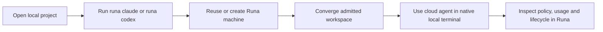

# PRD-001: Product Charter and PR/FAQ

| Field | Value |
| --- | --- |
| Status | Accepted |
| Owner | Runa product |
| Depends on | None |
| Last updated | 2026-08-05 |

## Problem

Runa's cloud terminal is currently reached through the authenticated web
console. Developers accustomed to Claude Code or Codex in a native terminal
must leave their editor, navigate a dashboard, wait for a browser terminal and
work against a remote filesystem whose relationship to their local project is
unclear. A terminal stream alone does not solve the core job: edit the project
locally while computation and policy enforcement occur remotely.

Existing evidence establishes reusable machine operations and a browser
handoff (`infra/edge/src/api.ts:580`, `libs/typescript/src/session.ts:276`), but
not a local CLI, native PTY contract, human Runa login, or workspace sync.

## Future press release

**Runa brings cloud coding agents directly to the developer's terminal.**

Developers can now enter a project and run `runa claude` or `runa codex`.
Their familiar terminal and local editor stay in place while the agent executes
inside an isolated Runa machine. Runa synchronizes the workspace, reconnects
the session, and retains outbound controls, safe credential injection, usage
visibility and machine lifecycle controls.

No provider infrastructure vocabulary or platform credential enters the local
workspace. Users may stop, pause, inspect or delete the machine explicitly.

## Goals and success measures

| ID | Goal | Proposed validation target |
| --- | --- | --- |
| G-001-01 | Reach an interactive agent from a local project with one primary command. | Median warm attach <= 3 s; p95 <= 8 s. |
| G-001-02 | Make local and cloud workspace state converge safely. | No silent conflict loss; acknowledged changes converge within 2 s p95 on the test network. |
| G-001-03 | Preserve Runa's policy and isolation benefits. | Zero direct client traffic to internal providers and zero disclosed protected credentials. |
| G-001-04 | Make cost and lifecycle consequences understandable. | Creation requires an explicit cost/config summary; abandoned-machine rate is measured. |
| G-001-05 | Support Claude Code and Codex subscription login plus OpenClaw key mode truthfully. | End-to-end journeys pass per provider capability. |

Targets are hypotheses until measured against an accepted test profile; they
are not production SLOs merely because they appear here.

## Users and jobs

- An individual developer wants cloud compute without changing terminal habits.
- A team developer wants policies and injected credentials without receiving
  plaintext shared secrets.
- An automation owner wants deterministic non-interactive commands and exit
  codes, while human browser login remains outside CI.

## Customer journey

## Product requirements

| ID | EARS requirement | Force | Goal |
| --- | --- | --- | --- |
| R-001-01 | WHEN a user runs `runa claude` or `runa codex` from a supported project, the product SHALL establish or reuse a compatible Runa machine, synchronize the project, and attach a native interactive terminal. | MUST | G-01, G-02 |
| R-001-02 | WHILE an attached agent runs, the product SHALL execute the agent and workload in the Runa machine rather than on the local host. | MUST | G-03 |
| R-001-03 | WHEN either side changes an included workspace file, the product SHALL converge safely or surface a conflict without silent overwrite. | MUST | G-02 |
| R-001-04 | WHEN creation would incur machine usage, the product SHALL show the selected resources and estimated charging basis before an interactive confirmation, unless the user supplied an explicit non-interactive authorization. | MUST | G-04 |
| R-001-05 | IF a claimed Runa benefit is unavailable, THEN the CLI SHALL label it unavailable and SHALL NOT render simulated or inferred success. | MUST | G-03, G-05 |
| R-001-06 | WHEN a user exits the CLI, the product SHALL state whether the machine continues running and SHALL offer explicit lifecycle commands. | MUST | G-04 |

## Non-goals

- Reimplementing Claude Code, Codex or OpenClaw user interfaces.
- Giving cloud agents arbitrary access to the local host.
- Treating the browser console as obsolete; it remains the management and
  observability surface.
- Shipping a general remote filesystem, SSH service or arbitrary tunnel.
- Promising prompt compression until producer behavior and telemetry are live.

## Riskiest assumptions

| Assumption | Test | Kill/re-scope condition |
| --- | --- | --- |
| Bidirectional sync feels local without corrupting work. | Prototype with concurrent edits, large repos and network interruption. | Any silent loss; otherwise make remote-only Git mode the first release. |
| Provider interactive login survives cloud/headless operation. | Real Claude and Codex subscription journeys. | Provider policy or flow forbids reliable remote use. |
| Existing terminal bridge can evolve safely. | Protocol spike with native PTY, resize, signals and reconnect. | Browser-only coupling cannot be separated without unsafe grants. |

## Acceptance

| ID | Given | When | Then |
| --- | --- | --- | --- |
| TC-001-01 | A supported local Git project and authenticated Runa user | `runa claude` runs | The cloud agent opens in the same terminal and sees included project files. |
| TC-001-02 | Simultaneous local and cloud edits to one file | Both changes arrive | Neither is silently lost; a deterministic conflict is presented. |
| TC-001-03 | A denied destination and an injected credential rule | The cloud agent makes requests | Policy is enforced and plaintext credentials never appear in CLI output or synced files. |
| TC-001-04 | Inspector/compression producer unavailable | CLI requests status | It reports unavailable, not zero savings or success. |

## Rollout and learning

Start with internal users, then an opt-in preview, then bounded canary cohorts.
Measure attach success, time to first prompt, sync conflicts, reconnect success,
unexpected running machines and support burden. Kill or re-scope the initiative
if the workspace-safety or provider-login assumptions fail.

## Evidence, inference and decision record

| Claim | Class | Confidence basis | Disconfirmation / control |
| --- | --- | --- | --- |
| Machine operations and a browser handoff exist. | Observed fact | Cited code paths, revalidated at review commit. | Disable the route in a test checkout; capability discovery must report unavailable. |
| Native-terminal access reduces friction. | Inference | User reports; not yet measured. | Compare completion, abandonment and help requests with the browser journey. |
| Bidirectional sync is the default. | Reversible decision | Conditional product hypothesis. | Any silent loss selects remote-only/Git workflow for the first release. |
| Compression and all provider logins work end to end. | Unknown | PRD prose is not producer evidence. | Keep claims unavailable until contract plus real-provider evidence exists. |

Measures SHALL be stratified by cold/warm path, repository size, OS, network
profile and concurrent AgentSession count; aggregates SHALL NOT hide a failing
cohort. Approval abstains when sample size or telemetry integrity is inadequate.
Before `Accepted`, owners SHALL decide default machine reuse/create behavior,
the charging-estimate authority and workspace-conflict UX.
