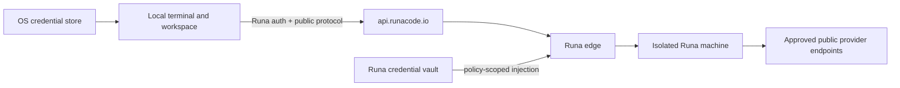

# PRD-002: Product Laws and Trust Boundaries

| Field | Value |
| --- | --- |
| Status | Accepted |
| Owner | Runa security and platform |
| Depends on | PRD-001 |

## Purpose

This document fixes invariants that every later CLI PRD SHALL refine. Current
repositories already require canonical Runa origins, single-use handoffs and
credential stripping (`app-website/AGENTS.md:27`, `infra/AGENTS.md:45`). The
CLI expands the client population without weakening those laws.

## Non-goals

- Selecting concrete terminal or synchronization algorithms.
- Granting permission to deploy, weaken an existing policy, or expose a new
  upstream surface.
- Treating local repository configuration, terminal output or agent text as a
  source of authorization.

## Trust zones

The local host, network, API, edge, machine and third-party provider are
separate trust zones. Internal provider identity and credentials are never a
public protocol concept.

## Normative laws

| ID | EARS requirement | Goal |
| --- | --- | --- |
| R-002-01 | The CLI SHALL send authenticated control-plane requests only to the exact configured and validated Runa API origin. | G-001-03 |
| R-002-02 | The CLI, SDKs, documentation, errors, telemetry and artifacts SHALL NOT expose or accept an internal infrastructure provider name, host, token, field or direct transport. | G-001-03 |
| R-002-03 | WHEN a terminal or sync capability is issued, Runa SHALL bind it to user, workspace, machine, purpose, expiry and nonce and SHALL reject replay. | G-001-03 |
| R-002-04 | The CLI SHALL NOT synchronize `.env`, credential-store material, provider login caches, Runa tokens, sockets or explicitly excluded files. | G-001-02, G-001-03 |
| R-002-05 | WHEN Runa authenticates a human CLI, it SHALL use a public-client flow with proof of possession and SHALL store renewable credentials in the operating-system credential store where available. | G-001-03 |
| R-002-06 | The cloud agent SHALL NOT receive the user's Runa access token or `runa_sk_*` API key. | G-001-03 |
| R-002-07 | WHEN Runa injects a protected credential, neither the agent process, CLI, terminal output, logs nor synchronized workspace SHALL receive its plaintext unless the accepted injection contract explicitly requires delivery to the destination request. | G-001-03 |
| R-002-08 | IF ownership, policy, producer status or evidence is unavailable, THEN the system SHALL fail closed and SHALL NOT infer authorization or feature success. | G-001-03 |
| R-002-09 | WHEN a local or remote change cannot be reconciled safely, Runa SHALL preserve both recoverable versions and block silent convergence. | G-001-02 |
| R-002-10 | The CLI SHALL NOT upload source, prompts, terminal content or file paths as product analytics; operational telemetry SHALL use bounded, redacted categories. | G-001-03 |
| R-002-11 | Every write operation SHALL be idempotent or carry an explicit no-retry rule and observable reconciliation path. | G-001-02, G-001-04 |
| R-002-12 | Every release SHALL be recoverable to a verified safe state without exporting provider login material from a machine. | G-001-03 |

## Critical safety properties

- Safety: `G(!(client_destination = internal_provider))`.
- Isolation: `G(capability_used -> owner_matches && purpose_matches && !expired)`.
- No silent loss: `G(conflict -> preserve_local && preserve_remote && notify)`.
- Liveness: `G(connecting -> F(connected || actionable_failure || cancelled))`.
- Recovery: from every nonterminal connection/sync state, a path exists to a
  disconnected state with local work preserved.

## Threats and controls

| Threat | Required control | Negative control |
| --- | --- | --- |
| Handoff theft/replay | Short TTL, nonce consumption, channel binding | Reuse the same grant and expect rejection. |
| Malicious repository file | Treat repository content as data; no config-as-authority | Add a file requesting token disclosure and prove no policy change. |
| Symlink/path escape | Canonical root and no-follow validation | Link outside root and prove it is excluded/rejected. |
| Log/telemetry leakage | Structural redaction and secret-shaped scanners | Inject sentinel secrets and scan every retained artifact. |
| Cross-tenant attach | Ownership check at API and upgrade | Attempt foreign machine ID and prove non-disclosing denial. |

## Acceptance and rollback

Stable tests `TC-002-01` through `TC-002-12` map one-to-one to
`R-002-01` through `R-002-12`; each test SHALL exercise the stated safety law
and its fail-closed negative control where the protected authority is absent.

Every later PRD SHALL trace each MUST behavior to these laws. A violation is a
hard blocker, not a warning. Rollback disables new CLI consumers before
removing additive producer support, invalidates outstanding grants and leaves
local workspace contents recoverable.

## Monitoring/control separation and abstention

Authorization, ownership, policy and injection are object-level decisions made
only by authoritative server components. CLI status, cached metadata, terminal
text and agent self-report are meta-level cues and SHALL NOT expand authority.
A monitor may report `unknown`; it may not turn missing evidence into `allowed`,
`signed in`, `not billable` or `safe`.

Falsification SHALL include confused-deputy requests across user/workspace/
machine/AgentSession IDs, forged status, revoked ownership during attach,
time-of-check/time-of-use races and sibling sessions. Negative controls remove
one binding dimension at a time and must expose the violation. If authority
cannot be checked, mutation, attach, injection and destructive actions fail
closed. Security evidence requires the enforcer plus an independent observer
and records artifact, environment, producer, oracle, timestamp and expiry.
