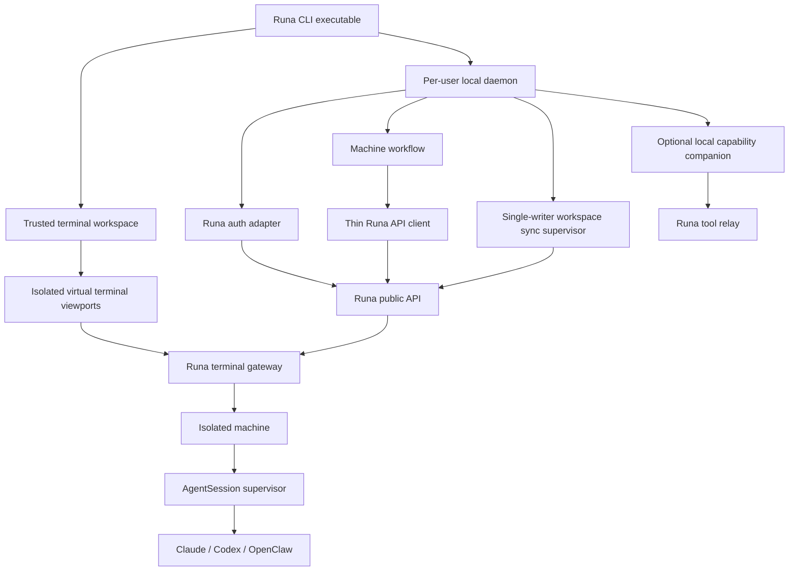
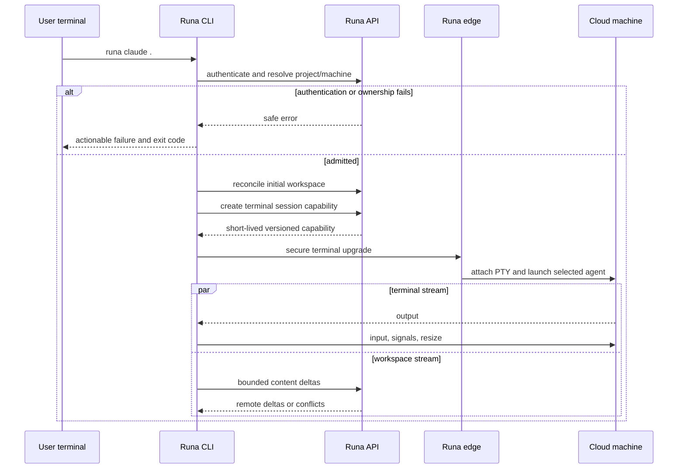

# PRD-003: System Architecture and Ownership

| Field | Value |
| --- | --- |
| Status | Accepted |
| Owner | Runa architecture |
| Depends on | PRD-001, PRD-002 |

## Decision

Runa CLI SHALL be an independent distributable product in `runa-cli/`, built
above public Runa contracts. It is not a third language SDK. The SDKs remain
programmatic clients; the CLI owns interactive workflows and may reuse a thin
TypeScript client internally without making terminal or sync behavior implicit
SDK side effects.

## Non-goals

- A direct client for the internal infrastructure provider.
- A generic SSH/VPN/tunneling product or browser-terminal parser.
- Moving server policy enforcement, provider login storage or tenant authority
  into the local executable.

## Existing baseline

- Infra exposes machine lifecycle, exec, agent-auth and a browser-oriented open
  handoff (`infra/edge/src/api.ts:580`).
- The TypeScript SDK returns but never consumes the handoff
  (`libs/typescript/src/session.ts:276`).
- The current proxy exchanges a single-use URL for a browser cookie before
  terminal WebSocket use (`infra/edge/src/proxy.ts:218`).
- The current agent bridge translates ttyd-style input/output and fixes initial
  PTY dimensions (`infra/edge/src/agentterm.ts:150`).
- No repository currently owns local workspace synchronization [verified by
  source search on 2026-08-05].

## Component model

## Ownership

| Component | Owns | Does not own |
| --- | --- | --- |
| CLI/TUI | Commands, trusted chrome, prompts, virtual viewports, input focus and plain fallback | Tenant authority, cloud process truth, provider credentials, policy enforcement |
| Local daemon | Auth projection, authenticated IPC, one local sync owner per binding, local journals and optional companion channel | Cloud lifecycle authority, browser authority without consent, server policy |
| Infra/API | Human/token verification, machine ownership, capabilities, sync authority, terminal gateway, audit and metering | Local UI or filesystem decisions |
| Machine runtime | AgentSession supervision, agent install/launch, remote workspace overlays, provider login profiles | Runa human credential or local-device authority |
| TypeScript/Python SDK | Explicit stable REST operations | Interactive terminal UI, local keychain, background sync |
| App website | Management, status, inspector and recovery visibility | CLI terminal transport or local sync |

## Requirements

| ID | EARS requirement | Goal |
| --- | --- | --- |
| R-003-01 | The CLI SHALL separate presentation, workflow, public API transport, terminal transport, synchronization, persistence and platform adapters behind explicit internal interfaces. | G-001-01, G-001-02 |
| R-003-02 | WHEN a public operation is shared with an SDK, the canonical OpenAPI contract SHALL remain the wire authority and generated projections SHALL drift-check every consumer. | G-001-03 |
| R-003-03 | WHEN terminal or sync requires a protocol not represented by the current REST API, infra SHALL expose a versioned Runa protocol rather than making the CLI depend on browser HTML, cookies or undocumented internals. | G-001-01, G-001-03 |
| R-003-04 | The CLI SHALL support injected clocks, randomness, transports, filesystem and terminal adapters for hermetic tests while production adapters remain internally owned. | G-001-02 |
| R-003-05 | WHEN a component fails, its error SHALL cross boundaries as a bounded Runa error category without internal hosts, tokens, commands or raw provider responses. | G-001-03 |
| R-003-06 | The architecture SHALL allow terminal and sync to reconnect independently without creating a second machine or duplicating acknowledged writes. | G-001-01, G-001-02 |
| R-003-07 | WHEN multiple local CLI views use one WorkspaceBinding, exactly one fenced daemon/supervisor SHALL own mutable local sync state while views remain replaceable projections. | G-001-02, G-001-03 |
| R-003-08 | WHEN rich terminal mode is active, remote escape sequences and payloads SHALL affect only their AgentSession virtual viewport and SHALL NOT alter trusted Runa chrome, focus or authority state. | G-001-01, G-001-03 |
| R-003-09 | WHERE local browser/MCP capabilities are enabled, the companion SHALL use a separate outbound-only, consented capability boundary and SHALL NOT extend terminal or sync authority into a generic local tunnel. | G-001-03 |

## Runtime sequence

## Quality attributes

- Protocol versions negotiate explicitly and reject unsupported majors.
- All queues and frames have byte/count bounds and backpressure.
- Platform-specific code is isolated behind Windows/macOS/Linux adapters.
- Core workflows are deterministic under injected time and scheduling.
- No runtime dependency is added without the inventory and risk controls in
  PRD-027.

## Acceptance

Stable tests `TC-003-01` through `TC-003-09` map one-to-one to
`R-003-01` through `R-003-09`; the architecture gate SHALL bind each result to
the corresponding component boundary and immutable candidate.

Architecture tests SHALL prove dependency direction, public-contract drift,
safe error mapping, independent reconnect and absence of browser DOM/cookie or
internal-provider coupling in the CLI artifact. A graph-cycle or trust-boundary
violation blocks the Design-to-Planning gate.

## Rollout and rollback

Protocol producers deploy additively before the CLI consumes them. Rollback
disables new CLI capability issuance first, then rolls clients back to the last
compatible signed artifact; existing browser and SDK operations remain intact.

## Decision authority and epistemic ownership

Each runtime fact SHALL have one authoritative producer: identity for human
auth, orchestration for machine lifecycle/billing, workspace service for the
admitted generation, AgentSession supervisor for child state, and policy
enforcement for authorization. CLI and website are projections. Disagreement
is `unknown/inconsistent`, emits a safe correlation ID and blocks mutation.

Architecture review maintains a claim ledger: observed baseline, inference,
decision, rejected alternative, owner and falsifier. Reusing the browser bridge
for native PTY remains an inference until framing, resize, signals, backpressure
and reconnect pass independently. Component diagrams do not prove isolation;
controls that bypass the Runa API or misroute sibling frames must fail tests.
No component owns both an irreversible action and its sole success oracle.
