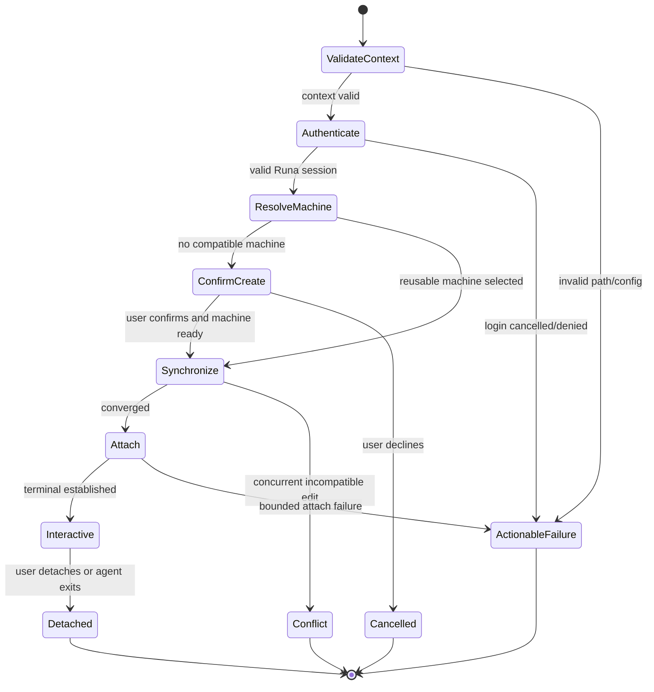

# PRD-004: CLI Command Surface and User Experience

| Field | Value |
| --- | --- |
| Status | Accepted |
| Owner | Runa developer experience |
| Depends on | PRD-001, PRD-002, PRD-003 |

## Goals and non-goals

The CLI SHALL make the common journey one memorable command while preserving
explicit commands for diagnosis and automation. It SHALL use subcommands—
`runa claude`, not `runa --claude`—because providers are actions, while flags
modify those actions.

This PRD does not define REST schemas, synchronization algorithms, provider
installation or pricing policy. It defines the command foundation consumed by
the local terminal workspace in PRD-038; "CLI parity" means access to supported
control-plane capabilities, not a pixel-equivalent copy of the web console.

## Public command grammar

```text
runa signup | login | logout | whoami
runa access status
runa claude [path] [--machine NAME | --new] [--no-sync]
runa codex [path] [--machine NAME | --new] [--no-sync]
runa openclaw [path] [--machine NAME | --new]
runa shell [MACHINE]
runa connect [MACHINE] [--agent-session ID]
runa agent-sessions list|create|attach|rename|terminate [--machine NAME]
runa machines list|create|start|pause|resume|stop|delete
runa records list|get
runa usage show
runa inspector summary|list
runa secrets list|put|delete
runa injection-rules list|create|delete
runa api-keys list|create|revoke
runa authorizations list
runa account show|open
runa workspace show|open
runa capabilities
runa status [--json]
runa doctor [--json]
runa config get|set|unset
runa update
```

`runa claude --new-session` and `runa codex --new-session` create an
independent child agent process in the selected machine. If several detached
children match, interactive mode selects one and noninteractive mode fails
until `--agent-session` is supplied.

`--no-sync` is an expert remote-only mode and SHALL warn that the cloud agent
cannot see uncommitted local work. Destructive operations require confirmation
on an interactive TTY; non-interactive use requires an explicit confirmation
flag and returns stable exit codes.

## Requirements

| ID | EARS requirement | Goal |
| --- | --- | --- |
| R-004-01 | WHEN `runa <agent> [path]` is invoked, the CLI SHALL validate the local context, authenticate, reconcile one compatible machine, synchronize unless explicitly disabled, and attach the selected agent. | G-001-01, G-001-02 |
| R-004-02 | WHEN a step is in progress, the CLI SHALL render one updating status region on an interactive terminal and newline-delimited stable events otherwise. | G-001-01 |
| R-004-03 | WHEN attached in plain/passthrough mode, the CLI SHALL yield the screen and input path to the selected remote program and SHALL NOT interleave decorative progress output; WHEN rich workspace mode is admitted, trusted Runa chrome SHALL be rendered by the isolated local compositor in PRD-038 and never injected into remote PTY bytes. | G-001-01 |
| R-004-04 | WHEN stdout is not a TTY or `--json` is selected, the CLI SHALL emit versioned machine-readable records and SHALL never prompt. | G-001-01 |
| R-004-05 | IF user action is required, THEN the CLI SHALL state what happened, what remains safe, the exact next command, and a stable error code. | G-001-01 |
| R-004-06 | WHEN machine creation is proposed interactively, the CLI SHALL display agent, resources, outbound mode, sync root and estimated charging basis before confirmation. | G-001-04 |
| R-004-07 | WHEN the process exits while a machine remains billable, the CLI SHALL disclose that state and the exact stop command. | G-001-04 |
| R-004-08 | The CLI SHALL reserve exit code 0 for completed success and SHALL document stable nonzero categories for usage, auth, policy, network, conflict, remote command and internal failures. | G-001-01 |
| R-004-09 | CLI output SHALL be accessible without color, shall respect `NO_COLOR`, and SHALL not rely on animation as the only status signal. | G-001-01 |

## Journey state machine



Safety: no transition reaches `Attach` before auth, ownership and workspace
admission. Liveness: every progress state reaches interactive, conflict,
cancelled or actionable failure within a bounded deadline.

## Acceptance

Stable tests `TC-004-01` through `TC-004-09` map one-to-one to
`R-004-01` through `R-004-09` across interactive TTY, non-TTY, `--json`, and
plain/passthrough cohorts.

Tests SHALL cover TTY/non-TTY output, no-color terminals, narrow widths,
keyboard signals, invalid commands, cancelled browser login, multiple-machine
selection, creation confirmation, JSON schema snapshots and every exit-code
category. Golden text alone is insufficient: tests must assert side effects and
the absence of secret/internal values.

## Rollout

Preview commands MAY be hidden behind a CLI feature capability, but the server
remains authoritative. Removal or rename of a public command requires usage
evidence, deprecation, aliases for the stated support window and a major-version
decision.

## Confidence-safe UX

Spinners, progress bars, optimistic copy and provider terminal output SHALL NOT
be the oracle for readiness, auth, sync, policy or billing. Determinate progress
requires monotonic server milestones; otherwise show phase, elapsed time,
cancel action and bounded deadline without fabricated percentages.

Ambiguous machine/AgentSession selection, uncertain create, unknown cost,
stale ownership, sync conflict or contradictory auth requires abstention.
Interactive mode asks a consequence-oriented question; non-interactive mode
exits nonzero with structured candidates and performs no mutation. Usability
tests use uncoached first-time users and verify their beliefs about execution
location, selected target, synchronization and continuing billing—not merely
task completion.
