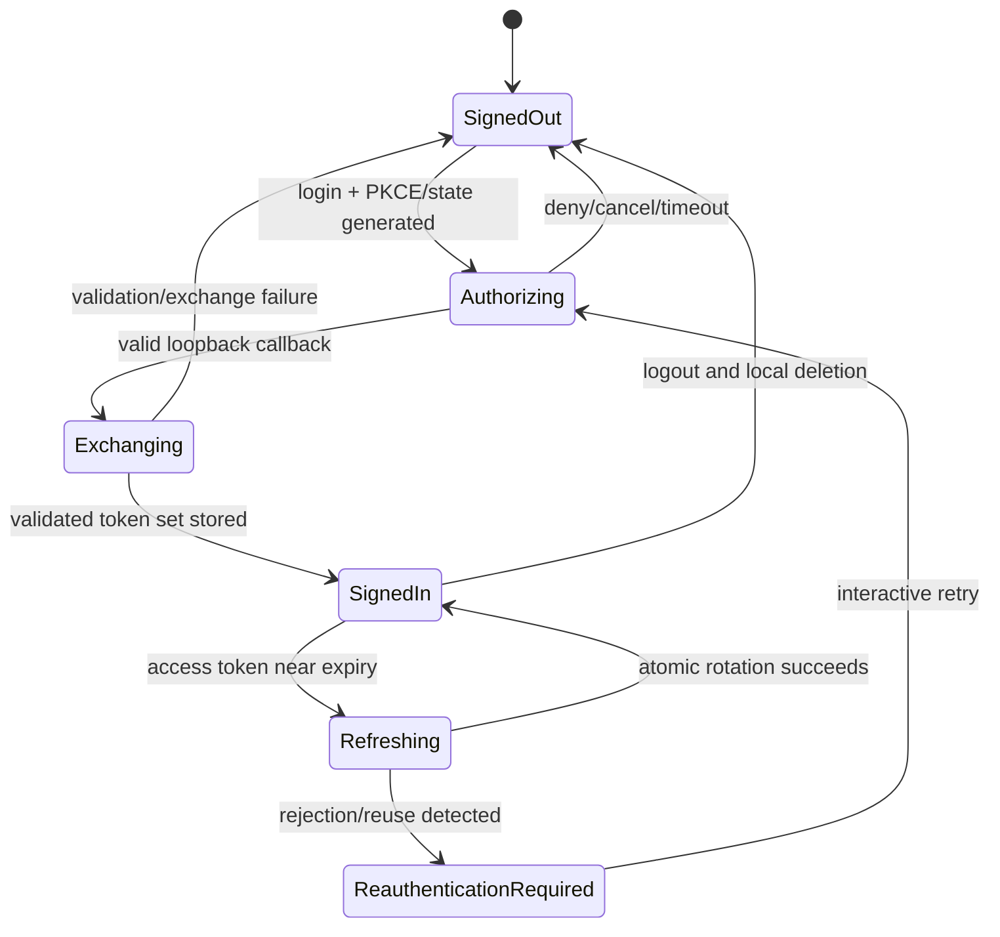

# PRD-005: Runa Human Authentication

| Field | Value |
| --- | --- |
| Status | Accepted |
| Owner | Runa identity |
| Depends on | PRD-002, PRD-003 |

This PRD governs authentication for an existing eligible Runa identity. Account
creation, invitation, email verification, waitlist, workspace enrollment and
safe browser continuation are composed by PRD-036; browser success alone is
never proof that the CLI is admitted or authorized.

## Problem and boundary

Current SDKs authenticate with long-lived `runa_sk_*` credentials, resolved
from constructor/environment/file (`libs/typescript/src/config.ts:154`,
`libs/python/src/runa/_internal/transport.py:92`). That is suitable for
programmatic access but not the default human CLI experience. Runa needs an
OAuth public-client flow; it SHALL NOT reuse or extract browser cookies.

Provider login is separate and occurs inside the cloud machine. A successful
Runa login does not mean Claude, ChatGPT or OpenClaw is authenticated.

## Non-goals

- Copying browser cookies or provider credentials into the CLI.
- Using `runa_sk_*` as the default interactive human login.
- Brokering Claude, ChatGPT or OpenClaw identity through the Runa login flow.

## Chosen flow

Interactive desktop login uses the system browser, Authorization Code with
PKCE, random state and a loopback IP callback on an ephemeral port. Device
authorization is a later fallback for genuinely headless clients and requires
its own server capability. `RUNA_API_KEY` remains an explicit automation mode.

## Requirements

| ID | EARS requirement | Goal |
| --- | --- | --- |
| R-005-01 | WHEN an unauthenticated human invokes an interactive command, the CLI SHALL offer Runa browser login and SHALL bind the response using PKCE and unpredictable state. | G-001-01, G-001-03 |
| R-005-02 | WHILE awaiting callback, the CLI SHALL listen only on loopback IP, use an ephemeral port, enforce one response and close the listener on success, failure, timeout or cancellation. | G-001-03 |
| R-005-03 | IF state, issuer, audience, redirect, PKCE verifier or token response validation fails, THEN the CLI SHALL reject the result and retain no credential. | G-001-03 |
| R-005-04 | WHEN login succeeds, the CLI SHALL store refreshable Runa material through the secure credential adapter and SHALL keep only non-secret profile metadata in config. | G-001-03 |
| R-005-05 | WHEN access expires, the CLI SHALL coalesce concurrent refreshes, rotate credentials atomically and fail closed on refresh rejection. | G-001-03 |
| R-005-06 | WHERE `RUNA_API_KEY` is explicitly selected, the CLI SHALL treat it as automation authentication, SHALL NOT persist it automatically, and SHALL not call it a human session. | G-001-03 |
| R-005-07 | WHEN `runa logout` succeeds, the CLI SHALL remove local renewable Runa credentials and revoke the server session where supported; it SHALL NOT delete provider login files from cloud machines. | G-001-03 |
| R-005-08 | Auth logs, diagnostics and errors SHALL contain no access token, refresh token, authorization code, verifier, API key or browser cookie. | G-001-03 |

## State machine

## Behavioral assurance

The harness SHALL use a fake authorization server plus browser/callback adapter
and cover CSRF state mismatch, code interception without verifier, duplicate
callback, port occupation, IPv4/IPv6 behavior, timeout, refresh races, revoked
session, clock skew, keychain denial, log redaction and API-key non-persistence.
The negative control removes PKCE verification and must make the security test
fail.

## Acceptance criteria

Stable tests `TC-005-01` through `TC-005-08` map one-to-one to
`R-005-01` through `R-005-08`; the suite SHALL include wrong-state, wrong-issuer,
replay, timeout, cancellation, concurrent refresh, and redaction controls.

Human login is accepted only when the normal browser flow, cancellation,
refresh rotation and logout tests pass together with every adversarial case in
Behavioral assurance. A passing happy-path login alone is insufficient.

## Rollout and recovery

Deploy issuer/server support before CLI consumers. Begin with one internal OAuth
client registration and exact redirect policy. On incident, revoke the client
sessions and disable browser login through server capability while retaining
explicit API-key automation. Never fall back silently from failed human login
to a discovered API key.

## Evidence classes and abstention rules

A token-shaped value, browser success page, cached profile, local expiry or
provider `Signed in` text is not proof of a valid Runa session. Protected
mutation requires validated token material and current server authorization;
provider authentication remains separate and machine-runtime-owned.

If issuer metadata/key rotation cannot be validated, clock skew exceeds the
bound, keychain durability is unknown, refresh evidence conflicts, or tenant/
workspace selection is ambiguous, the CLI abstains. Loopback PKCE remains a
decision—not an observed capability—until registration, redirect behavior and
production-equivalent platform tests exist. Simulated authorization alone
cannot authorize GA; evidence records platform, browser, identity configuration,
artifact digest and time without credential material.
