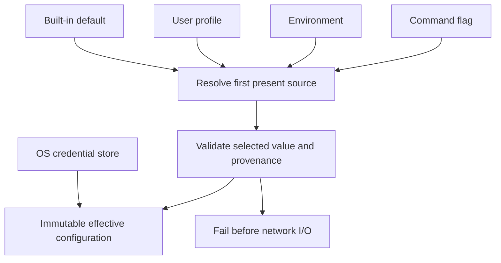

# PRD-006: Configuration and Local Credential Storage

| Field | Value |
| --- | --- |
| Status | Accepted |
| Owner | Runa CLI |
| Depends on | PRD-002, PRD-005 |

## Scope

Define deterministic profiles and platform storage without making repository
content an authority. This PRD does not define server authentication, workspace
sync or provider credential persistence.

## Non-goals

- A plaintext credential fallback.
- Automatic import of SDK, browser, Claude or Codex authentication state.
- Project-controlled API origins, trust roots or security policy.

## Configuration model

Non-secret preferences live under the platform config directory. Renewable
human credentials live in Windows Credential Manager, macOS Keychain or a
supported Linux Secret Service. If no secure store is available, interactive
login fails with remediation by default; plaintext fallback requires a future
explicitly accepted security decision.

Precedence is: command flag → environment → selected user profile → built-in
default. Project files may select harmless preferences but SHALL NOT override
API origins, credentials, trust roots or security policy.

## Requirements

| ID | EARS requirement | Goal |
| --- | --- | --- |
| R-006-01 | WHEN configuration resolves, the CLI SHALL apply the documented precedence once and SHALL reject an invalid higher-precedence value instead of falling through. | G-001-01, G-001-03 |
| R-006-02 | The production API default SHALL be the exact canonical Runa HTTPS origin; custom origins SHALL require an explicit named development profile and SHALL never be accepted from repository content. | G-001-03 |
| R-006-03 | The CLI SHALL store secrets only through the credential adapter and SHALL set restrictive ownership/permissions on non-secret configuration. | G-001-03 |
| R-006-04 | WHEN config is printed or diagnosed, values SHALL be structural/redacted and SHALL identify provenance without revealing credentials. | G-001-03 |
| R-006-05 | IF a config file is malformed, duplicated, oversized, symlinked unsafely or owned/permissioned unsafely, THEN the CLI SHALL fail with a stable category before network I/O. | G-001-03 |
| R-006-06 | WHEN multiple CLI processes update config, the CLI SHALL use lock-and-atomic-replace semantics and preserve the last valid file after interruption. | G-001-02 |
| R-006-07 | The CLI SHALL NOT import existing Claude, Codex, browser or SDK credential files into Runa authentication. | G-001-03 |

## Acceptance

Stable tests `TC-006-01` through `TC-006-07` map one-to-one to
`R-006-01` through `R-006-07` on Windows, macOS, and Linux credential/config
adapters, including unsafe ownership and interrupted-write controls.

Cross-platform tests SHALL cover precedence, invalid-shadow behavior, atomic
writes, crash between write/rename, concurrent writers, symlink attacks,
permissions, Unicode profile names, corrupt keychain entries, redaction and
uninstall retention/deletion choices. Tests SHALL use temporary platform
adapters and sentinel secrets; retained fixtures contain no usable token.

## Migration and rollback

Config schemas are versioned. Readers accept supported older schemas and write
only after a backup-free atomic validation step; destructive downgrade is
forbidden. A rollback may leave unknown newer fields untouched but SHALL not
reinterpret them. Credential removal remains an explicit user action.

Rollout begins with read-only config inspection and ephemeral test profiles,
then enables writes per supported platform only after atomicity and keychain
tests pass.

## Metacognitive controls

Configuration discovery SHALL report the winning and shadowed sources, but
successful parsing is neither semantic validity nor authorization. Secret-
shaped values in project config, history or synced files are boundary failures,
not credential fallbacks.

Ambiguous precedence, missing workspace/profile, inaccessible/corrupt keychain
or lossy migration causes abstention from authenticated mutation; redacted
read-only diagnosis MAY continue. Negative controls invert precedence, use a
plaintext token file, race writers and replace the credential adapter with an
in-memory success stub. OS support requires its real credential backend. Review
separates configured, stored, retrievable, refreshable and server-authorized
states; none is a proxy for another.
