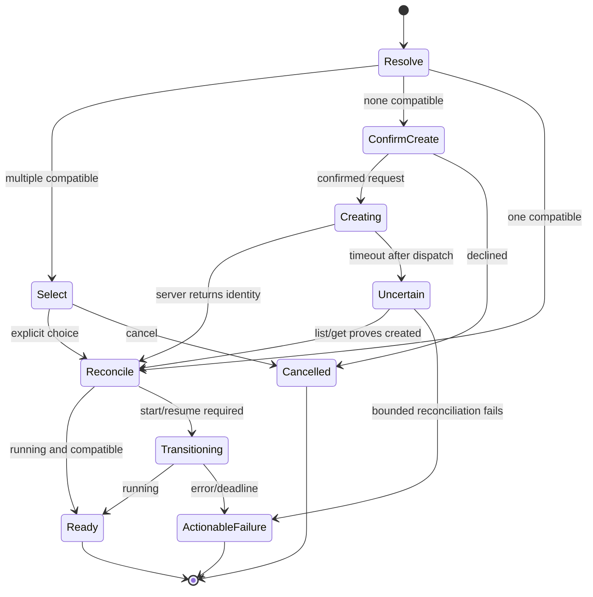

# PRD-007: Machine Selection and Lifecycle Orchestration

| Field | Value |
| --- | --- |
| Status | Accepted |
| Owner | Runa CLI and machine API |
| Depends on | PRD-003, PRD-004, PRD-005, PRD-006 |

## Baseline and goal

The public contract already exposes create/list/get and lifecycle operations;
session states include creating, running, paused, suspended, stopped, deleted
and error (`libs/typescript/src/types.ts:266`, generated contract projection).
The CLI SHALL compose these explicit operations into a predictable interactive
workflow without weakening server authority or inventing state transitions.

## Non-goals

- Client-side ownership authority or undocumented server transitions.
- Implicit deletion when the user detaches or cancels.
- Silent agent replacement, resource resizing or policy mutation during reuse.

## Selection policy

A project binding contains only stable Runa public IDs and preferences. Default
selection order is: explicit `--machine`; valid project binding; exactly one
compatible recent machine; interactive selector; otherwise proposed creation.
Ambiguity never selects silently. `--new` bypasses reuse but still requires
creation authorization.

## Requirements

| ID | EARS requirement | Goal |
| --- | --- | --- |
| R-007-01 | WHEN resolving a machine, the CLI SHALL apply the fixed selection order and SHALL verify ownership, agent compatibility and current server state. | G-001-01, G-001-03 |
| R-007-02 | IF more than one candidate remains and input is interactive, THEN the CLI SHALL present a selector containing only public name, agent, state, resources and cost status; non-interactive mode SHALL fail as ambiguous. | G-001-01, G-001-04 |
| R-007-03 | WHEN no compatible machine exists, the CLI SHALL present the exact create plan and require confirmation unless an explicit automation authorization is supplied. | G-001-04 |
| R-007-04 | WHEN creation is admitted, the CLI SHALL provide an idempotency identity or reconcile an uncertain outcome before any retry. | G-001-02, G-001-04 |
| R-007-05 | WHILE state is `creating`, `paused`, `suspended` or `stopped`, the CLI SHALL use only contract-authorized transitions and bounded polling to reach running or an actionable terminal result. | G-001-01 |
| R-007-06 | IF the user cancels during provisioning, THEN the CLI SHALL stop local work, reconcile server state and state whether a billable machine remains; it SHALL NOT assume deletion. | G-001-04 |
| R-007-07 | WHEN the selected machine agent differs from the requested command, the CLI SHALL reject reuse rather than replacing or relaunching the agent implicitly. | G-001-03, G-001-05 |
| R-007-08 | WHEN lifecycle commands affect data or billing, the CLI SHALL show the target identity and distinguish detach, stop and delete. | G-001-04 |
| R-007-09 | The CLI SHALL never send machine operations directly to a runtime or internal provider endpoint. | G-001-03 |

## State machine

## Tests and fault model

Stable tests `TC-007-01` through `TC-007-09` map one-to-one to
`R-007-01` through `R-007-09`; each lifecycle mutation test SHALL inspect the
authoritative postcondition rather than trusting only an HTTP response.

Contract tests SHALL cover every server state, empty/one/many candidates,
foreign/not-found equivalence, incompatible agent, create timeout before and
after dispatch, duplicate retry, delayed consistency, cancellation, polling
deadline and safe errors. A negative control that removes reconciliation after
an uncertain create must fail by detecting possible duplicate machines.

## Acceptance criteria

Acceptance requires the complete state/fault matrix above, a proved
single-machine outcome under uncertain retries, and evidence that cancellation
always reports the reconciled billable state.

## Observability and rollout

Record structural events for resolution source, transition, latency and safe
failure category, never machine URL, local path or terminal content. Server
idempotency support and state semantics deploy before enabling automatic create
or resume. Rollback disables orchestration shortcuts while retaining explicit
`machines` commands and existing SDK behavior.

## Decision, cost and uncertainty controls

Machine state, compatibility, ownership, quota and charging basis must come
from fresh authoritative server state. Name similarity, last-used metadata,
cached order and reachability are cues only; they SHALL NOT choose a billable
or destructive target while multiple candidates remain plausible.

Selection accounts separately for machine and child AgentSession identity.
Multiple children do not justify another machine; pressure does not justify
terminating a sibling. Unknown create results enter reconciliation and forbid a
retry with a new idempotency identity. Unknown stop/delete results remain
`reconciling`, never `completed`.

Before `Accepted`, product and billing owners define estimate authority,
staleness, currency/unit semantics and non-interactive authorization. Tests
falsify selection using reordered lists, stale costs, duplicate names, delayed
visibility, revoked ownership and several detached children; the CLI must
abstain or reconcile without duplicates, surprise mutations or false costs.
