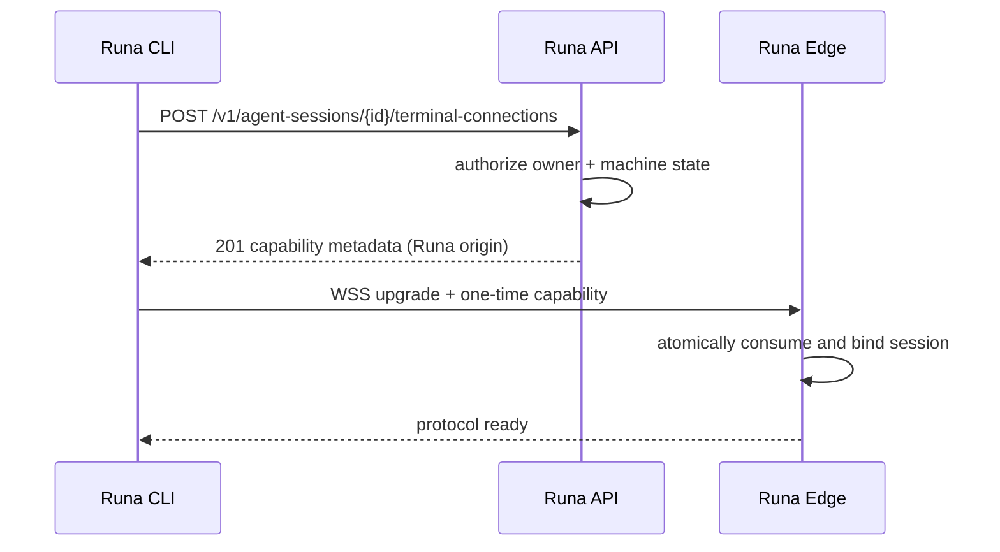

# PRD-008: Terminal-session REST contract

| Field | Value |
|---|---|
| Status | Accepted |
| Owner | Runa CLI + Infrastructure |
| Updated | 2026-08-05 |

Normative terms **MUST**, **SHALL**, **SHOULD**, and **MAY** follow RFC 2119/8174.

## Problem and existing evidence

The CLI needs a stable, machine-readable way to acquire a terminal connection without emulating a browser redirect/cookie flow. Today `POST /v1/sessions/:id/open` returns a 60-second handoff URL intended for a browser (`infra/edge/src/api.ts:575`), and the OpenAPI response exposes only `{url}` (`infra/contracts/runa-api.openapi.json:278`). Both SDKs already model this operation, but only as an opaque handoff (`libs/typescript/src/session.ts:275`, `libs/python/src/runa/_internal/contract/bridge.py:397`). The public session projection deliberately removes internal runtime and tenant identifiers (`infra/edge/src/sessions.ts:96`).

## Goals

- G-008-1: Establish a versioned REST contract that a local Runa CLI can use safely.
- G-008-2: Bind every ConnectionGrant to one user, workspace, machine,
  AgentSession/process epoch, client device, purpose, protocol, and short
  validity window. `capability` is reserved for server feature discovery in
  PRD-037.
- G-008-3: Preserve the invariant that clients communicate only with Runa and never receive upstream provider identity, hosts, IDs, or credentials.
- G-008-4: Make contract generation safe for TypeScript and Python consumers without forcing either SDK to implement a PTY.

## Non-goals

- Implementing the WebSocket wire protocol (PRD-009).
- Implementing CLI account login or workspace sync.
- Returning provider/runtime access tokens or a generic tunneling capability.
- Replacing the existing browser handoff during the first rollout.

## Functional requirements

- **R-008-01 (MUST, G-008-1):** WHEN an authenticated caller requests `POST /v1/agent-sessions/{id}/terminal-connections`, the Runa API SHALL return `201` with `terminal_session_id`, non-secret `resume_handle`, secret-free `connect_url`, one-use `connect_token`, selected `protocol`, `capabilities`, and `expires_at`; the token SHALL travel in the WebSocket `Authorization` header or an explicitly negotiated subprotocol field and SHALL never appear in a URL.
- **R-008-02 (MUST, G-008-2):** WHEN the target machine is absent or not owned by the caller, the API SHALL return the same non-disclosing `404` response.
- **R-008-03 (MUST, G-008-2):** WHEN a terminal capability is redeemed, the edge SHALL atomically consume it before WebSocket upgrade and SHALL reject every replay.
- **R-008-04 (MUST, G-008-2):** The issued ConnectionGrant SHALL expire no later than 60 seconds after issuance and SHALL be scoped to `terminal-connect`, the current user/workspace, selected machine, exact AgentSession and process epoch, client device/instance, attachment generation, and protocol version; it SHALL authorize no sibling resource.
- **R-008-05 (MUST, G-008-3):** The public response SHALL contain only Runa-controlled HTTPS/WSS origins and SHALL NOT contain upstream brand names, runtime IDs, tenant IDs, secrets, or upstream hostnames.
- **R-008-06 (MUST, G-008-1):** IF the machine is creating, paused, stopped, deleted, or errored, THEN the API SHALL return a stable problem code and a safe user-action hint; it SHALL NOT silently mutate lifecycle state.
- **R-008-07 (MUST, G-008-4):** The OpenAPI authority SHALL define the request, success response, errors, formats, enums, and examples; generated SDK contract artifacts SHALL remain byte-for-byte derivable from it.
- **R-008-08 (SHOULD, G-008-1):** The API SHOULD accept an `Idempotency-Key` so retries do not create multiple live terminal-session records.
- **R-008-09 (MAY, G-008-4):** SDKs MAY expose `createTerminalConnection()` returning metadata, but SHALL NOT automatically consume the one-time ConnectionGrant.
- **R-008-10 (MUST, G-008-2):** Issuance SHALL mean only that a scoped capability was created; it SHALL NOT assert that WebSocket upgrade, upstream PTY creation, agent launch, or terminal health succeeded. Those facts require separate evidence and timestamps.
- **R-008-11 (MUST, G-008-1):** Capability negotiation SHALL distinguish `supported`, `unsupported`, and `unknown`; absence of a capability field SHALL be `unknown`, never inferred as support. A client SHALL abstain from mutations requiring unknown capabilities.

## Non-functional requirements

- NFR-008-1: p95 issuance latency below 500 ms, excluding machine wake-up.
- NFR-008-2: capability consumption SHALL be atomic under concurrent redemption.
- NFR-008-3: API availability target 99.9%; error responses use stable codes and request IDs.
- NFR-008-4: the API SHALL support explicit protocol-version negotiation and reject unsupported versions.

## Security and privacy

Capabilities are bearer secrets: never persist plaintext, include query strings in logs, analytics, crash reports, shell history, or referrers. Store only a keyed digest plus scope and expiry. Apply API-key/JWT authentication through the existing dual resolver (`infra/edge/src/auth.ts:127`). Rate-limit issuance per user and machine. The only public authority is Runa; no client-facing schema or error may name the internal provider.

## Epistemic contract and falsification

`issued`, `redeemed`, `upgraded`, `pty_ready`, and `healthy` are distinct observations. Every reported state SHALL identify its evidence source, observation time, and freshness bound. Timeout, partial response, replica disagreement, or unavailable authority yields `unknown`; it SHALL NOT be collapsed into success or a retryable absence. The implementation hypothesis that atomic consumption prevents replay is falsified if two concurrent redeemers can both create upstream effects, including across replicas or after a crash boundary.

## Sequence

## Dependencies and risks

- Depends on PRD-002, PRD-003, PRD-005, and PRD-007; it unlocks PRD-009 and
  PRD-010. Protocol and resume authors SHALL refine this contract without
  introducing a backward dependency.
- Risk: browser and CLI contracts drift. Mitigation: one OpenAPI authority and cross-consumer contract tests.
- Risk: capability leaks through telemetry. Mitigation: structured allowlisted logging and redaction tests.
- Risk: retry produces excess grants. Mitigation: idempotency record with bounded TTL.

## Acceptance tests

- **TC-008-01:** Given an owned running machine, when a valid user requests a terminal session, then a schema-valid Runa-only capability is returned.
- **TC-008-02:** Given one capability, when two clients redeem concurrently, then exactly one upgrades and the other receives a stable rejection.
- **TC-008-03:** Given an expired capability, when redeemed, then it is rejected without upstream contact.
- **TC-008-04:** Given a foreign and a nonexistent machine, when requested, then their observable status/body classes are identical.
- **TC-008-05:** Given generated TS/Python artifacts, when contract CI runs, then both hashes match the authoritative OpenAPI document.
- **TC-008-06:** Given the same idempotency key and intent across concurrent retries, then one record is created; changed intent yields conflict and the same textual key remains tenant-scoped.
- **TC-008-07:** Given two edge replicas and crashes before consume, after consume/before upgrade, and after upgrade, then at most one upstream connection exists and no consumed token resurrects; replacing atomic consume with read-then-delete makes this test fail.
- **TC-008-08:** Given successful issuance followed by failed upgrade or PTY creation, then the API/telemetry never reports the terminal connected or healthy.
- **TC-008-09:** Given an old client, omitted capabilities, an unknown required capability, and server/client version skew, then no unsupported mutation occurs and the result is explicit `unknown` or protocol incompatibility before token consumption.

## Observability

Emit counters for issuance, redemption, replay, expiry, authorization denial, state rejection, and protocol mismatch; histograms for issuance and upgrade latency; traces joined by a non-secret terminal-session ID. Never record capability values, terminal bytes, provider tokens, or command text.

## Rollout and rollback

Ship behind `terminal_sessions_v1`: internal canary, CLI beta, 10%, 50%, 100%. Keep `/open` unchanged until browser migration is separately approved. Roll back by disabling new issuance and letting issued capabilities expire; no database rollback may resurrect consumed grants.

## Traceability

| Goal | Requirements | Design/task | Tests |
|---|---|---|---|
| G-008-1 | R-008-01,06,08,11 | OpenAPI + route + idempotency | TC-008-01,03,09 |
| G-008-2 | R-008-02,03,04,10 | scoped digest store + layered state evidence | TC-008-02,03,04,08 |
| G-008-3 | R-008-05 | public projection + redaction | TC-008-01,05 |
| G-008-4 | R-008-07,09,11 | contract generation + capability negotiation | TC-008-05,09 |
