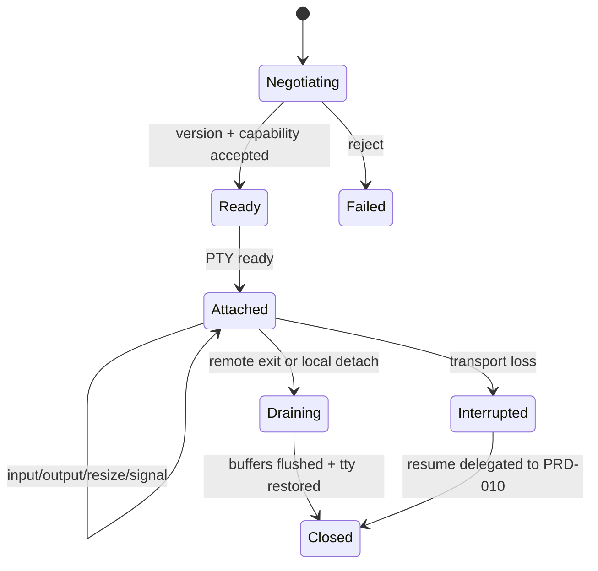

# PRD-009: Terminal wire protocol and local PTY

| Field | Value |
|---|---|
| Status | Accepted |
| Owner | Runa CLI + Edge Runtime |
| Updated | 2026-08-05 |

Normative terms follow RFC 2119/8174.

## Problem and existing evidence

The browser bridge currently speaks ttyd-style frames: client `0+input`, client `1+resize JSON`, and server `0+output` (`infra/edge/src/agentterm.ts:108`, `infra/edge/src/agentterm.ts:208`). The browser sends keyboard and resize events (`app-website/src/components/machines/MachineTerminal.tsx:226`). However, the upstream stream cannot resize a live PTY, so only the first dimensions affect launch (`infra/edge/src/agentterm.ts:153`). A local CLI requires an explicit, versioned, binary-safe protocol and faithful native-terminal behavior.

## Goals

- G-009-1: Make the remote agent feel like a native local TTY.
- G-009-2: Define bounded, versioned, testable client/server frames.
- G-009-3: Preserve control-plane secrecy and byte integrity.

## Non-goals

- File synchronization, multiplexing arbitrary ports, or interpreting agent
  content. Rich terminal composition is owned by PRD-038 and SHALL isolate the
  remote virtual viewport from trusted Runa chrome; this protocol remains the
  byte-preserving transport beneath either rich or passthrough mode.
- Exposing the upstream streaming-exec protocol.
- Promising live resize until the backend supports it end to end.

## Functional requirements

- **R-009-01 (MUST, G-009-2):** WHEN WebSocket negotiation succeeds, client and edge SHALL select exactly one protocol version (`runa.terminal.v1`) before terminal bytes flow.
- **R-009-02 (MUST, G-009-1):** WHILE attached in passthrough mode, the CLI SHALL put the local terminal in raw mode, forward stdin byte-for-byte, render stdout/stderr bytes without Unicode corruption, and restore terminal settings on every exit path; WHILE attached through PRD-038, it SHALL preserve the same byte semantics inside the selected isolated virtual viewport.
- **R-009-03 (MUST, G-009-2):** The protocol SHALL define typed frames for `ready`, `input`, `output`, `resize`, `signal`, `heartbeat`, `exit`, and structured `error`, each with maximum size and legal state.
- **R-009-04 (MUST, G-009-1):** WHEN the local terminal dimensions change, the CLI SHALL send the latest bounded dimensions; the edge SHALL apply them live when supported or SHALL explicitly advertise `initial_resize_only`.
- **R-009-05 (MUST, G-009-1):** WHEN the user presses Ctrl+C, Ctrl+Z, or sends a termination signal, the CLI SHALL distinguish local-client shutdown from remote PTY signal delivery according to documented escape semantics.
- **R-009-06 (MUST, G-009-3):** The edge SHALL scrub forbidden upstream identity across frame boundaries before output reaches a client, preserving the current stateful behavior evidenced at `infra/edge/src/agentterm.ts:77`.
- **R-009-07 (MUST, G-009-3):** The CLI SHALL NOT log terminal payloads by default and SHALL never expose or request upstream credentials.
- **R-009-08 (MUST, G-009-1):** The CLI SHALL support or explicitly reject before attach bracketed paste, truecolor, alternate screen, mouse mode, and UTF-8 without semantic rewriting; in rich mode their effects SHALL remain confined to the selected virtual viewport.
- **R-009-09 (MUST, G-009-2):** IF either peer receives an unknown critical frame or oversize payload, THEN it SHALL close with a stable protocol error; unknown optional extensions MAY be ignored.
- **R-009-10 (MUST, G-009-1):** `ready` SHALL require a completed protocol handshake and confirmed remote PTY identity; transport upgrade, heartbeat receipt, buffered output, or an open socket alone SHALL NOT be presented as terminal readiness or health.
- **R-009-11 (MUST, G-009-2):** Input acknowledgement SHALL mean only durable acceptance into the edge's ordered input stream, not execution by the shell or agent. No UI, SDK, or audit event SHALL relabel acknowledgement as command execution.

## Non-functional requirements

- NFR-009-1: median local-input-to-remote-echo below 150 ms and p95 below 400 ms under supported network conditions.
- NFR-009-2: sustained output SHALL use bounded buffers and backpressure; client memory SHALL remain below 100 MiB during a 1 GiB stream.
- NFR-009-3: maximum frame size defaults to 1 MiB; connection aggregate limits prevent memory amplification.
- NFR-009-4: Windows PowerShell/Terminal, macOS terminals, and common Linux terminals are Tier-1.

## Security and privacy

Treat terminal content as private customer data in transit. Require TLS, capability-bound upgrade, origin/host validation, bounded decompression (if later added), payload-free telemetry, and secure terminal restoration. The CLI connects only to allowlisted Runa origins. The edge alone translates to internal runtime transport.

## Epistemic contract and fault schedule

Connection state is a tuple, not a boolean: transport, protocol, PTY, process, and liveness are independently `confirmed`, `failed`, or `unknown`, with timestamps. The CLI SHALL display the weakest load-bearing state and abstain from sending input until protocol and PTY are confirmed. Tests SHALL schedule loss, duplication, delay, reordering, half-open TCP/WebSocket, stale heartbeat, edge restart, output-before-ready, ACK-before-process-read, and mixed-version frames. A negative-control codec that incorrectly treats WebSocket open as `ready` or ACK as `executed` MUST fail conformance.

## State machine

## Dependencies and risks

- Depends on PRD-008 capability acquisition and constrains, but does not depend
  on, PRD-010 reconnect semantics.
- Risk: raw-mode failure leaves the user terminal broken. Mitigation: finally/signal handlers plus subprocess crash tests.
- Risk: output flood exhausts memory. Mitigation: flow control, bounded queues, and load tests.
- Risk: live resize is impossible through the current upstream. Mitigation: capability advertisement and provider-side protocol upgrade; never fake success.

## Acceptance tests

- **TC-009-01:** Given an interactive TUI, when connected from each Tier-1 OS, then colors, cursor motion, input, Ctrl+C, and exit behave as locally.
- **TC-009-02:** Given a 1 GiB synthetic stream, when the consumer slows, then backpressure bounds memory and no bytes reorder.
- **TC-009-03:** Given resize capability `initial_resize_only`, when resizing after attach, then the CLI does not claim live resize and remains usable.
- **TC-009-04:** Given normal exit or any capturable termination signal, terminal settings are restored; after non-capturable termination, the documented recovery command or a new invocation restores sane local terminal mode where the platform permits.
- **TC-009-05:** Given an upstream brand split across two output frames, when bridged, then no forbidden identity reaches the client.
- **TC-009-06:** Given an upgraded but half-open connection, stale heartbeat, or output from a prior PTY generation, then state is not `ready`/healthy and input is withheld or fenced.
- **TC-009-07:** Given an acknowledged input whose remote process crashes before reading it, then the client reports delivery as uncertain and never claims execution.
- **TC-009-08:** Given N/N-1 peers, unknown critical frames fail closed before terminal bytes; unknown optional frames do not alter required-state inference.

## Observability

Measure connection duration, bytes in/out, frame counts, backpressure time, heartbeat RTT, close code, restore failures, and negotiated capabilities. Use session IDs only; terminal payloads and credentials are prohibited.

## Rollout and rollback

Gate each OS separately. Start with `initial_resize_only`; enable live resize only after conformance evidence. On regression, pin clients to the prior protocol and disable the new version server-side. A protocol version, once public, remains parseable through its support window.

## Traceability

| Goal | Requirements | Design/task | Tests |
|---|---|---|---|
| G-009-1 | R-009-02,04,05,08,10 | local PTY adapter + layered readiness | TC-009-01,03,04,06 |
| G-009-2 | R-009-01,03,09,11 | v1 codec/state validator + ACK semantics | TC-009-02,03,07,08 |
| G-009-3 | R-009-06,07 | edge scrubber + safe logger | TC-009-05 |
