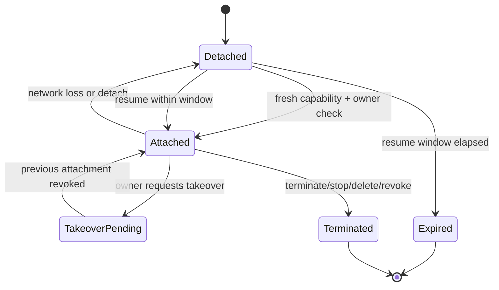

# PRD-010: Reconnect, resume, and terminal-session ownership

| Field | Value |
|---|---|
| Status | Accepted |
| Owner | Runa CLI + Infrastructure |
| Updated | 2026-08-05 |

Normative terms follow RFC 2119/8174.

## Problem and existing evidence

Browser reconnection is currently component-local with bounded backoff (`app-website/src/components/machines/MachineTerminal.tsx:100`), while the edge launches agent sessions under a fixed `dtach` socket so reopening may reattach (`infra/edge/src/agentterm.ts:50`). Browser unmount closes its socket (`app-website/src/components/machines/MachineTerminal.tsx:252`). There is no public contract defining ownership, concurrent attachment, resumable output, detach versus terminate, or recovery after the one-time capability is consumed.

## Goals

- G-010-1: Survive ordinary network loss without restarting the cloud agent.
- G-010-2: Define exclusive ownership and safe multi-client behavior.
- G-010-3: Make resume honest, bounded, and observable.

## Non-goals

- Infinite terminal history, collaborative multi-cursor terminals, or process checkpoint/restore.
- Resuming a deleted/stopped machine.
- Treating browser and CLI tabs as implicitly trusted peers.

## Functional requirements

- **R-010-01 (MUST, G-010-1):** WHEN transport is lost without an explicit remote termination, the edge SHALL detach the client while leaving the remote PTY/agent process running for a bounded resume window.
- **R-010-02 (MUST, G-010-1):** WHEN reconnecting, the CLI SHALL request a fresh terminal capability through Runa; it SHALL NOT replay an old capability.
- **R-010-03 (MUST, G-010-2):** The terminal session SHALL have one authenticated owner and an explicit attachment policy of `exclusive` for v1.
- **R-010-04 (MUST, G-010-2):** IF a second attachment targets an exclusively attached session, THEN the edge SHALL reject it or require an explicit owner-authorized takeover; it SHALL never silently duplicate keystrokes.
- **R-010-05 (MUST, G-010-3):** A resume response SHALL state whether the process survived, whether output continuity is complete, and the earliest retained output sequence.
- **R-010-06 (MUST, G-010-3):** The edge SHALL assign monotonic output sequence numbers and retain output until either its age exceeds 30 seconds or retained bytes exceed 1 MiB, evicting the oldest complete frame first; resume SHALL return `continuity_incomplete` and `earliest_sequence` when requested output was evicted.
- **R-010-07 (MUST, G-010-1):** The CLI SHALL retry only transient failures using bounded exponential backoff with jitter and SHALL expose a deterministic manual retry after exhaustion.
- **R-010-08 (MUST, G-010-2):** Explicit `detach` SHALL preserve the remote process; explicit `terminate` SHALL end it; local shell exit SHALL map according to the command contract and be confirmed when destructive.
- **R-010-09 (MUST, G-010-2):** Pause, stop, delete, ownership revocation, or account logout SHALL revoke active and resumable attachment rights promptly.
- **R-010-10 (MUST, G-010-3):** Input frames SHALL carry monotonic client sequence numbers and acknowledgements; the edge SHALL deduplicate acknowledged input within the resume window and SHALL classify unacknowledged input as uncertain rather than replaying it blindly.
- **R-010-11 (MUST, G-010-3):** `resumed` SHALL require proof of the same fenced AgentSession/process generation; reattachment to a replacement process, socket, or stale `dtach` path SHALL be reported as a new/discontinuous session.
- **R-010-12 (MUST, G-010-2):** Every attachment and input frame SHALL carry a monotonically increasing fencing generation. A stale attachment SHALL be unable to write even if its transport remains open after takeover.

## Non-functional requirements

- NFR-010-1: reconnect p95 under 5 seconds after network recovery, excluding machine wake-up.
- NFR-010-2: resume state SHALL remain consistent under concurrent reconnect/takeover requests.
- NFR-010-3: replay buffers SHALL be memory- and tenant-bounded.
- NFR-010-4: retry logic SHALL not exceed five automatic attempts or two minutes without explicit user action.

## Security and privacy

Resume identifiers are opaque, non-secret handles; every resume still requires a fresh user-scoped capability. Ownership checks occur before any buffered output is revealed. Replayed output inherits terminal-data privacy and is deleted on expiry, termination, or machine deletion. Clients never learn internal runtime or tenant IDs.

## Epistemic contract and fault schedule

`transport_reconnected`, `attachment_restored`, `process_survived`, `output_continuous`, and `input_executed` are not synonyms. Only the first four may be observed by this protocol; execution is outside its knowledge and SHALL remain `unknown` unless a higher-level agent protocol supplies proof. Fault schedules SHALL include simultaneous takeover, delayed old-socket input, lease expiry during partition, edge/database crash at each fencing transition, PID/socket reuse, replay eviction, and stop/delete racing reconnect. On authority disagreement the system abstains, revokes input rights, and fails closed.

## State machine

## Dependencies and risks

- Depends on PRD-008, PRD-009, machine lifecycle, and durable session ownership storage.
- Risk: split-brain attachments. Mitigation: database lease/fencing token and atomic takeover.
- Risk: misleading “resumed” state after process loss. Mitigation: explicit continuity fields and sequence-gap UI.
- Risk: replay buffer leaks terminal content. Mitigation: encryption at rest, strict TTL, per-owner authorization.

## Acceptance tests

- **TC-010-01:** Given a live agent and a 10-second network loss, when connectivity returns, then the same remote process resumes and duplicate input is absent.
- **TC-010-02:** Given an exclusive active attachment, when another client connects, then it receives a conflict unless authorized takeover succeeds atomically.
- **TC-010-03:** Given output exceeding the replay limit, when resumed, then the client is told exactly that continuity is partial.
- **TC-010-04:** Given a machine deletion, when any old or fresh resume attempt occurs, then it is denied and buffered output is unavailable.
- **TC-010-05:** Given five transient failures, when backoff is exhausted, then automatic retries stop and a manual action is offered.
- **TC-010-06:** Given takeover followed by delayed frames from the previous attachment, then every stale write is fenced while the new owner remains singular.
- **TC-010-07:** Given process death and PID/socket reuse, then reconnect is classified discontinuous and never reported as the same resumed agent.
- **TC-010-08:** Given an ACK followed by process failure before read/execute, then the CLI labels the command outcome uncertain and does not auto-replay it.

## Observability

Record attach, detach reason, reconnect attempt, resume success, continuity gap, takeover, fencing rejection, buffer eviction, and revocation. Track reconnect latency and process-survival rate. Do not log replayed content.

## Rollout and rollback

First ship exclusive single-attachment and detach/resume without replay; then enable bounded replay. Rollback disables resume issuance and terminates buffers while leaving machine lifecycle intact. Existing attached sessions may drain but receive no new resume entitlement.

## Traceability

| Goal | Requirements | Design/task | Tests |
|---|---|---|---|
| G-010-1 | R-010-01,02,07 | detach lease + retry controller | TC-010-01,05 |
| G-010-2 | R-010-03,04,08,09,12 | fencing/ownership service | TC-010-02,04,06 |
| G-010-3 | R-010-05,06,10,11 | sequenced replay buffer + process-generation proof | TC-010-03,07,08 |
