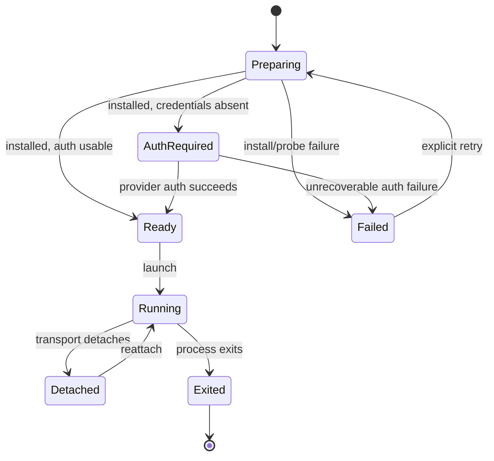

# PRD-011: Provider launcher and lifecycle

| Field | Value |
|---|---|
| Status | Accepted |
| Owner | Runa CLI + Edge Runtime |
| Updated | 2026-08-05 |

Normative terms follow RFC 2119/8174.

## Problem and existing evidence

The current edge maps presets directly to `claude`, `codex`, and `openclaw` and launches one immediately (`infra/edge/src/agentterm.ts:26`). It wraps the process with `dtach`, falling back to a non-persistent shell (`infra/edge/src/agentterm.ts:50`). Agent machines cannot use the terminal snapshot because checkpoint restore overrides agent installation (`infra/edge/src/sessions.ts:651`). The CLI needs a provider-neutral launcher contract so lifecycle, installation, authentication, persistence, and exit behavior are deterministic rather than embedded in one shell string.

## Goals

- G-011-1: Launch the requested installed agent reliably and preserve its interactive lifecycle.
- G-011-2: Separate provider adapters from terminal transport and machine lifecycle.
- G-011-3: Report actionable, secret-free state to CLI and dashboard.

## Non-goals

- Reimplementing Claude Code, Codex, or OpenClaw.
- Allowing clients to submit arbitrary privileged launch commands.
- Exposing internal infrastructure/provider details.

## Functional requirements

- **R-011-01 (MUST, G-011-2):** The launcher SHALL resolve a versioned server-owned preset by public agent ID and SHALL NOT accept executable paths from clients.
- **R-011-02 (MUST, G-011-1):** WHEN attachment requests agent launch, the launcher SHALL verify installation, working directory, machine state, authentication mode, and policy readiness before starting the process.
- **R-011-03 (MUST, G-011-3):** The launcher SHALL expose the state set `preparing`, `auth_required`, `ready`, `running`, `detached`, `exited`, and `failed` with stable reason codes.
- **R-011-04 (MUST, G-011-1):** WHEN a compatible persistent agent process already exists, the launcher SHALL reattach instead of starting a duplicate unless the user explicitly requests a new session.
- **R-011-05 (MUST, G-011-1):** WHEN the agent exits normally, the terminal SHALL either return to an interactive cloud shell or close according to the invocation mode; behavior SHALL be declared before launch.
- **R-011-06 (MUST, G-011-2):** Provider-specific environment preparation SHALL live behind an adapter interface and SHALL NOT alter terminal wire-protocol semantics.
- **R-011-07 (MUST, G-011-3):** IF installation or probing fails, THEN the launcher SHALL return a redacted reason, retryability, and remediation without terminally exposing internal vendor output.
- **R-011-08 (SHOULD, G-011-1):** Presets SHOULD pin a tested agent version and MAY permit an explicitly requested supported channel.
- **R-011-09 (MUST, G-011-2):** Stop/delete/revoke events SHALL terminate or detach agent processes according to the machine lifecycle contract and revoke terminal attachments.
- **R-011-10 (MUST, G-011-3):** `ready` SHALL mean the selected adapter version, binary integrity, working directory, policy preconditions, and declared authentication precondition were freshly verified. Binary presence, installer exit zero, credential-file presence, or a live PID alone SHALL NOT establish readiness.
- **R-011-11 (MUST, G-011-2):** Each launched process SHALL be bound to a unique AgentSession identity and generation; no preset, socket path, PID, or authentication state may be shared implicitly across concurrent Claude, Codex, OpenClaw, or clean-shell sessions on the same machine.
- **R-011-12 (MUST, G-011-3):** If a required probe is unavailable, contradictory, stale, or unsupported by the pinned adapter, the launcher SHALL report `unknown`/`unavailable` and abstain from launch unless an explicitly safe degraded mode is specified.

## Non-functional requirements

- NFR-011-1: reattach p95 under 3 seconds; warm launch p95 under 10 seconds, excluding provider login.
- NFR-011-2: launcher operations SHALL be idempotent under duplicate requests.
- NFR-011-3: adapter failures SHALL be isolated; one provider adapter cannot corrupt another provider's state.
- NFR-011-4: installation artifacts SHALL be integrity-verified and dependency versions reproducible.

## Security and privacy

Commands and adapters are server-owned, allowlisted, and executed as the unprivileged workspace identity. Environment variables are allowlisted per provider. Logs redact tokens and paths that reveal internal infrastructure. The local CLI communicates only with Runa endpoints; only the edge may call internal infrastructure.

## Epistemic contract and falsification

Launcher state is derived from named probes with freshness leases, not introspection by convention. The state payload SHALL expose `observed_at`, adapter/preset version, evidence class, and a secret-free reason while hiding provider material. The hypothesis that an adapter is isolated is falsified by any cross-session process reuse, credential influence, socket collision, or state transition caused by another adapter. Tests SHALL include deceptive binaries, stale credential files, successful installers that omit the executable, process exit between probe and launch, and mixed server/client preset versions.

## State machine

## Dependencies and risks

- Depends on PRD-009/010/031 and defines the launcher contract refined by provider
  PRDs 012-014; it does not depend on those downstream refinements.
- Risk: installer changes break presets. Mitigation: pinned versions, image-time installation, health probes.
- Risk: fixed `dtach` socket conflates sessions. Mitigation: per-machine/agent session IDs and fenced socket paths.
- Risk: shell interpolation creates injection. Mitigation: argv execution and typed adapter inputs, never concatenated user strings.

## Acceptance tests

- **TC-011-01:** Given a compatible detached process, when reconnecting, then the same PID/session is reattached and no duplicate agent starts.
- **TC-011-02:** Given a missing binary, when preparing, then verified installation runs once and state progresses deterministically.
- **TC-011-03:** Given an unsupported agent ID or client executable path, when requested, then launch is rejected before execution.
- **TC-011-04:** Given stop/delete, when lifecycle action completes, then attachments are revoked and process disposition matches policy.
- **TC-011-05:** Given adapter stderr containing secrets/internal identity, when failure is reported, then neither appears in API, logs, or terminal banner.
- **TC-011-06:** Given a credential file but an official usability probe that fails or times out, then launcher state is not `ready` and launch fails closed or enters the declared auth flow.
- **TC-011-07:** Given simultaneous different AgentSessions on one machine, then processes, PTYs, sockets, auth-mode resolution and lifecycle actions remain isolated by session generation.
- **TC-011-08:** Given a client requesting a preset/capability unknown to the server or a server emitting a required state unknown to the client, mutation is rejected before process creation.

## Observability

Emit state transitions, preset/version, install duration/result, launch/reattach duration, exit class, retryability, and lifecycle cause. Never capture terminal payload or credential values.

## Rollout and rollback

Shadow the new state resolver against the existing launch path, then enable by agent: clean shell, Codex, Claude, OpenClaw. Rollback routes new launches to the prior launcher while preserving process/session data; incompatible new state fields remain additive.

## Traceability

| Goal | Requirements | Design/task | Tests |
|---|---|---|---|
| G-011-1 | R-011-02,04,05,08,10 | process supervisor + readiness probes | TC-011-01,02,04,06 |
| G-011-2 | R-011-01,06,09,11 | adapter registry + session-fenced lifecycle hooks | TC-011-03,04,07,08 |
| G-011-3 | R-011-03,07,10,12 | evidence-bearing state/reason model | TC-011-05,06,08 |
