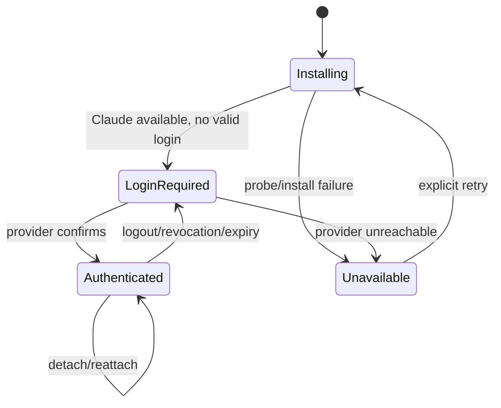

# PRD-012: Claude Code interactive authentication

| Field | Value |
|---|---|
| Status | Accepted |
| Owner | Runa CLI + Claude adapter |
| Updated | 2026-08-05 |

Normative terms follow RFC 2119/8174.

## Problem and existing evidence

The web layer declares Claude Code as `interactive-or-api-key` and defaults every non-key-only environment to interactive authentication (`app-website/src/lib/agent-auth.ts:24`, `app-website/src/lib/agent-auth.ts:41`). Yet machine creation currently maps Claude to `ANTHROPIC_API_KEY` and rejects creation if that secret is absent (`infra/edge/src/sessions.ts:42`, `infra/edge/src/sessions.ts:672`). Worse, the launcher deletes `~/.claude/.credentials.json` on every launch to prefer an injected key (`infra/edge/src/agentterm.ts:39`), which conflicts with subscription login persistence. The CLI experience requires an explicit interactive mode that never destroys a valid user login.

## Goals

- G-012-1: Let a user authenticate Claude Code interactively from a local terminal while Claude runs in Runa Cloud.
- G-012-2: Persist the remote login across detach/reconnect without exporting credentials.
- G-012-3: Keep API-key mode separate and prevent credential conflicts.

## Non-goals

- Runa brokering or reselling Claude subscriptions.
- Reading, copying, returning, or centrally storing Claude credential files.
- Automating provider consent or bypassing provider policies.

## Functional requirements

- **R-012-01 (MUST, G-012-1):** WHERE `auth_method=interactive_login`, machine creation SHALL succeed without `ANTHROPIC_API_KEY` and SHALL start Claude Code's supported interactive sign-in inside the remote PTY.
- **R-012-02 (MUST, G-012-2):** WHEN interactive login succeeds, credentials SHALL remain only in the machine's provider-owned credential storage and SHALL survive terminal detach/reattach according to machine persistence.
- **R-012-03 (MUST, G-012-3):** WHERE interactive mode is selected, the launcher SHALL NOT inject `ANTHROPIC_API_KEY` and SHALL NOT delete a valid interactive credential.
- **R-012-04 (MUST, G-012-3):** WHERE API-key mode is selected, the launcher SHALL use only the configured key path and SHALL surface a conflict if an incompatible interactive credential would override it.
- **R-012-05 (MUST, G-012-1):** WHEN Claude presents a login URL or device code, the CLI SHALL render it faithfully and MAY offer an explicit local-browser open action without intercepting credentials or callbacks.
- **R-012-06 (MUST, G-012-1):** The secret-free auth status SHALL transition only among `installing`, `login_required`, `authenticated`, and `unavailable`, matching the existing public SDK model (`libs/typescript/src/types.ts:30`).
- **R-012-07 (MUST, G-012-2):** WHEN a user revisits an authenticated machine, the launcher SHALL probe state without restarting Claude or displaying redundant “signed in” terminal chrome.
- **R-012-08 (MUST, G-012-2):** WHEN `runa agent logout --machine <id>` or confirmed machine deletion is requested, Runa SHALL remove/revoke the remote provider credential using provider-supported behavior; `runa logout` alone SHALL NOT change it, and no operation SHALL expose credential contents.
- **R-012-09 (MUST, G-012-2):** `authenticated` SHALL require a fresh provider-supported usability probe attributable to the selected Claude AgentSession/auth mode. Credential-file existence, prior success, UI text, process liveness, or network reachability alone SHALL NOT establish authentication.
- **R-012-10 (MUST, G-012-2):** Probe timeout, provider outage, ambiguous output, unsupported CLI version, or contradictory evidence SHALL yield `unavailable` with evidence freshness—not `authenticated` or `login_required`—and SHALL never trigger destructive credential cleanup.
- **R-012-11 (MUST, G-012-3):** Authentication state and logout SHALL be scoped explicitly to machine, OS identity, provider account store and AgentSession compatibility; concurrent Claude sessions MAY share a provider-owned account store only by declared policy, never by accidental file reuse.

## Non-functional requirements

- NFR-012-1: auth-state detection p95 below 5 seconds and SHALL tolerate provider/network unavailability without false `authenticated`.
- NFR-012-2: zero provider credential bytes in Runa API responses, telemetry, records, or local config.
- NFR-012-3: interactive authentication SHALL work after terminal reconnect and CLI restart.

## Security and privacy

Use the provider's official interactive flow inside the isolated machine. OAuth/device codes are sensitive short-lived data and must not enter analytics. Provider credentials remain machine-local, filesystem-permission restricted, excluded from workspace sync/checkpoints unless encrypted policy explicitly permits it. Runa and its SDKs expose only a secret-free state. All local control calls go to Runa, never internal infrastructure.

## Epistemic contract and falsification

Authentication is a provider-observed ability to perform the supported authenticated operation, not a local artifact. Every status carries `observed_at`, `valid_until`, adapter/Claude version, auth mode, and evidence class. The system SHALL abstain when freshness expires. Negative controls SHALL plant plausible stale credential files, spoof successful terminal text, block only the probe endpoint, revoke after probe, and run two sessions with conflicting modes. Any resulting false `authenticated`, cross-session logout, or API-key fallback falsifies the design.

## State machine

## Dependencies and risks

- Depends on PRD-011 launcher, PRD-031's explicit auth-mode contract, and
  outbound policy allowing required public provider endpoints.
- Risk: provider flow changes. Mitigation: adapter conformance tests against pinned Claude Code versions.
- Risk: allowlist blocks login/inference. Mitigation: platform-managed control destinations plus clear diagnostics, never leaked internal domains.
- Risk: API-key and subscription credentials conflict. Mitigation: mutually exclusive mode and prelaunch probe.

## Acceptance tests

- **TC-012-01:** Given no Anthropic key and interactive mode, when creating a Claude machine, then creation succeeds and the supported login prompt appears.
- **TC-012-02:** Given completed subscription login, when CLI detaches and reconnects, then Claude remains authenticated and no new consent is requested.
- **TC-012-03:** Given interactive credentials, when launching in interactive mode, then their credential file is not deleted or exported.
- **TC-012-04:** Given a provider endpoint blocked by policy, when login runs, then status becomes unavailable with safe remediation rather than authenticated.
- **TC-012-05:** Given logout/delete, when later probed, then status is not authenticated and no credential content appears in records.
- **TC-012-06:** Given a syntactically valid stale credential file, spoofed “signed in” output, or provider outage, then the status is never `authenticated` without a fresh successful usability probe.
- **TC-012-07:** Given two Claude AgentSessions with declared shared-account policy, logout behavior matches the displayed blast radius; without that policy, one session cannot change the other's authentication.
- **TC-012-08:** Given probe success followed by revocation before launch, launch revalidates at the use boundary and returns a non-secret auth transition instead of retrying as authenticated.

## Observability

Record mode, state transition, probe latency/result class, login completion latency, logout, and redacted failure reason. Never record login URLs, codes, emails, tokens, terminal payloads, or credential paths containing user data.

## Rollout and rollback

Canary on new Claude machines only; existing API-key machines retain mode. Rollback disables new interactive selection but does not delete existing credentials or force users into key mode. Migration requires explicit user choice.

## Traceability

| Goal | Requirements | Design/task | Tests |
|---|---|---|---|
| G-012-1 | R-012-01,05,06 | Claude interactive adapter | TC-012-01,04 |
| G-012-2 | R-012-02,07..11 | evidence-bearing remote credential lifecycle | TC-012-02,03,05..08 |
| G-012-3 | R-012-03,04,11 | exclusive auth-mode/session resolver | TC-012-03,07 |
