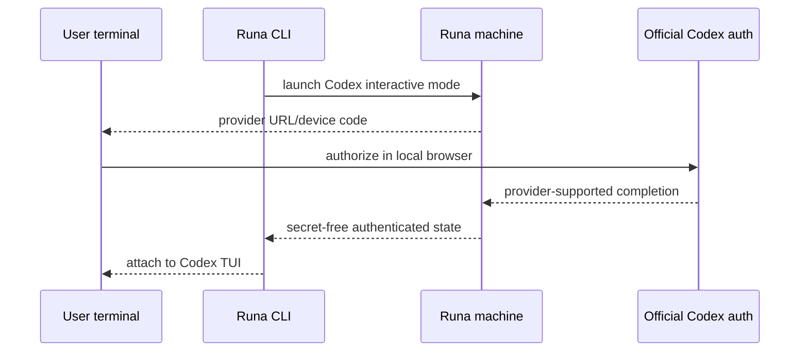

# PRD-013: Codex interactive authentication

| Field | Value |
|---|---|
| Status | Accepted |
| Owner | Runa CLI + Codex adapter |
| Updated | 2026-08-05 |

Normative terms follow RFC 2119/8174.

## Problem and existing evidence

Codex is a public session agent (`libs/typescript/src/types.ts:24`); the app classifies it as `interactive-or-api-key` and defaults it to interactive (`app-website/src/lib/agent-auth.ts:31`, `app-website/src/lib/agent-auth.ts:41`). Infrastructure nevertheless maps Codex to `OPENAI_API_KEY` and rejects a machine without the preset secret (`infra/edge/src/sessions.ts:52`, `infra/edge/src/sessions.ts:678`). Users who sign in with their Codex/ChatGPT account need that supported login to occur in the cloud agent while being operated from their local terminal, without Runa handling the provider credential.

## Goals

- G-013-1: Support Codex's official interactive login in a Runa cloud machine from the local CLI.
- G-013-2: Persist and accurately report remote authentication state.
- G-013-3: Maintain strict separation between interactive and API-key modes.

## Non-goals

- Guaranteeing subscription eligibility, quotas, or provider availability.
- Minting OpenAI credentials or capturing browser callbacks at Runa infrastructure.
- Copying provider credentials into local config or SDK responses.

## Functional requirements

- **R-013-01 (MUST, G-013-1):** WHERE `auth_method=interactive_login`, Codex machine creation SHALL succeed without `OPENAI_API_KEY` and the launcher SHALL invoke Codex's supported interactive sign-in.
- **R-013-02 (MUST, G-013-1):** WHEN Codex offers browser/device authorization, the CLI SHALL display the provider-issued URL/code and MAY open the local browser only after an explicit user action.
- **R-013-03 (MUST, G-013-2):** WHEN authorization completes, the remote Codex credential SHALL remain machine-local and survive detach/reattach without entering Runa control-plane storage.
- **R-013-04 (MUST, G-013-3):** Interactive mode SHALL NOT inject `OPENAI_API_KEY`; API-key mode SHALL NOT claim interactive login success.
- **R-013-05 (MUST, G-013-2):** The status probe SHALL return only the secret-free states `installing`, `login_required`, `authenticated`, or `unavailable` and SHALL verify usability rather than mere file existence.
- **R-013-06 (MUST, G-013-2):** IF a token expires or is revoked, THEN status SHALL leave `authenticated` and the next attach SHALL guide the user through login without destroying workspace state.
- **R-013-07 (MUST, G-013-3):** IF both credential modes are detected, THEN launch SHALL stop with a safe conflict reason and explicit remediation; it SHALL NOT guess precedence.
- **R-013-08 (MUST, G-013-2):** WHEN `runa agent logout --machine <id>` or confirmed machine deletion is requested, Runa SHALL revoke/remove remote Codex credentials without returning their contents; `runa logout` alone SHALL NOT change them.
- **R-013-09 (MUST, G-013-2):** `authenticated` SHALL require a fresh official Codex usability probe attributable to the selected AgentSession and auth mode; credential files, cached UI, previous login, a running process, or device-flow completion acknowledgement alone are insufficient.
- **R-013-10 (MUST, G-013-2):** Probe timeout, provider outage, ambiguous/changed CLI output, unsupported version, or contradictory evidence SHALL yield `unavailable` with freshness metadata and SHALL NOT mutate credentials or claim `login_required` without evidence.
- **R-013-11 (MUST, G-013-3):** Acknowledgement that browser/device authorization completed SHALL not be equated with a usable remote credential; launch SHALL revalidate at the use boundary and fail closed on revocation or wrong-account-store binding.

## Non-functional requirements

- NFR-013-1: status probe p95 below 5 seconds and no false-positive authenticated result during network failure.
- NFR-013-2: authentication flow SHALL remain usable on Windows, macOS, Linux, and headless terminals.
- NFR-013-3: no credential, authorization code, or login URL in telemetry, durable records, or local shell history generated by Runa.

## Security and privacy

Use only official Codex authentication commands and credential storage. Browser launch is local; Runa never requests provider passwords. Device codes and login URLs are ephemeral secrets. Machine-local credentials use least filesystem privilege and are excluded from sync/logs. All machine/session calls terminate at Runa-controlled endpoints; internal infrastructure remains invisible.

## Epistemic contract and falsification

Every auth judgment SHALL carry `observed_at`, `valid_until`, Codex/adapter version, auth mode, and evidence class. The adapter abstains after expiry or on unparsable provider output. Fault schedules include authorization acknowledged but token persistence failed, token revoked immediately after probe, network partition, stale credential artifact, account-store permission failure, two concurrent Codex sessions, and mixed CLI versions. A deliberately planted credential file and spoofed “login successful” output are mandatory negative controls and MUST not produce `authenticated`.

## Sequence

## Dependencies and risks

- Depends on PRD-011, PRD-031, outbound access, and a version-pinned Codex installation.
- Risk: headless login behavior changes. Mitigation: provider-version conformance matrix and fallback to displaying official instructions.
- Risk: status based only on files becomes stale. Mitigation: safe official probe with bounded timeout.
- Risk: codes leak in recordings. Mitigation: mark sensitive output region and prohibit Runa capture.

## Acceptance tests

- **TC-013-01:** Given no OpenAI key and interactive mode, when a Codex machine is created, then creation succeeds and official login begins.
- **TC-013-02:** Given completed browser/device login, when reconnecting from another local terminal as the same Runa owner, then Codex remains authenticated.
- **TC-013-03:** Given an expired provider token, when probed, then state is not authenticated and re-login is offered.
- **TC-013-04:** Given both modes, when launching, then a conflict blocks launch without revealing either credential.
- **TC-013-05:** Given a foreign Runa user, when requesting auth status, then no state or credential metadata is disclosed.
- **TC-013-06:** Given device authorization completion but failed remote credential persistence or failed usability probe, then status is `unavailable`/`login_required` as evidenced, never `authenticated`.
- **TC-013-07:** Given stale files, spoofed success text, provider timeout, or an unsupported Codex version, then the adapter abstains and performs no destructive remediation.
- **TC-013-08:** Given two Codex AgentSessions on one machine, terminal/auth status and lifecycle events remain session-scoped; any explicitly shared account store has a disclosed logout blast radius.

## Observability

Emit adapter version, auth mode/state transitions, probe latency/result, login completion class, conflict, logout, and retry. Exclude URLs, codes, account identity, credential files, and terminal payloads.

## Rollout and rollback

Enable for internal new machines, then opt-in beta. Preserve existing API-key mode without migration. Rollback hides interactive creation and stops new flows; it SHALL NOT remove already stored provider credentials or expose them for migration.

## Traceability

| Goal | Requirements | Design/task | Tests |
|---|---|---|---|
| G-013-1 | R-013-01,02 | Codex interactive adapter | TC-013-01 |
| G-013-2 | R-013-03,05,06,08..11 | probe + evidence-bearing credential lifecycle | TC-013-02,03,05..08 |
| G-013-3 | R-013-04,07,11 | exclusive auth-mode resolver | TC-013-04,06 |
