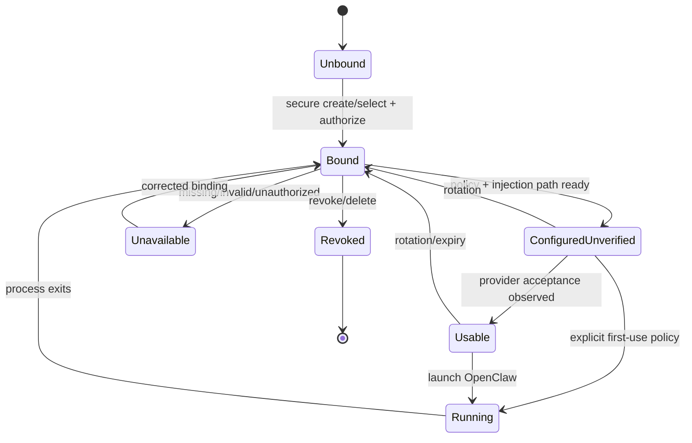

# PRD-014: OpenClaw API-key mode

| Field | Value |
|---|---|
| Status | Accepted |
| Owner | Runa CLI + OpenClaw adapter |
| Updated | 2026-08-05 |

Normative terms follow RFC 2119/8174.

## Problem and existing evidence

OpenClaw is modeled as API-key-only in the app (`app-website/src/lib/agent-auth.ts:38`) and maps to an Anthropic secret preset in infrastructure (`infra/edge/src/sessions.ts:57`). Creation writes a supplied secret to tenant secret storage or requires an existing named secret (`infra/edge/src/sessions.ts:672`). The CLI needs a safe non-interactive flow that distinguishes the Runa API key authenticating the client from the provider API key used only inside the cloud machine.

## Goals

- G-014-1: Launch OpenClaw with a usable provider credential without revealing it to the agent UI, SDK response, or local logs.
- G-014-2: Make credential source, scope, rotation, and revocation explicit.
- G-014-3: Prevent confusion between `RUNA_API_KEY` and provider credentials.

## Non-goals

- Interactive subscription login for OpenClaw.
- Returning, downloading, or displaying stored provider key material.
- Treating a workspace-wide provider secret as authorization for every machine without policy.

## Functional requirements

- **R-014-01 (MUST, G-014-3):** `RUNA_API_KEY` SHALL authenticate only calls to Runa; it SHALL never be injected as an OpenClaw/provider credential.
- **R-014-02 (MUST, G-014-1):** WHERE OpenClaw is selected, creation SHALL require a reference to an authorized stored provider credential or an explicit secure create-and-bind operation.
- **R-014-03 (MUST, G-014-1):** The CLI SHALL accept provider secret material only through secure interactive input or an explicitly named environment/file source and SHALL never place it in argv, URLs, command history, or normal output.
- **R-014-04 (MUST, G-014-2):** A credential binding SHALL identify credential ID, provider, machine/workspace scope, lifecycle, and permitted injection target without returning the value.
- **R-014-05 (MUST, G-014-1):** WHEN OpenClaw sends an authorized matching request, Runa SHALL inject the provider credential only at the request boundary; plaintext SHALL NOT enter agent argv, environment, filesystem, PTY or process metadata.
- **R-014-06 (MUST, G-014-2):** WHEN rotation commits, new matching requests SHALL use version N+1; requests already in flight MAY complete with N, but revoked N SHALL start no new request, and every boundary SHALL be ordered and auditable.
- **R-014-07 (MUST, G-014-2):** WHEN a binding is revoked or the machine is deleted, Runa SHALL prevent future injection and remove associated machine-local material.
- **R-014-08 (MUST, G-014-1):** IF the credential is invalid, missing, expired, or unauthorized, THEN launch SHALL fail closed with a stable secret-free remediation code.
- **R-014-09 (SHOULD, G-014-2):** The CLI SHOULD support `--credential <name>` and an interactive selector; it SHOULD NOT default across ambiguous credentials.
- **R-014-10 (MUST, G-014-1):** `bound` SHALL mean only that an authorized metadata relationship exists; `configured` SHALL require successful policy compilation and injection-path readiness; `authenticated`/`usable` SHALL require a fresh non-secret provider acceptance probe or an actual authorized request. These states SHALL never be conflated.
- **R-014-11 (MUST, G-014-1):** A credential injection request SHALL be bound to the initiating tenant, machine, AgentSession, rule version, destination tuple, and request generation; reuse across any boundary or after redirect/retry SHALL fail closed.
- **R-014-12 (MUST, G-014-2):** If credential validity cannot be safely probed without cost or side effect, status SHALL remain `configured_unverified`; UI and CLI SHALL not claim authentication and launch policy SHALL state whether first use is permitted.

## Non-functional requirements

- NFR-014-1: secret values SHALL be write-only and absent from API reads, logs, traces, records, crash reports, and SDK object representations.
- NFR-014-2: injection authorization and secret retrieval SHALL be auditable and p95 below 1 second.
- NFR-014-3: rotation/revocation convergence for new launches below 60 seconds.
- NFR-014-4: secret handling tests SHALL cover shell metacharacters, Unicode, maximum length, and binary rejection.

## Security and privacy

Encrypt provider secrets at rest with separated key management; decrypt only in the trusted injection path and minimize plaintext lifetime. Use constant-shape errors where credential existence is sensitive. Mask interactive input and clear buffers best-effort. Scope credentials least-privilege to owner/workspace/machine. The CLI and SDK speak only to Runa; no internal provider control-plane token or hostname is exposed.

## Epistemic contract and falsification

Metadata existence, decryption success, rule match, injection success, provider acceptance, and agent usability are separate observations with timestamps and rule/credential versions. A successful injection is not proof that the provider accepted the key. Fault schedules SHALL include rotation between authorization and injection, redirect after match, DNS rebinding, duplicate request, revoked key cached at edge, path canonicalization disagreement, concurrent sessions, and provider 401/429/5xx. Sentinel negative controls mutate exactly one binding dimension and MUST observe no injection.

## State machine

## Dependencies and risks

- Depends on PRD-011, PRD-022 and PRD-031.
- Risk: users paste provider keys into command arguments. Mitigation: refuse inline secret flags and provide masked stdin flow.
- Risk: workspace-wide secret crosses machine boundary. Mitigation: explicit binding policy and authorization check at injection time.
- Risk: invalid-key diagnosis leaks prefixes. Mitigation: stable reason categories without echoing values.

## Acceptance tests

- **TC-014-01:** Given a valid authorized binding, when launching OpenClaw, then state becomes configured/running and no secret appears in process listing or outputs.
- **TC-014-02:** Given only `RUNA_API_KEY`, when no provider credential is bound, then launch fails with `provider_credential_required`; the Runa key is never injected.
- **TC-014-03:** Given a provider secret containing shell metacharacters, when securely stored and injected, then it is passed exactly as data and never evaluated.
- **TC-014-04:** Given revocation, when a subsequent launch occurs, then injection is denied and audit evidence links the revocation causally.
- **TC-014-05:** Given API/SDK list/status calls, when inspected, then they contain metadata/state only and no recoverable secret bytes.
- **TC-014-06:** Given a valid binding with an invalid/revoked provider key, then state may be configured but is never reported authenticated/usable after the provider rejects it.
- **TC-014-07:** Given redirect, retry, DNS change, stale rule version, or a request from another AgentSession, then injection authorization is recomputed and no credential crosses the original tuple.
- **TC-014-08:** Given a provider for which safe validation is unavailable, then status remains `configured_unverified`, first-use behavior is explicit, and no fabricated health signal appears.

## Observability

Emit credential-binding create/use/rotate/revoke events, authorization result, injection result class, OpenClaw state transition, and latency. Identify credentials by opaque ID only. Values, prefixes, headers, environment dumps, and terminal content are forbidden.

## Rollout and rollback

Ship secure binding and read-only metadata before CLI launch. Canary with test credentials, then opt-in users. Rollback disables new bindings and launches while preserving encrypted secrets for explicit user recovery/re-enable; emergency rollback may revoke bindings without deleting audit evidence.

## Traceability

| Goal | Requirements | Design/task | Tests |
|---|---|---|---|
| G-014-1 | R-014-02,03,05,08,10,12 | secure input + injection adapter | TC-014-01,03,05,06,08 |
| G-014-2 | R-014-04,06,07,09,11 | binding/rotation service | TC-014-04,05,07 |
| G-014-3 | R-014-01 | auth-domain separation | TC-014-02 |
