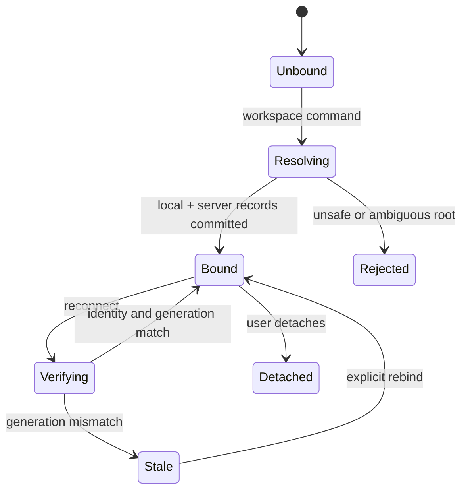
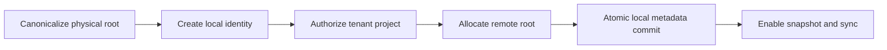

# PRD-015 — Workspace identity and root model

**Status:** Accepted · **Owner:** Runa CLI · **Depends on:** CLI authentication and machine lifecycle PRDs · **Unlocks:** PRD-016–021

The key words **MUST**, **SHALL**, **SHOULD**, and **MAY** are normative per RFC 2119/8174.

## 1. Problem and evidence

`runa claude .` needs a stable answer to “which local project and remote directory are these?” Paths are not identities: a project can move, Windows path syntax differs from POSIX, and two clones may share Git metadata while representing separate working copies. The inspected repository contains file upload/download capabilities and references `/workspace`, but no implemented Runa CLI workspace identity contract was found. **Inference:** the model below is proposed, not a description of production behavior.

## 2. Goals and non-goals

- **G-015-01:** Associate one local working copy, one Runa account/workspace, and one remote machine mount without ambiguity.
- **G-015-02:** Prevent path traversal, cross-tenant attachment, and accidental attachment to the wrong project.
- **G-015-03:** Preserve identity after local moves and safe machine reconnects.

Non-goals: cloud-drive semantics, sharing a live workspace between tenants, Git hosting, or deciding file synchronization behavior (PRD-016–021).

## 3. Model and invariants

`WorkspaceBinding = {binding_id, workspace_id, project_id, local_instance_id, canonical_local_root, remote_root, machine_id, generation, created_at}`. `workspace_id` is a public opaque Runa identifier; internal tenant mapping remains exclusively server-side.

- **I-015-01:** `binding_id`, `project_id`, and `local_instance_id` are opaque random identifiers; paths and repository URLs are never identity.
- **I-015-02:** A binding belongs to exactly one tenant; authorization is rechecked on every mutation.
- **I-015-03:** `remote_root` is an absolute normalized child of `/workspace/projects/<project_id>` and cannot escape it.
- **I-015-04:** One local instance has at most one writable active binding per machine/project generation.
- **I-015-05:** A path is admitted only after physical canonicalization; lexical `..`, symlink/junction escape, device paths, and NUL are rejected.

## 4. Requirements

| ID | Force | EARS requirement | Goal |
|---|---|---|---|
| R-015-01 | MUST | WHEN a user invokes a workspace command with a path, the CLI SHALL resolve the nearest explicit `.runa/workspace.json` or project root without traversing above the filesystem root. | G-01 |
| R-015-02 | MUST | WHEN no binding exists, the CLI SHALL generate separate project and local-instance identifiers, persist only non-secret metadata locally, and request a tenant-bound server binding. | G-01, G-02 |
| R-015-03 | MUST | WHEN a binding is loaded, the CLI SHALL verify schema version, tenant, project, local instance, remote machine, and generation before use. | G-02 |
| R-015-04 | MUST | IF metadata is malformed, forged, cross-tenant, or points outside the canonical root, THEN the CLI SHALL fail closed before reading or transmitting project content. | G-02 |
| R-015-05 | MUST | WHEN a bound directory is moved without content-identity conflict, the CLI SHALL update the canonical local path without changing project or local-instance identity. | G-03 |
| R-015-06 | MUST | WHEN two processes attempt to create or mutate the same binding, the CLI SHALL serialize the operation with an ownership lock and reject stale generations. | G-01, G-02 |
| R-015-07 | SHOULD | WHERE a Git repository is present, the CLI SHOULD record a sanitized repository fingerprint as advisory metadata and SHALL NOT use it as authorization. | G-01 |
| R-015-08 | MUST | WHEN displaying a binding, the CLI SHALL redact account tokens, terminal grants, filesystem usernames, and repository credentials. | G-02 |

## 5. State machine and dependency DAG

## 6. Threat model and limits

Threats: malicious `.runa` metadata, symlink/junction swaps, shared-directory races, tenant-ID substitution, malicious repo URL, and logs leaking usernames. Mitigations: handle-relative traversal where supported, revalidation immediately before file access, generation CAS, tenant derivation from authenticated principal, and structured redaction.

Limits: metadata ≤64 KiB; identifiers ≤128 bytes; normalized root path ≤4,096 UTF-8 bytes; lock wait defaults to 10 seconds then a typed `workspace_busy` failure; maximum 32 active local bindings per CLI process.

## 7. Behavioral acceptance tests

| Test | Given / When / Then | Covers |
|---|---|---|
| TC-015-01 | Given an unbound safe repo, when binding, then IDs are distinct, metadata is atomic, and remote root is confined. | R-01–03 |
| TC-015-02 | Given `../`, a Windows device path, symlink/junction escape, or metadata tenant mutation, when resolving, then zero project bytes and zero API mutations occur. | R-04 |
| TC-015-03 | Given a moved directory with the same local ID, when reconnecting, then the path updates and identity remains stable. | R-05 |
| TC-015-04 | Given two concurrent binders, when both commit, then one succeeds and the loser receives a typed conflict without partial metadata. | R-06 |
| TC-015-05 | Negative control: given two ordinary clones, when binding both, then their local-instance IDs differ even if Git fingerprints match. | R-02, R-07 |
| TC-015-06 | Fault injection: crash between server allocation and local rename; retry either adopts the exact idempotent binding or safely compensates it. | R-02, R-06 |

## 8. Metrics, rollout, rollback

Metrics: successful root resolution ≥99.9%; wrong-project incidents = 0; ambiguous-root failures; stale-generation rate; lock contention p95. Roll out behind `workspace_bindings_v1`: internal fixtures → 5% → 25% → 100%, with audit sampling at each gate. Rollback disables new bindings while preserving read-only metadata; no automatic deletion of remote content. A migration tool SHALL be reversible and retain the prior metadata copy.

## 9. Metacognitive checks and shared-boundary decision

A familiar path, matching Git remote, successful `stat`, or locally present metadata is a cue, not proof of identity or authority. Every attach SHALL derive its decision from the authenticated server binding, physical root identity, generation and current tenant authorization; uncertainty is a typed `workspace_identity_unproven` outcome, never implicit consent.

The workspace identity schema, canonicalization vectors and authorization oracle are shared contract assets for CLI, infrastructure and any SDK models. Runtime root discovery, OS locks and filesystem traversal remain CLI-owned. App and SDK code SHALL NOT independently reinterpret path identity. Any new public binding endpoint SHALL have equivalent idiomatic TypeScript and Python SDK models, methods, typed errors and contract tests when intended for programmatic clients. SDKs SHALL NOT discover local roots or mutate local files.

Add adversarial tests for copied `.runa` metadata, Git worktrees, bind mounts, junction retargeting after validation, tenant revocation between check and commit, and N/N-1 metadata readers. A negative control that substitutes path/Git equality for server identity MUST fail. Evidence expires on schema, canonicalizer, OS/runtime, authorization policy or server digest change.

## 10. Traceability

| Goal | Requirements | Design/task | Tests |
|---|---|---|---|
| G-015-01 | R-01, R-02, R-06, R-07 | D-015 identity registry; T-015 resolver/lock | TC-01, TC-04, TC-05 |
| G-015-02 | R-03, R-04, R-08 | D-015 confinement/CAS; T-015 validation/redaction | TC-02, TC-06 |
| G-015-03 | R-05 | D-015 relocatable binding | TC-03 |
