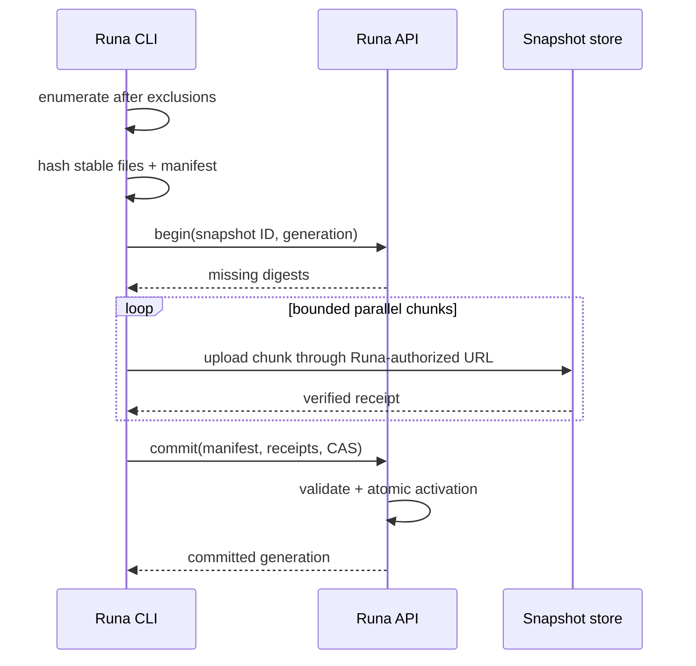

# PRD-016 — Snapshot and initial upload

**Status:** Accepted · **Owner:** Runa CLI · **Depends on:** PRD-015, PRD-018, PRD-020, PRD-032 · **Unlocks:** PRD-017

Normative terms follow RFC 2119/8174. No explicit file upload/download methods or content-addressed workspace snapshot contract were found in the reviewed infra, TypeScript SDK, or Python SDK revisions. **Observed scope:** snapshot transfer is a new Runa-facing capability; the CLI SHALL never call internal provider endpoints. Explicit programmatic primitives may reach the SDKs only through the compatibility campaign in PRD-024.

## Problem, goals, and non-goals

A first remote session needs an exact, bounded, confidential copy of the admitted local workspace. Partial archives, changes during enumeration, and retries can silently produce an incoherent tree.

- **G-016-01:** Produce a deterministic manifest and atomically materialize it remotely.
- **G-016-02:** Resume uploads without duplicating bytes or exposing excluded content.
- **G-016-03:** Fail before activation if integrity or authorization is uncertain.

Non-goals: continuous sync, conflict resolution, build artifact caches, or Git history replication.

## Snapshot contract and invariants

Manifest entries contain normalized relative path, kind, byte length, executable bit where portable, content digest, and mode metadata allowed by PRD-020. Directories are explicit; file content is addressed by SHA-256 digest. The snapshot ID is a domain-separated digest of canonical manifest bytes.

- **I-016-01:** The activated remote tree exactly matches one accepted manifest—never a partial mixture.
- **I-016-02:** Excluded files never enter a chunk, manifest, log, metric label, or error payload.
- **I-016-03:** A chunk is committed only after length and digest verification.
- **I-016-04:** Activation uses compare-and-swap on workspace generation.

## Requirements

| ID | Force | EARS requirement | Goal |
|---|---|---|---|
| R-016-01 | MUST | WHEN snapshotting begins, the CLI SHALL use descriptor/handle-relative no-follow traversal where supported, verify identity from each opened handle and every ancestor immediately before admission, and reject an unstable or escaping object after bounded retries; unsupported platforms without an accepted safe primitive SHALL fail closed. | G-01 |
| R-016-02 | MUST | WHEN enumerating, the CLI SHALL apply PRD-018 exclusions before opening file content. | G-02 |
| R-016-03 | MUST | WHEN constructing a manifest, the CLI SHALL canonicalize order and paths and compute content and manifest digests. | G-01 |
| R-016-04 | MUST | WHEN uploading, the client SHALL ask Runa which digests are absent and upload only missing chunks over authenticated Runa endpoints. | G-02 |
| R-016-05 | MUST | IF a chunk is truncated, corrupted, oversized, or digest-mismatched, THEN Runa SHALL reject it and SHALL NOT activate the snapshot. | G-03 |
| R-016-06 | MUST | WHEN all referenced chunks exist, Runa SHALL validate the complete manifest and atomically swap the staging tree into the bound remote root. | G-01, G-03 |
| R-016-07 | MUST | IF generation CAS fails, THEN activation SHALL return a typed conflict and preserve both the active tree and immutable staged snapshot for bounded recovery. | G-03 |
| R-016-08 | SHOULD | WHEN a retry presents the same idempotency key and snapshot digest, Runa SHOULD return the prior result without repeated activation. | G-02 |

## Flow

States: `enumerating → hashing → negotiating → uploading → verifying → committed`; any failure moves to `retryable`, `conflict`, or `rejected`; only `committed` unlocks agent launch.

## Threat model and resource bounds

Threats include archive bombs, path traversal, TOCTOU replacement, digest confusion, dedupe existence oracle, replay, and tenant-crossing chunk references. Dedupe responses SHALL be tenant-scoped; digests SHALL be domain separated; server reconstructs paths without archive extraction; grants are short-lived and scoped.

Defaults: 100,000 entries, 2 GiB total admitted bytes, 512 MiB per file, 4 MiB chunks, 4 concurrent uploads, 60-second request deadline, three exponential retries with jitter, and 15-minute staging TTL. Exceeding a limit fails with counts only and zero silent truncation. Limits may be raised only by server policy surfaced before upload.

## Behavioral tests

| Test | Scenario | Covers |
|---|---|---|
| TC-016-01 | Stable tree → deterministic manifest and byte-identical remote activation. | R-01,03,06 |
| TC-016-02 | Secret/excluded file spy → zero open/read/upload calls. | R-02 |
| TC-016-03 | Bit flip, short chunk, false receipt → commit fails and active root stays unchanged. | R-05,06 |
| TC-016-04 | Concurrent remote generation update during commit → typed conflict; no overwrite. | R-07 |
| TC-016-05 | Disconnect after half the chunks → retry sends only missing content and activates once. | R-04,08 |
| TC-016-06 | File mutates continuously during read → bounded retry then `snapshot_unstable`; no partial activation. | R-01 |
| TC-016-07 | Negative control: identical content in another tenant → API reveals no cross-tenant existence information. | R-04 |

## Metrics and release

Measure snapshot success, bytes avoided by dedupe, time-to-first-terminal p50/p95, integrity rejects, unstable-file rate, staging leaks, and excluded-file read count (must remain zero). Roll out synthetic trees → employee projects → opt-in beta → 10/50/100%. Rollback disables commit admission and garbage-collects uncommitted staging after TTL; already activated generations remain readable and PRD-021 can restore the previous generation.

## Release and oracle hardening

“All chunks uploaded” is not evidence of a valid snapshot. The authoritative oracle is a server receipt binding tenant, binding/epoch, policy digest, canonical manifest root, exact byte/entry counts, activated generation and immutable implementation digest. Client progress, HTTP success and object-store presence are non-authoritative cues.

The canonical manifest/chunk schemas and conformance corpus SHALL have one contract owner; hashing and canonicalization may be implemented separately in CLI/server/SDK languages and proven by differential vectors. Runtime traversal, chunk scheduling and activation stay separate because their trust and failure domains differ. If begin/manifest/chunk/commit are public, TypeScript and Python SDKs SHALL expose equivalent idiomatic request/result/error models and methods. They SHALL NOT implicitly walk, ignore, hash or synchronize a caller's filesystem.

Release tests SHALL cover unknown commit outcome, malicious missing-digest oracle, staged-content expiry during retry, quota races, mixed N/N-1 readers of staged and active generations, and rollback after an N writer creates durable state. A negative control that treats upload completion as activation MUST fail. Evidence expires on manifest schema, hash/canonicalization implementation, storage policy, quota, SDK artifact or producer digest change.

## Traceability

| Goal | Requirements | Design/task | Tests |
|---|---|---|---|
| G-016-01 | R-01,03,06 | Manifest engine + atomic activator | TC-01,06 |
| G-016-02 | R-02,04,08 | Exclusion-first walker + resumable uploader | TC-02,05,07 |
| G-016-03 | R-05,07 | Digest verifier + generation CAS | TC-03,04 |
