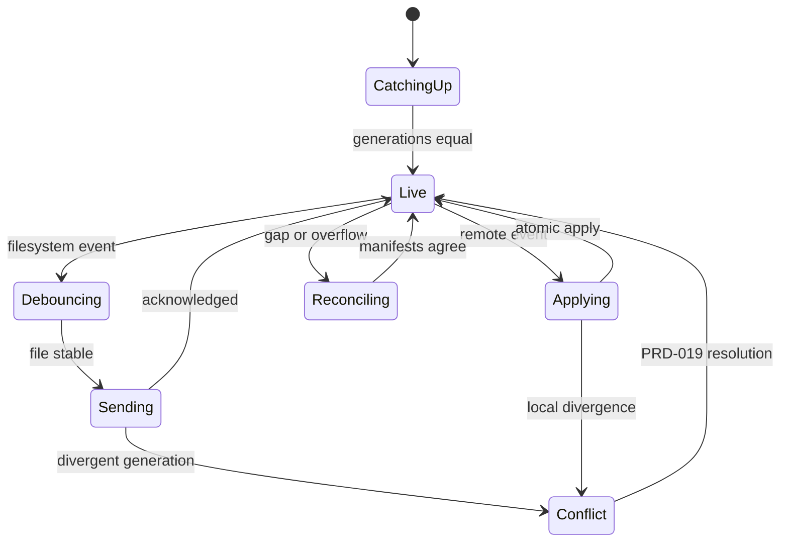
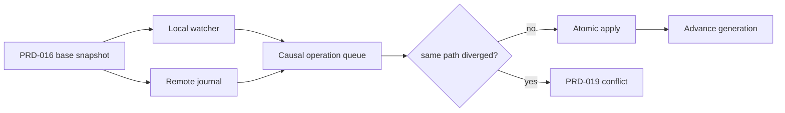

# PRD-017 — Incremental bidirectional synchronization

**Status:** Accepted · **Owner:** Runa CLI · **Depends on:** PRD-015, PRD-016, PRD-018–020, PRD-032 · **Recovery:** PRD-021

Normative terms follow RFC 2119/8174. **Inference:** no production bidirectional watcher/protocol was found; this document proposes it.

## Problem and outcomes

After the initial snapshot, local editors and cloud agents can modify the same workspace concurrently. Polling whole trees is slow; last-writer-wins can destroy work.

- **G-017-01:** Deliver admitted changes in both directions with deterministic convergence.
- **G-017-02:** Never silently overwrite divergent edits.
- **G-017-03:** Keep terminal interactivity independent of sync backpressure.

Non-goals: collaborative character-level editing, arbitrary multi-user shared roots, database synchronization, or replacing source control.

## Protocol and invariants

Each side emits ordered operations against `{binding_id, epoch, base_generation}`. Server assigns a monotonically increasing workspace sequence. Operations are create/update/delete/rename where rename is an optimization, never required for correctness.

- **I-017-01:** Acknowledged operations are idempotent by operation ID.
- **I-017-02:** No local or remote divergent write is silently discarded.
- **I-017-03:** Events outside the canonical root or excluded by PRD-018 are never serialized.
- **I-017-04:** Applied generation advances atomically with its operation receipt.
- **I-017-05:** Terminal input/output and sync use independent bounded channels.

## Requirements

| ID | Force | EARS requirement | Goal |
|---|---|---|---|
| R-017-01 | MUST | WHILE sync is active, the CLI SHALL combine filesystem notifications with periodic bounded reconciliation because notifications may coalesce or disappear. | G-01 |
| R-017-02 | MUST | WHEN a stable local change is admitted, the CLI SHALL assign an operation ID and base generation before transmission. | G-01 |
| R-017-03 | MUST | WHEN Runa observes a remote change, it SHALL publish an ordered tenant-bound event containing content identity and causality without secret values. | G-01 |
| R-017-04 | MUST | WHEN receiving a duplicate operation or event, either side SHALL acknowledge it without reapplying its effects. | G-01 |
| R-017-05 | MUST | IF both sides changed the same logical path from the same base, THEN sync SHALL enter conflict handling under PRD-019 and SHALL NOT choose a winner automatically. | G-02 |
| R-017-06 | MUST | WHEN an operation is accepted, the destination SHALL create a sibling temporary file through handle-relative no-follow traversal, verify content plus every ancestor/target identity, fsync as required, and atomically replace; any identity change SHALL reject, mark the root dirty, invoke PRD-021 reconciliation and SHALL NOT advance generation. | G-01, G-02 |
| R-017-07 | MUST | WHILE sync is congested, terminal transport SHALL retain its own capacity and sync SHALL coalesce superseded unacknowledged updates without coalescing deletes across causal barriers. | G-03 |
| R-017-08 | MUST | IF watcher overflow, sequence gap, or journal loss occurs, THEN the system SHALL pause incremental apply and initiate PRD-021 reconciliation. | G-01, G-02 |
| R-017-09 | SHOULD | WHEN a rename can be proven by file identity and digest, the system SHOULD transmit a rename; otherwise it SHALL use delete plus create. | G-01 |

## State and concurrency model

## Threat model and limits

Threats: event forgery, replay, delete storms, symlink swap, resource starvation, sequence rollback, and terminal starvation. Events are authenticated, binding/epoch scoped, monotonically checked, and revalidated at apply. Default bounds: 10,000 queued operations or 256 MiB, whichever first; 250 ms debounce; four content transfers; 16 MiB event metadata batch; reconciliation at least every 60 seconds and immediately after overflow. Crossing a limit pauses production and reconciles; it never drops an acknowledged change.

## Behavioral and fault tests

| Test | Scenario | Covers |
|---|---|---|
| TC-017-01 | Local create/edit/delete and remote create/edit/delete on disjoint paths → both trees converge byte-for-byte. | R-01–04,06 |
| TC-017-02 | Duplicate, reordered, and delayed events → each effect applied once in server sequence. | R-03,04 |
| TC-017-03 | Simultaneous edits to one base → conflict, both contents retained, no winner. | R-05 |
| TC-017-04 | 100k rapid saves to one file → bounded coalescing, final content converges, delete barriers preserved. | R-07 |
| TC-017-05 | Watcher overflow/sequence gap → incremental application stops until reconciliation proves equality. | R-08 |
| TC-017-06 | Slow sync plus interactive terminal flood → terminal latency guardrail remains green and sync stays bounded. | R-07 |
| TC-017-07 | File target, ancestor, symlink or junction identity changes between validation and apply → reject, write nowhere outside root, mark dirty and do not advance generation. | R-017-06 |
| TC-017-08 | Negative control: remote excluded-path event → zero local filesystem writes. | R-03, I-03 |

## Metrics, rollout, rollback

North star: convergence latency p95 <2 s for ≤1 MiB changes under nominal network. Guardrails: data-loss incidents 0; unresolved conflicts; queue utilization; reconciliation rate; terminal keystroke echo p95 regression <10 ms; bytes transferred. Rollout is one-way sync shadow comparison → bidirectional opt-in → 10/50/100%. Rollback stops watchers and remote subscriptions, drains acknowledged operations, records the last common generation, and falls back to explicit snapshot/download without deleting either tree.

## Hidden assumptions, authoritative truth, and mixed versions

Filesystem notifications, queue emptiness, websocket connectivity and equal wall-clock timestamps are hints only. Convergence is proven only by matching exclusion-aware manifest roots at a server-acknowledged generation and epoch. The UI/CLI SHALL report `catching_up`, `live_unverified`, `reconciling`, `conflicted` or `converged`; it SHALL NOT call a workspace synchronized solely because a watcher is quiet.

Add model-based histories covering multi-session writers on one machine, local plus two cloud-agent writers, rename cycles, delete/recreate ABA, directory/file kind races, reconnect during coalescing, disk-full after receipt, and crash at every journal transition. The oracle compares final admitted trees, retained conflicts, receipts and generations; last-write-wins and watcher-drop mutations are mandatory negative controls.

The operation/event schemas, causal rules, error taxonomy and conformance histories are shared contract/oracle assets. CLI watcher/apply code and server journal/apply code remain independent runtimes. Public sync operations require equivalent idiomatic TypeScript/Python SDK methods and models, but SDKs SHALL only submit/read explicit operations or streams; they SHALL NOT start watchers, reconcile directories or manage terminal backpressure implicitly. N and N-1 SHALL understand every durable state they can observe or reject before mutation with an export/recovery path.

## Traceability

| Goal | Requirements | Design/task | Tests |
|---|---|---|---|
| G-017-01 | R-01–04,06,08,09 | Watcher+journal protocol | TC-01,02,05,07 |
| G-017-02 | R-05,06,08 | Causality/conflict gate | TC-03,05,08 |
| G-017-03 | R-07 | Isolated queues/backpressure | TC-04,06 |
