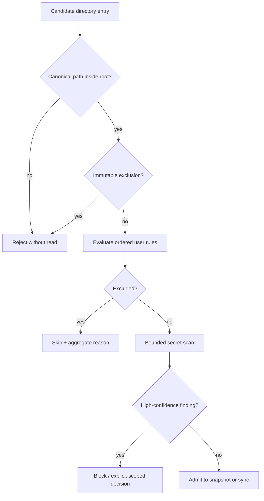

# PRD-018 — Ignore, exclusion, and secret safety

**Status:** Accepted · **Owner:** Runa CLI Security · **Depends on:** PRD-015 · **Constrains:** PRD-016, PRD-017, PRD-021

Normative terms follow RFC 2119/8174. This policy precedes all content reads. **Inference:** `.runaignore` and the exclusion compiler are proposed and not observed as implemented.

## Problem, goals, and non-goals

Workspace sync can exfiltrate `.env`, credentials, private keys, caches, or huge generated directories before a user notices. Git ignore rules alone are neither universal nor security policy.

- **G-018-01:** Prevent known-sensitive and explicitly ignored paths from being opened or transmitted.
- **G-018-02:** Give users deterministic, explainable control without unsafe overrides.
- **G-018-03:** Minimize secret leakage through content, names, logs, telemetry, and diagnostics.

Non-goals: secret scanning as proof that content is safe, DLP for every secret format, or uploading secrets for runtime injection (use Runa Secrets).

## Policy precedence and invariants

Effective exclusion is the union of immutable safety exclusions, platform exclusions, `.gitignore` when enabled, `.runaignore`, and CLI additions. Negation may re-include only entries excluded by user-controlled layers; it cannot override immutable safety rules.

- **I-018-01:** Policy evaluation occurs before open/read/hash/stat-follow of file content.
- **I-018-02:** Secrets detected by content scanning are blocked by default and never reproduced in diagnostics.
- **I-018-03:** The remote side enforces the same canonical policy digest; client filtering is not the only control.
- **I-018-04:** Ignored paths cannot be restored by recovery or received from remote sync.

## Requirements

| ID | Force | EARS requirement | Goal |
|---|---|---|---|
| R-018-01 | MUST | WHEN resolving policy, the CLI SHALL compile deterministic ordered rules and produce a versioned policy digest shared with Runa. | G-02 |
| R-018-02 | MUST | The CLI SHALL immutably exclude `.runa` credentials/state secrets, VCS credential stores, SSH/private keys, OS credential stores, sockets, devices, and paths outside the root. | G-01 |
| R-018-03 | MUST | WHEN `.gitignore` or `.runaignore` contains invalid syntax, the CLI SHALL report file and line without echoing matched sensitive names and SHALL fail closed for affected scope. | G-02, G-03 |
| R-018-04 | MUST | WHEN an entry is excluded, the walker SHALL NOT open its content and telemetry SHALL record only reason category and aggregate count. | G-01, G-03 |
| R-018-05 | MUST | IF a small admitted text file matches a high-confidence secret detector, THEN the CLI SHALL block it and require explicit per-path confirmation; immutable classes cannot be overridden. | G-01, G-02 |
| R-018-06 | MUST | WHEN an override is accepted, the CLI SHALL store only the scoped rule and policy version, never the matched secret or detector sample. | G-03 |
| R-018-07 | MUST | IF the server receives a path that violates the bound policy digest, THEN it SHALL reject the operation before content persistence. | G-01 |
| R-018-08 | SHOULD | WHEN users request `runa sync explain <path>`, the CLI SHOULD identify the winning rule and source without reading file content. | G-02 |

## Decision flow

## Threat model and bounds

Threats: malicious ignore negation, catastrophic glob, Unicode/path ambiguity, secret in filename, binary scanning DoS, TOCTOU, remote policy downgrade, and logs containing matches. Compile rules with bounded automata/non-backtracking matching. Defaults: ignore file ≤1 MiB, ≤10,000 rules, pattern ≤1,024 bytes, match evaluation ≤10 ms per entry budget, content scan only first/last configured windows totaling ≤2 MiB per file. A scan limit yields `unscanned_sensitive_risk` and blocks by default.

## Behavioral tests

| Test | Scenario | Covers |
|---|---|---|
| TC-018-01 | `.env`, PEM key, credential directory, socket and outside-root symlink → zero content-open calls and zero upload bytes. | R-02,04 |
| TC-018-02 | `.runaignore` excludes `dist/**`; later negation includes one file → deterministic result unless immutable. | R-01,02 |
| TC-018-03 | Malformed/complex glob → bounded typed error, no fallback-to-include. | R-03 |
| TC-018-04 | High-confidence token in admitted text → blocked; logs contain detector category only. | R-05,06 |
| TC-018-05 | Forged remote event under excluded path or stale policy digest → rejected before persistence. | R-07 |
| TC-018-06 | Negative control: ordinary source containing words `token` and `password` without a secret pattern → admitted. | R-05 |
| TC-018-07 | Concurrent rule edit during scan → snapshot binds one policy digest or restarts; never mixes policies. | R-01,07 |

## Metrics, rollout, rollback

Metrics: immutable exclusions, detector blocks/overrides by category, policy mismatch, false-positive appeal rate, evaluator latency, and confirmed leakage incidents (=0). Deploy in report-only on synthetic/non-secret corpus, then blocking for immutable classes, then opt-in detector, then default-on. Rollback may disable heuristic scanning but SHALL NOT disable immutable exclusions, server policy verification, or redaction.

## Policy authority, duplication, and assurance

A clean secret scan is not proof content is safe, and a matching client policy digest is not proof the server enforced it. Admission requires deterministic policy evaluation plus server-side policy binding. Unknown detector state, unsupported rule semantics or version skew SHALL produce `policy_unproven` and block affected content.

Rule grammar, precedence, immutable exclusion taxonomy, digest algorithm and golden vectors SHALL be one versioned contract/oracle shared across CLI and infrastructure. Implementations remain separate for defense in depth; neither may use the other as its sole oracle. App may explain server decisions. SDKs expose only explicit public policy fields/errors and SHALL NOT scan caller files or silently apply ignore rules.

Tests SHALL include encoded/Unicode filenames, hard links, alternate streams/resource forks, nested ignore files, rule changes between negotiate and commit, detector timeout, malicious downgrade and secret-bearing names. Negative controls remove server enforcement and invert precedence. Evidence expires on grammar, detector corpus/version, immutable-policy list, canonicalizer, supported filesystem or producer/client digest change.

## Traceability

| Goal | Requirements | Design/task | Tests |
|---|---|---|---|
| G-018-01 | R-02,04,05,07 | Exclusion-first walker + server gate | TC-01,04,05 |
| G-018-02 | R-01,03,05,08 | Policy compiler/explainer | TC-02,03,06,07 |
| G-018-03 | R-03,04,06 | Redacted diagnostics | TC-03,04 |
