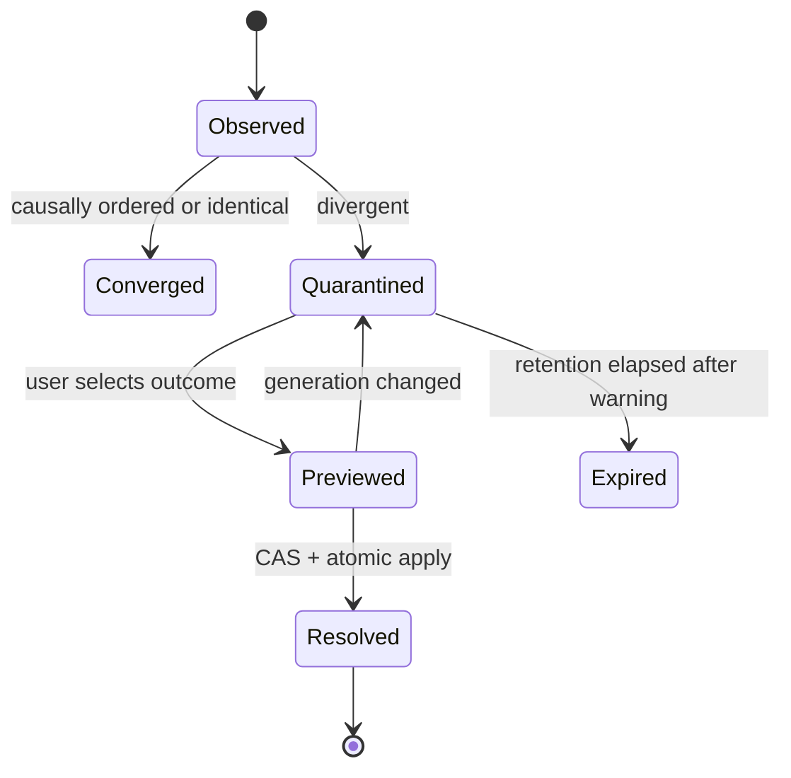

# PRD-019 — Conflict detection and resolution

**Status:** Accepted · **Owner:** Runa CLI · **Depends on:** PRD-015, PRD-018, PRD-020 · **Constrains:** PRD-017 · **Recovery:** PRD-021

Normative terms follow RFC 2119/8174. **Inference:** conflict artifacts and commands described here are new.

## Problem and goals

Local users and cloud agents can edit, rename, or delete the same path concurrently. Timestamp-based last-writer-wins is unsafe across skewed clocks and would invisibly destroy work.

- **G-019-01:** Detect divergence from causality/content, not wall-clock order.
- **G-019-02:** Preserve every conflicting version and make resolution explicit and reversible.
- **G-019-03:** Keep unrelated paths syncing while containing a conflict.

Non-goals: semantic merge for programming languages, automatic Git commits, collaborative text CRDTs, or deciding business intent.

## Conflict model and invariants

A conflict exists when two non-identical operations for the same logical path descend from the same base and neither causally includes the other. Classes: modify/modify, modify/delete, create/create, rename/modify, rename/rename, kind change, case collision, and permission collision.

- **I-019-01:** No divergent content is destroyed before explicit resolution and retention expiry.
- **I-019-02:** Clocks never determine the winner.
- **I-019-03:** Resolving requires the conflict ID and current conflict generation (CAS).
- **I-019-04:** Conflicted paths are quarantined; disjoint paths continue.

## Requirements

| ID | Force | EARS requirement | Goal |
|---|---|---|---|
| R-019-01 | MUST | WHEN operations share a path and base, the resolver SHALL compare causal generations, kinds, and content digests to classify convergence or conflict. | G-01 |
| R-019-02 | MUST | IF contents are byte-identical despite concurrent operation IDs, THEN the resolver SHALL converge without presenting a conflict. | G-01 |
| R-019-03 | MUST | WHEN a conflict is created, Runa SHALL persist immutable local, remote, and base references plus redacted metadata and return a stable conflict ID. | G-02 |
| R-019-04 | MUST | WHILE a path is conflicted, the sync engine SHALL reject additional automatic writes to that logical path but SHALL continue disjoint operations. | G-02, G-03 |
| R-019-05 | MUST | WHEN a user chooses local, remote, delete, rename, or a merged file, the CLI SHALL preview the consequence and commit it with conflict-generation CAS. | G-02 |
| R-019-06 | MUST | IF resolution CAS fails, THEN the CLI SHALL refresh the conflict and SHALL NOT apply the stale decision. | G-02 |
| R-019-07 | MUST | WHEN resolving with merged content, the CLI SHALL apply PRD-018 safety checks before upload and preserve both originals. | G-02 |
| R-019-08 | SHOULD | WHERE safe UTF-8 text and an available common base exist, the CLI SHOULD offer a three-way merge preview but SHALL NOT auto-commit conflict markers. | G-02 |

## State machine

Dependency order: capture immutable variants → classify → quarantine → inform user → preview → PRD-018 validate → CAS commit → resume path.

## Threat model and limits

Threats: malicious remote overwrites, stale resolution, conflict floods, filename injection, merge-tool command injection, and secret exposure in diffs. Use no shell interpolation; escape terminal output; default to metadata-only display for detector-blocked content. Defaults: 1,000 active conflicts/workspace, 2 GiB retained variants, text preview ≤1 MiB, 10,000 changed lines, binary always metadata-only, retention 30 days with warnings. At quota, pause affected new conflicts rather than evict unresolved evidence.

## Behavioral tests

| Test | Scenario | Covers |
|---|---|---|
| TC-019-01 | Same base, different bytes, simultaneous edits → one conflict with all three references. | R-01,03 |
| TC-019-02 | Same base, identical final bytes → converges without conflict. | R-02 |
| TC-019-03 | Modify/delete and rename/modify races → correct classes; no original lost. | R-01,03 |
| TC-019-04 | Conflict on `a`; updates to `b` → `a` quarantined and `b` converges. | R-04 |
| TC-019-05 | Two clients resolve same conflict → one CAS commit; stale client refreshes. | R-05,06 |
| TC-019-06 | Merged result contains blocked secret → resolution rejected, originals preserved. | R-07 |
| TC-019-07 | Negative control: timestamp skew of ±24h on causally ordered operations → no false conflict/winner change. | R-01 |
| TC-019-08 | Filenames containing terminal escapes/shell metacharacters → rendered safely and never executed. | R-03,05 |

## Metrics, rollout, rollback

Metrics: conflicts per 1,000 operations; false conflict rate; unresolved age; resolution choice distribution; time to resolution; data-loss incidents (=0). Begin with shadow classifier over generated histories, then detect-and-pause, then interactive resolution. Rollback freezes new automatic application on possibly divergent paths and exposes export of both variants; rollback SHALL NOT reinstate last-writer-wins.

## Conflict truth and multi-session obligations

Absence of a reported conflict is not proof of convergence. Classification SHALL use complete causal ancestry or reconciliation proof; missing ancestry is `causality_unknown` and pauses the affected path. A preview cannot authorize resolution after its generation changes.

The conflict schema, classifier specification and generated history corpus are shared contract/oracle assets; CLI, server and app runtimes remain independent. Public list/get/resolve endpoints require equivalent idiomatic TypeScript/Python SDK models, methods and typed stale-generation errors. SDKs SHALL NOT choose winners, invoke merge tools, read local files or auto-resolve.

Model-based tests SHALL cover three or more simultaneous Claude/Codex/local sessions, conflict-of-conflict, rename graphs, directory descendants, identical digest with different metadata, retention racing resolution and rollback after newer durable conflict state. Negative controls that discard a variant or use timestamps MUST fail. Retention expiry SHALL never be the only copy-destruction mechanism: unresolved content requires export plus explicit authorized disposition.

## Traceability

| Goal | Requirements | Design/task | Tests |
|---|---|---|---|
| G-019-01 | R-01,02 | Causal classifier | TC-01,02,03,07 |
| G-019-02 | R-03,05–08 | Conflict store/resolver | TC-01,05,06,08 |
| G-019-03 | R-04 | Path quarantine scheduler | TC-04 |
