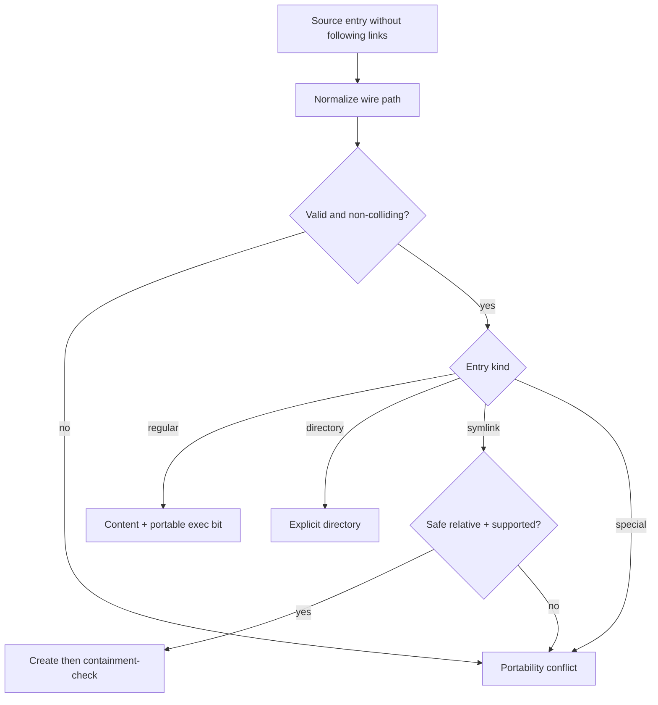

# PRD-020 — Filesystem portability

**Status:** Accepted · **Owner:** Runa CLI · **Depends on:** PRD-015, PRD-018 · **Constrains:** PRD-016, PRD-017, PRD-019, PRD-021

Normative terms follow RFC 2119/8174. Remote machines are expected to expose POSIX workspaces; local clients target Windows, macOS, and Linux. **Inference:** exact remote filesystem capabilities require implementation-time discovery.

## Problem, goals, and non-goals

Case sensitivity, Unicode normalization, separators, reserved names, symlinks, permissions, timestamps, sparse files, and executable bits differ. A “successful” copy can still alias two files or change program behavior.

- **G-020-01:** Define a reversible portable path/name model across supported OSes.
- **G-020-02:** Preserve meaningful metadata without manufacturing false fidelity.
- **G-020-03:** Block unsafe or lossy materialization unless explicitly exported by a safe alternative.

Non-goals: preserving every ACL/xattr/resource fork, device nodes, named pipes, sockets, hard-link topology, or arbitrary filesystem semantics.

## Canonical model and invariants

Wire paths use UTF-8 NFC, `/`, relative components, and preserve original display bytes where representable. Capability negotiation records case sensitivity, Unicode behavior, symlink support, atomic rename, permission model, and maximum path/component lengths.

- **I-020-01:** One canonical wire path maps to at most one destination object.
- **I-020-02:** Two source objects that collide at the destination never overwrite one another.
- **I-020-03:** Symlinks are data, are never followed during traversal, and may target only according to explicit safe policy.
- **I-020-04:** Unsupported metadata is reported, not silently claimed as preserved.

## Requirements

| ID | Force | EARS requirement | Goal |
|---|---|---|---|
| R-020-01 | MUST | WHEN binding a workspace, the CLI SHALL probe source and destination capabilities and bind the result to the sync epoch. | G-01, G-02 |
| R-020-02 | MUST | WHEN encoding paths, the CLI SHALL reject absolute paths, empty/dot/parent components, NUL, invalid Unicode, Windows device names, and components exceeding negotiated limits. | G-01, G-03 |
| R-020-03 | MUST | IF two paths collide by case-folding or normalization on either destination, THEN synchronization SHALL quarantine them as a portability conflict before writing either. | G-01, G-03 |
| R-020-04 | MUST | WHEN encountering a symlink or junction, the walker SHALL record link text without following it; external/absolute links SHALL be blocked by default. | G-03 |
| R-020-05 | MUST | WHERE safe relative symlinks are enabled and supported, materialization SHALL revalidate that the link’s resolved target remains inside the workspace. | G-03 |
| R-020-06 | MUST | WHEN transferring a regular file, the protocol SHALL preserve content and the portable executable bit; it SHALL normalize other permissions to policy defaults. | G-02 |
| R-020-07 | MUST | WHEN a file kind or metadata cannot be represented, the CLI SHALL return a typed portability issue and SHALL NOT silently substitute content. | G-02, G-03 |
| R-020-08 | SHOULD | WHERE atomic rename is unavailable, the destination SHOULD use a journaled replace protocol recoverable by PRD-021. | G-02 |

## Portability decision flow

## Threat model and limits

Threats: case-collision overwrite, Unicode spoofing, junction/symlink escape, reserved-name coercion, ACL escalation, decompression sparse-file exhaustion, and rename non-atomicity. Limits: component ≤255 UTF-8 bytes unless lower capability; path ≤4,096 bytes unless lower; symlink text ≤4,096 bytes; nesting ≤256; sparse logical size counts toward PRD-016 quota; modes limited to regular `0644/0755` policy equivalents. Capability disagreement fails closed.

## Behavioral matrix

| Test | Scenario | Covers |
|---|---|---|
| TC-020-01 | Round-trip portable corpus Windows↔Linux and macOS↔Linux → bytes/names/executable semantics preserved. | R-01,06 |
| TC-020-02 | `README` + `readme`, NFC + NFD equivalent names → conflict before destination write on colliding filesystem. | R-03 |
| TC-020-03 | `CON`, trailing dot/space, `..`, absolute, NUL and overlong components → typed rejection. | R-02 |
| TC-020-04 | Internal relative symlink, external symlink, junction swap during read → only enabled contained link can materialize. | R-04,05 |
| TC-020-05 | FIFO/socket/device/hard-link special case → no dereference or substitution. | R-07 |
| TC-020-06 | Destination lacks chmod/atomic rename → capabilities report limitation; journaled fallback or typed failure. | R-01,07,08 |
| TC-020-07 | Negative control: filenames differing in case on a proven case-sensitive pair → both transfer. | R-03 |
| TC-020-08 | Concurrent case-only rename and remote edit → one causal portability conflict, no data loss. | R-03,08 |

## Metrics, rollout, rollback

Metrics by OS/filesystem: portability conflicts, unsupported kinds, collision rate, symlink blocks, round-trip fidelity, journal recovery. Roll out corpus tests in CI → internal OS matrix → opt-in. Rollback disables bidirectional materialization for the affected capability tuple and offers snapshot export; it never applies a lossy rename automatically.

## Capability confidence and contract ownership

A successful capability probe is scoped evidence for one `{source filesystem, destination filesystem, mount, OS/runtime, epoch}` tuple, not a permanent platform fact. Probe failure, virtualization ambiguity or mount change yields `capability_unknown`; materialization pauses instead of assuming permissive behavior.

Wire-path schema, normalization/collision vectors and capability vocabulary SHALL be canonical contract assets. OS-specific codecs remain independently implemented and differentially tested; centralizing filesystem syscalls would collapse failure isolation. Public capability/portability results require equivalent idiomatic TypeScript/Python SDK models and typed errors when programmatic, but SDKs SHALL NOT inspect or materialize local filesystem objects.

Add tests for network shares, WSL/container mounts, short names, alternate streams, normalization-changing mounts, hard-link aliasing, case-mode changes after bind and N/N-1 vocabularies. Negative controls that trust source-only probes or perform lossy substitution MUST fail. Evidence expires immediately on remount, epoch, OS/runtime, codec or policy change.

## Traceability

| Goal | Requirements | Design/task | Tests |
|---|---|---|---|
| G-020-01 | R-01–05 | Capability/path codec | TC-01–04,07,08 |
| G-020-02 | R-01,06–08 | Metadata mapper/journal | TC-01,05,06 |
| G-020-03 | R-02–05,07 | Portability gate | TC-02–05,08 |
