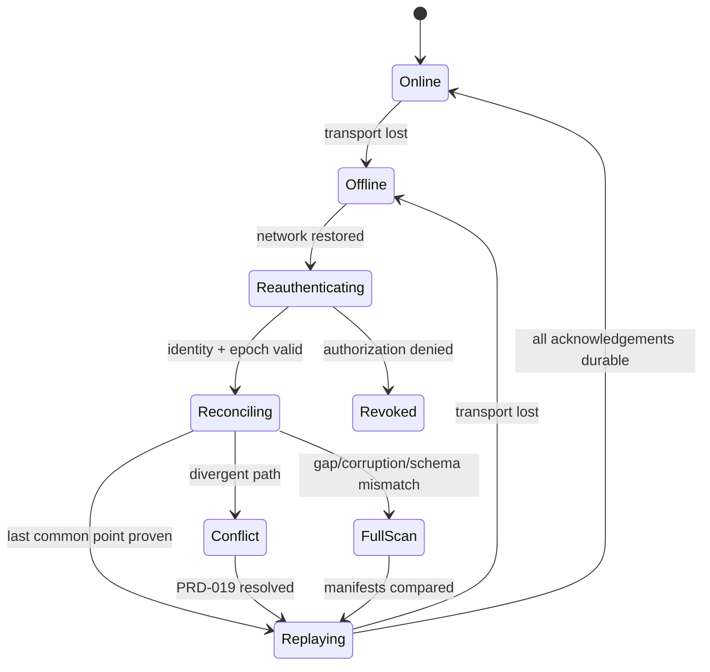
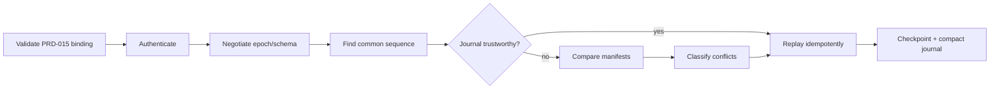

# PRD-021 — Sync recovery, offline operation, and resume

**Status:** Accepted · **Owner:** Runa CLI/SRE · **Depends on:** PRD-015–020, PRD-032

Normative terms follow RFC 2119/8174. **Inference:** a durable local sync journal and reconciliation endpoint are new; existing point transfers do not establish these guarantees.

## Problem and outcomes

Laptops sleep, networks partition, CLIs crash, machines pause, credentials expire, and servers redeploy. Recovery must distinguish “not yet sent,” “accepted remotely,” and “applied locally” without guessing or duplicating destructive operations.

- **G-021-01:** Resume after any single crash/partition with no acknowledged-change loss or duplicate effect.
- **G-021-02:** Permit bounded offline local work while clearly showing that cloud state is stale.
- **G-021-03:** Reconcile uncertainty safely and provide operator evidence.

Non-goals: indefinite offline multi-writer collaboration, disaster recovery for the entire Runa control plane, or guaranteed continuation after tenant access revocation.

## Durable model and invariants

The local journal records encrypted/authenticated operation metadata and content references, never Runa/provider credentials. Server journal records binding, epoch, monotonically increasing sequence, operation ID, digest, disposition, and generation.

- **I-021-01:** Acknowledged means durably committed by the authoritative side.
- **I-021-02:** Resume begins with identity/auth/epoch validation before replay.
- **I-021-03:** Uncertain destructive operations are queried by ID; they are not blindly retried.
- **I-021-04:** Offline mode never implies remote success and never launches a cloud agent without connectivity.
- **I-021-05:** Recovery cannot bypass PRD-018 exclusions or PRD-019 conflicts.

## Requirements

| ID | Force | EARS requirement | Goal |
|---|---|---|---|
| R-021-01 | MUST | WHEN producing a local operation, the CLI SHALL durably append and fsync its operation ID, base generation, digest, and state before reporting it queued. | G-01 |
| R-021-02 | MUST | IF connectivity is lost, THEN the CLI SHALL transition to explicit offline state, continue recording bounded local operations, and display that remote execution is unavailable/stale. | G-02 |
| R-021-03 | MUST | WHEN connectivity returns, the CLI SHALL reauthenticate, validate binding/epoch, query the last common acknowledged sequence, and reconcile before replay. | G-01, G-03 |
| R-021-04 | MUST | IF an operation outcome is uncertain, THEN the CLI SHALL query by idempotency/operation ID and SHALL retry only when the authoritative service proves it uncommitted. | G-01 |
| R-021-05 | MUST | IF journals have a gap, checksum failure, expired epoch, or incompatible schema, THEN sync SHALL stop incremental replay and perform manifest reconciliation. | G-01, G-03 |
| R-021-06 | MUST | WHEN reconciliation finds divergence, the system SHALL route same-path divergence to PRD-019 and continue only proven-disjoint operations. | G-03 |
| R-021-07 | MUST | IF authentication is revoked or the binding belongs to another tenant, THEN resume SHALL fail closed without uploading, downloading, or deleting content. | G-03 |
| R-021-08 | MUST | WHEN a process crashes during local apply, restart SHALL inspect the replace journal and deterministically complete or restore the prior path before new events. | G-01 |
| R-021-09 | MUST | WHEN the offline queue reaches its operation or byte bound, the CLI SHALL fsync `root_dirty_after_sequence`, suspend queue admission without assuming filesystem edits stop, retain every admitted entry, and require complete exclusion-aware manifest reconciliation before clearing the marker. | G-02 |

## Recovery state machine and DAG

## Threat model and bounded resources

Threats: replay after revocation, journal tampering, rollback to old epoch, disk exhaustion, malicious server sequence, offline secret addition, and crash loops. Journal records are checksummed and bound to identity/epoch; secrets remain protected by PRD-018 at enqueue and replay; server sequence monotonicity is verified.

Defaults: offline journal ≤100,000 operations or 2 GiB referenced new content; 7-day offline duration before mandatory full reconciliation; reconnect backoff 1–60 seconds with jitter; recovery attempts ≤5 before stable `recovery_required`; journal compaction only after both-side checkpoint proof; recovery logs ≤10 MiB with redaction. Limits never cause silent eviction.

## Behavioral, fault, and concurrency tests

| Test | Scenario | Covers |
|---|---|---|
| TC-021-01 | Kill process before send, during send, after server commit/before receipt, and during local replace → restart yields one effect and consistent tree. | R-01,04,08 |
| TC-021-02 | Offline edits below quota → visibly queued; reconnect reconciles and converges. | R-02,03 |
| TC-021-03 | Offline queue exceeds its bound, then further create/modify/delete/rename operations occur across two restarts → every change synchronizes or becomes an explicit conflict after full reconciliation; removing the dirty marker makes the negative control detect divergence. | R-021-09 |
| TC-021-04 | Journal bit flip, missing sequence, incompatible schema → no replay; full manifest reconciliation. | R-05 |
| TC-021-05 | Same path edited remotely while local offline → PRD-019 conflict; both versions retained. | R-06 |
| TC-021-06 | Credentials revoked during partition → zero content/API mutation after reconnect denial. | R-07 |
| TC-021-07 | Two CLI processes attempt replay → binding lock/sequence CAS permits one applier; effects remain idempotent. | R-03,04 |
| TC-021-08 | Negative control: clean reconnect with matching checkpoint → no full scan and no content retransmission. | R-03,05 |
| TC-021-09 | `.runaignore` changes offline → replay uses versioned policy and never uploads newly excluded content. | R-05, I-05 |

## Metrics, rollout, rollback, operations

Metrics: recovery success ≥99.9%; mean time to convergence; uncertain-operation queries; full reconciliations; offline queue saturation; journal corruption; duplicate effects (=0); acknowledged loss (=0). Alerts fire on any integrity failure or monotonicity violation.

Rollout: deterministic fault simulator → crash-point matrix → internal dogfood → offline opt-in → staged default. A release gate requires all crash points and network partitions on Windows/macOS/Linux. Rollback disables background resume, preserves journals read-only, and offers `runa sync recover --export`; it SHALL not delete local/remote data or downgrade journal schema destructively. Server must support N-1 protocol during staged rollback.

## Durable-state compatibility and recovery proof

Process restart, successful authentication and an empty outbound queue are not recovery evidence. Recovery completes only when identity/epoch are current, every uncertain operation has an authoritative disposition, replace journals are terminal, conflict retention is intact, and exclusion-aware manifest roots agree at the recorded generation.

Every durable record SHALL carry schema version, minimum reader/writer version, integrity domain and migration state. N and N-1 readers/writers SHALL be tested against journals, dirty markers, conflicts and generations created by the other. If downgrade cannot safely read new state, rollback SHALL first disable writers, export durable intent, run a reversible migration or roll forward; deleting journals or treating unknown records as applied is forbidden.

The journal schema/state machine and replay corpus are shared specifications, not shared runtime storage code. Public recovery/status/reconcile operations require equivalent idiomatic TypeScript/Python models and methods; SDKs SHALL NOT replay local journals, scan workspaces or infer recovered state. Crash-point, power-loss, disk-full, vault-lock, revocation and concurrent-session schedules require semantic oracles plus a mutation that marks uncertain operations successful; evidence expires on schema, storage engine, fsync policy, protocol, runtime or candidate change.

## Traceability

| Goal | Requirements | Design/task | Tests |
|---|---|---|---|
| G-021-01 | R-01,03–05,08 | Dual journal + idempotency + replace recovery | TC-01,04,07,08 |
| G-021-02 | R-02,09 | Offline queue/status | TC-02,03 |
| G-021-03 | R-03,05–07 | Reconciler/auth gate | TC-04–06,09 |
