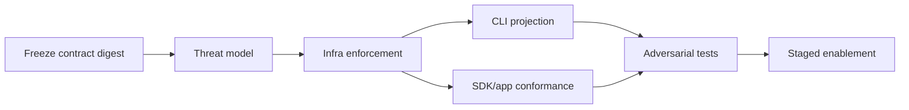

# PRD-022: Credential Injection and Outbound Policy Boundary

**Status:** Accepted | **Owner:** CLI + Infrastructure | **Normative language:** RFC 2119/8174

## Problem and evidence

The local CLI must preserve Runa's security boundary: the user and agent may use an authorized credential without the CLI, terminal stream, logs, or SDK learning its value. Today infrastructure validates mutually exclusive legacy/new outbound fields (`infra/edge/src/api.ts:229-263`), normalizes policies and automatically preserves required platform hosts (`infra/edge/src/outbound-policy.ts:49-78`), and exposes credential-rule CRUD (`infra/edge/src/api.ts:494-570`). The console already models credential, host, path and target (`app-website/src/lib/console-api-requests.ts:45-53,151-169`). The agent terminal removes Claude's stored credential when an injected API key is authoritative (`infra/edge/src/agentterm.ts:42-46`).

## Goals / explicit non-goals

Goals: preserve least privilege, secret non-disclosure, tenant isolation, deterministic outbound policy and auditable rule use across CLI sessions. **Non-goals:** storing provider secrets locally; teaching the CLI internal-infrastructure fields or hosts; granting task-level authority; inventing per-process sandboxing in v1; silently converting denylist to allowlist.

## Requirements (EARS)

- **R-022-01 MUST:** WHEN the CLI creates a machine, the Runa API SHALL accept either `outbound_policy` or legacy `allowed_hosts`, never both, and SHALL return a stable machine/session result.
- **R-022-02 MUST:** IF both forms, more than 128 rules, an invalid host, or a control-plane host in a denylist is submitted, THEN the API SHALL reject before provider mutation with a structured non-secret error.
- **R-022-03 MUST:** WHILE a terminal session is active, the CLI SHALL transmit only terminal protocol frames and SHALL NOT receive credential plaintext, provider tenant tokens, or injection templates.
- **R-022-04 MUST:** WHEN an outbound request matches a credential rule, infrastructure SHALL inject the credential only at the named host/path/target boundary and SHALL strip it before any untrusted redirect or unmatched destination.
- **R-022-05 MUST:** WHEN a rule is created, listed, used, rejected, or deleted, Runa SHALL emit a tenant-scoped audit event containing identifiers and outcome but no value.
- **R-022-06 SHOULD:** WHERE a user chooses unrestricted outbound traffic, the CLI SHALL omit the policy field instead of synthesizing an empty denylist.
- **R-022-07 MUST:** Policy `accepted` SHALL mean only schema/authorization acceptance; `enforced` SHALL require a policy digest acknowledged by the active dataplane generation. CLI/app/SDK SHALL not infer enforcement from a successful create/update response alone.
- **R-022-08 MUST:** Injection rule `configured` SHALL mean metadata and policy are valid; `usable` SHALL require a fresh authorized end-to-end result. Unknown, stale, or contradictory enforcement/injection evidence SHALL be represented explicitly and sensitive traffic SHALL fail closed.
- **R-022-09 MUST:** Every enforcement and injection decision SHALL bind tenant, machine, AgentSession, normalized destination, path/target, policy/rule version and dataplane generation; redirects, retries and DNS resolution changes SHALL re-evaluate the binding.
- **R-022-10 MUST:** Public clients and schemas SHALL expose only Runa concepts/origins. A contract/runtime scan SHALL fail release on internal provider names, identifiers, credentials, hosts, redirect mechanics, or error text.

## Contract compatibility envelope

Producer: exact infra API/OpenAPI digest; consumers: CLI version range, app console and TS/Python SDK supported versions; transports: HTTPS/WSS production and staging; auth: Runa user token or API key; population: named tenants; evidence lease: 7 days. Compatibility is **UNKNOWN** outside those identities. Request expansion is additive; old `allowed_hosts` remains accepted during adoption, new producers emit only `outbound_policy`, and contraction requires measured zero legacy use plus a deprecation release.

## Epistemic contract and abstention

The control plane SHALL report separately: request accepted, normalized policy digest, dataplane generation acknowledged, rule matched, secret injected, upstream accepted, and workload succeeded. No earlier signal implies a later one. Each evidence item has source, version, observation time and freshness. Missing dataplane acknowledgement, split-brain digest, unavailable secret authority, ambiguous normalization, or unsupported mixed version yields `unknown` and blocks credential-bearing traffic. Unrestricted outbound is an explicit policy conclusion, never inferred from a missing/failed policy fetch.

## Acceptance and fault model

Stable tests `TC-022-01` through `TC-022-10` map one-to-one to
`R-022-01` through `R-022-10`; protected-effect tests SHALL distinguish schema
acceptance, dataplane acknowledgement, rule match, injection, and upstream
acceptance.

- Positive: exact/wildcard allow and deny rules; empty allow blocks workload while platform traffic survives; empty deny is unrestricted.
- Faults: ambiguous dual fields, Unicode/confusable host, redirect exfiltration, header smuggling, tenant crossover, deleted secret, provider timeout, replayed rule ID.
- Faults additionally schedule control-plane success/dataplane failure, stale policy digest, replica disagreement, rotation during request, DNS rebinding, redirect/retry, concurrent AgentSessions and N/N-1 policy interpreters.
- Negative controls: mutate exactly one tenant/machine/session/host/path/target/rule-version/generation dimension and prove no injection; seed a sentinel secret and prove it appears in neither PTY, errors, traces nor audit payloads. Replace the dataplane ACK with a no-op fixture and require the enforcement gate to fail.
- Given a valid scoped rule, when matching traffic occurs, then only the provider request receives the secret; given any mismatch, then it does not.

## Delivery DAG and hard blockers

Block release on secret disclosure, fail-open matching, cross-tenant access, ambiguous request acceptance, unbound contract evidence, or inability to revoke. Rollback disables CLI rule authoring and retains server enforcement/read-only visibility.

## Traceability

| Goal | Requirements | Verification |
|---|---|---|
| Secret non-disclosure | R-022-03..05,09,10 | sentinel/redaction/cross-boundary tests |
| Policy correctness | R-022-01..02,06..09 | contract, ACK, property and fault-schedule tests |
| Compatible evolution | R-022-01,07,10 | mixed-version campaign in PRD-024 |
