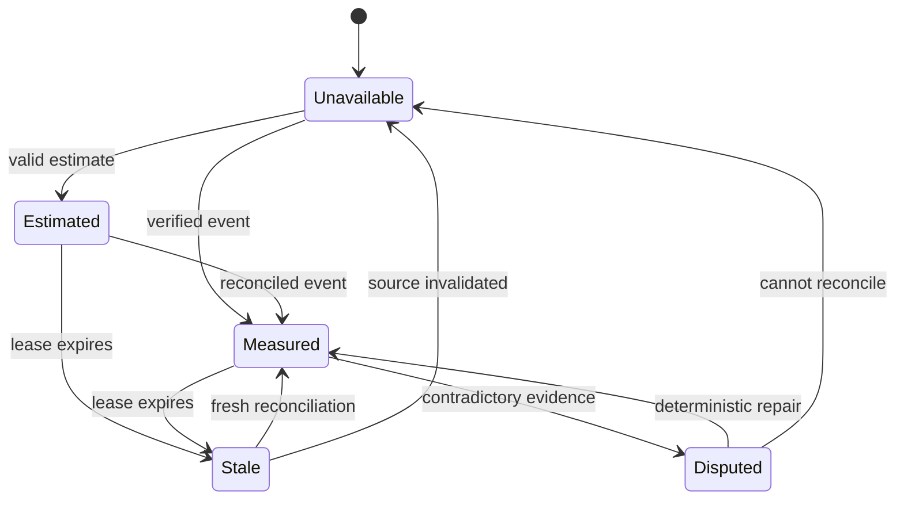

# PRD-023: Run Inspector, Metering, and Compression Truth

**Status:** Accepted | **Owner:** Infrastructure + Product | **Normative language:** RFC 2119/8174

## Problem and evidence

Runa must never display inferred savings or unavailable telemetry as fact. The console explicitly marks prompt compression unbacked (`app-website/src/lib/services.ts:104-105,471-472`), degrades Run Inspector failures to unavailable (`app-website/src/lib/services.ts:538-560`), and labels daily/resource histories unavailable (`app-website/src/lib/services.ts:676-706`). Infrastructure does accept token-saving/capture options (`infra/edge/src/api.ts:235-243`) and maps them into provider configuration (`infra/edge/src/sessions.ts:603-603,733-734`), but configuration is not evidence of measured effect.

## Goals / explicit non-goals

Goals: one authoritative event model, exact provenance, explicit estimated/measured/unavailable states, CLI summaries consistent with web. **Non-goals:** promising compression before causal evidence; reconstructing missing events; treating no telemetry as zero; exposing prompts/tool bodies by default; billing from client counters.

## Requirements (EARS)

- **R-023-01 MUST:** WHEN Runa reports tokens, cost, calls, or savings, it SHALL label each value `measured`, `estimated`, or `unavailable` with source, window and freshness.
- **R-023-02 MUST:** IF telemetry is absent, stale, contradictory, or partially ingested, THEN CLI and web SHALL display unavailable/partial and SHALL NOT substitute zero.
- **R-023-03 MUST:** WHEN compression savings are reported, Runa SHALL bind input baseline, output count, method/version, session/request identity and measurement timestamp.
- **R-023-04 MUST:** WHILE capture is disabled, Runa SHALL NOT persist prompt, response, tool-input, tool-output or terminal content.
- **R-023-05 MUST:** WHEN duplicate or out-of-order events arrive, the rollup SHALL be idempotent and monotonic for the same event identity.
- **R-023-06 SHOULD:** WHEN a CLI session exits, it SHALL show a compact verified summary and a web deep link, never marketing copy in place of data.

## Truth state machine

Safety: `AG(displayed_as_measured -> provenance_valid)`. Liveness: `AG(disputed -> AF(measured OR unavailable))`.

## Acceptance, fault model, and controls

Stable tests `TC-023-01` through `TC-023-06` map one-to-one to
`R-023-01` through `R-023-06`; negative controls SHALL prove that missing data
cannot become zero, measured, billed, or saved.

Faults: missing event, duplicate ID, clock skew, counter reset, partial batch, cross-tenant event, compression enabled but unused, negative savings, integer overflow, stale exchange rate. Negative controls deliberately drop/duplicate/reorder events and corrupt provenance; UI/CLI must become partial/unavailable, never green. Compare raw provider fixture → normalized event → rollup → API → CLI/web across exact candidate digests.

## Metrics and hard blockers

Track ingest lag, reconciliation delta, duplicate rate, unavailable rate and measured coverage. Block GA if any savings lack a causal measurement, billing and display disagree beyond defined rounding, tenant isolation fails, capture-off persists content, or an unavailable source renders zero. Rollback hides disputed metrics while retaining raw privacy-safe evidence.

## Calibration, contracts, and release evidence

Configuration enabled, agent exit success, low byte counts and user-perceived speed are cues—not measurements of compression, saved tokens or cost. Each displayed claim SHALL carry a machine-readable truth state, confidence/limitations where estimated, and an evidence lease. Estimated values SHALL never be aggregated into measured billing totals.

The normalized telemetry schema, truth-state algebra, rounding rules and fixture corpus are shared contract/oracle assets for infra, CLI, app and SDKs; presentation and collection runtimes remain separate. Any new public inspector/metering endpoint requires equivalent idiomatic TypeScript/Python models and methods for its explicit data. SDKs SHALL NOT invent estimates, scrape terminal output or claim compression from configuration.

Add mixed-version tests for unknown event kinds/required semantics, currency/model-price revisions, late corrections, session reuse, multi-agent sessions sharing a machine, capture-policy changes and rollback after new rollup state. Negative controls that map missing to zero, enabled to measured, or estimated to billed MUST fail. Evidence expires on event schema, normalizer, price table, attribution algorithm, capture policy, producer or consumer digest change.

## Traceability

| Goal | Requirements | Test |
|---|---|---|
| Truthful presentation | R-023-01..03,06 | state/contract snapshots |
| Privacy | R-023-04 | sentinel non-persistence |
| Correct aggregation | R-023-05 | duplicate/order/property tests |
