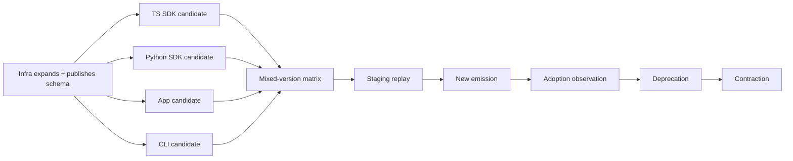

# PRD-024: SDK, App, Infra, and CLI Compatibility Campaign

**Status:** Accepted | **Owner:** API Governance | **Depends on:** PRD-008, PRD-022, PRD-023, PRD-031, PRD-032, PRD-033, PRD-034, PRD-036, PRD-037, PRD-039, PRD-041, PRD-042 | **Normative language:** RFC 2119/8174

## Problem and evidence

The CLI adds a consumer to a distributed contract already consumed by app and two SDKs. Infra CI verifies API/SDK and console projections (`infra/.github/workflows/ci.yml:64-69`) and fails closed when cross-repository authority is absent (`infra/.github/workflows/ci.yml:133-153`). The TS SDK exposes handoff and strict secret-free authentication (`libs/typescript/src/session.ts:276-309`) while its CI already exercises Node/OS compatibility (`libs/typescript/.github/workflows/ci.yml:48-80`). These controls must become one candidate-bound campaign rather than independent green checks.

## Goals / explicit non-goals

Goals: directional semantic compatibility, mixed-version safety, immutable cross-repo identities, expand-contract rollout. **Non-goals:** assuming SemVer proves compatibility; requiring atomic repository deploys; silently exposing browser-only fields in SDKs; removing old fields by calendar alone.

## Compatibility envelope

Each decision SHALL name: infra commit + OpenAPI SHA; CLI artifact digest/version; app commit/deployment; TS npm and Python wheel/sdist digests; supported Node/Python/OS matrix; staging/production topology; auth modes; protocol version; tenant cohort; evidence timestamps/expiry; unknown-consumer policy. Verdicts: `COMPATIBLE`, `COMPATIBLE_WITH_CONDITIONS`, `MIGRATION_REQUIRED`, `VERSION_SPLIT_REQUIRED`, `BLOCKED_BREAKING_CHANGE`, or `UNKNOWN_INSUFFICIENT_EVIDENCE`.

## Requirements (EARS)

- **R-024-01 MUST:** WHEN a public route/schema/error/auth/terminal behavior changes, the campaign SHALL evaluate request and response compatibility separately for every named consumer.
- **R-024-02 MUST:** WHEN artifacts are tested, receipts SHALL bind immutable digests, toolchain, environment, raw output and expiry.
- **R-024-03 MUST:** IF old and new populations may coexist, THEN the migration SHALL prove all producer×consumer combinations plus rollback after new state exists.
- **R-024-04 MUST:** WHEN a new field/operation is introduced, producers SHALL expand first, consumers SHALL adopt second, emission SHALL switch third, and contraction SHALL occur only after verified adoption.
- **R-024-05 MUST:** IF any material consumer or runtime behavior is unknown, THEN the campaign SHALL return `UNKNOWN_INSUFFICIENT_EVIDENCE` and block promotion.
- **R-024-06 MUST:** The CLI SHALL reuse public Runa concepts and SHALL NOT expose internal-infrastructure identifiers or browser-only redirect/cookie mechanics.
- **R-024-07 MUST:** Compatibility evidence SHALL distinguish schema acceptance, transport negotiation, semantic interpretation, side-effect execution, and observed postcondition; success at one layer SHALL NOT establish the next.
- **R-024-08 MUST:** Every verdict SHALL include confidence limits: tested identities/populations, untested combinations, evidence freshness, assumptions, and falsifying observations. No evidence or stale evidence yields `UNKNOWN_INSUFFICIENT_EVIDENCE`, not compatibility.
- **R-024-09 MUST:** Mixed-version tests SHALL cover unknown required/optional fields, capability omission, N/N-1 state enums, auth probes, AgentSession isolation, terminal ACK-versus-execution semantics, policy-digest acknowledgement, and rollback after durable new state.
- **R-024-10 MUST:** Promotion SHALL fail if any public artifact, generated SDK, CLI output, app response, telemetry fixture, or runtime error exposes non-Runa control-plane identities, hosts, credentials, or browser-only mechanics.

## Campaign DAG

The graph must topologically sort; cycles are resolved through a compatibility adapter or version split. External node completion requires artifact/deployment evidence, not merge status.

## Tests, negative controls, blockers

Stable tests `TC-024-01` through `TC-024-10` map one-to-one to
`R-024-01` through `R-024-10`; every receipt SHALL bind producer, consumer,
schema, runtime, environment, artifact digest, and evidence expiry.

Consumer-driven contracts cover success, errors, auth, side effects, timeouts, idempotency, handoff replay, terminal framing and lifecycle ordering. Negative control runs an intentionally incompatible fixture and requires the gate to fail. Hard blockers: missing exact artifact, schema/runtime drift, unknown consumer, failed mixed-version rollback, leaked internal field, stale receipt, or cyclic migration plan.

The campaign SHALL run fault schedules at every producer/consumer boundary: response lost after mutation, ACK before side effect, timeout with unknown outcome, replica/version split, delayed old-client retry, rollback while new durable state exists, and authority unavailable. Oracles SHALL inspect externally observable postconditions rather than trusting HTTP status, merge status, generated types, or self-reported readiness. A deliberately permissive consumer, a no-op producer that returns success, and an internal-name leak fixture are mandatory negative controls; each gate MUST reject them.

The campaign SHALL include PRD-031 authentication modes, PRD-032 manifest,
journal, generation, policy-digest and conflict schemas, and PRD-033 parent/
child AgentSession contracts. Required matrices are old server/new CLI, new
server/old CLI, N/N-1 terminal and sync protocols, rollback after new journal or
AgentSession state, and rejection of unknown required fields before mutation.

## Traceability

| Requirement | Evidence |
|---|---|
| R-024-01..03 | directional matrix + rollback replay |
| R-024-04 | promotion receipts per DAG node |
| R-024-05..06 | unknown-consumer/internal-name scans |
| R-024-07..09 | layered oracles + fault schedules + mixed-version negative controls |
| R-024-10 | public-artifact/runtime Runa-only leak scan |
