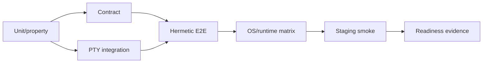

# PRD-025: Test Harness and Behavioral Assurance

**Status:** Accepted | **Owner:** CLI Quality | **Depends on:** PRD-009, PRD-014, PRD-019, PRD-021, PRD-024, PRD-038, PRD-040, PRD-041, PRD-042 | **Normative language:** RFC 2119/8174

## Problem and evidence

The product crosses local PTY, HTTPS/WSS, machine lifecycle, provider login and workspace synchronization. Compile-only evidence cannot protect behavior. Existing app tests include outbound omission/ambiguity (`app-website/src/lib/console-api-requests.test.ts:137-158`) and terminal keyboard/open-handoff suites are wired into CI (`app-website/package.json:16-17`). Infra CI runs tests, contract checks and an authenticated boot probe (`infra/.github/workflows/ci.yml:58-75,96-131`). The CLI needs a hermetic harness that composes those obligations.

## Goals / explicit non-goals

Goals: reproducible PTY/protocol/provider/API tests, semantic oracles, fault injection, negative controls, evidence receipts. **Non-goals:** live-provider calls in required PR CI; snapshot-only assurance; coverage percentage as a release decision; retries that hide deterministic failures.

## Requirements (EARS)

- **R-025-01 MUST:** WHEN a CLI command is tested, the harness SHALL record setup, stimulus, observations, oracle, cleanup, seed, platform and candidate digest.
- **R-025-02 MUST:** WHERE a MUST behavior exists, at least one test SHALL fail under a known contract mutation or fault injection and pass on the candidate.
- **R-025-03 MUST:** WHEN terminal transport is exercised, tests SHALL cover raw mode restoration, resize, Unicode, large output, Ctrl+C, Ctrl+V/paste policy, disconnect, bounded reconnect and exit-code propagation.
- **R-025-04 MUST:** WHEN create/connect/sync is exercised, tests SHALL cover idempotency, partial upload, conflict, ignored files, symlink escape, cancellation and cleanup.
- **R-025-05 MUST:** IF external services are unavailable, THEN required tests SHALL use deterministic fakes; scheduled staging tests SHALL verify real integration separately.
- **R-025-06 MUST:** IF a test is flaky or quarantined, THEN it SHALL not satisfy a mandatory obligation and SHALL carry owner, reason and expiry.

## Fault model

| Domain | Injected faults | Oracle |
|---|---|---|
| HTTP | 401/403/409/422/429/5xx, timeout, truncation | typed error; no unsafe retry |
| WSS/PTTY | bad frame, replay, half-close, resize storm | fail closed; terminal restored |
| Sync | hash collision fixture, conflict, disk full, symlink | no escape/loss; recovery possible |
| Auth | expired/revoked token, wrong tenant | reauth or deny; no secret output |
| Lifecycle | delayed start, duplicate create, delete race | bounded, idempotent outcome |

Negative controls include a server that accepts replay, a decoder that ignores unknown required semantics, and redaction disabled; the harness must detect each. Property/fuzz tests shrink host rules, frames, paths and Unicode inputs. Live staging tests use disposable tenants/machines and always clean up by recorded IDs.

## Assurance DAG

## Obligation ledger and independent oracles

The repository SHALL maintain a machine-readable ledger mapping every normative requirement to owner, implementation/effect slice, setup, stimulus, observation, independent oracle, negative control, platforms, stability and evidence TTL. A passing test without that path is execution evidence only and cannot close an obligation.

Mocks may establish client behavior but cannot prove real auth, PTY, storage, atomicity, network, OS-vault or provider behavior. Required assurance separates hermetic contract evidence, real installed-artifact OS evidence and disposable staging evidence. Generated tests cannot be the only oracle for generated clients/schemas; use frozen examples, independent reference models or cross-language differential vectors.

The harness SHALL test N/N-1 CLI/API/TS SDK/Python SDK/app combinations, durable-state rollback, concurrent agent sessions, abort/cleanup and partial observability. Each required test has a bounded retry policy; a retry-only pass is unavailable. Default TTLs: hermetic exact-candidate evidence until any bound input changes; OS/PTY 7 days; staging/provider 24 hours; vulnerability feeds 24 hours. Any changed contract, dependency, toolchain, runtime image, policy or artifact invalidates affected descendants.

## Gates and traceability

Stable tests `TC-025-01` through `TC-025-06` map one-to-one to
`R-025-01` through `R-025-06`; these are meta-tests of the harness and SHALL fail
when the corresponding seeded defect is not detected.

Block release on uncovered MUST, negative control that passes, non-restored terminal, data loss, cross-tenant access, unbounded retry, flaky mandatory evidence or failed cleanup. Evidence expiry is class-specific: hermetic exact-candidate receipts remain valid only while every bound input is identical; OS/PTY receipts expire after 7 days; staging/provider and vulnerability receipts expire after 24 hours; approvals expire at their declared window. Any dependency, contract, candidate, policy, toolchain, runtime, topology or oracle change immediately invalidates affected descendants even when the time lease has not elapsed.

| Goal | Requirements | Evidence |
|---|---|---|
| Behavioral fidelity | R-025-01..05 | receipts + mutation/fault results |
| Trustworthy gates | R-025-02,06 | negative-control/quarantine ledger |
