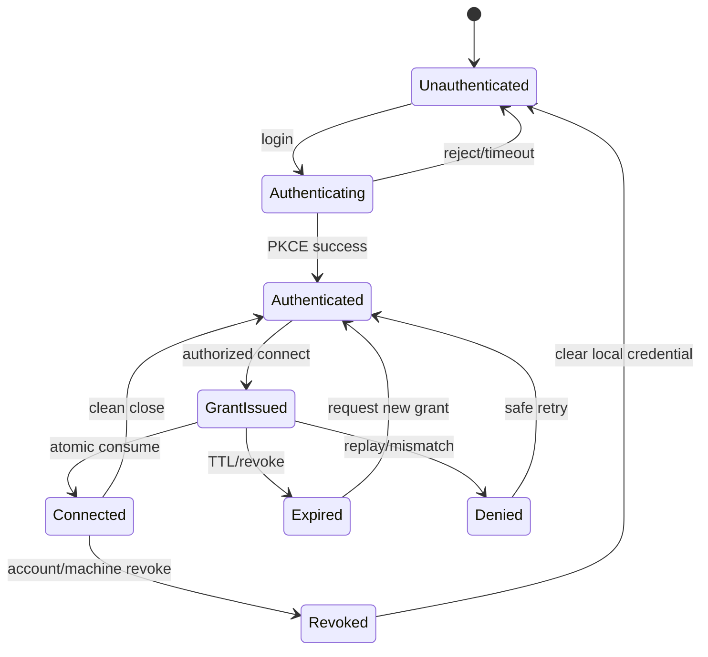

# PRD-026: Security Hardening and Threat Model

**Status:** Accepted | **Owner:** Security | **Normative language:** RFC 2119/8174

## Existing boundary

Infrastructure mints a 60-second grant (`infra/edge/src/api.ts:576-584`), cryptographically separates grant/cookie/tunnel purposes (`infra/edge/src/crypto.ts:39-69`), and atomically records nonce consumption across edge instances (`infra/edge/src/grants.ts:4-21`). Proxy code consumes query grants before honoring them (`infra/edge/src/proxy.ts:128-132,221-225`). This browser-oriented boundary is evidence, not automatic approval for a native CLI protocol.

## Goals / explicit non-goals

Goals: protect account, project, terminal, cloud machine, credentials and update channel against STRIDE-class threats. **Non-goals:** endpoint antivirus; securing a knowingly compromised local administrator account; transmitting provider credentials to Runa CLI; arbitrary port forwarding in v1; trusting repository instructions as authority.

## Threats and controls

| Threat | Asset/control |
|---|---|
| grant theft/replay | one-use, ≤60s, user+machine+purpose binding |
| malicious workspace | ignore policy, symlink/root escape prevention, no executable hooks by default |
| terminal injection | byte transport without interpreting output as authority; safe log escaping |
| confused deputy | server authorization on every mutation; tenant-bound IDs |
| secret exfiltration | scoped injection, redirect stripping, redaction sentinels |
| malicious update/dependency | signed provenance, digest verification, registry allowlist |
| local token theft | OS credential vault, restrictive permissions, revocation |

## Requirements (EARS)

- **R-026-01 MUST:** WHEN a human logs in, the CLI SHALL use system browser + PKCE/loopback or approved device flow and SHALL store refresh material only in the OS credential vault.
- **R-026-02 MUST:** WHEN a terminal session is issued, its capability SHALL be single-use, short-lived, audience/purpose/user/machine bound and redacted from logs/process arguments where feasible.
- **R-026-03 MUST:** IF a token is expired, replayed, malformed, wrong-purpose or wrong-tenant, THEN every hop SHALL fail closed without upstream connection.
- **R-026-04 MUST:** WHILE syncing, the CLI SHALL confine traversal to the canonical workspace root and SHALL reject escaping symlinks, device files and secret defaults.
- **R-026-05 MUST:** WHEN output contains control sequences, telemetry/log renderers SHALL neutralize sequences while the attached PTY preserves terminal semantics.
- **R-026-06 MUST:** IF update signature/provenance/digest verification fails, THEN auto-update SHALL abort and retain the prior executable.
- **R-026-07 SHOULD:** Security events SHALL be rate-limited, privacy-safe, tenant-scoped and causally linked without terminal content.

## Security state machine

Safety: `AG(Connected -> authenticated ∧ consumed_once ∧ tenant_match)`. Recovery: `AG EF(Unauthenticated OR Authenticated)`.

## Security truth, shared contracts, and recovery

UI badges, locally cached login state, successful websocket upgrade and possession of an identifier are not authorization evidence. Each privileged mutation and reconnect SHALL be authorized server-side against current tenant, purpose, machine/session and revocation state. Unknown revocation or audit state fails closed and is surfaced as unavailable, not signed-in.

Token/grant schemas, error codes, redaction corpus and security invariants are shared contract/oracle assets; crypto verification and authorization enforcement remain independently owned by each trust boundary. Public security/status operations require equivalent idiomatic TypeScript/Python models and methods where safe, but SDKs SHALL NOT receive provider credentials, own OS-vault behavior or implement implicit interactive login flows.

Recovery rehearsals SHALL cover signing-key compromise, update-root rotation, grant-store partition, account revocation during active multi-session use, malicious N-1 clients and containment without deleting user work. Security evidence expires at most every 24 hours and immediately on policy, key, dependency/advisory, protocol, auth implementation or candidate change.

## Verification and blockers

Stable tests `TC-026-01` through `TC-026-07` map one-to-one to
`R-026-01` through `R-026-07`; every privileged path requires an adversarial
counterexample and a protected-effect oracle.

Threat-model review, SAST, secret scan, dependency audit, fuzzers, cross-tenant suite, replay race, malicious archive/tree fixtures, revoked-login test and update substitution test are mandatory. Block GA on any cross-tenant access, secret disclosure, replay, path escape, unsigned update, fail-open authorization, critical/high exploitable finding, or missing incident/revocation procedure.
