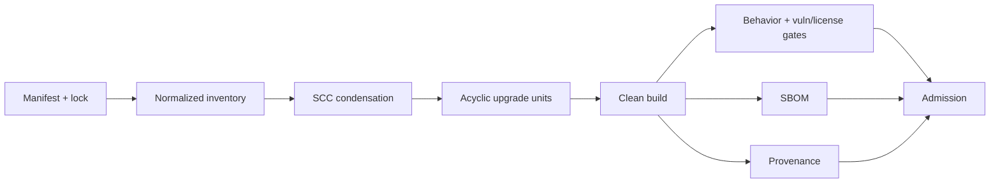

# PRD-027: Dependency and Supply-Chain Controls

**Status:** Accepted | **Owner:** CLI Maintainers + Security | **Normative language:** RFC 2119/8174

## Problem and evidence

The CLI will be installed on developer machines and process credentials, source trees and terminal bytes. Existing projects already use lockfiles/audits; infra pins GitHub Actions to commit SHAs and audits the complete tree (`infra/.github/workflows/ci.yml:34-43,87-91`), while TS release CI checksum-pins CycloneDX and produces attestations (`libs/typescript/.github/workflows/ci.yml:28-38,130-145`). The CLI must meet or exceed that baseline.

## Goals / explicit non-goals

Goals: minimal reachable dependency set, reproducible graph, SBOM, provenance, lifecycle/license/vulnerability policy, safe upgrades. **Non-goals:** chasing newest versions without risk reduction; trusting SemVer; allowing install scripts by default; publishing from a workstation; treating a lockfile as provenance.

## Requirements (EARS)

- **R-027-01 MUST:** WHEN dependencies are resolved, CI SHALL inventory direct/transitive packages, licenses, integrity, source, lifecycle, native code, install scripts and reachable usage.
- **R-027-02 MUST:** WHEN a candidate is built, it SHALL use a committed lockfile, clean environment, allowlisted registry and immutable toolchain.
- **R-027-03 MUST:** WHEN an artifact is produced, CI SHALL generate a CycloneDX SBOM, signed provenance/attestation and checksums bound to the exact artifact digest.
- **R-027-04 MUST:** IF provenance, integrity, publisher ownership or registry source is unknown, THEN the dependency SHALL be quarantined and release blocked.
- **R-027-05 MUST:** WHEN upgrading, maintainers SHALL establish a baseline, build an SCC-condensed acyclic upgrade DAG, verify semantics, and stage rollout with rollback.
- **R-027-06 MUST:** IF a reachable critical/high vulnerability lacks a validated mitigation, THEN release SHALL be blocked; an exception requires owner, scope, compensating controls and expiry.
- **R-027-07 SHOULD:** The runtime bundle SHALL exclude package managers, tests, source maps containing sources, and unused optional dependencies.

## Dependency DAG and policy

CI SHALL reject graph drift (`npm ls` mismatch), unapproved git/file dependencies, new native/install-script capability without security review, forbidden license, mutable Action tags, missing integrity and SBOM/artifact mismatch.

The repository SHALL carry a versioned machine-readable admission policy. Its
initial envelope permits only exact-integrity packages from
`https://registry.npmjs.org`, Apache-2.0/MIT/BSD/ISC/CC0-style permissive
licenses, and zero install scripts or native code unless a named Security
approval with expiry is present. Unknown or policy-incompatible licenses block.
Reachable critical/high advisories block immediately; an unreachable high
finding requires a documented reachability proof and a maximum seven-day
exception approved by Security. Advisory input is refreshed at least every 24
hours and immediately before release admission.

## Fault model, negative controls, recovery

Inject tampered tarball, wrong checksum, compromised registry response, dependency confusion name, mutable tag, revoked attestation, undeclared transitive, malicious postinstall and CVE fixture; each gate must fail. Rollback reinstalls the prior signed digest and verifies executable/self-test; dependency evidence expires on manifest, lockfile, toolchain, advisory database or artifact change.

## Cross-repository maintenance and evidence discipline

The dependency inventory SHALL include CLI, infra contract tooling, app consumers, TypeScript/Python SDK generators/runtimes, CI actions, container bases and distribution metadata. Similar packages across repositories are not automatically unified: share a package only when ownership, release cadence, failure domain and compatibility envelope align; otherwise share policy, schemas, fixtures and upgrade evidence.

Every upgrade plan SHALL record delay risk separately from change risk, supported runtime/OS matrix, transitive capability growth, maintainer health, release provenance and rollback feasibility. Lockfile freshness, `npm audit` success or SemVer compatibility are signals, not semantic proof. Negative controls include a vulnerable package absent from the direct tree, a transitive install script, registry substitution and an SDK generator/runtime incompatibility.

Evidence TTL is 24 hours for advisories/registry ownership and until any digest changes for graph/build evidence. A contract-tool or generator upgrade that changes public output triggers API compatibility assessment plus equivalent TypeScript/Python regeneration and consumer tests; no SDK is published from stale generated artifacts.

## Acceptance

Stable tests `TC-027-01` through `TC-027-07` map one-to-one to
`R-027-01` through `R-027-07`; candidate evidence SHALL be rejected when its
lockfile, source, dependency graph, SBOM, provenance, or digest identity drifts.

Every exception records package/version, graph path, reachability method,
owner, compensating control, approval and expiry; expiry invalidates dependent
release evidence automatically.

All package graph nodes are connected or explicitly excluded; topological upgrade plan succeeds after SCC collapse; installed artifact matches SBOM; provenance verifies independently; clean rebuild is byte-identical where supported or has documented nondeterminism; no hard blocker remains.
