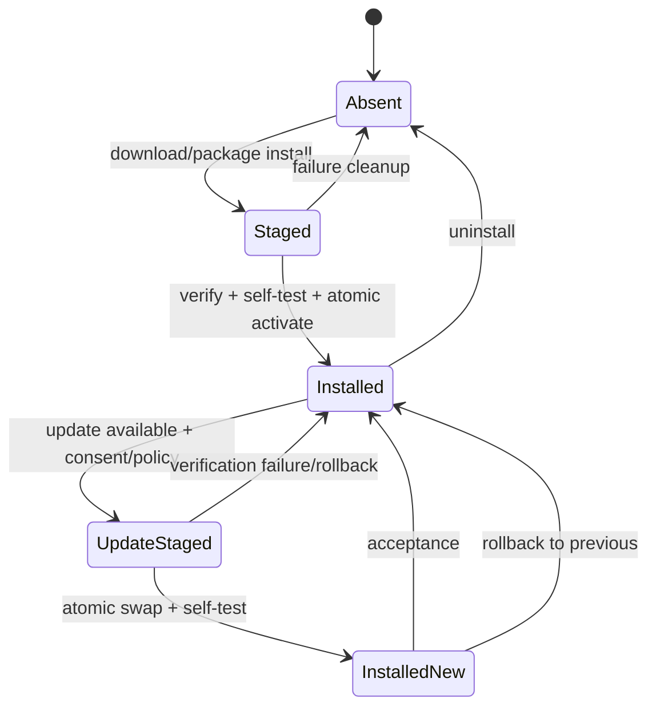

# PRD-028: Packaging, Installation, Update, and Uninstall

**Status:** Accepted | **Owner:** CLI Distribution | **Depends on:** PRD-004, PRD-006, PRD-027, PRD-043 | **Normative language:** RFC 2119/8174

## Problem and evidence

Users need `runa` to behave like a native local tool without weakening supply-chain guarantees. The existing TS SDK is an npm package with extensive pack/release gates (`libs/typescript/package.json:32-75`) and validates Linux, Windows and macOS combinations (`libs/typescript/.github/workflows/ci.yml:52-75`). The CLI is a distinct executable product and requires lifecycle guarantees beyond library installation.

## Goals / explicit non-goals

Goals: predictable command path, signed multi-platform distribution, atomic updates, complete non-destructive uninstall and diagnosable version state. **Non-goals:** mandatory auto-update; modifying shell profiles without consent; deleting cloud machines/workspaces during uninstall; hiding Node/runtime requirements; installing provider CLIs locally.

## Distribution decision

MVP and first GA SHALL publish `@runa_laboratories/cli` with `bin: { "runa": ... }` and an explicit supported Node range. npm is the owner of installed package files for this channel; `runa update` SHALL detect the installer and use or recommend the exact package-manager operation with explicit consent, then verify the installed artifact. Standalone binaries are out of scope for first GA and require a later accepted release-envelope revision. Package-manager formulas/manifests are projections, not independent builds. Publisher and trust-root authority are defined by PRD-043.

### Supported installation surfaces

| Surface | Intended command | Tier / platform | Authority rule |
| --- | --- | --- | --- |
| npm | `npm install -g @runa_laboratories/cli` | Primary; Windows, macOS, Linux | Installs the exact approved npm package and provenance-bound version. |
| Bun | `bun add --global @runa_laboratories/cli` | Tier 1; Windows, macOS, Linux | Resolves the same npm package/version; Bun is an installer projection, not a publisher. |
| curl | `curl -fsSL https://runacode.io/install \| sh` | Tier 1; macOS and Linux | Proposed official bootstrap; it SHALL select an approved channel, show its action, verify metadata/artifact identity, and never build from source. The URL is not claimed live until runtime evidence exists. |
| Homebrew | `brew install Runa-Laboratories/tap/runa` | Tier 1; macOS and supported Linux | Formula is digest-pinned and generated from the approved release envelope. |
| paru/AUR | `paru -S runa-cli-bin` | Tier 1 for supported Arch Linux | PKGBUILD is digest-pinned, installs approved release bytes, and never executes repository HEAD. |

Windows remains fully supported through npm and Bun. A future PowerShell-native
bootstrap is a separate channel decision; absence of curl, brew, or paru on
Windows SHALL NOT reduce Windows product support.

## Requirements (EARS)

- **R-028-01 MUST:** WHEN installed through a supported channel, exactly one `runa` executable SHALL resolve and `runa version --json` SHALL report CLI version, build digest, protocol range, platform and update channel.
- **R-028-02 MUST:** WHEN installation completes, it SHALL run a network-free self-test and SHALL fail without leaving a partially active binary.
- **R-028-03 MUST:** WHEN checking/updating an npm installation, the CLI SHALL verify registry/channel/provenance metadata, obtain consent, invoke or present the exact supported package-manager operation, and verify the resulting installed identity; it SHALL NOT overwrite package-manager-owned files itself. WHERE a future standalone channel is accepted, its installer SHALL stage, verify, self-test and atomically replace according to PRD-043.
- **R-028-04 MUST:** IF verification, disk write or self-test fails, THEN the prior executable SHALL remain usable and the update SHALL return a stable nonzero code.
- **R-028-05 MUST:** WHEN uninstalled, binaries, completions and opt-in caches SHALL be removable while OS-vault credentials require explicit `runa logout --all`; cloud resources SHALL remain untouched.
- **R-028-06 SHOULD:** Shell completion installation SHALL be explicit/idempotent for PowerShell, bash, zsh and fish.
- **R-028-07 MUST:** The installer/updater SHALL NOT execute repository-local hooks or trust terminal output as instructions.
- **R-028-08 MUST:** npm update authorization SHALL require the approved registry identity, exact package/repository/publisher binding, provenance and dist-tag/channel policy from PRD-043. WHERE a standalone updater exists, it SHALL use the versioned threshold-signed root/timestamp/snapshot/targets model in PRD-043; the CLI SHALL NOT claim that npm installation traversed that standalone trust decision point.
- **R-028-09 MUST:** WHEN npm, Bun, curl, Homebrew, or paru installs the same release version, each surface SHALL resolve to the approved package/artifact identity and support policy, report its installer of record, and reject mutable, unverified, source-rebuilt, or cross-channel-mismatched bytes.

## Lifecycle state machine

## Mixed-version and dependency obligations

Installation success and `runa --version` are not proof that the artifact can safely read existing configuration, credentials or durable sync state. Installed-artifact tests SHALL cover upgrade and downgrade across every supported N/N-1 pair with old/new config, journals and protocol negotiation. If a prior binary cannot safely read new state, update metadata SHALL declare a rollback barrier and require export/migration or roll-forward rather than silent downgrade.

Package-manager wrappers, update metadata and the npm package SHALL resolve to the same signed artifact identity and support policy. Channel metadata is authoritative only while signatures, thresholds and expiry validate. Negative controls for rollback/freeze attack, PATH shadowing, stale cache, killed atomic swap and incompatible durable state are mandatory. Packaging evidence expires on artifact, update metadata, trust root, installer dependency, support-policy or channel change.

## Acceptance and blockers

Test clean install, reinstall, path with spaces/non-ASCII, read-only destination, full disk, concurrent update, offline mode, downgrade policy, corrupted archive, wrong architecture, uninstall with active session and recovery after killed updater on every supported platform. **TC-028-09** installs the same candidate through npm and Bun on Windows/macOS/Linux, curl and Homebrew on macOS/Linux, and paru on supported Arch Linux; it compares reported identity, payload surface, self-test, update ownership and uninstall cleanup. A formula, installer or PKGBUILD that rebuilds or mutates executable bytes fails. Block release on unsigned artifact, non-atomic replacement, lost credentials without consent, cloud deletion, orphan executable precedence or inability to restore prior binary.
