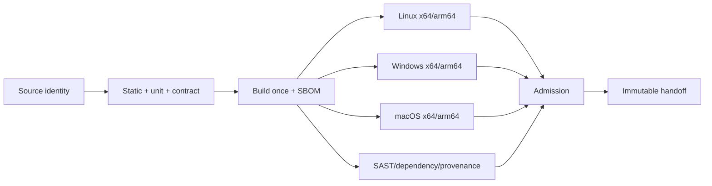

# PRD-029: CI Quality Gates and Multi-Platform Matrix

**Status:** Accepted | **Owner:** DevOps | **Normative language:** RFC 2119/8174

## Problem and evidence

The CLI's core promise is platform-sensitive: PTY, signals, clipboard/paste, paths and credential vaults differ. Existing infra CI is Linux-only (`infra/.github/workflows/ci.yml:21-25`); the TS SDK demonstrates a fan-out matrix across Ubuntu, Windows and macOS (`libs/typescript/.github/workflows/ci.yml:48-80`) plus release admission and attestations (`libs/typescript/.github/workflows/ci.yml:82-145`). The CLI needs its own candidate-bound DAG.

## Goals / explicit non-goals

Goals: fast deterministic commit feedback, installed-artifact testing, platform behavior evidence, least-privilege CI and immutable handoff. **Non-goals:** making every job blocking on every commit; accepting branch/tag as artifact identity; rerunning deterministic failures unchanged; allowing a platform to pass via another platform.

## Requirements (EARS)

- **R-029-01 MUST:** WHEN code is proposed, commit CI SHALL finish lint, formatting, typecheck, unit/property, contract, dependency and secret gates before candidate construction.
- **R-029-02 MUST:** WHEN a candidate is built, downstream jobs SHALL test that exact artifact digest rather than rebuild source independently.
- **R-029-03 MUST:** WHERE a platform is supported, CI SHALL test install, login fake, PTY I/O/signals/resize, sync paths, update/rollback and uninstall on its architecture/runtime envelope.
- **R-029-04 MUST:** WHEN matrix jobs complete, admission SHALL require every mandatory receipt and validate candidate/toolchain/platform/evidence identity and freshness.
- **R-029-05 MUST:** IF a negative control does not fail, a mandatory receipt is absent, or an artifact digest differs, THEN admission SHALL block.
- **R-029-06 MUST:** CI actions SHALL be commit-SHA pinned, permissions least-privilege, credentials non-persistent, and release publication SHALL use OIDC/trusted publishing.
- **R-029-07 SHOULD:** Independent gates SHALL fan out and fail independently; no `fail-fast` SHALL hide sibling evidence.

## Gate DAG and matrix

The candidate SHALL bind an immutable `support-policy.json` containing exact
Node, npm, runner-image, OS release and architecture identities. First GA tests
the npm artifact on the two exact supported Node lines recorded there, Windows
11 and Server, two named macOS releases and two named Ubuntu LTS releases; x64
is mandatory. arm64 is mandatory only before that architecture is claimed.
Standalone-binary jobs are absent until PRD-028's release envelope is revised.
Scheduled automation may propose support-policy updates, but candidate receipts
always bind concrete versions. Slow fuzz, real OS vaults, staging API and
provider-login smoke never persist credentials.

## Evidence and operational gates

Each receipt records candidate SHA-256, source commit, lockfile, runner image, tool versions, command, exit, duration, raw artifact pointers and expiry. CI monitors p50/p95 duration, queue time, flake rate and false-green incidents. Blockers: any unsupported claim, missing OS-specific semantic test, mutable action, high/critical reachable vulnerability, contract drift, failed redaction or candidate rebuild.

## Consumer, state, and evidence matrix

The matrix SHALL include producer N/N-1 × CLI N/N-1 × TypeScript SDK N/N-1 × Python SDK N/N-1 for every changed public contract, plus app compatibility where it consumes the surface. Durable-state changes add old-reader/new-writer and new-reader/old-writer recovery cases. Unsupported combinations must reject before mutation with stable errors, never merely fail later.

CI SHALL verify generated SDK artifacts are reproducible from the frozen OpenAPI digest and that each new public endpoint has equivalent idiomatic TypeScript/Python methods, models, errors, examples and contract tests where appropriate. Terminal UI, PTY ownership, workspace watchers and implicit sync SHALL remain CLI-only and are explicitly excluded from SDK parity.

Receipt success is not truth unless its oracle discriminates a seeded fault. Required gates include negative controls for skipped matrix legs, stale cache, rebuilt artifact substitution, schema/runtime drift, missing telemetry and cleanup leakage. Evidence TTL follows PRD-025/030 and every invalidation edge SHALL be encoded, not manually inferred.

## Acceptance

Stable tests `TC-029-01` through `TC-029-07` map one-to-one to
`R-029-01` through `R-029-07`; installed-artifact receipts SHALL remain distinct
for Windows, macOS, and Linux and cannot substitute for one another.

The DAG topologically sorts with one candidate root and one admission sink; every external call has timeout/failure handling; a deliberately corrupted receipt and mismatched artifact are rejected; branch protection requires the admission gate.
