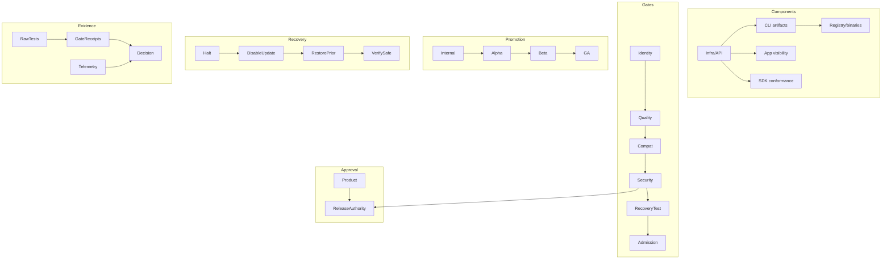

# PRD-030: Staged Release, Readiness, Recovery, and Support

**Status:** Accepted | **Owner:** Release Authority | **Mode:** Gatekeeper until separately authorized | **Normative language:** RFC 2119/8174

## Problem and evidence

The CLI coordinates a local executable, API contract, edge terminal protocol, web observability and SDK-facing behavior. A green branch is not a safe release. Existing TS release automation already separates candidate, compatibility, admission, handoff and attestation (`libs/typescript/.github/workflows/ci.yml:12-46,48-145`) and publishes with provenance before final promotion (`libs/typescript/.github/workflows/release.yml:293-388`). CLI release governance must preserve these identities and add staged client rollout/recovery.

## Goals / explicit non-goals

Goals: immutable candidate decisions, six explicit DAGs, staged cohorts, fresh evidence, tested recovery and support ownership. **Non-goals:** automatic production authorization from this PRD; overriding blockers with a score; calling an unpublished branch a release; destructive cloud rollback; forced updates except a separately approved security kill switch.

## Requirements (EARS)

- **R-030-01 MUST:** WHEN readiness is assessed, it SHALL bind exact CLI artifact(s), source, lockfile, SBOM, provenance, protocol/API digest, infra/app/SDK candidates, configuration, environment and policy digest.
- **R-030-02 MUST:** BEFORE promotion, component, gate, promotion, recovery, approval and evidence DAGs SHALL be acyclic, complete and independently recorded.
- **R-030-03 MUST:** WHEN a decision is issued, it SHALL be exactly `READY`, `READY_WITH_CONDITIONS`, `BLOCKED`, or `EXPIRED`, with expiry and residual risk.
- **R-030-04 MUST:** WHEN promoting, release authority SHALL move one cohort edge at a time and evaluate a predefined observation window; missing telemetry SHALL not count as success.
- **R-030-05 MUST:** IF a halt threshold triggers, THEN promotion SHALL stop and the approved rollback/roll-forward/containment path SHALL execute to a verified safe state.
- **R-030-06 MUST:** WHEN a release becomes supported, documentation SHALL include install/update/uninstall, known limits, status page, support route, diagnostic bundle redaction, revocation and incident playbook.
- **R-030-07 MUST:** IF evidence, approval, policy, window or lease expires or candidate identity drifts, THEN promotion SHALL return to `EXPIRED`/`BLOCKED`.

## Six release DAGs

## Rollout and observation

Internal dogfood → opt-in alpha → ≤5% beta → 25% → 50% → GA. Each edge has minimum sample/time, success thresholds and halt thresholds for login success, connect success, unexpected disconnects, sync conflict/data loss, terminal restoration, update rollback, API error rate, support volume and secret/security alerts. Exact numerical SLOs require baseline evidence before approval; until then promotion beyond internal is **BLOCKED**.

## Executable graph tables

| Graph | Node | Prerequisites | Exit evidence / invalidation |
|---|---|---|---|
| Component | C-API | Exact OpenAPI, infra image and migrations | Producer conformance; invalidated by any digest/config drift |
| Component | C-CLI | C-API compatibility envelope | Signed npm artifact, SBOM, provenance |
| Component | C-CONSUMERS | C-API | App/TS/Python mixed-version receipts |
| Gate | G-IDENTITY | C-API, C-CLI, C-CONSUMERS | All immutable identities resolved |
| Gate | G-BEHAVIOR | G-IDENTITY | PRD-025 positive/negative/fault matrices |
| Gate | G-SECURITY | G-BEHAVIOR | Threat, secret, tenant, supply-chain gates |
| Gate | G-RECOVERY | G-SECURITY | Exact-candidate rollback rehearsal |
| Gate | G-ADMISSION | G-RECOVERY, A-RELEASE | READY decision and unexpired lease |
| Approval | A-RELEASE | Product + Security scopes | Separate authorized approval, explicit window |
| Evidence | E-DECISION | Raw receipts → normalized gates | Content-addressed bundle, limitations and expiry |
| Promotion | P-INTERNAL | G-ADMISSION | Observation contract passes |
| Promotion | P-ALPHA/BETA/GA | Previous cohort | Fresh preflight plus cohort observation |
| Recovery | X-HALT | Any cohort threshold failure | New promotion disabled |
| Recovery | X-RESTORE | X-HALT | Prior signed artifact/channel restored |
| Recovery | X-VERIFY | X-RESTORE | Service, local state, cloud resources and telemetry safe |

Admission is the only edge into `P-INTERNAL`. Every promotion failure routes to
`X-HALT`; affected descendant evidence and approvals are invalidated.

## Evidence freshness policy

| Evidence class | Maximum age | Immediate invalidation |
|---|---:|---|
| Candidate hermetic tests | Until any source/lock/toolchain/policy input changes | Any bound digest drift |
| Vulnerability/advisory data | 24 hours | New relevant advisory or database revision |
| Staging smoke and provider login | 24 hours | Infra/config/provider-flow change |
| Recovery rehearsal | Per release candidate | Topology, state schema or recovery-plan change |
| Approval and change window | Explicitly recorded, never implied | Scope, approver authority, policy or window change |
| Cohort telemetry | The predefined observation window | Missing/late telemetry or alert-pipeline failure |

## Recovery and support

Recovery order: halt metadata/channel promotion; revoke compromised grants/tokens if needed; disable affected feature server-side without breaking prior clients; repoint channel to prior signed artifact; verify install/connect/sync and server compatibility; preserve evidence; communicate incident. npm artifacts are immutable—use deprecation/dist-tag movement and a fixed forward release, never overwrite. Diagnostic bundles SHALL be opt-in, previewable and redact tokens, paths/usernames where possible, terminal content and secrets.

## DAG separation, compatibility envelope, and recovery terminal states

The six DAGs SHALL be stored as distinct machine-readable graphs; the combined Mermaid view is explanatory and SHALL NOT collapse their predicates. Component edges describe build/deploy prerequisites, gates proof prerequisites, promotion allowed cohorts, recovery safe-state transitions, approval authority and evidence non-circular support. Every node records owner, immutable inputs, predicate, receipt, TTL, invalidation edges and terminal failure route.

For any public API change, `C-CONSUMERS` is incomplete until app plus idiomatic TypeScript and Python SDK artifacts/methods/models/errors are assessed and, where appropriate, delivered. SDK parity excludes CLI-owned terminal UI, PTY orchestration, local filesystem watching and implicit synchronization. Mixed-version evidence SHALL include rollback after new durable sync/auth/conflict state exists; inability to return to a verified safe terminal state is a hard blocker.

Readiness is not inferred from green CI, elapsed observation time, lack of alerts or model confidence. Missing, stale, contradictory or non-discriminating evidence yields `BLOCKED`/`EXPIRED`. Recovery completes only after service, user files, durable journals, sessions, billing/metering, security revocation and observability invariants pass with fresh evidence.

## Hard blockers and acceptance

Stable tests `TC-030-01` through `TC-030-07` map one-to-one to
`R-030-01` through `R-030-07`; release tests SHALL bind immutable candidate
identity and SHALL exercise expiration, halt, rollback or roll-forward, and
verified recovery.

Hard blockers: mutable/unverified artifact; missing compatibility envelope; failed security/behavior negative control; untested rollback; unresolved data-loss/cross-tenant/secret issue; unknown supported platform; no on-call/support owner; missing telemetry; stale evidence/approval; inability to disable a defective update.

GA requires all MUST trace to passing evidence, recovery rehearsal, signed approval separation, fresh observation, public docs and zero hard blockers. Final acceptance occurs only after GA cohort completes its observation window; rollback completion requires service, local state, cloud resources and observability invariants to pass.
