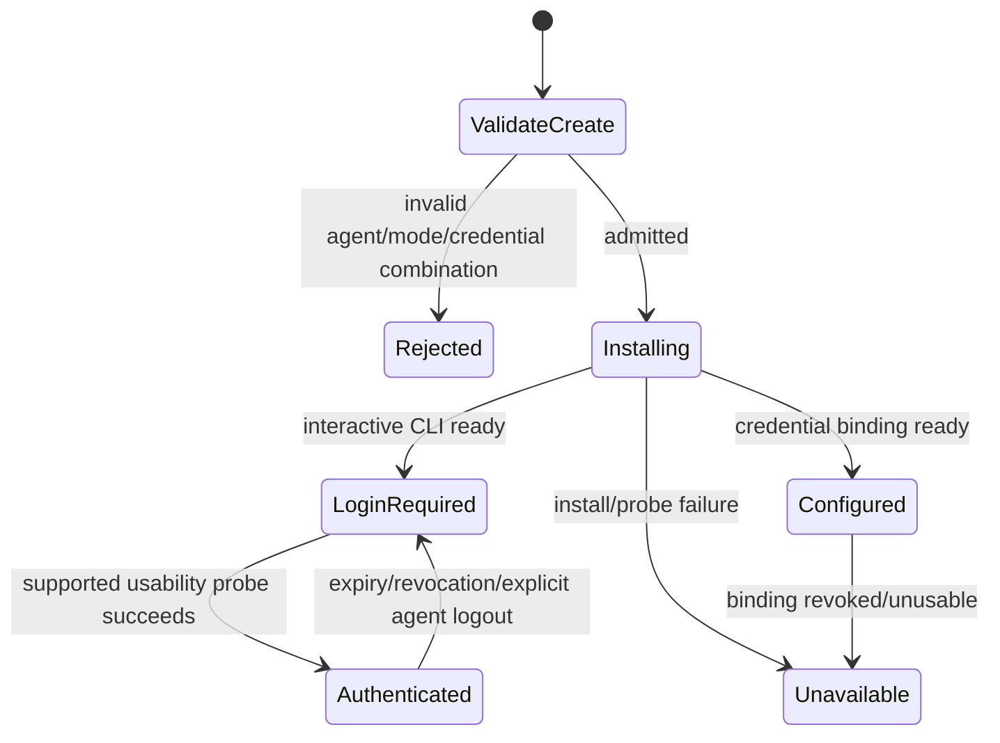

# PRD-031: Machine Agent Authentication-Mode Contract

| Field | Value |
| --- | --- |
| Status | Accepted |
| Owner | Infrastructure contract and runtime maintainers |
| Depends on | PRD-002, PRD-003, PRD-007 |
| Unlocks | PRD-011, PRD-012, PRD-013, PRD-014, PRD-024 |

## Problem and evidence

The desired Claude/Codex subscription journey is not implementable through the
current create contract. The runtime creation path still requires provider-key
input and current launch preparation can discard interactive login state
(`infra/edge/src/sessions.ts:672`, `infra/edge/src/agentterm.ts:39`). Existing
agent-auth status is additive, but status alone does not select a creation mode.

## Goals and non-goals

- **G-031-01:** Make authentication mode explicit, persistent and compatible.
- **G-031-02:** Permit Claude/Codex interactive login without a provider API key.
- **G-031-03:** Preserve OpenClaw key requirements and old-client behavior.
- **G-031-04:** Keep provider credentials machine-local or request-bound.

Non-goals: Runa brokering provider identity, returning provider account data,
or changing the meaning of existing machine lifecycle states.

## Additive contract

For compatibility, legacy `CreateSession` MAY gain optional
`agent_auth_mode` as a shorthand for creating the machine's initial
AgentSession. The authoritative field belongs to AgentSession creation and
references an agent-scoped `AgentAuthProfile`; a machine-wide scalar SHALL NOT
govern sibling AgentSessions. Omission preserves the documented legacy behavior
for old clients. Valid combinations are explicit:

| Agent | interactive_login | credential_binding |
| --- | --- | --- |
| Claude Code | Allowed; no provider key | Allowed with opaque binding |
| Codex | Allowed; no provider key | Allowed with opaque binding |
| OpenClaw | Rejected | Required |
| Clean shell | Rejected/not applicable | Rejected/not applicable |

The public legacy Session response remains unchanged. During migration,
`GET /v1/sessions/{id}/agent-auth` remains a compatibility projection only when
exactly one unambiguous agent profile applies. New clients use child/profile-
scoped status defined with PRD-033/034; ambiguous status returns a typed error
and never guesses.

## Requirements

| ID | Force | EARS requirement | Goal | Test |
| --- | --- | --- | --- | --- |
| R-031-01 | MUST | WHEN create includes `agent_auth_mode`, the OpenAPI authority SHALL validate the closed enum and agent/mode matrix before provider mutation. | G-031-01, G-031-03 | TC-031-01 |
| R-031-02 | MUST | WHEN Claude or Codex uses `interactive_login`, creation SHALL require no provider API key and the runtime SHALL preserve machine-local login state across attaches. | G-031-02 | TC-031-02 |
| R-031-03 | MUST | WHEN OpenClaw omits a valid credential binding or selects interactive login, Runa SHALL reject before provisioning. | G-031-03 | TC-031-03 |
| R-031-04 | MUST | WHEN mode is persisted, infra SHALL derive it from the authenticated request and SHALL not add internal fields to public Session payloads. | G-031-01, G-031-04 | TC-031-04 |
| R-031-05 | MUST | WHEN old clients omit the field, the producer SHALL preserve their accepted legacy behavior throughout the compatibility window. | G-031-03 | TC-031-05 |
| R-031-06 | MUST | WHEN mode and supplied credential inputs are ambiguous or contradictory, Runa SHALL reject with a safe stable error. | G-031-01, G-031-04 | TC-031-06 |
| R-031-07 | MUST | Status probes SHALL determine usability through supported bounded commands and SHALL not infer authentication from credential-file existence. | G-031-02, G-031-04 | TC-031-07 |

## State machine

## Compatibility, tests and rollout

Producer-old/new consumer matrices SHALL cover omitted/new fields, unknown enum,
old server/new CLI, new server/old app and rollback after mode persistence.
TC-031-07 includes revoked, expired, malformed and wrong-account caches plus
401/403/429/5xx, DNS and outbound-policy failures; replacing the probe with
`fileExists` is the required negative control.

Deploy schema and producer behavior first, then runtime launcher, SDK projections
and clients. Rollback disables new-mode creation before producer removal and
leaves additive stored mode dormant. This PRD is a hard prerequisite for every
Claude/Codex CLI end-to-end candidate.

## Traceability

Every requirement maps to the same-numbered TC above; design nodes are OpenAPI
schema, create validator, private persistence, launcher branch and status probe.

## Epistemic status and fail-closed semantics

The cited contract limitation is an observed fact only for the reviewed commit;
whether providers sustain interactive cloud login is unknown until real-flow
tests. The two-value enum is a decision and must be revisited if same-agent
sessions on one machine need different auth modes.

`Authenticated`, `Configured` and `LoginRequired` require bounded usability
probes—not UI copy, file presence, exit zero or historical success. Timeout,
conflict, rate limit, policy/DNS failure or unsupported response yields
`unknown/unavailable`. Unknown blocks credential-required launch but MAY expose
an explicitly interactive login PTY; it never changes ownership or policy.

Tests cover concurrent same-agent login/logout, Claude plus Codex, and binding
revocation beside an interactive sibling. Negative controls share auth state
across agent kinds and replace probes with cache existence; both must fail.
Evidence records provider CLI version, image, outbound policy, probe class and
time without account or credential material.
