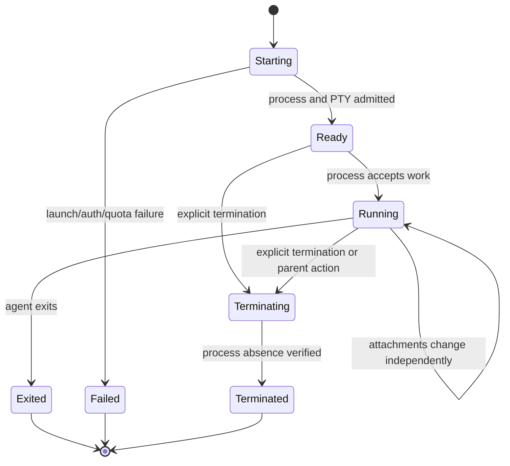

# PRD-033: Multiple Agent Sessions per Machine

| Field | Value |
| --- | --- |
| Status | Accepted |
| Owner | Runa CLI, infrastructure and runtime maintainers |
| Depends on | PRD-007, PRD-009, PRD-010, PRD-011, PRD-015, PRD-031, PRD-032, PRD-034, PRD-039 |
| Constrains | PRD-004, PRD-008, PRD-012, PRD-013, PRD-014, PRD-024, PRD-030 |

## Problem

A cloud machine is a durable compute/workspace boundary, not one conversation.
A user SHALL be able to run several Claude Code, Codex or OpenClaw sessions in
the same owned machine—for example two Claude sessions in different directories
or Claude and Codex concurrently—without creating and paying for another machine.

The current public `Session` resource represents the machine. This PRD adds a
distinct child resource named `AgentSession`; it SHALL NOT reinterpret existing
Session IDs or lifecycle semantics.

## Goals and non-goals

- **G-033-01:** Host multiple isolated agent processes/PTYs on one machine.
- **G-033-02:** Select, list, attach, detach and terminate each independently.
- **G-033-03:** Preserve shared-machine policy, workspace safety and metering.
- **G-033-04:** Bound resource contention and prevent cross-session input leaks.

Non-goals: multiple users collaboratively typing into one PTY, bypassing
machine ownership, cloning provider credentials between machines, or silently
merging concurrent edits.

## Resource model

```text
Machine (existing public Session)
  ├── AgentSession A: claude-code, cwd=/workspace/project/api, PTY A
  ├── AgentSession B: claude-code, cwd=/workspace/project/web, PTY B
  └── AgentSession C: codex, cwd=/workspace/project, PTY C
```

`AgentSession = {id, machine_id, agent, cwd, process_state, process_epoch,
auth_profile_id, workspace_revision, created_at, updated_at, exit_summary,
row_version}`. Attachment state belongs exclusively to `TerminalConnection`;
it SHALL NOT be duplicated inside AgentSession state. Provider authentication
is machine-local and agent-profile-scoped; an AgentSession references safe auth
status but never owns or returns credential material.

Process states: `starting | ready | running | exited | failed | terminating |
terminated`. Each AgentSession has one process/PTY epoch and v1 attachment
policy `exclusive`; different AgentSessions may be attached concurrently by
separate processes or by the trusted local workspace in PRD-038. At most one
current TerminalConnection owns writable foreground input for each process
epoch.

## Additive API

| Operation | Method/path | Result |
| --- | --- | --- |
| Create | `POST /v1/sessions/{machine_id}/agent-sessions` | `201 AgentSession` |
| List | `GET /v1/sessions/{machine_id}/agent-sessions` | bounded page |
| Get | `GET /v1/agent-sessions/{id}` | `AgentSession` |
| Terminate | `POST /v1/agent-sessions/{id}/terminate` | terminal state |
| Terminal connection | `POST /v1/agent-sessions/{id}/terminal-connections` | PRD-008 capability |

Delete/stop/pause of the parent machine has server-authoritative effects on all
children and SHALL return/record the affected count before destructive action.

## Requirements

| ID | Force | EARS requirement | Goal | Test |
| --- | --- | --- | --- | --- |
| R-033-01 | MUST | WHEN an owner creates an AgentSession, Runa SHALL validate machine state, agent support, safe working directory, authentication mode, workspace generation and resource quota before launching exactly one child process/PTY. | G-033-01, G-033-03 | TC-033-01 |
| R-033-02 | MUST | WHILE one machine is running, it SHALL support multiple AgentSessions up to an explicit machine/profile quota without multiplexing their input, output, exit state or attachment grants. | G-033-01, G-033-04 | TC-033-02 |
| R-033-03 | MUST | WHEN `--new-session` is supplied, the CLI SHALL create a child even if a compatible detached child exists; without it, one detached match MAY be resumed, multiple matches SHALL require selection, and noninteractive ambiguity SHALL fail. | G-033-02 | TC-033-03 |
| R-033-04 | MUST | WHEN listing or selecting children, the CLI SHALL show safe public ID/name, agent, cwd relative to workspace, state and creation age without terminal contents or provider identity. | G-033-02 | TC-033-04 |
| R-033-05 | MUST | WHEN attaching, a capability SHALL bind to one AgentSession and SHALL authorize no sibling PTY; each attachment obtains a fresh one-use connection token. | G-033-02, G-033-04 | TC-033-05 |
| R-033-06 | MUST | WHEN two AgentSessions may mutate the same workspace, Runa SHALL apply the admitted overlay/visibility model in PRD-039 before concurrent launch; a watcher observing a shared writable tree after the fact SHALL NOT be claimed to preserve overwritten variants. | G-033-03 | TC-033-06 |
| R-033-07 | MUST | WHEN CPU, memory, process or AgentSession quota is reached, Runa SHALL reject or throttle deterministically without terminating an unrelated child. | G-033-04 | TC-033-07 |
| R-033-08 | MUST | WHEN a child exits, detaches or fails, sibling AgentSessions and the parent machine SHALL remain running unless an explicit parent lifecycle action applies. | G-033-01, G-033-02 | TC-033-08 |
| R-033-09 | MUST | WHEN the parent stops, pauses, is deleted or ownership is revoked, Runa SHALL revoke every child attachment and transition children according to the documented parent/child table without orphan processes. | G-033-03, G-033-04 | TC-033-09 |
| R-033-10 | MUST | Metering and audit SHALL attribute machine resources plus safe per-AgentSession lifecycle/attachment events without recording prompts or terminal payloads. | G-033-03 | TC-033-10 |

## Lifecycle



Safety: no terminal frame crosses AgentSession IDs. Liveness: starting reaches
ready, failed or terminated within a bounded launch deadline. Recovery: losing
one attachment never requires recreating the parent machine.

## Tests, limits and rollout

Tests create same-agent and mixed-agent children, attach concurrently, inject
cross-ID tokens, saturate quotas, race terminate/reconnect, stop/delete parent,
cause simultaneous same-file edits and verify sibling survival. The negative
control deliberately keys PTY routing by machine ID only and must demonstrate a
cross-session leak, causing the suite to fail.

Initial default quota is a versioned server profile, not hard-coded CLI policy;
the server returns the effective limit and safe utilization. Roll out storage
and API first, then runtime multiplexer, then CLI. Rollback disables new child
creation, preserves/terminates existing children by an approved containment
policy, and never maps multiple children back into the legacy single terminal.

## Traceability

Each R-033 requirement maps to the same-numbered TC. Design nodes are child
schema/API, process supervisor, PTY router, workspace generation gate, quota
controller, metering attribution and parent/child lifecycle coordinator.

## Metacognitive concurrency controls

Machine health is not AgentSession health, terminal connectivity is not process
readiness, and provider sign-in is not proof that a child can serve a prompt.
These observations remain separate; usable state requires fresh child-scoped
evidence. Missing/conflicting signals yield `unknown` and SHALL NOT attach to a
guessed child or create another billable machine.

Default reuse requires an exact key: owner, machine, agent, workspace identity/
generation, cwd, auth-mode compatibility and resumable child state. Name,
agent kind or recent activity alone is insufficient. Multiple exact candidates
require interactive selection; non-interactive execution abstains. Per-child
cost is not shown as measured unless the metering authority supports it.

Falsification uses randomized concurrency, stale lists, replayed grants,
machine-ID-only routing, child-ID confusion, parent deletion between check and
attach, cwd rename, generation drift and sibling logout. Independent oracles
verify PTY bytes, process identity, generation, audit attribution and sibling
survival; two working terminals alone do not prove isolation.

Blockers before `Accepted`: child naming, default reuse versus always-new,
quota ownership, pause/resume semantics and same-file conflict UX. Each gets an
accountable owner and trace into PRD-004, 007, 009/010, 017/019 and 024 tests.
