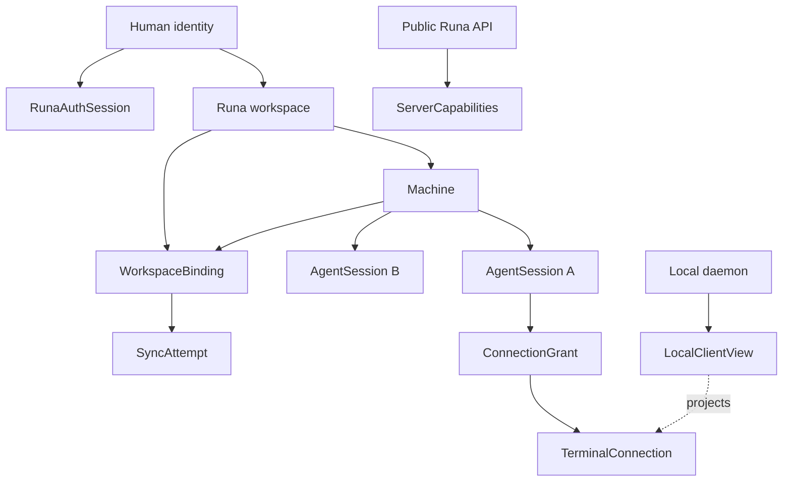

# PRD-034: Canonical Resource Ontology, IDs, Ownership, and Capability Vocabulary

| Field | Value |
| --- | --- |
| Status | Accepted |
| Owner | Runa architecture and public API maintainers |
| Approver | Product, identity, infrastructure, and SDK owners |
| Depends on | PRD-002, PRD-003 |
| Unlocks | PRD-035, PRD-036, PRD-037, PRD-038, PRD-039, PRD-041, PRD-042 |
| Normative language | RFC 2119 / RFC 8174 |

## Problem and evidence

The existing public contract uses `Session` for the durable cloud machine while
the CLI design introduces `AgentSession` for one child agent process. Other
documents also use terminal session, synchronization session, human session,
and capability for materially different concepts. These terms cannot safely be
distinguished from an ID alone, and accidental machine-ID/child-ID routing is a
known cross-session isolation failure mode.

This PRD freezes names, cardinalities, authorities, identifiers, and public
compatibility rules before additional endpoints or durable state are built. It
does not claim that the new public names already exist in production.

## Goals and non-goals

- **G-034-01:** Give every durable or authorization-relevant concept one stable
  name, identity domain, owner, and lifecycle authority.
- **G-034-02:** Preserve compatibility with the legacy `/v1/sessions` Machine
  representation without reinterpreting existing IDs.
- **G-034-03:** Prevent cross-resource confusion, guessed routing, and duplicated
  state authority across CLI, app, infrastructure, and SDKs.
- **G-034-04:** Define a contract vocabulary that supports capability discovery
  and independent mixed-version consumers.

Non-goals:

- Renaming every legacy endpoint in one release.
- Exposing internal provider, runtime, tenant, storage, or host identities.
- Sharing runtime implementations between CLI, infrastructure, app, or SDKs.
- Making display names globally unique or suitable for authorization.

## Canonical ontology

| Concept | Meaning and cardinality | Canonical authority | Explicit non-responsibilities |
| --- | --- | --- | --- |
| `Machine` | One owned durable cloud compute boundary; legacy public `Session` projects this concept 1:1. | Machine control plane | Child PTY state, local filesystem state, human login validity |
| `AgentSession` | One child agent process, working directory, generation, and PTY; many per Machine. | Remote AgentSession supervisor | Machine ownership, billing plan, local TUI tab state |
| `TerminalConnection` | One live transport attachment between one client view and one AgentSession PTY. | Terminal gateway | Process readiness, provider authentication, workspace convergence |
| `ConnectionGrant` | One short-lived, purpose-bound, normally single-use authorization to establish one TerminalConnection. | Runa authorization service | Feature discovery, durable resume, process identity |
| `WorkspaceBinding` | Association among one Runa workspace/project, one local working-copy identity, one Machine mount, and an epoch. | Workspace service | Local absolute-path disclosure, agent process ownership |
| `SyncAttempt` | One bounded protocol negotiation/reconciliation attempt for a WorkspaceBinding. | Workspace sync service | Human login session, terminal transport, background watcher ownership |
| `RunaAuthSession` | Renewable authorization for one human CLI profile and Runa account/workspace context. | Runa identity service | Provider authentication in a Machine |
| `ProviderAuthState` | Fresh evidence-bearing status for one agent kind/auth scope in one Machine or AgentSession scope declared by its adapter. | Provider adapter plus Runa probe policy | Runa identity, raw credential export |
| `ServerCapabilities` | Versioned facts describing operations currently supported for a caller/context. | Public Runa API | Authorization to perform a mutation; a mutation is re-authorized separately |
| `LocalClientView` | Ephemeral local tab/pane attachment intent managed by the CLI/daemon. | Local CLI daemon | Remote process liveness or terminal ownership |

The word `session` SHALL NOT appear unqualified in new normative schemas,
events, commands, logs, or user copy. Existing legacy fields MAY retain their
wire names but SHALL map explicitly to one canonical concept.

## Identifier and reference rules

Public IDs are opaque, non-secret, non-reassignable within their identity
domain, and carry no provider or infrastructure meaning. A typed reference is
`{kind, id}`; an untyped arbitrary ID SHALL NOT select a mutation target.
Display names are labels only and SHALL never establish ownership, uniqueness,
compatibility, or authorization.

| ID kind | Parent binding | Reuse rule | Safe public exposure |
| --- | --- | --- | --- |
| `machine_id` | Runa account/workspace | Never reused | Yes |
| `agent_session_id` | Exactly one `machine_id` | Never reused | Yes |
| `terminal_connection_id` | Exactly one AgentSession generation | Never reused | Structural diagnostics only |
| `connection_grant_id` | Caller, AgentSession, purpose, expiry | Never reused; single redemption unless explicitly typed otherwise | Redacted diagnostic reference only |
| `workspace_binding_id` | Workspace/project/local-instance/Machine epoch | New ID for a semantically new binding | Yes |
| `sync_attempt_id` | WorkspaceBinding epoch and protocol selection | Never reused | Structural diagnostics only |
| `runa_auth_session_id` | Human profile and identity subject | Never reused | Never shown in routine output |

## Normative requirements

| ID | Force | EARS requirement | Goal | Test |
| --- | --- | --- | --- | --- |
| R-034-01 | MUST | WHEN any public resource or event is introduced, its schema SHALL name exactly one canonical concept, identity domain, parent relation, lifecycle authority, and deletion authority. | G-034-01 | TC-034-01 |
| R-034-02 | MUST | WHEN a legacy public `Session` is projected, Runa SHALL identify it as a `Machine` without changing its ID, ownership, state meaning, or lifecycle side effects. | G-034-02 | TC-034-02 |
| R-034-03 | MUST | WHEN an operation accepts a child resource, Runa SHALL verify both the typed child ID and its authenticated parent binding; a `machine_id` SHALL never route an AgentSession PTY. | G-034-01, G-034-03 | TC-034-03 |
| R-034-04 | MUST | WHEN a caller supplies an ID of the wrong kind, foreign parent, stale generation, or deleted resource, the producer SHALL reject before mutation using a stable non-enumerating error class. | G-034-03 | TC-034-04 |
| R-034-05 | MUST | WHEN a ConnectionGrant is issued, it SHALL bind caller, AgentSession generation, purpose, protocol range, expiry, and redemption policy and SHALL confer no ServerCapabilities or sibling authority. | G-034-03 | TC-034-05 |
| R-034-06 | MUST | WHEN ServerCapabilities are returned, they SHALL include schema/version/freshness context and SHALL be treated as discovery evidence only; every subsequent mutation SHALL be authorized against current server state. | G-034-04 | TC-034-06 |
| R-034-07 | MUST | WHEN CLI, app, TypeScript SDK, or Python SDK displays or models a canonical resource, it SHALL preserve canonical semantics and SHALL NOT infer object-level success from a related resource's status. | G-034-03, G-034-04 | TC-034-07 |
| R-034-08 | MUST | IF two authorities disagree about identity, parentage, generation, ownership, or lifecycle state, THEN clients SHALL report `unknown` or `inconsistent` and SHALL perform no mutation against a guessed target. | G-034-03 | TC-034-08 |
| R-034-09 | MUST | New schemas, events, metrics, and audit records SHALL use typed canonical names; compatibility aliases SHALL have an owner, support window, and removal gate. | G-034-02, G-034-04 | TC-034-09 |
| R-034-10 | MUST | Public projections SHALL contain no internal provider name, internal host, private runtime ID, credential material, or internal ownership key. | G-034-03 | TC-034-10 |

## Resource relationship model

## Truth and authority rules

| Claim | Authoritative evidence | Insufficient cue | Failure behavior |
| --- | --- | --- | --- |
| Machine is running | Fresh machine control-plane state | Reachable terminal, cached list | Show unknown/reconciling; do not create a replacement |
| AgentSession is usable | Fresh child-scoped process/readiness evidence | Machine running, provider credential file | Do not attach as ready |
| Terminal is connected | Gateway-confirmed connection generation | Local tab exists, socket open before upgrade | Keep view disconnected/reconnecting |
| Provider is authenticated | Supported bounded usability probe | Login page text, cached file, prior success | `unknown`, `login_required`, or unavailable |
| Workspace is converged | Matching admitted manifest roots at generation/epoch | Quiet watcher, empty queue | Show reconciling/unverified |
| Mutation is allowed | Current authorization decision at mutation time | ServerCapabilities response | Reject safely |

## Behavioral assurance and negative controls

- **TC-034-01:** Contract inventory maps every public object/event to one
  concept, parent, owner, state machine, and deletion authority; omissions fail.
- **TC-034-02:** Old and new clients observe identical Machine identity and
  lifecycle effects through the legacy Session projection.
- **TC-034-03:** A terminal router keyed only by `machine_id` deliberately leaks
  sibling frames and MUST make the isolation suite fail.
- **TC-034-04:** Randomized wrong-kind, foreign-parent, stale-generation, and
  deleted IDs mutate nothing and do not reveal resource existence.
- **TC-034-05:** Replayed, expired, purpose-changed, or sibling-targeted grants
  cannot establish a TerminalConnection.
- **TC-034-06:** A stale capability response followed by revoked authorization
  fails the mutation rather than trusting discovery.
- **TC-034-07:** Projection tests prove that machine health does not make child,
  terminal, auth, or sync status green.
- **TC-034-08:** Injected disagreement among list/get/event sources forces
  abstention and emits one safe correlation ID.
- **TC-034-09:** Schema lint rejects new unqualified `session` and ambiguous
  `capability` fields outside registered compatibility aliases.
- **TC-034-10:** Golden leak fixtures containing internal IDs/hosts/credentials
  are rejected from every public projection.

## Compatibility, rollout, and rollback

Publish the ontology registry, alias registry, golden fixtures, and OpenAPI
extensions before consumers. Migrate infrastructure projections first, then
CLI/app and both SDKs. Mixed-version tests cover old/new producers and each
consumer independently. Rollback disables consumption of new fields and leaves
legacy Machine projections unchanged; it SHALL NOT reinterpret or recycle IDs.

## Risks and mitigations

- **Legacy naming becomes permanent:** assign alias expiry and usage telemetry.
- **Typed IDs leak resource existence:** use non-enumerating authorization errors.
- **One mega-model couples releases:** share schema/fixtures only, not runtime
  implementations or release cadence.
- **Client caches become authority:** attach freshness and require mutation-time
  authorization.

## Acceptance and blockers

Acceptance requires all TC-034 tests, an acyclic ownership graph, generated and
runtime consumer conformance, and independent review by architecture and
security. Blockers and owners:

| Decision | Owner | Closure evidence |
| --- | --- | --- |
| Legacy `Session` support window | API product owner | Version/deprecation policy and usage inventory |
| Public ID syntax and typed-reference encoding | API architecture | OpenAPI schemas and cross-language golden vectors |
| Provider-auth scope (Machine or AgentSession) per adapter | Runtime identity | Explicit matrix and concurrent-session tests |
| Deletion/tombstone authority | Data governance | Link to accepted lifecycle policy and non-reuse proof |

## Traceability

| Goal | Requirements | Design artifacts | Tests |
| --- | --- | --- | --- |
| G-034-01 | R-01,03,05,09 | Ontology/ID/owner registries | TC-01,03,05,09 |
| G-034-02 | R-02,09 | Legacy projection/alias policy | TC-02,09 |
| G-034-03 | R-03..05,07,08,10 | Typed routers and authority checks | TC-03..05,07,08,10 |
| G-034-04 | R-06,07,09 | Capability schema and consumer fixtures | TC-06,07,09 |
