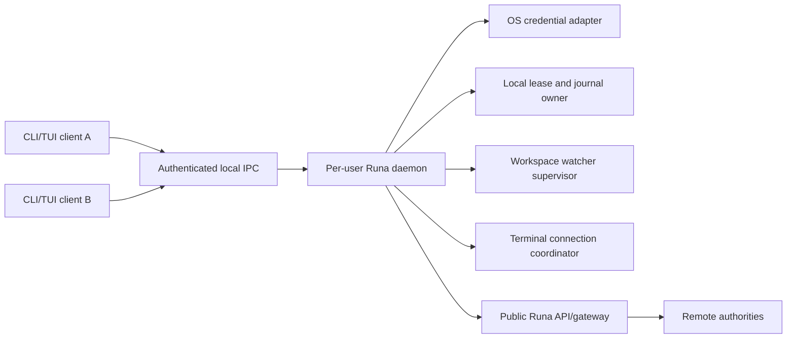
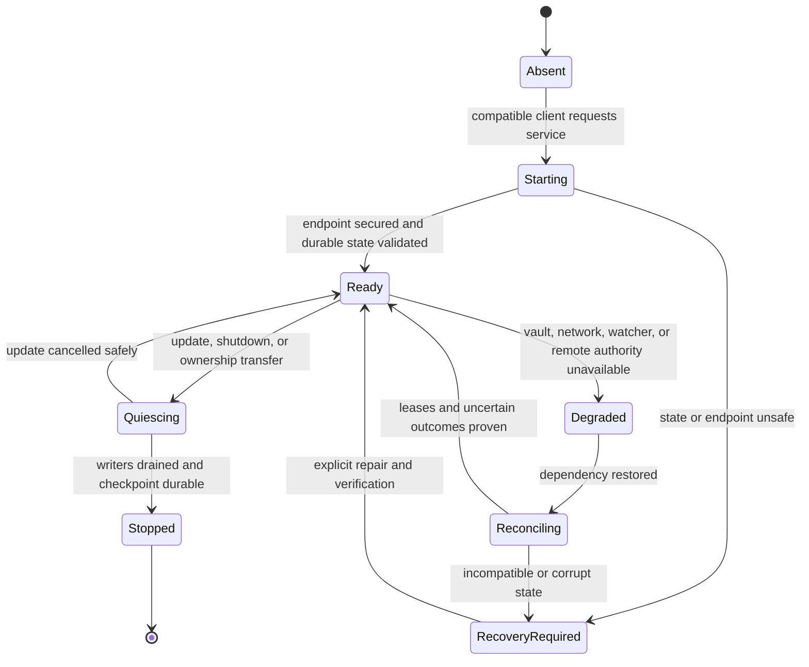
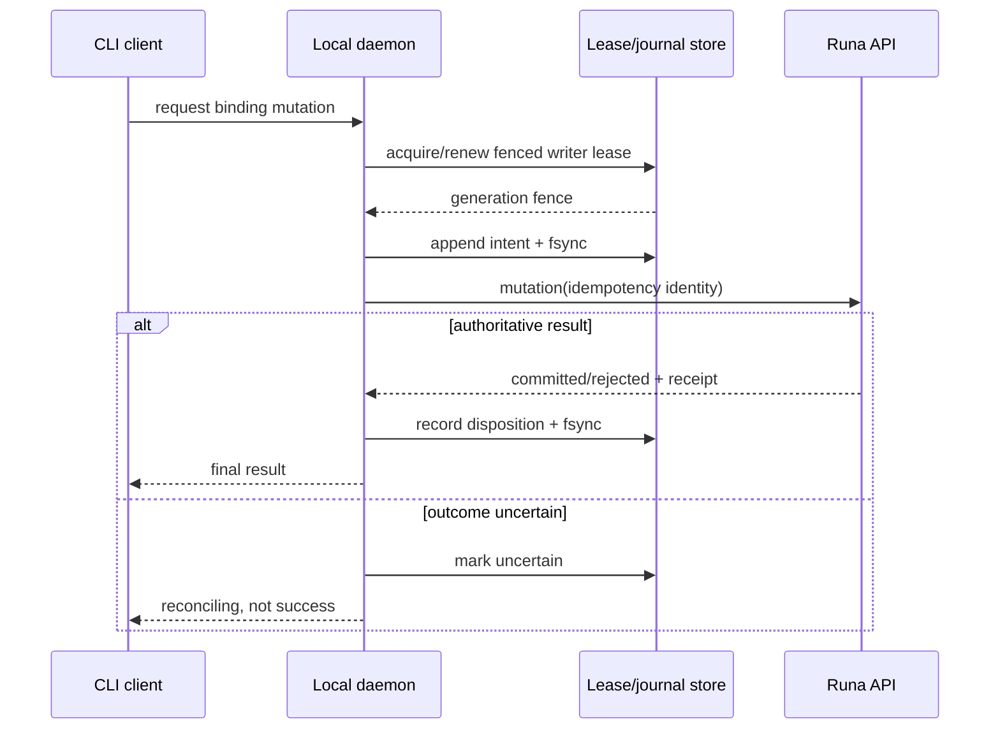

# PRD-035: Local Daemon, IPC, Single-Writer Leases, and Process Supervision

| Field | Value |
| --- | --- |
| Status | Accepted |
| Owner | Runa CLI runtime maintainers |
| Approver | CLI architecture, security, and workspace-sync owners |
| Depends on | PRD-002, PRD-003, PRD-005, PRD-006, PRD-034 |
| Unlocks | Local terminal workspace, persistent sync supervisor, local companion |
| Normative language | RFC 2119 / RFC 8174 |

## Problem and evidence

Several local `runa` processes may target the same Machine, AgentSessions, and
WorkspaceBinding. Without one local coordination authority they can duplicate
machine creation, race token refresh, replay a journal twice, compete for a
filesystem watcher, and disagree about terminal attachment. Existing PRDs
assign these tasks to the CLI but define no daemon, authenticated IPC, lease, or
upgrade/crash-recovery contract.

The daemon is a local coordinator and projection cache. It is not a second Runa
control plane and cannot authoritatively declare remote success.

## Goals and non-goals

- **G-035-01:** Provide one per-OS-user coordination service for concurrent CLI
  views and long-lived local work.
- **G-035-02:** Enforce a single writer for each durable local binding/journal
  while allowing multiple independent terminal views.
- **G-035-03:** Authenticate and version local IPC with least privilege and
  bounded resources.
- **G-035-04:** Survive CLI exits, daemon crashes, upgrades, sleep, and stale
  leases without duplicating admitted remote mutations.

Non-goals:

- A system-wide privileged service, generic shell execution broker, VPN, SSH
  server, or arbitrary local-network listener.
- Authority over Machine, AgentSession, billing, provider auth, or server policy.
- Storing terminal payload history or provider credentials.
- Replacing server idempotency, fencing, or authorization.

## Component and authority model

| Fact/action | Local authority | Remote authority | Daemon behavior on disagreement |
| --- | --- | --- | --- |
| IPC client identity | OS peer credentials plus per-user endpoint ACL | None | Reject before parsing privileged request |
| Local writer lease | Daemon durable lease/fencing store | Workspace generation/CAS | Stop writes and reconcile |
| Machine state/billing | None; cached projection only | Machine control plane | Mark stale/unknown; never create replacement implicitly |
| AgentSession/process state | None; cached projection only | AgentSession supervisor | Detach/reconcile; never invent ready/exited |
| Terminal attachment | LocalClientView ownership | Terminal gateway grant/connection | Reacquire fresh grant; do not replay stale input |
| Human credential refresh | Coalesced vault operation | Runa identity service | Fail closed and request reauthentication |
| Sync convergence | Local observed manifest/journal evidence | Workspace service generation/receipt | `reconciling` until both agree |

## Local endpoint and persistence contract

The daemon SHALL run as the interactive OS user. Unix-like systems use a
user-private Unix-domain socket; Windows uses a user-scoped named pipe with an
ACL and peer identity check. TCP loopback is not a Tier-1 IPC transport. Endpoint
paths, lock files, logs, and state directories SHALL be created with safe owner
and no-follow semantics.

Durable state contains schema/version, daemon instance ID, WorkspaceBinding
leases and fencing generations, operation references, non-secret projections,
and crash-recovery checkpoints. Renewable Runa credentials remain in the OS
vault and are retrieved only for bounded operations. Terminal bytes are
streamed through bounded memory and not durably recorded by default.

## Normative requirements

| ID | Force | EARS requirement | Goal | Test |
| --- | --- | --- | --- | --- |
| R-035-01 | MUST | WHEN an interactive user first needs coordination, the CLI SHALL discover or start exactly one compatible daemon for that OS user and SHALL verify endpoint ownership before IPC. | G-035-01, G-035-03 | TC-035-01 |
| R-035-02 | MUST | WHEN an IPC client connects, the daemon SHALL authenticate OS peer identity, negotiate protocol range, and reject unsupported or unauthorized requests before side effects. | G-035-03 | TC-035-02 |
| R-035-03 | MUST | WHEN a mutating local workflow targets a WorkspaceBinding, the daemon SHALL acquire one durable fenced writer lease before watcher, journal, snapshot, or replay mutation. | G-035-02 | TC-035-03 |
| R-035-04 | MUST | IF a second process or stale daemon presents an older fence, THEN every local writer and apply path SHALL reject it without modifying admitted state. | G-035-02, G-035-04 | TC-035-04 |
| R-035-05 | MUST | WHILE multiple LocalClientViews exist, the daemon SHALL isolate view input, selected AgentSession, resize, detach, and cancellation and SHALL never route by Machine ID alone. | G-035-01, G-035-03 | TC-035-05 |
| R-035-06 | MUST | WHEN concurrent clients require Runa token refresh, the daemon SHALL coalesce one refresh, rotate vault material atomically, and return no token bytes over general IPC. | G-035-03 | TC-035-06 |
| R-035-07 | MUST | IF the daemon exits after dispatching an uncertain remote mutation, THEN restart SHALL reconcile using the original idempotency identity before retrying or reporting completion. | G-035-04 | TC-035-07 |
| R-035-08 | MUST | WHEN daemon/client versions are compatible, upgrade SHALL quiesce writers, persist a checkpoint, hand over or reacquire fences, and resume without losing acknowledged intent; incompatible durable state SHALL fail safely with export/recovery guidance. | G-035-04 | TC-035-08 |
| R-035-09 | MUST | WHEN no client view remains, daemon and Machine lifetimes SHALL follow explicit independent policies; local idleness SHALL never delete, stop, or create cloud resources implicitly. | G-035-01, G-035-04 | TC-035-09 |
| R-035-10 | MUST | IPC frames, queues, logs, reconnects, watchers, and child processes SHALL have documented byte/count/time bounds and backpressure that prioritizes interactive terminal safety. | G-035-03, G-035-04 | TC-035-10 |
| R-035-11 | MUST | IF remote authority is unavailable, contradictory, or stale for a mutation, THEN the daemon SHALL abstain, preserve durable intent, and expose `unknown` or `reconciling` rather than manufacture success. | G-035-04 | TC-035-11 |
| R-035-12 | MUST | Diagnostics SHALL exclude terminal payloads, local file content, absolute paths where avoidable, access/refresh tokens, provider credentials, connection grants, and internal endpoints. | G-035-03 | TC-035-12 |

## Daemon lifecycle state machine

## Lease and mutation sequence

## Behavioral assurance and negative controls

- **TC-035-01:** Twenty simultaneous cold-start clients produce one daemon and
  one secured endpoint; losing candidates exit without deleting winner state.
- **TC-035-02:** Foreign-user, weak-ACL, symlinked socket, pipe-squatting,
  malformed-frame, downgrade, and oversized-frame attempts cause zero effects.
- **TC-035-03:** Two clients start sync for one binding; one fenced writer owns
  watcher/journal and both may observe safe progress.
- **TC-035-04:** Removing the fence check permits a stale writer and MUST make
  the concurrency oracle detect divergent journal/application state.
- **TC-035-05:** Randomized multi-view input/resize/detach with sibling
  AgentSessions proves no cross-view or cross-child bytes.
- **TC-035-06:** Concurrent refresh succeeds once; vault denial, rotation crash,
  and revoked refresh expose no credential and leave a recoverable state.
- **TC-035-07:** Crash at every pre-dispatch/post-dispatch/pre-receipt journal
  point yields one authoritative remote effect.
- **TC-035-08:** N/N-1 daemon-client/state combinations either resume safely or
  reject before mutation with a tested export/roll-forward path.
- **TC-035-09:** Closing all terminals leaves cloud resources unchanged and
  reports continuing billing when authoritative data is available.
- **TC-035-10:** Slow clients, terminal floods, watcher floods, disk full, sleep,
  and network partitions stay inside declared resource and latency bounds.
- **TC-035-11:** A fake cached `running` state during server unavailability never
  authorizes attach/create/delete.
- **TC-035-12:** Secret-canary and terminal-content fixtures never appear in IPC
  diagnostics, logs, crash reports, or exported support bundles.

## Reliability, security, and observability

The daemon SHALL use crash-only restart semantics with explicit recovery, not
blind replay. It SHALL drop privileges rather than elevate, ignore repository
instructions for control behavior, and execute no arbitrary command received
over IPC. Metrics include daemon starts/crashes, lease contention, recovery
duration, uncertain mutations, queue pressure, reconnects, protocol versions,
and safe reason classes. Metrics SHALL not identify file names, prompts, or
credential material.

## Rollout and rollback

Ship an opt-in foreground-compatible daemon first, then internal persistent
sync, then multi-view TUI. Server contracts and idempotency precede daemon use.
Rollback stops new daemon starts, quiesces writers, preserves journals read-only,
and permits explicit foreground recovery. It SHALL NOT delete cloud resources,
credentials, workspace content, or unresolved intent. N-1 remains able to read
or export durable state throughout the rollout window.

## Risks and mitigations

- **Compromised local process attacks IPC:** OS peer checks, endpoint ACLs,
  request authorization, and no token-return API.
- **Daemon becomes false remote authority:** authority table plus fresh server
  reconciliation and explicit unknown states.
- **Upgrade strands journals:** minimum reader/writer versions, quiescence,
  export, and roll-forward containment.
- **Background resource drain:** bounded queues/watchers, idle policy, and
  observable per-binding activity.

## Acceptance and blockers

Acceptance requires all TC-035 tests on Windows, macOS, and Linux; model-based
lease/restart histories; IPC threat review; N/N-1 recovery; and an independent
negative-control run. Blockers and owners:

| Decision | Owner | Closure evidence |
| --- | --- | --- |
| Daemon language/runtime and distribution coupling | CLI architecture | ADR plus supported-platform prototype |
| Windows named-pipe and Unix socket identity primitives | Platform security | Adversarial platform test matrix |
| Local lease store/fsync guarantees | Sync/runtime | Crash-point and power-loss evidence |
| Idle/shutdown policy | Product and billing | User-facing policy and no-surprise billing tests |
| IPC support window | Release owner | N/N-1 matrix and rollback rehearsal |

## Traceability

| Goal | Requirements | Design artifacts | Tests |
| --- | --- | --- | --- |
| G-035-01 | R-01,05,09 | Daemon discovery and view registry | TC-01,05,09 |
| G-035-02 | R-03,04 | Lease/fencing store | TC-03,04 |
| G-035-03 | R-02,05,06,10,12 | IPC/vault/bounds contracts | TC-02,05,06,10,12 |
| G-035-04 | R-04,07..11 | Journal, recovery, upgrade model | TC-04,07..11 |
