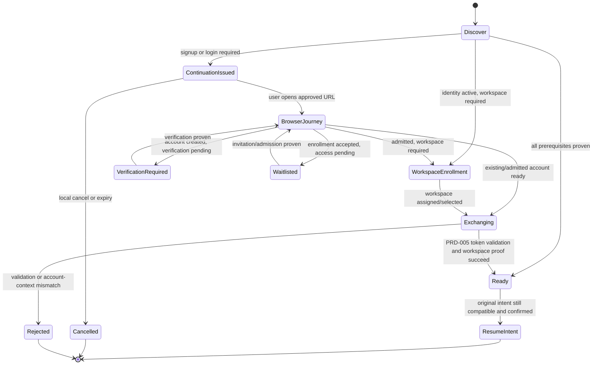

# PRD-036: CLI Signup, Waitlist, Workspace Enrollment, and Browser Continuation

| Field | Value |
| --- | --- |
| Status | Accepted |
| Owner | Runa identity and developer-experience maintainers |
| Approver | Product, identity security, app website, and CLI owners |
| Depends on | PRD-001, PRD-002, PRD-004, PRD-005, PRD-034 |
| Unlocks | Complete first-run CLI journey and CLI/web parity validation |
| Normative language | RFC 2119 / RFC 8174 |

## Problem and evidence

PRD-005 defines browser authentication for an existing Runa account. It does
not define what happens when a first-time CLI user must create an account,
verify contact information, accept required terms, join a waitlist, receive
access, choose or receive a workspace, and return safely to the waiting CLI.
Without a continuation contract, the CLI can hang, poll forever, trust a browser
success page, lose the original command, or confuse authentication with product
admission.

This PRD treats signup, admission, workspace enrollment, and authentication as
separate authoritative states. Exact public web origin and route are release
configuration decisions and SHALL be frozen before implementation.

## Goals and non-goals

- **G-036-01:** Let a new user begin locally, complete the required browser
  journey, and resume the original CLI intent without copying secrets.
- **G-036-02:** Represent waitlist, verification, admission, and workspace
  enrollment honestly and with bounded recovery.
- **G-036-03:** Prevent redirect, replay, account-confusion, workspace-confusion,
  and browser-page-trust failures.
- **G-036-04:** Provide equivalent interactive, headless, cancellation, and
  re-entry behavior without silent mutations or surprise billing.

Non-goals:

- Implementing identity-provider UI inside the terminal.
- Treating waitlist membership as authentication or machine authorization.
- Brokering Claude, Codex, or OpenClaw accounts during Runa signup.
- Creating a Machine, starting billing, accepting optional marketing consent,
  or selecting a paid plan without explicit server-authorized user action.
- Reusing browser cookies or placing access/refresh tokens in browser URLs.

## User journey and command surface

`runa login` and the first protected interactive command SHALL detect the
authoritative onboarding state. The CLI may offer `Open browser`, `Copy link`,
`Check status`, or `Cancel`. The URL opens an approved Runa-controlled web
origin and contains only a short-lived, single-purpose continuation reference
plus PKCE/state material as required by PRD-005.

The web journey may support existing sign-in, signup, verification, required
terms, waitlist enrollment, admission, and workspace enrollment. The CLI
resumes only after a protected API proves the required state for the original
command. A browser success page is never that proof.

For noninteractive invocation, the CLI SHALL NOT open a browser or prompt. It
returns a stable state/error and, only when explicitly requested, a structured
continuation URL with expiry and safe resume command. Headless device flow is a
separate capability and SHALL be used only when advertised by ServerCapabilities.

## Canonical onboarding states and authorities

| State dimension | Values | Authority | Insufficient evidence |
| --- | --- | --- | --- |
| Browser continuation | `issued`, `opened_unknown`, `completed`, `expired`, `cancelled`, `consumed` | Runa continuation service | Browser tab opened or success text |
| Identity account | `unknown`, `signup_required`, `verification_required`, `active`, `disabled` | Runa identity service | Email entered, cookie exists |
| Product admission | `not_requested`, `waitlisted`, `invited`, `admitted`, `denied`, `suspended` | Runa admission service | Identity active, invitation email text |
| Workspace enrollment | `required`, `selectable`, `assigned`, `unavailable` | Runa workspace service | Cached workspace name |
| CLI Runa auth | PRD-005 states | Runa identity/token service | Browser completion alone |
| Provider auth | PRD-031 adapter states | Machine runtime/provider probe | Runa account active |

These dimensions SHALL remain separate. The CLI presents a derived next action
but SHALL retain each authoritative source and freshness in diagnostics.

## Normative requirements

| ID | Force | EARS requirement | Goal | Test |
| --- | --- | --- | --- | --- |
| R-036-01 | MUST | WHEN an unauthenticated or unenrolled interactive user invokes a protected command, the CLI SHALL request an onboarding continuation bound to PKCE verifier, unpredictable state, intended profile, original command class, approved redirect, expiry, and one-time consumption. | G-036-01, G-036-03 | TC-036-01 |
| R-036-02 | MUST | WHEN opening or printing the browser URL, the CLI SHALL use only an approved HTTPS Runa origin (except the PRD-005 loopback callback), SHALL reveal no access token, refresh token, API key, provider credential, local path, or internal endpoint, and SHALL show the destination origin before consent. | G-036-03 | TC-036-02 |
| R-036-03 | MUST | WHILE the browser journey is pending, the CLI SHALL show the authoritative phase, elapsed time, expiry, cancel action, and safe resume guidance without fabricated percentage or automatic cloud-resource creation. | G-036-02, G-036-04 | TC-036-03 |
| R-036-04 | MUST | WHEN signup completes but verification, admission, or workspace enrollment remains incomplete, the CLI SHALL preserve those states separately and SHALL not call the user signed in and ready. | G-036-02 | TC-036-04 |
| R-036-05 | MUST | WHEN admission is `waitlisted`, the CLI SHALL report that no Machine has been created, provide a bounded status-check/resume path, stop automatic polling at the declared deadline, and exit successfully only for the waitlist-enrollment command rather than the original protected command. | G-036-02, G-036-04 | TC-036-05 |
| R-036-06 | MUST | WHEN the continuation reaches identity, admission, and workspace prerequisites, the CLI SHALL exchange/validate through PRD-005, retrieve current workspace context, consume the continuation once, and resume only the original compatible command intent after any required confirmation. | G-036-01, G-036-03 | TC-036-06 |
| R-036-07 | MUST | IF state, PKCE, issuer, audience, redirect, account, workspace, command class, expiry, or one-time-consumption validation fails, THEN the CLI SHALL reject the continuation, retain no new credential, perform no billable mutation, and provide a fresh-start command. | G-036-03 | TC-036-07 |
| R-036-08 | MUST | WHEN a user cancels locally or in the browser, Runa SHALL invalidate or expire the continuation, stop polling/listeners, preserve no renewable credential, and leave cloud resources unchanged. | G-036-03, G-036-04 | TC-036-08 |
| R-036-09 | MUST | WHERE noninteractive mode is active, the CLI SHALL never open a browser or prompt and SHALL emit a versioned machine-readable onboarding state, expiry, and explicit next action with a stable nonzero status for an unfinished protected command. | G-036-04 | TC-036-09 |
| R-036-10 | MUST | WHEN multiple CLI processes initiate onboarding, each continuation SHALL remain isolated by profile/state and successful completion SHALL coalesce compatible credential storage without cross-account or cross-workspace adoption. | G-036-03 | TC-036-10 |
| R-036-11 | MUST | Logs, metrics, support bundles, analytics, and URLs SHALL exclude credentials, authorization codes, PKCE verifiers, cookies, full email addresses, local project paths, and unredacted continuation references. | G-036-03 | TC-036-11 |
| R-036-12 | MUST | IF admission, workspace, or identity authority is unavailable, stale, or contradictory, THEN the CLI SHALL report `unknown/unavailable`, perform no mutation, and SHALL not infer readiness from cached profile or browser UI. | G-036-02, G-036-03 | TC-036-12 |

## Journey state machine



## Browser continuation sequence

```mermaid
sequenceDiagram
  participant U as User
  participant C as Runa CLI
  participant A as Runa API
  participant W as Runa web app
  C->>A: create continuation(PKCE challenge, state hash, intent class)
  A-->>C: approved URL, continuation ID, expiry
  C-->>U: show origin and open/copy/cancel choices
  U->>W: sign in or sign up
  W->>A: verification/admission/workspace actions
  W-->>U: browser status; return to CLI
  loop bounded status checks or loopback callback
    C->>A: continuation status
    A-->>C: separate authoritative dimensions
  end
  C->>A: consume + exchange(PKCE verifier)
  A-->>C: validated Runa auth and workspace context
  C-->>U: resume original intent or ask required confirmation
```

## Behavioral assurance and negative controls

- **TC-036-01:** Existing-account sign-in and new-account signup both return to
  the exact initiating profile/intent with one consumed continuation.
- **TC-036-02:** Unapproved origin, HTTP downgrade, open redirect, URL-injected
  token/path/internal host, and deceptive Unicode host are rejected.
- **TC-036-03:** Pending journeys show phase/elapsed/expiry without fake progress;
  deadline stops polling and leaves no Machine.
- **TC-036-04:** Each combination of verification, admission, workspace, and
  auth states renders the correct next action and never collapses to `ready`.
- **TC-036-05:** Waitlist enrollment is acknowledged while the protected command
  remains unexecuted; later admission resumes through fresh proof.
- **TC-036-06:** Original `runa claude` intent resumes after prerequisites but
  machine creation still follows its explicit confirmation and authorization.
- **TC-036-07:** State/PKCE/account/workspace/intent swap, replay, expiry, duplicate
  callback, and continuation fixation yield zero credential or cloud mutation.
- **TC-036-08:** Cancel and browser denial close listeners/polling and invalidate
  pending material under race with completion.
- **TC-036-09:** Piped/JSON/CI invocation never opens a browser or prompts and
  emits a schema-valid unfinished state.
- **TC-036-10:** Concurrent profiles for two accounts cannot exchange, overwrite,
  or resume each other's intents; compatible refresh storage coalesces safely.
- **TC-036-11:** Secret/PII canaries do not appear in URLs, logs, metrics, browser
  copy, support bundles, or terminal errors.
- **TC-036-12:** The negative control treats the browser success page as ready;
  the oracle MUST detect missing server admission/workspace proof and fail.

## Metrics, privacy, and accessibility

Measure structural funnel transitions, time to each phase, cancellation,
waitlist-to-admission latency, resume success, and safe error categories. Do not
record email, authorization codes, project paths, or browser query strings.
Users SHALL be able to copy a URL and resume without automatic browser launch;
terminal output respects narrow widths, screen readers, `NO_COLOR`, and
non-animated status alternatives. Optional marketing consent SHALL remain
separate from required product/legal acceptance.

## Rollout and rollback

Freeze the production web origin, OAuth public-client registration, redirect
allowlist, continuation schema, and workspace enrollment semantics first.
Deploy API/web support before advertising the capability to CLI clients. Roll
out to employees, invited accounts, waitlisted users, then general signup.

Rollback disables new continuation issuance through ServerCapabilities, lets
issued references expire or be cancelled, preserves already valid Runa auth,
and returns a stable browser-only signup fallback. It SHALL NOT silently switch
to API-key auth, create Machines, discard admission state, or revoke unrelated
provider authentication.

## Risks and mitigations

- **Open redirect/account takeover:** exact HTTPS origins, PKCE/state, one-time
  references, no wildcard redirects.
- **False readiness:** separate state dimensions and protected server proof.
- **Infinite waiting/friction:** declared deadlines, resumable status, safe exit,
  and no need to keep one CLI process alive.
- **Account/workspace confusion:** bind intended profile and require fresh
  workspace context before resuming.
- **Signup abuse:** server-side rate/risk controls with privacy-safe reason
  categories; the CLI does not implement admission policy.

## Acceptance and blockers

Acceptance requires TC-036-01 through TC-036-12, independent auth security
review, first-time-user usability evidence, web/CLI mixed-version tests, and a
rollback rehearsal. Blockers and owners:

| Decision | Owner | Closure evidence |
| --- | --- | --- |
| Canonical production web origin and routes | Web/platform owner | Frozen route map and redirect allowlist |
| Signup and waitlist eligibility/policy | Product/admission owner | State/transition policy and privacy review |
| Workspace assignment versus selection | Workspace product owner | Authoritative API contract and ambiguity tests |
| Loopback callback versus bounded polling/device fallback | Identity security | Threat model and Windows/macOS/Linux evidence |
| Required terms and consent versioning | Legal/product | Versioned acceptance contract and revocation behavior |
| Continuation TTL and polling bounds | Identity/SRE | Abuse, reliability, and UX evidence |

## Traceability

| Goal | Requirements | Design artifacts | Tests |
| --- | --- | --- | --- |
| G-036-01 | R-01,06 | Continuation/exchange/resume contracts | TC-01,06 |
| G-036-02 | R-03..05,12 | State projection and waitlist flow | TC-03..05,12 |
| G-036-03 | R-01,02,06..08,10..12 | PKCE binding, authority checks, redaction | TC-01,02,06..08,10..12 |
| G-036-04 | R-03,05,08,09 | Bounded interactive/headless behavior | TC-03,05,08,09 |
