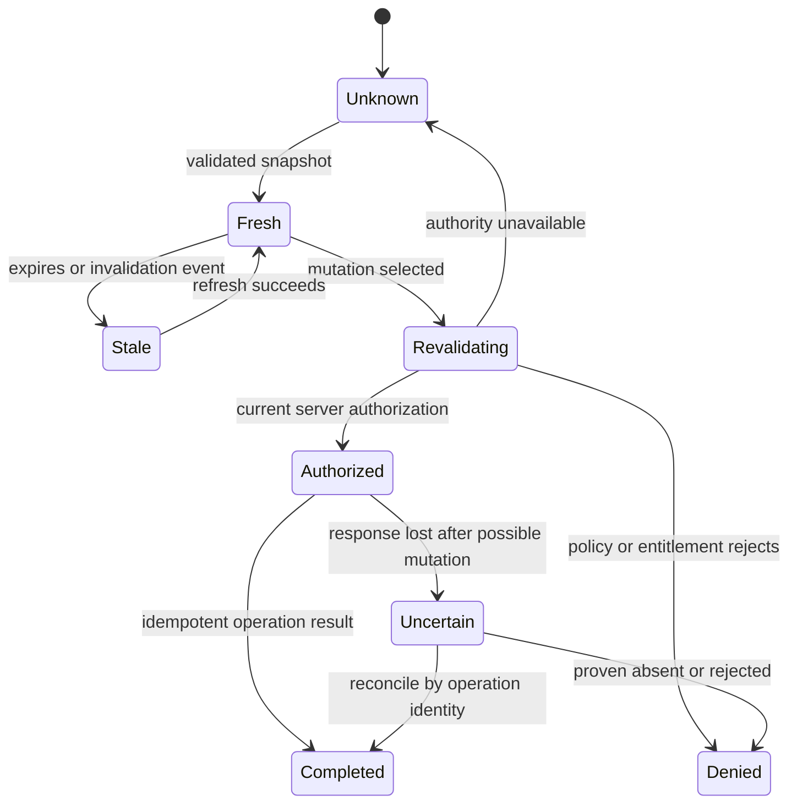

# PRD-037: Capability Discovery and CLI-Web Parity

| Field | Value |
| --- | --- |
| Status | Accepted |
| Owner | Runa product, public API, CLI and console maintainers |
| Depends on | PRD-003, PRD-004, PRD-005, PRD-007, PRD-023, PRD-031, PRD-033, PRD-034 |
| Unlocks | PRD-038 |

Normative terms **MUST**, **SHALL**, **SHOULD**, and **MAY** follow RFC 2119/8174.

## Problem and outcome

The authenticated console currently exposes machines, AgentSession-related
status, records, usage, Run Inspector, secrets, API keys and settings, while
some operations such as payments may remain browser-only. A local CLI cannot
promise equivalent control by copying console navigation or guessing support
from an endpoint response. It needs one versioned, server-owned capability
projection that states what is supported, how it is authorized and whether the
appropriate experience is native CLI, read-only CLI, or an exact browser
handoff.

The outcome is semantic parity: the same account and resource produce the same
authoritative result regardless of surface. Pixel parity and identical command
coverage are not goals.

## Goals and non-goals

- **G-037-01:** Discover supported account, machine and AgentSession operations
  without client-side feature invention.
- **G-037-02:** Define an auditable parity ledger for CLI, console and SDKs.
- **G-037-03:** Preserve one authorization and state authority across surfaces.
- **G-037-04:** Make unsupported, unavailable and browser-only outcomes explicit.

Non-goals: reimplementing the console as a terminal dashboard; exposing internal
provider topology; allowing capability metadata to grant authority; forcing
billing, legal consent or identity proof into a text prompt; or making the SDKs
interactive workflow engines.

## Public contract

The OpenAPI authority SHALL define an additive discovery operation:

`GET /v1/capabilities?scope=account|machine|agent_session&resource_id=<id>`

The closed response model is:

```text
CapabilitySnapshot {
  schema_version, subject_scope, subject_id?, observed_at, expires_at,
  etag, capabilities: Capability[]
}
Capability {
  id, availability, surfaces[], interaction, mutation_class,
  required_permissions[], reason_code?, documentation_url?, handoff?
}
availability = supported | unsupported | temporarily_unavailable | unknown
interaction = native | read_only | browser_handoff
mutation_class = none | reversible | destructive | secret_revealing | financial
```

A browser handoff contains only a Runa-owned exact HTTPS URL, purpose, expiry
and one-use state binding. It contains no bearer credential in its URL and
cannot authorize an operation by itself.

## Requirements

| ID | Force | EARS requirement | Goal | Test |
| --- | --- | --- | --- | --- |
| R-037-01 | MUST | WHEN a caller requests capabilities, the API SHALL derive the subject and permissions from current authentication and SHALL return only the closed versioned projection. | G-01, G-03 | TC-037-01 |
| R-037-02 | MUST | WHEN a capability is absent, expired, contradictory or unknown to the client, the client SHALL treat it as `unknown` and SHALL NOT perform the associated mutation. | G-03, G-04 | TC-037-02 |
| R-037-03 | MUST | WHEN CLI and console invoke the same public operation with equivalent intent, the API SHALL apply the same authorization, validation, idempotency and lifecycle semantics. | G-02, G-03 | TC-037-03 |
| R-037-04 | MUST | WHEN `interaction=browser_handoff`, the CLI SHALL show the destination and consequence, require explicit user action, and open only an allowlisted Runa HTTPS origin with one-use state. | G-03, G-04 | TC-037-04 |
| R-037-05 | MUST | WHEN a mutation is destructive, secret-revealing or financial, the CLI SHALL require the confirmation and authentication strength declared by server policy; noninteractive mode SHALL require an explicit stable confirmation input. | G-03 | TC-037-05 |
| R-037-06 | MUST | WHEN a user is authenticated but waitlisted or not assigned, capability discovery SHALL return an entitlement-safe state and machine mutations SHALL remain unavailable without treating authentication as failed. | G-01, G-04 | TC-037-06 |
| R-037-07 | MUST | The parity ledger SHALL classify machines, AgentSessions, records, usage, Run Inspector, secrets, API keys, settings and payments as native, read-only, browser-handoff or intentionally unsupported, with an owner and contract operation. | G-02 | TC-037-07 |
| R-037-08 | MUST | Capability snapshots SHALL be cacheable only until `expires_at`; authorization-sensitive mutations SHALL revalidate server-side even when a fresh snapshot says supported. | G-03 | TC-037-08 |
| R-037-09 | MUST | Capability and error payloads SHALL reveal no internal provider name, tenant identifier, credential, terminal content, secret value or policy implementation detail. | G-03 | TC-037-09 |
| R-037-10 | MUST | IF discovery is unavailable, THEN read-only cached display MAY be labeled stale, but mutation, secret reveal and browser handoff issuance SHALL fail closed with a stable reason. | G-04 | TC-037-10 |

## State and truth model



`supported` means the server advertises an operation for the subject; it does
not mean the next invocation will be authorized or succeed. The mutation result
and resource projection are authoritative. CLI menus, console navigation,
OpenAPI path presence, HTTP reachability and prior success are hints only.
Evidence is invalidated by policy, entitlement, OpenAPI, deployment, account,
resource lifecycle or capability-schema change, and expires no later than the
server-provided lease.

## Parity and SDK boundary

The parity ledger is generated from one capability registry plus OpenAPI
operation metadata and checked against console requests and CLI commands. It
SHALL NOT be a shared runtime orchestration library. Console and CLI own their
presentation; infra owns authorization and domain transitions.

TypeScript and Python SDKs SHALL expose idiomatic discovery models and methods
when the operation is public. They MAY expose explicit domain operations from
the parity ledger, but SHALL NOT prompt, open browsers, confirm destructive
actions, manage terminal tabs, reveal secrets automatically or infer support
from installed SDK version.

## Behavioral assurance

- **TC-037-01:** Cross-tenant and nonexistent resource discovery have the same
  non-disclosing observable class.
- **TC-037-02:** Remove a required capability or add an unknown enum; the CLI
  performs zero mutation.
- **TC-037-03:** Replay equivalent CLI/console intents against contract fixtures;
  authorization, idempotency and final resource state match.
- **TC-037-04:** Malicious, expired, replayed, non-HTTPS and lookalike handoff
  URLs are rejected before browser invocation.
- **TC-037-05:** Destructive, financial and secret-reveal actions fail without
  the declared confirmation and never echo secret material.
- **TC-037-06:** A waitlisted authenticated account can inspect safe status but
  cannot create or start a machine.
- **TC-037-07:** Removing a console request witness or CLI mapping makes parity
  CI fail with the capability ID and owner.
- **TC-037-08:** Policy changes after snapshot issuance; server revalidation
  denies the mutation.
- **TC-037-09:** Schema/property fuzzing finds no forbidden identifiers or
  credential-shaped values.
- **TC-037-10:** Drop discovery responses before and after a mutation; the CLI
  either abstains or reconciles by idempotency identity without blind retry.

Negative controls grant from cached capability metadata, treat endpoint
presence as support, skip mutation revalidation and accept arbitrary handoff
origins; every mutation MUST make the respective test fail.

## Rollout, recovery and blockers

Deploy registry and additive discovery schema first, then console shadow
comparison, SDK projections, CLI read-only display, reversible mutations and
finally higher-risk actions. Rollback disables new discovery consumers while
preserving the existing console and explicit SDK operations; clients fall back
to stable `capability_unknown`, never guessed support.

Blockers before `Accepted`: named capability-registry owner; complete parity
ledger; exact production handoff origin policy; confirmation taxonomy; waitlist
semantics; N/N-1 response compatibility; reconciliation rules for uncertain
mutations; and contract tests bound to immutable producer, console, CLI and SDK
digests.
