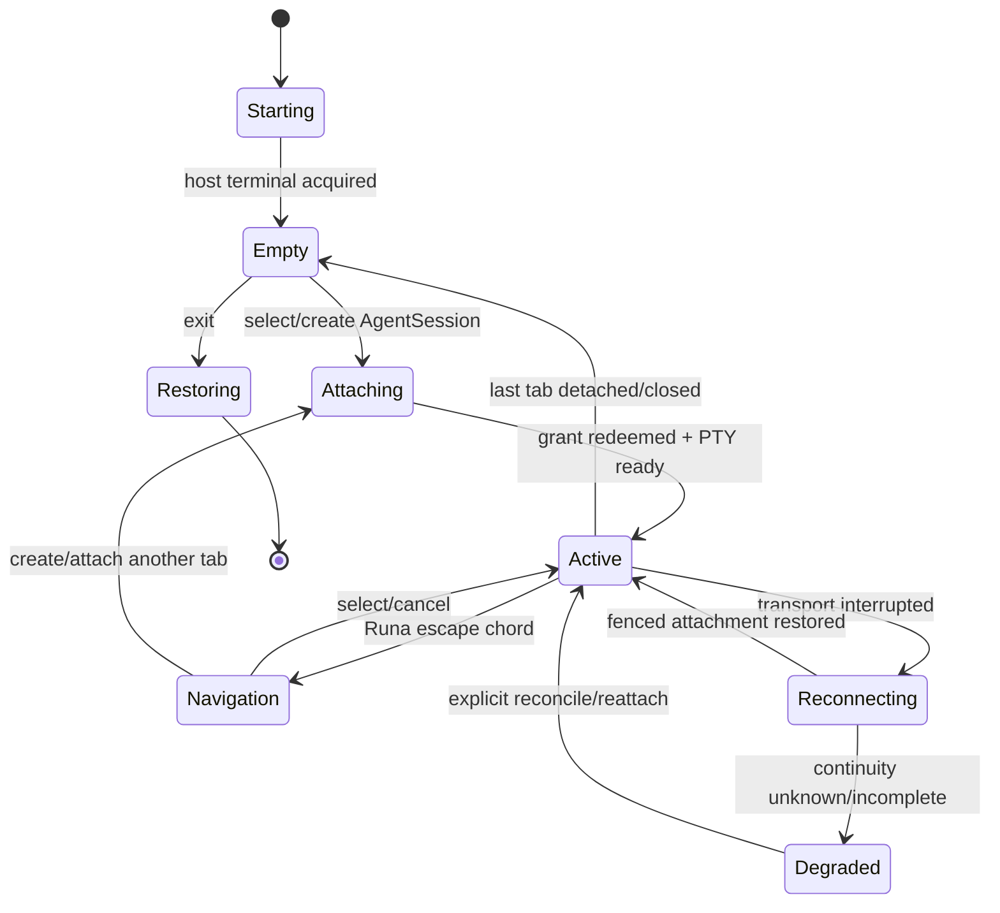
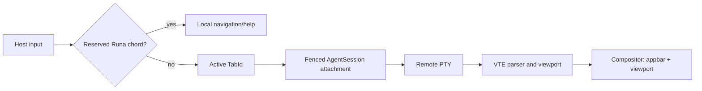

# PRD-038: Local Runa Terminal Appbar, Tabs, and Session Switching

| Field | Value |
| --- | --- |
| Status | Accepted |
| Owner | Runa CLI and terminal-runtime maintainers |
| Depends on | PRD-004, PRD-008, PRD-009, PRD-010, PRD-011, PRD-033, PRD-037 |

Normative terms follow RFC 2119/8174.

## Problem and decision

The required experience is a Runa-owned orange appbar above a cloud Claude,
Codex or OpenClaw terminal. From the same local terminal, the user can inspect
machine/session state and switch among multiple AgentSessions. Directly passing
remote alternate-screen and cursor-control bytes to the host terminal cannot
preserve that appbar: the child can erase, scroll or repaint it.

Runa therefore SHALL own the outer alternate screen and render each remote PTY
inside an isolated virtual terminal viewport. This supersedes any interpretation
of PRD-004/009 that grants the remote program the complete host screen. Payload
bytes remain uninterpreted for product meaning, but a standards-conforming VTE
parser interprets terminal control sequences for rendering and input modes.

## Goals and non-goals

- **G-038-01:** Preserve a stable branded appbar without corrupting native agent TUIs.
- **G-038-02:** Switch, create, attach, detach and close AgentSession tabs safely.
- **G-038-03:** Keep machine, sync, auth and terminal status truthful and separate.
- **G-038-04:** Restore the host terminal on every recoverable exit path.

Non-goals: collaborative typing into one PTY; parsing prompts or model output;
recording terminal contents; replacing shell multiplexers globally; combining
different machines into one tab without explicit identity; or claiming a task
executed from terminal input acknowledgement.

## Local component contract

```text
RunaTerminalHost
  AppbarModel(machine, active AgentSession, safe metrics, notices)
  TabRegistry(TabId -> AgentSessionId + PtyGeneration + ViewportState)
  InputRouter(reserved Runa chord | active virtual terminal)
  VteViewport(bytes -> cells/modes; resize -> remote PTY)
  AttachmentClient(one-use grant, fencing, replay sequence)
```

Only public Runa IDs and safe display fields enter the appbar. Each tab binds an
immutable tuple `{user, machine_id, agent_session_id, pty_generation}`. Switching
tabs changes the input/output viewport, not AgentSession ownership or lifecycle.

## Requirements

| ID | Force | EARS requirement | Goal | Test |
| --- | --- | --- | --- | --- |
| R-038-01 | MUST | WHEN interactive mode starts, Runa SHALL own the outer alternate screen and SHALL confine every remote control sequence to the active virtual viewport below the appbar. | G-01 | TC-038-01 |
| R-038-02 | MUST | WHILE an AgentSession tab is active, keyboard, paste, mouse and resize events SHALL route only to that tab except for a documented configurable Runa escape chord. | G-01, G-02 | TC-038-02 |
| R-038-03 | MUST | WHEN the escape chord opens session navigation, Runa SHALL suspend remote input routing until the user selects, cancels or completes a local action. | G-02 | TC-038-03 |
| R-038-04 | MUST | WHEN switching tabs, Runa SHALL preserve each viewport, PTY generation, replay cursor and local mode state and SHALL never replay input into the newly selected tab. | G-02 | TC-038-04 |
| R-038-05 | MUST | WHEN creating or attaching a tab, the client SHALL use PRD-033 selection and a fresh PRD-008 grant bound to exactly one AgentSession; a machine-level match SHALL be insufficient. | G-02 | TC-038-05 |
| R-038-06 | MUST | The appbar SHALL represent machine lifecycle, AgentSession lifecycle, attachment, provider auth and workspace sync as separate fields and SHALL show `unknown` for stale or contradictory evidence. | G-03 | TC-038-06 |
| R-038-07 | MUST | WHEN status evidence expires, Runa SHALL retain the terminal if its fenced transport remains valid but SHALL mark the affected appbar field stale/unknown and SHALL not infer health from terminal output. | G-03 | TC-038-07 |
| R-038-08 | MUST | WHEN the terminal is narrow, lacks color, has reduced-motion preferences or is noninteractive, the CLI SHALL use a bounded accessible fallback; it SHALL not rely on orange, animation or icons alone. | G-01 | TC-038-08 |
| R-038-09 | MUST | WHEN Runa exits, crashes on a capturable signal or loses every tab, it SHALL leave the outer alternate screen, restore cooked mode, cursor, paste/mouse modes and signal handlers. | G-04 | TC-038-09 |
| R-038-10 | MUST | IF a remote child emits malformed, oversized or adversarial escape sequences, THEN the VTE SHALL bound memory/CPU, prevent host-terminal escape and close or quarantine only the offending tab. | G-01, G-04 | TC-038-10 |
| R-038-11 | MUST | Appbar metrics such as cost, tokens saved, authorization and sync SHALL carry source, observation time and freshness; unavailable metrics SHALL disappear or show unknown, never zero or success. | G-03 | TC-038-11 |
| R-038-12 | MUST | The host SHALL provide a discoverable help overlay for switching, new session, detach, terminate, copy mode and literal escape-chord forwarding without sending overlay keystrokes remotely. | G-01, G-02 | TC-038-12 |

## State machines





## Truth, freshness and privacy

Rendered cells prove only received terminal bytes. A selected tab does not prove
attachment, a connected transport does not prove process health, and provider
welcome text does not prove usable authentication. Terminal state follows
PRD-009/010 evidence; appbar projections use leases and correlation IDs from
their owning services. The compositor SHALL not inspect content to derive
business state.

Terminal bytes and screen buffers remain memory-bounded customer data and are
not persisted by default. Crash reports contain structural state only. Copy mode
requires explicit user action and never copies hidden/inactive tab content.

## Tests and negative controls

- **TC-038-01:** Full-screen Claude/Codex fixtures emit clear, cursor, scroll,
  title, OSC, DCS and alternate-screen sequences; the appbar remains unchanged.
- **TC-038-02:** Random keyboard/paste/mouse schedules deliver bytes to exactly
  the active tab; literal escape forwarding is explicit.
- **TC-038-03:** While navigation is open, remote byte count does not increase.
- **TC-038-04:** Rapid switching with delayed frames preserves per-tab ordering,
  viewport and PTY generation.
- **TC-038-05:** A machine-scoped or sibling-session grant cannot attach a tab.
- **TC-038-06:** Contradictory fresh/stale lifecycle/auth/sync signals never
  collapse to a single green status.
- **TC-038-07:** Terminal continues during status outage while appbar says
  unknown; mutations remain blocked where current authority is required.
- **TC-038-08:** Golden semantic tests cover 40-column, no-color, screen reader
  text fallback and non-TTY JSON behavior.
- **TC-038-09:** Fault injection at every raw-mode/alternate-screen transition
  restores the host or prints a deterministic recovery instruction.
- **TC-038-10:** Escape-sequence bombs and output floods remain within CPU/memory
  budgets and cannot write outside the viewport.
- **TC-038-11:** Stale or absent metering never renders as `$0`, zero tokens or
  authorized.
- **TC-038-12:** Uncoached users find and switch sessions without terminating the
  remote agent or typing navigation keys into it.

Negative controls pass remote bytes directly to the host terminal, key routing
by machine ID, derive auth from output text, and share viewport state across
tabs; each MUST fail.

## Cross-platform closure

**R-038-13 (MUST):** WHERE rich or passthrough mode is supported on Windows,
macOS, or Linux, the CLI SHALL preserve identical focus, byte-isolation,
copy/paste, signal, resize, restoration, accessibility, and truthful-status
semantics using the platform's native terminal facilities. **TC-038-13** runs
the installed artifact in Windows Terminal/PowerShell, macOS Terminal and a
representative Linux terminal, including tmux/SSH nesting and `TERM=dumb`; a
platform-specific silent fallback or cross-session byte leak fails the gate.

## SDK impact, rollout and blockers

The TUI, VTE, tab registry and input router are CLI-only. TypeScript/Python SDKs
MAY expose explicit AgentSession listing and terminal-grant metadata per
PRD-008/033 but SHALL NOT consume grants, render terminals or manage tabs.

Roll out with deterministic VTE corpus, OS terminal matrix, employee dogfood,
single-tab preview, multi-tab preview, then default interactive mode. Keep a
documented diagnostic passthrough mode only if it cannot claim appbar support.
Rollback disables the compositor feature before protocol rollback and detaches
without terminating remote AgentSessions.

Blockers before `Accepted`: implementation language/VTE dependency decision;
reserved chord and literal-forward UX; exact compact/narrow layout; per-tab
buffer limits; status freshness leases; crash restoration evidence; live resize
support policy; and confirmation that PRD-004/009 are amended to remove the
whole-screen passthrough contradiction.
