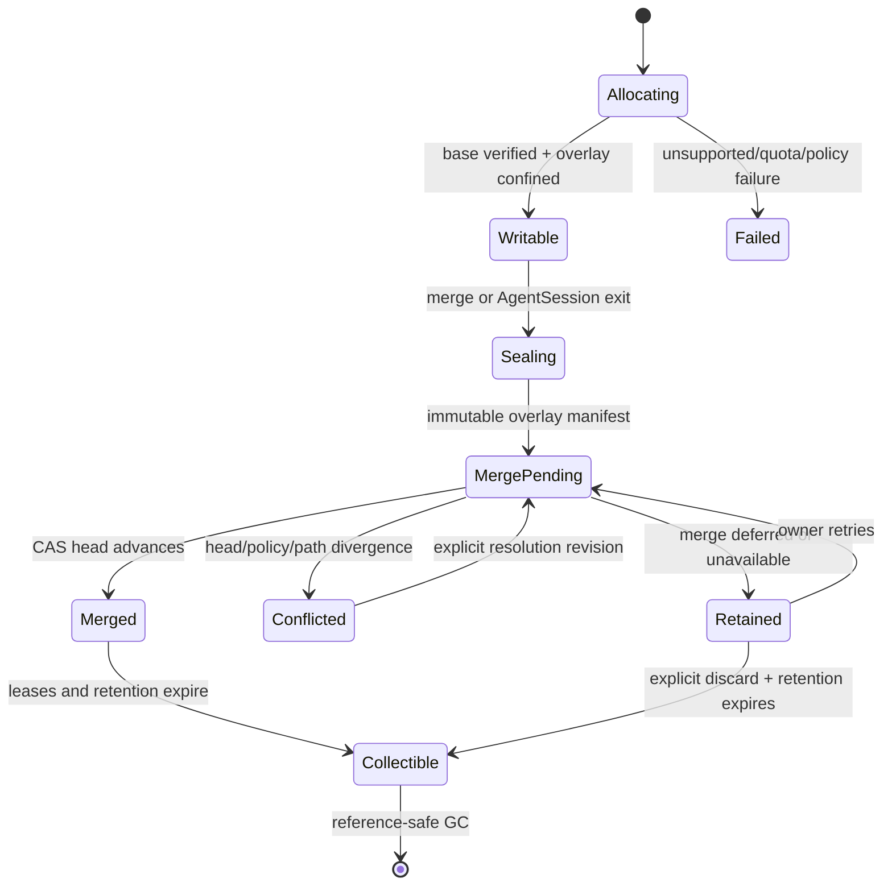
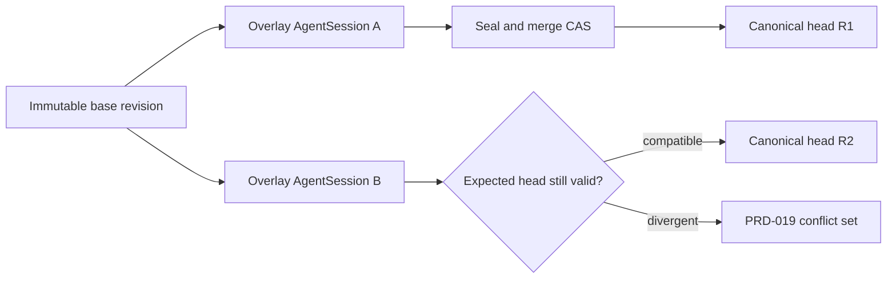

# PRD-039: Workspace Revisions, Overlays, and Multi-Writer Safety

| Field | Value |
| --- | --- |
| Status | Accepted |
| Owner | Runa workspace service and machine-runtime maintainers |
| Depends on | PRD-015, PRD-016, PRD-017, PRD-018, PRD-019, PRD-020, PRD-021, PRD-032 |
| Unlocks | PRD-040 |

Normative terms follow RFC 2119/8174.

## Problem and decision boundary

Several AgentSessions in one machine can write the same project concurrently.
Process and PTY isolation do not isolate filesystem writes. A watcher observing
a shared mutable tree after each write cannot prove that an intermediate
divergent value was not overwritten before observation, so it cannot satisfy
the existing no-silent-loss invariant.

The architectural default for strong multi-writer safety is one copy-on-write
overlay per AgentSession over an immutable admitted workspace revision. Changes
are committed through a compare-and-swap merge into the canonical revision.
Direct shared-write mode, if retained, SHALL be explicitly named `best_effort`,
SHALL not claim lossless conflict detection, and SHALL not be the GA default.

## Model and invariants

```text
WorkspaceRevision {workspace_id, revision_id, parent_ids[], manifest_root,
                   policy_digest, created_at, minimum_reader}
SessionOverlay {overlay_id, agent_session_id, base_revision, state,
                upper_root, observed_root, quota, created_at}
MergeAttempt {merge_id, overlay_id, expected_head, result, conflict_ids[]}
```

- **I-039-01:** An admitted revision is immutable and content-addressed.
- **I-039-02:** Exactly one writable overlay belongs to one live AgentSession;
  siblings cannot address its upper layer.
- **I-039-03:** Canonical head advances only by CAS from the expected revision.
- **I-039-04:** A failed merge preserves base, overlay changes and canonical head.
- **I-039-05:** Excluded or escaping content never enters a revision or overlay export.
- **I-039-06:** Destroying an AgentSession never silently destroys unmerged work.

## Requirements

| ID | Force | EARS requirement | Goal | Test |
| --- | --- | --- | --- | --- |
| R-039-01 | MUST | WHEN an AgentSession is created in strong mode, runtime SHALL mount/create a private writable overlay over the selected immutable base revision before launching the process. | Integrity | TC-039-01 |
| R-039-02 | MUST | WHEN a process writes, deletes or renames within its workspace, the effect SHALL remain in its overlay until an explicit or policy-authorized merge commits it. | Isolation | TC-039-02 |
| R-039-03 | MUST | WHEN merging, the service SHALL compare expected canonical head, base and policy digest and SHALL atomically advance only if all validations pass. | Integrity | TC-039-03 |
| R-039-04 | MUST | IF canonical head changed incompatibly, THEN the service SHALL create immutable conflict records preserving base, ours and theirs and SHALL not choose a winner automatically. | Safety | TC-039-04 |
| R-039-05 | MUST | WHEN disjoint changes from sibling overlays merge, their resulting revision SHALL be deterministic independent of arrival order where causality permits. | Convergence | TC-039-05 |
| R-039-06 | MUST | WHEN an AgentSession exits, fails or is terminated with unmerged changes, runtime SHALL retain a recoverable sealed overlay for the declared retention period and return a safe recovery reference. | Recovery | TC-039-06 |
| R-039-07 | MUST | IF overlay quota, disk capacity or inode limits are reached, THEN writes SHALL fail explicitly without mutating canonical head or deleting unrelated overlays. | Bounds | TC-039-07 |
| R-039-08 | MUST | Every overlay, merge and conflict operation SHALL bind user, workspace, machine, AgentSession, base revision, generation and policy digest; foreign identifiers SHALL be non-disclosing. | Isolation | TC-039-08 |
| R-039-09 | MUST | WHEN local sync targets canonical head, the sync protocol SHALL exchange immutable revision identity and SHALL never treat an unmerged overlay as globally converged. | Truth | TC-039-09 |
| R-039-10 | MUST | IF a platform cannot provide the required overlay confinement and atomicity, THEN strong multi-writer mode SHALL be unavailable before process launch; no silent downgrade is permitted. | Safety | TC-039-10 |
| R-039-11 | MUST | WHEN `best_effort` shared mode is explicitly selected, every surface SHALL disclose the weaker guarantee and SHALL disable claims that all concurrent variants are retained. | Honesty | TC-039-11 |
| R-039-12 | MUST | Garbage collection SHALL require proof that no active overlay, retained conflict, sync journal, checkpoint or rollback lease references the revision/content. | Recovery | TC-039-12 |

## Lifecycle and merge DAG





## Truth, compatibility and observability

Filesystem visibility, watcher delivery, process exit zero, an empty diff view
or successful content upload is not proof of an admitted revision. The
authoritative evidence is a server receipt binding the manifest root, base,
resulting head, policy, owner and merge identity. An overlay can be `writable`,
`sealed`, `merge_pending`, `merged`, `conflicted`, `retained` or `unknown`; stale
mount/process observations never upgrade it.

Revision and overlay durable records carry minimum reader/writer versions.
N/N-1 rollback must preserve sealed overlays and conflicts or disable new writes
before downgrade. Metrics record structural counts, bytes, latency, quota and
safe outcomes, never filenames, diffs, prompts or content.

Evidence freshness is bounded by the owning service. A mount observation,
process probe or cached overlay projection expires on AgentSession generation,
canonical-head, policy, runtime-image, overlay-driver or deployment change.
Expired or contradictory evidence yields `unknown`, blocks merge/discard/GC and
requires a fresh server receipt; it never becomes an inferred clean overlay.

## Tests and negative controls

- **TC-039-01:** Two same-base AgentSessions receive distinct upper layers and
  cannot observe unmerged sibling writes.
- **TC-039-02:** Create/update/delete/rename schedules alter only the owning overlay.
- **TC-039-03:** Concurrent same-intent merge retries produce one canonical revision.
- **TC-039-04:** Same-path divergent edits preserve base/ours/theirs and head.
- **TC-039-05:** Property histories for disjoint changes converge to identical roots.
- **TC-039-06:** Crash/terminate at every seal/merge transition preserves a
  recoverable reference and never reports merged prematurely.
- **TC-039-07:** Disk-full, inode and quota exhaustion affect only the writer and
  preserve every admitted revision.
- **TC-039-08:** Cross-user/machine/session IDs neither reveal nor mutate overlays.
- **TC-039-09:** Local sync sees canonical head only; overlay status is separately labeled.
- **TC-039-10:** Remove overlay confinement or atomic rename support; admission fails.
- **TC-039-11:** Shared best-effort mode never emits lossless/converged-all-writers claims.
- **TC-039-12:** GC with a hidden live reference is rejected; after all leases
  expire, content is collected exactly once.

Negative controls use one shared writable directory, replace CAS with
last-write-wins, delete overlays on process exit and let GC ignore conflict
references; each MUST make the suite fail.

## Cross-platform closure

**R-039-13 (MUST):** WHEN the same workspace history is processed on Windows,
macOS, and Linux, overlay identity, canonical paths, case/normalization checks,
rename/delete semantics, conflict preservation, and revision roots SHALL remain
portable or reject before mutation with a typed portability conflict.
**TC-039-13** differentially replays one causal history across NTFS, APFS and a
supported Linux filesystem, including case-only renames, Unicode normalization,
symlinks/junctions and forbidden names; lossy silent conversion fails.

## API and SDK impact

The public contract requires explicit revision, overlay status, seal, merge,
conflict and recovery operations. TypeScript/Python SDKs SHALL expose idiomatic
models, typed errors, pagination and explicit methods for programmatic use.
They SHALL NOT mount filesystems, create OS overlays, watch directories, choose
conflict winners or merge automatically on client construction.

## Rollout and blockers

Implement immutable revision storage and reference-safe GC first, then runtime
overlay fixtures, one-agent shadow comparison, multi-agent opt-in, recovery
rehearsals and staged default. Rollback disables new overlay allocation, seals
active overlays and preserves read/export/merge recovery; it never maps strong
sessions into shared-write mode.

Blockers before `Accepted`: overlay technology and supported kernel/image;
canonical-head ownership; merge policy for generated/binary files; AgentSession
exit retention; quota/billing owner; checkpoint interaction; local-sync target;
N/N-1 durable schema; export/discard authorization; and a model-checked or
property-tested proof that no admitted variant is silently lost.
