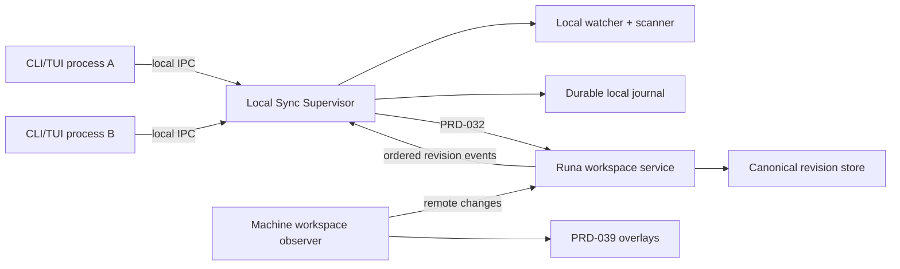
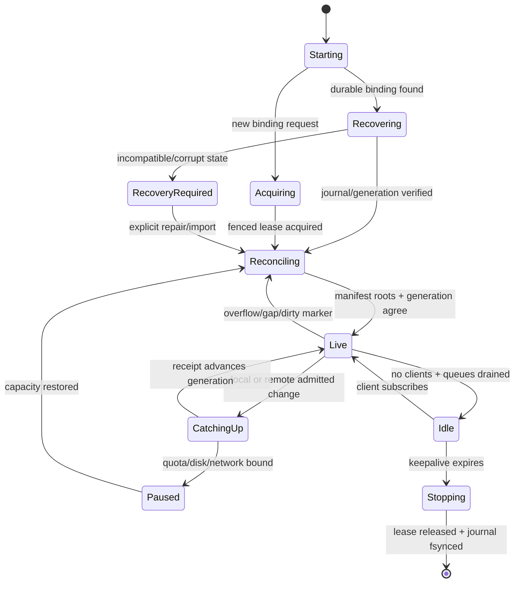

# PRD-040: Sync Supervisor, Scaling, and Large Repositories

| Field | Value |
| --- | --- |
| Status | Accepted |
| Owner | Runa CLI sync and workspace-service maintainers |
| Depends on | PRD-015, PRD-016, PRD-017, PRD-018, PRD-019, PRD-020, PRD-021, PRD-032, PRD-039 |

Normative terms follow RFC 2119/8174.

## Problem and outcome

The sync algorithm PRDs do not assign runtime ownership when several local CLI
windows use the same workspace, nor define bounded behavior for monorepos with
millions of entries, very large files, watcher overflow or long offline periods.
Independent watchers and journals can race, duplicate uploads and disagree about
generation. Running all scanning in the foreground also couples terminal startup
and latency to repository size.

One per-user local Sync Supervisor SHALL own each writable WorkspaceBinding
lease. CLI/TUI processes are clients of its authenticated local IPC. A machine-
side workspace observer and the Runa workspace service own remote observation
and canonical revision admission respectively.

## Component and authority model

The supervisor is not authorization authority. It serializes local intent,
holds renewable local leases and calls the public Runa API. The server owns
identity, quotas, admission, sequence, canonical head and policy. CLI clients
never read or mutate the journal directly.

## Goals and non-goals

- **G-040-01:** Exactly one local sync writer per binding/generation.
- **G-040-02:** Bound CPU, memory, disk and network on large repositories.
- **G-040-03:** Keep terminal attach and echo independent from sync congestion.
- **G-040-04:** Recover deterministically from crashes, overflow and version skew.

Non-goals: distributed multi-user editing; syncing excluded build caches by
default; replacing Git; hidden unlimited background work; or treating a watcher
as the canonical source of file truth.

## Requirements

| ID | Force | EARS requirement | Goal | Test |
| --- | --- | --- | --- | --- |
| R-040-01 | MUST | WHEN the first local client requests sync, the supervisor SHALL acquire an OS-authenticated per-user binding lease and SHALL permit exactly one journal writer for the binding generation. | G-01 | TC-040-01 |
| R-040-02 | MUST | WHEN another client requests the same binding, it SHALL subscribe to the existing supervisor state rather than start another watcher/journal; incompatible configuration SHALL fail as a conflict. | G-01 | TC-040-02 |
| R-040-03 | MUST | WHEN scanning a repository, the supervisor SHALL stream bounded manifest pages, use handle-relative safe traversal, and remain within declared CPU, memory, open-file and queue budgets. | G-02 | TC-040-03 |
| R-040-04 | MUST | WHEN files exceed the inline threshold, the supervisor SHALL chunk and hash incrementally without loading the complete file into memory and SHALL verify stability before commit. | G-02 | TC-040-04 |
| R-040-05 | MUST | IF watcher overflow, journal gap, directory identity change or unsupported event occurs, THEN incremental apply SHALL pause and exclusion-aware manifest reconciliation SHALL begin. | G-04 | TC-040-05 |
| R-040-06 | MUST | WHILE terminal traffic is active, sync hashing, compression and transfer SHALL run under independent bounded queues and resource priority so terminal latency guardrails remain satisfied. | G-03 | TC-040-06 |
| R-040-07 | MUST | WHEN initial sync is incomplete, CLI/TUI SHALL display measured stages and counts from authoritative receipts; it SHALL not show fabricated percentage or call the workspace ready before the required revision is admitted. | G-03 | TC-040-07 |
| R-040-08 | MUST | WHEN a supervisor crashes or upgrades, durable journal ownership SHALL transfer through fencing and schema compatibility without two active writers or acknowledged-operation loss. | G-01, G-04 | TC-040-08 |
| R-040-09 | MUST | IF local disk, API quota or network budget is exhausted, THEN admission SHALL pause explicitly, retain every acknowledged intent, mark the root dirty where observation may have been lost, and require reconciliation. | G-02, G-04 | TC-040-09 |
| R-040-10 | MUST | WHEN remote overlay/canonical revisions change, the machine observer SHALL publish ordered revision events; local sync SHALL consume only canonical admitted revisions unless an explicit overlay export is requested. | G-01, G-04 | TC-040-10 |
| R-040-11 | MUST | Supervisor local IPC SHALL authenticate the same OS user, apply restrictive socket/pipe permissions, version messages, bound frames and reject replay or cross-user clients. | G-01, G-04 | TC-040-11 |
| R-040-12 | MUST | Large-repository policy SHALL expose documented limits and exclusion recommendations and SHALL never silently omit admitted files because a heuristic deems them unimportant. | G-02 | TC-040-12 |
| R-040-13 | MUST | WHEN no client remains, the supervisor SHALL follow an explicit keepalive policy that discloses continuing sync/resource use and reaches idle or shutdown within a bounded period. | G-02 | TC-040-13 |
| R-040-14 | MUST | N and N-1 supervisor/API combinations SHALL read every supported journal/revision state or reject before mutation with export, migration or roll-forward recovery. | G-04 | TC-040-14 |

## Supervisor lifecycle

## Scaling envelope and backpressure

GA limits SHALL be measured and versioned rather than inferred from defaults.
The validation matrix includes at least: 1 million entries; 100 GiB admitted
content; individual 20 GiB sparse and non-sparse files; 100,000 rapid saves;
deep paths at supported platform limits; 10,000 rename/delete operations; 7 days
offline; and simultaneous terminal output flood. Results record peak RSS, CPU,
disk amplification, open handles, bytes transferred, convergence time and
terminal echo impact.

Backpressure propagates from server admission to chunk scheduler, journal and
watcher coalescing without dropping causal delete barriers. Crossing a bound
stops new admission and records a dirty marker; it never clears unobserved local
changes merely to reduce queue size.

## Truth and evidence freshness

Watcher quiet, queue empty, equal timestamps, successful upload, local manifest
completion or WebSocket connectivity are not convergence proof. The authoritative
oracle is equality of exclusion-aware manifest roots at a server-acknowledged
canonical revision, generation, epoch and policy digest. Supervisor status is
`recovering | reconciling | catching_up | live_unverified | converged |
conflicted | paused | recovery_required | unknown` with observed time and lease.

Evidence expires on watcher backend, filesystem, canonicalizer, ignore policy,
journal schema, hashing/chunking code, server protocol, revision model, resource
policy or deployment digest change. Conflicting supervisor/server evidence is
`unknown` and blocks claims or destructive cleanup.

## Tests and negative controls

- **TC-040-01:** Race 100 local processes; exactly one journal writer/lease exists.
- **TC-040-02:** Compatible clients share state; conflicting roots/policies fail
  without a second watcher.
- **TC-040-03:** Million-entry scan stays inside declared memory/handle budgets.
- **TC-040-04:** Large-file mutation during hashing retries boundedly and never
  admits mixed bytes.
- **TC-040-05:** Watcher overflow and event gaps force full reconciliation before
  `converged`.
- **TC-040-06:** Sync saturation keeps terminal p95 within PRD-009 guardrails.
- **TC-040-07:** Progress stages advance only on named local/server milestones;
  no static or time-based fake percentage appears.
- **TC-040-08:** Crash at every lease/journal transition yields at most one writer
  and exactly-once acknowledged effects.
- **TC-040-09:** Disk-full/quota/partition schedules preserve admitted intents and
  reconcile subsequent unobserved edits.
- **TC-040-10:** Unmerged PRD-039 overlays never appear as canonical local changes.
- **TC-040-11:** Cross-user, replayed, oversized and wrong-version IPC frames fail.
- **TC-040-12:** Heuristic/exclusion audits prove every omitted path is excluded by
  explicit policy, not size or perceived relevance.
- **TC-040-13:** Last-client exit follows disclosed keepalive and releases resources.
- **TC-040-14:** N/N-1 upgrade/downgrade fixtures either preserve state or stop
  before mutation with successful export/repair.

Negative controls start two supervisors, remove dirty markers, mark queue-empty
as converged, load whole large files, run sync and terminal on one unbounded
queue, and let old binaries write new journals; every control MUST fail.

## API, SDK and implementation boundary

Shared assets are IPC schemas, sync/OpenAPI schemas, canonicalization vectors,
journal state model and conformance histories. Local watcher, supervisor,
machine observer and server journal are independent runtime implementations with
separate fault domains.

TypeScript and Python SDKs SHALL expose explicit public status, manifest, chunk,
revision and recovery operations where intended for programmatic clients. They
SHALL NOT launch the supervisor, scan files, start watchers, own journals,
choose resource scheduling or synchronize merely by constructing a client.

## Rollout, recovery and blockers

Roll out deterministic fixtures, single-client shadow mode, supervisor opt-in,
large-repo cohort, multi-client cohort and staged default. Server and machine
observer producers deploy before supervisor consumers. Rollback stops new
background admission, fsyncs and preserves journals, releases leases, exports
safe recovery metadata and falls back to explicit snapshot/reconcile; it never
deletes either tree or unmerged overlays.

Blockers before `Accepted`: local daemon/IPC ownership decision; OS service and
upgrade model; exact scaling envelope and resource budgets; remote observer
delivery contract; initial-sync readiness threshold; keepalive disclosure;
large-file/sparse-file policy; N/N-1 journal migration; multi-process fencing
proof; and recovery drills on Windows, macOS and Linux.
