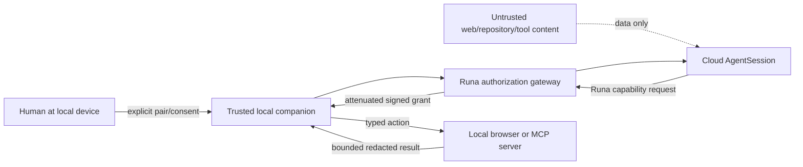
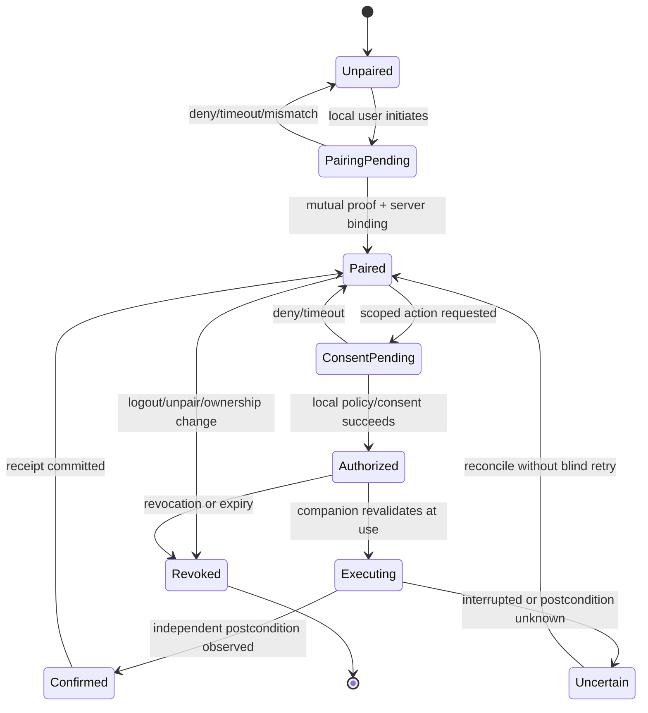
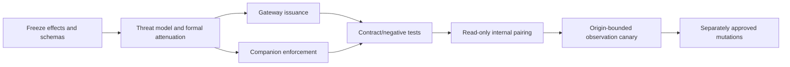

# PRD-041: Local Companion Capability Bridge for MCP/Browser

| Field | Value |
| --- | --- |
| Status | Accepted |
| Owner | Runa CLI, security and local-companion maintainers |
| Depends on | PRD-002, PRD-003, PRD-005, PRD-008, PRD-010, PRD-033, PRD-034, PRD-035, PRD-037 |
| Constrains | Browser/MCP integrations, AgentSession UI, release readiness |

Normative terms **MUST**, **SHALL**, **SHOULD**, and **MAY** follow RFC 2119/8174.

## Problem, goals and non-goals

A cloud AgentSession may need a bounded action on the user's local computer—for
example opening a URL in a local browser, reading the active page after consent,
or invoking a deliberately enabled MCP tool. A generic tunnel, remote desktop,
browser-cookie bridge, or arbitrary localhost proxy would let untrusted cloud or
page content reach effects outside the cloud machine and is prohibited.

Goals are explicit device pairing, least-privilege capabilities, local informed
consent, prompt-injection containment, revocation, truthful status and causal
audit. Non-goals are arbitrary Chrome control, cookie/password extraction,
silent background automation, exposing browser debugging ports, generic port
forwarding, or treating MCP discovery as authorization.

## Protected effects and trust boundaries



Protected effects include observing a page, navigating, clipboard access,
upload/download, form input, submission, authentication, external
communication, money/admin changes, filesystem selection and local MCP tool
execution. Every path to an effect SHALL cross the local companion's current
grant check; a cloud approval alone is insufficient where local consent is
required.

## Capability and action contracts

```text
CompanionPairing = {
  id, user_id, workspace_id, device_id, cli_instance_id,
  public_key_thumbprint, created_at, expires_at, state, generation
}

LocalActionGrant = {
  id, pairing_id, user_id, workspace_id, machine_id, agent_session_id,
  tool, action, resource_selector, allowed_origins, data_classes,
  mutation_class, consent_receipt_id, not_before, expires_at,
  max_uses, generation, nonce, parent_capability_id
}

LocalActionReceipt = {
  request_id, grant_id, action_digest, decision, effect_class,
  started_at, completed_at, postcondition_class, audit_event_id
}
```

Derived grants SHALL be no broader than their parent in principal, device,
tenant/workspace, machine, AgentSession, tool, action, resource, origin, data,
time, uses or delegation depth. Capability cycles are forbidden. Opaque IDs and
digests are not bearer authority.

## Requirements

| ID | Force | EARS requirement | Verification |
| --- | --- | --- | --- |
| R-041-01 | MUST | WHEN a user pairs a local companion, Runa SHALL use mutually authenticated proof of possession and bind the pairing to the exact user, workspace, device, CLI instance, expiry and generation. | Pairing replay/cross-device test |
| R-041-02 | MUST | WHEN a cloud AgentSession requests a local action, the authorization gateway SHALL bind a short-lived capability to the exact pairing, machine, AgentSession, tool, action, resource/origin, data class, use count and consent receipt. | One-dimension mutation suite |
| R-041-03 | MUST | IF a requested action exceeds its grant or any identity, generation, origin, resource, consent, expiry or revocation fact is unknown, THEN the companion SHALL deny before the protected effect. | Fail-closed fault schedule |
| R-041-04 | MUST | Untrusted page, repository, terminal, agent or MCP-returned content SHALL remain data and SHALL NOT create, broaden, approve or renew a capability. | Prompt-injection suite |
| R-041-05 | MUST | Read, write, submit, authentication, financial/admin, clipboard, filesystem and external-communication actions SHALL be distinct effect classes; mutation SHALL never inherit from observation permission. | Capability lattice test |
| R-041-06 | MUST | WHERE local consent is required, the trusted local UI SHALL show requesting AgentSession, exact action, target, disclosed data and consequence and SHALL obtain a fresh local decision before execution. | UI/effect binding test |
| R-041-07 | MUST | The companion SHALL NOT expose browser cookies, passwords, bearer tokens, debugging ports, arbitrary localhost access or raw secret-bearing page state to Runa, the agent, terminal, logs or telemetry. | Sentinel/source-to-sink scan |
| R-041-08 | MUST | WHEN pairing, consent, ownership, machine or AgentSession authority is revoked, the gateway and companion SHALL prevent new effects and terminate resumable authority within the declared bound. | Revocation-during-action test |
| R-041-09 | MUST | WHEN an action is attempted, Runa SHALL create a causal privacy-safe receipt recording actor, effective principal, capability generation, action digest, decision and externally verified postcondition class without page/terminal/secret payload. | Independent receipt oracle |
| R-041-10 | MUST | The public protocol SHALL use only Runa-controlled origins and versioned closed schemas and SHALL reveal no internal provider identity, cookie bridge or undocumented transport. | Contract/leak scan |
| R-041-11 | MUST | The companion SHALL mediate a declared allowlist of typed MCP tools and SHALL reject unknown tools, schema expansion, side-effect-class disagreement and tool-requested authority escalation. | Malicious MCP fixtures |
| R-041-12 | MUST | The CLI SHALL display `paired`, `action_authorized`, `executing`, `effect_confirmed`, `denied`, `revoked` and `unknown` as separate states and SHALL NOT infer success from transport connection or tool acknowledgement. | State-oracle mutation test |

## Lifecycle



Transport connection, MCP acknowledgement and browser automation completion are
not proof of the protected effect. An uncertain non-idempotent action SHALL not
be retried automatically.

## Threat model and negative controls

Threat origins include malicious page/repository/tool authors, compromised
cloud AgentSessions, stolen pairing data, sibling sessions, stale clients,
DNS/origin rebinding and a confused-deputy gateway. Tests SHALL cover cross-user,
cross-workspace, cross-device, cross-machine and cross-AgentSession replay;
revocation between check and use; malicious MCP schema/tool output; hidden
redirects/iframes; origin change; local listener exposure; consent-overlay
spoofing; clipboard/file exfiltration; duplicate submission; and companion
restart with stale grants.

Mandatory negative controls remove local consent, accept a sibling session ID,
treat tool output as instruction, expose an arbitrary localhost proxy and report
ACK as effect. The assurance suite MUST reject each seeded defect and inspect an
independent postcondition where safe.

## Cross-platform closure

**R-041-13 (MUST):** WHERE the local companion is offered on Windows, macOS, or
Linux, enrollment, device-key protection, outbound connectivity, local consent,
browser-adapter identity, revocation and cleanup SHALL preserve the same policy
semantics despite different OS key stores and browser integration mechanisms.
**TC-041-13** uses installed companions and Chrome adapters on all three Tier-1
platforms; a platform that bypasses consent, exposes an inbound listener or
cannot revoke a grant is unsupported and blocks general release.

## SDK and ownership boundary

Infrastructure owns identity, attenuation and grant issuance; the local
companion owns the final local enforcement point; the CLI owns trusted local UI
and pairing orchestration. TypeScript and Python SDKs MAY expose explicit
pairing/action metadata and typed errors when public, but SHALL NOT discover
local browsers, open debugging ports, auto-consent, execute MCP tools, retain
capabilities or turn client construction into a local bridge.

## Delivery DAG, rollout and rollback



Rollback revokes new issuance, pushes a minimum-companion-version deny rule and
expires outstanding grants; it SHALL NOT silently retain pairing or fall back to
a tunnel. Existing terminal and sync functions remain usable without companion
authority.

Hard blockers: no product-approved effect/consent taxonomy; no local companion
implementation owner; arbitrary browser/MCP access; missing AgentSession/device
binding; capability amplification; prompt-controlled approval; cookie/secret
exposure; inability to revoke; missing independent negative evidence; or no
safe uncertain-effect reconciliation.
