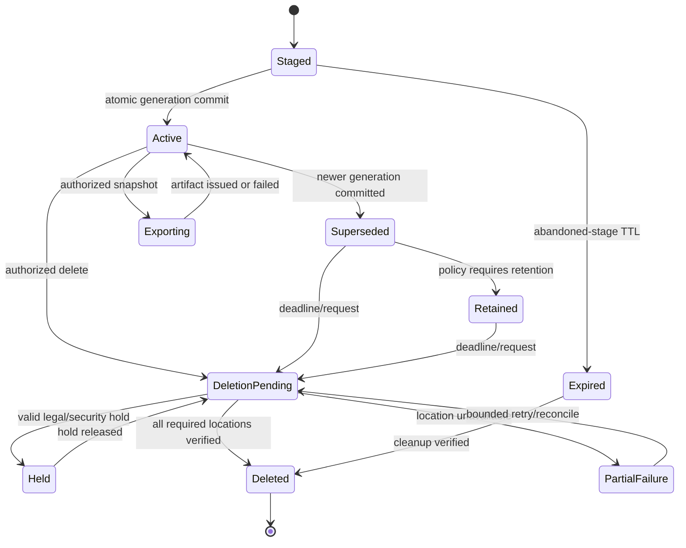
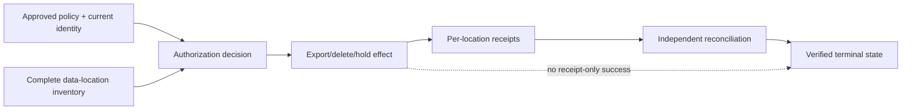
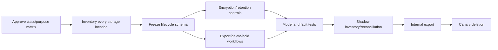

# PRD-042: Data Lifecycle/Retention/Export/Deletion/Audit

| Field | Value |
| --- | --- |
| Status | Accepted |
| Owner | Runa data, security, privacy and infrastructure maintainers |
| Depends on | PRD-002, PRD-015, PRD-018, PRD-021, PRD-032, PRD-033, PRD-034 |
| Constrains | Sync storage, machine deletion, account/workspace deletion, audit and support |

Normative terms follow RFC 2119/8174.

## Problem and scope

The sync PRDs govern admission and convergence but do not completely govern how
workspace content, staged chunks, journals, conflicts, backups, telemetry and
audit evidence are retained, exported and deleted. A successful API response is
not proof that every replica, cache or backup reached the required lifecycle
state.

This PRD covers Runa-controlled workspace/sync and security-audit data. It does
not promise deletion from third-party systems outside Runa's declared control,
legal deletion contrary to an active hold, or export of provider secrets,
terminal payloads or internal infrastructure metadata.

## Data classes and authoritative record

```text
DataRecord = {
  data_id, workspace_id, class, owner_scope,
  storage_locations, encryption_key_scope, created_at,
  retention_policy_id, retention_deadline, legal_hold_state,
  lifecycle_state, generation, deletion_receipt_id?
}

ExportJob = {
  id, requester, workspace_id, requested_classes, policy_version,
  snapshot_generation, state, expires_at, artifact_digest
}

DeletionReceipt = {
  id, request_id, subject_scope, policy_version, inventory_digest,
  completed_locations, pending_locations, exceptions,
  completed_at, verifier, evidence_expiry
}
```

Classes include active workspace content, staged chunks/manifests, sync journals,
conflict copies, local CLI journals, machine-local copies, backups, diagnostics,
operational telemetry, billing records and security audit events. Each class
SHALL have an approved owner, purpose, locations, encryption boundary,
retention/hold policy, exportability and deletion terminal state.

## Lifecycle and effects



Protected effects are content read/export, active-generation replacement,
retention extension, legal-hold change, destructive delete, audit read/export
and destruction-key removal.



## Requirements

| ID | Force | EARS requirement | Verification |
| --- | --- | --- | --- |
| R-042-01 | MUST | WHEN data enters Runa control, the system SHALL classify it and bind tenant/workspace, purpose, locations, encryption-key scope, policy version and retention deadline before persistence. | TC-042-01 inventory completeness test |
| R-042-02 | MUST | Workspace content, staged data, journals, conflicts and backups SHALL be encrypted in transit and at rest with tenant/workspace separation and documented key rotation/destruction semantics. | TC-042-02 ciphertext/key-scope evidence |
| R-042-03 | MUST | WHEN staged or orphan content exceeds its approved TTL, cleanup SHALL remove it from active stores and produce a verifiable receipt without affecting committed generations. | TC-042-03 crash/orphan schedule |
| R-042-04 | MUST | WHEN an authorized user requests export, Runa SHALL freeze one authorized workspace generation, include only approved classes, exclude secrets/internal metadata, produce a digest and short-lived delivery capability, and audit retrieval. | TC-042-04 export boundary test |
| R-042-05 | MUST | WHEN deletion is authorized, Runa SHALL fence new writes, enumerate every controlled replica/cache/index/stage/backup reference, revoke active sessions and capabilities as required, and advance each location toward its declared deletion terminal state. | TC-042-05 end-to-end deletion oracle |
| R-042-06 | MUST | The system SHALL NOT report `deleted` while any required location is pending, unknown or failed; it SHALL report partial state and residual scope without disclosing sensitive topology. | TC-042-06 missing-replica negative control |
| R-042-07 | MUST | IF an approved legal/security hold prevents deletion, THEN Runa SHALL record authority, scope, reason, approval and expiry and SHALL expose a safe held status instead of claiming deletion. | TC-042-07 expired/forged hold test |
| R-042-08 | MUST | Cross-tenant physical deduplication, if used, SHALL NOT expose content equality, ownership, existence, timing or deletion state across tenants and SHALL preserve independent cryptographic erasure semantics. | TC-042-08 equality-oracle test |
| R-042-09 | MUST | Audit events SHALL identify actor and effective principal, tenant/workspace, protected-effect class, target ID, decision, causal request, policy/generation, timestamp and outcome without prompts, terminal bytes, source content or secret values. | TC-042-09 schema/privacy scan |
| R-042-10 | MUST | Security audit records SHALL be append-only/tamper-evident within the approved retention window; read, export, hold and deletion of audit data SHALL themselves be authorized and audited. | TC-042-10 tamper/recursive audit test |
| R-042-11 | MUST | WHEN authorization, inventory, hold, key, audit or deletion evidence is unavailable or contradictory, destructive completion SHALL fail closed while bounded reconciliation continues. | TC-042-11 dependency outage test |
| R-042-12 | MUST | Local CLI journals and exported artifacts SHALL have explicit user-visible locations, restrictive permissions, retention controls and deletion commands; uninstall SHALL not silently claim removal of cloud or provider data. | TC-042-12 installed-artifact OS tests |
| R-042-13 | MUST | Public status SHALL distinguish requested, fenced, deleting, held, partially deleted, deleted and unknown and SHALL include evidence freshness without private storage topology. | TC-042-13 state projection tests |

## Consistency and concurrency invariants

- No generation becomes active after its workspace deletion fence.
- A deletion receipt cannot precede completion evidence from every required
  inventory node.
- Retention and hold updates use compare-and-swap policy generations.
- Export observes exactly one admitted generation and policy digest.
- Account/workspace/machine deletion racing sync commit, reconnect, export or
  AgentSession launch has one documented serializable outcome.
- Content digest possession grants neither read nor cross-tenant existence
  information.

Model concurrent delete/commit/export/hold transitions with a reference state
machine or TLA+/model-based histories before implementation acceptance.

## Threats, tests and negative controls

Threats include cross-tenant export, stale membership, backup/cache omission,
malicious retention extension, legal-hold abuse, deletion resurrection, digest
equality oracle, export URL leakage, key reuse, audit tampering and support-tool
bypass.

Tests SHALL cover authorization revocation between request and effect; concurrent
sync and delete; missing replica; orphan stage after crash; backup restore after
deletion; expired/forged hold; export during policy change; cross-tenant digest
probe; revoked export capability; audit sink outage; and N/N-1 state readers.
Mandatory negative controls mark deletion complete after only the primary store,
reuse an encryption key across tenant scopes, omit a cache from inventory,
accept stale membership and allow audit mutation. Every control MUST be detected.

## SDK and abstraction limits

Infrastructure owns classification, storage inventory, encryption, hold,
retention and deletion reconciliation. The CLI/app own explicit user journeys
and truthful status. TypeScript/Python SDKs MAY expose explicit export,
deletion-request and status models with typed partial/held outcomes; they SHALL
NOT scan local disks, infer legal authority, implement backup deletion, retain
export artifacts automatically or report success from an HTTP receipt alone.

## Delivery DAG, rollout, recovery and blockers



Rollback stops new destructive requests, preserves fences and receipts, and
rolls forward reconciliation; it SHALL NOT resurrect deleted data or discard
unknown/pending work. Recovery from backup SHALL reapply deletion tombstones and
hold/policy generations before serving reads.

Hard blockers: incomplete data-location inventory; undecided retention/hold
authority; missing encryption/key scope; unverifiable backup/cache deletion;
cross-tenant equality leak; stale authorization; unaudited support/admin bypass;
SDK false-success semantics; or inability to reach a truthful terminal state.
