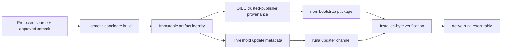
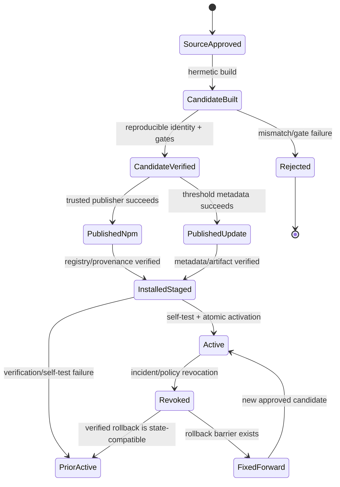
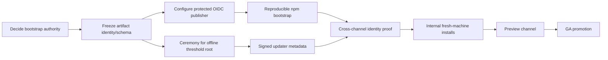

# PRD-043: Bootstrap/Publisher Identity/Update Trust Roots

| Field | Value |
| --- | --- |
| Status | Accepted |
| Owner | Runa release engineering and security |
| Depends on | PRD-002, PRD-003, PRD-006, PRD-027 |
| Constrains | npm, Bun, curl, Homebrew, paru/AUR, `runa update`, rollback and incident response |

Normative terms follow RFC 2119/8174.

## Problem

First GA uses npm as its canonical package publication while npm, Bun, curl,
Homebrew and paru expose installation surfaces and `runa update` requires a
versioned, threshold-signed update trust root. npm installation and the in-product updater
are distinct authorization paths. Green CI, an npm organization name, package
provenance or a valid TUF-style signature alone does not prove that the installed
bytes are the approved Runa CLI candidate.

## Verified facts, decisions and unknowns

Facts observed in this workspace on 2026-08-08:

- `libs/typescript/package.json` names `@runa_laboratories/sdk`, version `0.1.0`.
- That SDK sets the npm registry to `https://registry.npmjs.org`, requests npm
  provenance, runs `prepack`, registry-version preflight, provenance recording/
  verification, pack verification and a broad `quality` script.
- `libs/python/pyproject.toml` names `runa-sdk`, version `0.1.0`, with Runa
  Laboratories as author/maintainer.
- The proposed CLI package and its immutable registry/publisher receipts are not
  present in the reviewed workspace; PRD-028 decides the first-GA package name
  `@runa_laboratories/cli` but that is not publication evidence.

Unknown until registry/API evidence is captured: package existence/version,
dist-tags, organization/team permissions, Trusted Publisher/OIDC binding,
mandatory 2FA, lifecycle scripts in the published tarball, provenance identity,
downloaded digest, revocation procedure and whether npm is the bootstrap trust
authority or merely an artifact carrier. Browser UI appearance SHALL NOT be the
sole evidence for any of these claims.

## Trust and artifact model

```text
ReleaseIdentity = {
  repository, workflow_ref, source_commit, builder_identity,
  environment, approval_receipt, publisher_subject
}

ArtifactIdentity = {
  product, version, platform, archive_digest, payload_digest,
  sbom_digest, provenance_digest, contract_digest, build_recipe_digest
}

UpdateRoot = {
  root_version, threshold, key_ids, roles, expires_at,
  successor_constraints, recovery_authority
}

InstallReceipt = {
  channel, package_name, package_version, registry_digest,
  artifact_identity, publisher_identity, verification_result,
  installed_path, verified_at
}
```



The two paths may converge only on the same immutable artifact identity. If npm
builds or repacks different executable bytes, it is a separate candidate and
requires separate approval/evidence.

Installation surfaces do not multiply release authority. npm and Bun consume
the canonical registry package; the official curl bootstrap, Homebrew formula,
and AUR/paru PKGBUILD are versioned projections generated from an admitted
release envelope. Every projection pins immutable digests, declares its
installer of record, and preserves one support policy. Mutable `main` archives,
repository builds, and unsigned mirror substitution are forbidden.

## Requirements

| ID | Force | EARS requirement | Verification |
| --- | --- | --- | --- |
| R-043-01 | MUST | WHEN a CLI candidate is built, release automation SHALL bind source commit, reviewed workflow, builder identity, dependencies/lockfile, toolchain, contract digest, SBOM, payload/archive digests and approval into one immutable artifact identity. | Reproducibility/receipt test |
| R-043-02 | MUST | npm publication SHALL use a repository/workflow/environment-bound short-lived trusted-publisher identity or an explicitly approved equivalent and SHALL NOT depend on a long-lived npm automation token in repository secrets. | OIDC subject/permission audit |
| R-043-03 | MUST | Publisher authority SHALL be least-privilege, separation-of-duties protected, branch/environment gated and unable to publish an unapproved commit, workflow or package name. | Reduced-authority replay |
| R-043-04 | MUST | WHEN installed through npm, the package SHALL map its registry integrity/provenance to the approved ArtifactIdentity and SHALL perform a network-free self-test before reporting usable. | Fresh-container install test |
| R-043-05 | MUST | The npm package SHALL contain no unnecessary install-time lifecycle script, remote-code bootstrap, mutable URL or repository-controlled hook; any required lifecycle action SHALL be bounded, integrity-verified and explicitly approved. | Published-tarball inspection |
| R-043-06 | MUST | `runa update` SHALL validate threshold-signed root, timestamp, snapshot and target metadata; expiry, monotonic version, channel/platform delegation, artifact digest and publisher/candidate identity SHALL succeed before activation. | TUF attack corpus |
| R-043-07 | MUST | npm bootstrap and updater channels SHALL resolve to one approved artifact identity or SHALL be declared separate candidates with separate compatibility, support and rollback evidence. | Cross-channel digest comparison |
| R-043-08 | MUST | IF provenance, publisher identity, metadata, digest, platform, support policy or candidate identity is missing, stale, revoked or contradictory, THEN installation/update SHALL fail closed and preserve the previous executable where one exists. | Evidence-loss fault schedule |
| R-043-09 | MUST | Root and publisher-key rotation/revocation SHALL require threshold authorization, monotonic versions, bounded overlap and an offline recovery path; no online publisher alone may replace the root of trust. | Compromise recovery rehearsal |
| R-043-10 | MUST | WHEN a compromised/misissued release is discovered, release owners SHALL halt promotion, revoke publisher/root authority as applicable, move/deprecate registry tags without overwriting immutable packages, publish a fixed forward release and preserve evidence. | Incident game day |
| R-043-11 | MUST | The active executable SHALL report version, build/artifact digest, channel, protocol range and verification class; successful command execution alone SHALL NOT imply trusted origin. | Runtime identity comparison |
| R-043-12 | MUST | No SDK package release SHALL silently install, replace or update the CLI, and the CLI SHALL not be bundled into TypeScript/Python SDKs without a new approved artifact/support envelope. | Package-content boundary test |
| R-043-14 | MUST | WHEN npm, Bun, curl, Homebrew or paru publishes or installs a CLI projection, release automation SHALL bind its manifest/script/formula/PKGBUILD revision, immutable source digest, resulting installed identity, channel owner and revocation path to the same approved release envelope. | Cross-installer identity and substitution test |

## State machine



## Threat model and negative controls

Adversaries include compromised developer/publisher accounts, malicious workflow
changes, registry compromise, dependency confusion, stolen npm tokens,
provenance substitution, mutable tags, rollback/freeze attacks, PATH shadowing,
malicious lifecycle scripts and a compromised online update key.

Tests SHALL use the actually downloaded npm tarball and installed executable,
not only the source tree. They cover wrong OIDC repository/ref/environment,
unapproved commit, duplicate version, altered tarball, provenance for different
bytes, dist-tag race, compromised registry metadata, stale timestamp/snapshot,
root threshold loss, wrong platform, killed activation, PATH shadowing,
incompatible durable state and package removal/deprecation.

Mandatory negative controls accept provenance without matching artifact bytes,
publish from a fork/ref with the same workflow name, trust `latest` as identity,
allow one online key to rotate root, and install a tarball with a malicious
postinstall. Every gate MUST reject the seeded defect.

## Cross-platform closure

**R-043-13 (MUST):** WHEN a candidate is installed from the approved npm
channel on Windows, macOS, or Linux, the recovered registry tarball,
provenance, repository/publisher binding, executable identity and supported
Node envelope SHALL resolve to the same immutable candidate. **TC-043-13** runs
clean global install, update, downgrade barrier and uninstall tests on all three
platforms; rebuilding different bytes per OS or trusting only a source checkout
fails admission.

**TC-043-14** recovers every published installer projection, substitutes a
mutable source archive or mismatched digest, and proves that npm/Bun, curl,
Homebrew, and paru either install the approved identity or fail before
activation.

## SDK limits

TypeScript and Python SDK release pipelines remain independent consumer
artifacts. They MAY share policy schemas, provenance verification utilities and
canonical evidence formats, but SHALL NOT share publisher credentials, package
names, mutable release state or install-time CLI behavior. SDK parity for public
API contracts does not authorize coupling their release cadence or trust roots
to the CLI.

## Delivery DAG, rollout, rollback and blockers



Rollback uses only a previously verified artifact when it can read current
durable state. Otherwise promotion halts and recovery is fixed-forward. npm
packages are never overwritten; registry tags are pointers, not artifact
identity. Outstanding update metadata is expired/revoked according to the root
policy, and the incident runbook preserves install receipts.

Hard blockers: unresolved npm-versus-updater authority; no exact published
tarball/provenance evidence; long-lived publisher token; unprotected workflow or
environment; unreproducible bytes; cross-channel digest mismatch; mutable or
unsigned install path; lifecycle-script ambiguity; no offline root/recovery
ceremony; no revocation rehearsal; or inability to identify the active binary.
