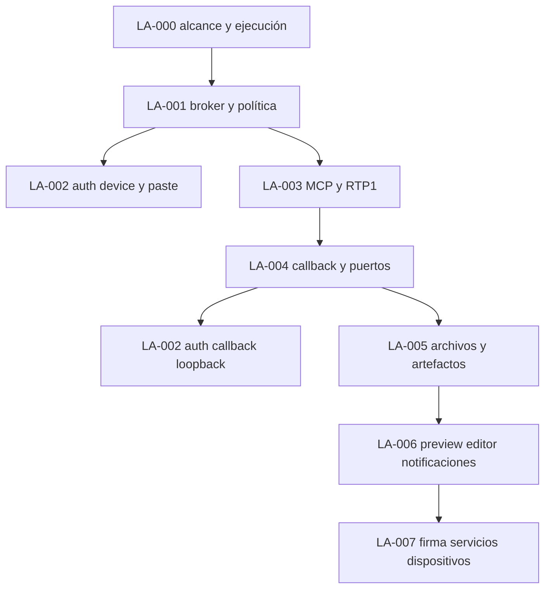
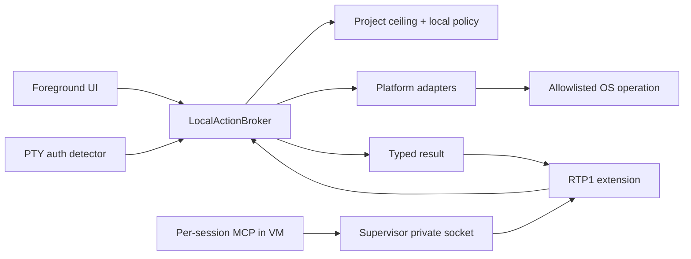
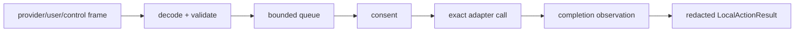
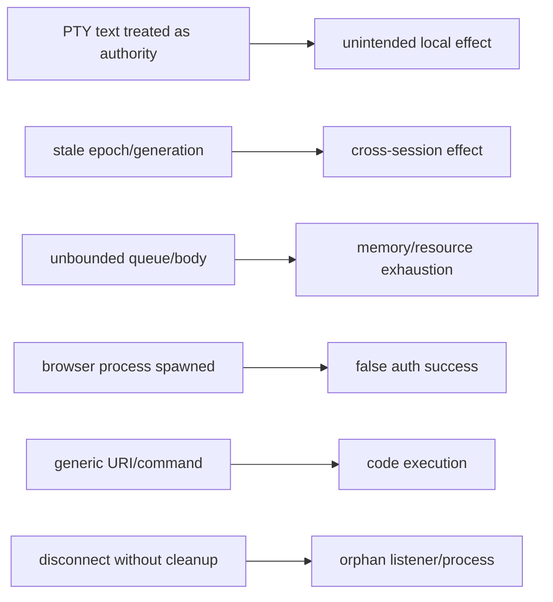

# PRD-LA-000: CUNA Local Actions — índice de ejecución

**Estado:** Ready
**Tipo:** Full engineering PRD / control de alcance
**Objetivo superior:** GOAL_0 — hacer utilizable CUNA CLI como frontend del backend existente.
**Normativa:** Las palabras MUST, MUST NOT, SHALL, SHALL NOT, SHOULD y MAY se interpretan según RFC 2119/8174.

## 1. Problema

El terminal remoto puede mostrar una necesidad local —abrir una URL, presentar un código, seleccionar un archivo o abrir un preview— pero el texto del PTY no constituye autoridad para ejecutar acciones en el equipo del usuario. La implementación actual admite detectores de autenticación acotados para Claude/Codex. OpenCode es distinto: su runtime real elige proveedor y autentica dentro de su TUI remoto mediante `/connect`, seguido de `/models`; no existe un handoff CUNA device/browser para OpenCode. No existe autoridad implícita para una URL, un prompt o un servidor MCP arbitrario.

Sin una frontera explícita, ampliar esa detección produciría dos fallos posibles: una CLI incapaz de completar journeys comunes, o un agente remoto con autoridad local excesiva. El problema central es permitir handoffs concretos sin convertir texto, MCP o la VM en autoridad del dispositivo.

## 2. Objetivos y no-objetivos

### Objetivos

- **G0.1:** El usuario completa acciones locales comunes desde una sesión foreground con consentimiento visible y contexto verificable.
- **G0.2:** Ningún origen remoto obtiene más autoridad que la intersección de política, decisión humana e identidad viva.
- **G0.3:** Las capacidades funcionan mediante contratos uniformes en Windows, macOS y Linux, con evidencia runtime sólo donde exista host real.
- **G0.4:** Claude y Codex son funcionales mediante sus topologías locales acotadas. OpenCode queda habilitado como attach de TUI remoto: el usuario usa `/connect` para elegir/autenticar proveedor y `/models` para elegir modelo. El broker local expone cero acciones OpenCode y nunca abre browser, device UI, callback, paste, archivos, puertos ni otra acción local por OpenCode.

### No-objetivos / DoNotBuild

La iniciativa SHALL NOT construir shell local arbitrario, control general del navegador, lectura de clipboard, lectura de keychain, sincronización de archivos de autenticación, forwarding de agentes SSH/GPG, acceso al socket Docker, SOCKS/VPN genérico, filesystem irrestricto, aplicación/URI arbitrarios, captura de pantalla, apertura automática de descargas, daemon persistente, CI, staging, publicación npm o maquinaria de release.

## 3. Suite y DAG de dependencias



Un orden topológico de ejecución es `000, 001, [002-device|003], 004, 002-loopback, 005, 006, 007`. Sólo el detector/paste/device-code de LA-002 MAY ejecutarse en paralelo con LA-003; el callback loopback de Codex MUST esperar LA-004. Este orden no altera la numeración documental. Ningún PRD derivado puede redefinir la autoridad de LA-001.

Dependency graph de repositorios/servicios: `cuna-cli(local broker, UI, adapters) → edge terminal-gateway → agent-session supervisor → per-session MCP`; `Supabase schema/RPC → edge`; `provider CLI → per-session MCP`; `PlatformAdapter → OS allowlists`. No existe arista `provider/VM → OS local`.

Execution DAG: `validate envelope → prove live identity → enqueue → interactive decision → acquire exact resource → execute adapter → mark effect commit → observe/cache outcome → send → ACK → release`. Un outcome post-commit permanece en el cache foreground bajo `(requestId,argumentsDigest,identity)` y se retransmite sin reejecutar hasta el ACK exacto, expiry o fencing de la identidad. `detach` puede cancelar sólo antes de effect commit; después de commit conserva ese outcome o termina `outcome_unknown_nonretryable`.

## 4. Requisitos EARS globales

| ID | Requisito EARS | Fuerza | Goal |
|---|---|---:|---|
| R0.1 | El programa SHALL tratar toda solicitud remota como datos sin autoridad local. | MUST | G0.2 |
| R0.2 | WHEN una acción local sea solicitada, el broker SHALL verificar tipo, identidad viva, policy ceiling, política local y decisión humana antes del efecto. | MUST | G0.1, G0.2 |
| R0.3 | IF cambia epoch, attachment generation o sesión, THEN el broker SHALL cancelar solicitudes y grants ligados a la identidad anterior. | MUST | G0.2 |
| R0.4 | WHERE una capacidad no esté implementada por el adaptador del SO, la CLI SHALL declararla `unsupported` antes de cualquier efecto. | MUST | G0.3 |
| R0.5 | WHERE el proveedor sea OpenCode, la CLI SHALL adjuntar el terminal remoto y mostrar la guía `/connect` seguido de `/models`; SHALL exponer cero `LocalActionKind` para OpenCode y SHALL rechazar todo request/frame OpenCode antes de cola, consentimiento, adaptador, browser o cualquier otro efecto local. Un estado de auth OpenCode SHALL provenir sólo de una observación remota privada de la sesión exacta, nunca de texto PTY ni de una acción local. | MUST | G0.4 |
| R0.6 | El trabajo SHALL preservar el protocolo RTP1 desplegado para peers que no negocien la extensión. | MUST | G0.1 |
| R0.7 | La suite SHALL NOT introducir ninguno de los elementos DoNotBuild. | MUST | G0.2 |
| R0.8 | WHEN `cuna` se ejecute sin comando en un TTY autenticado, THEN SHALL pintar `Finding a machine or AgentSession` antes de la primera lectura de inventario y SHALL NOT afirmar que adjunta antes de una selección explícita. | MUST | G0.1 |
| R0.9 | WHEN la capacidad de crear AgentSession no sea fresca y verificable, THEN SHALL mostrar que la capacidad no puede verificarse y SHALL NOT ofrecer `New session` ni `Create machine` por inferencia; una sesión existente confirmada seguirá siendo seleccionable explícitamente. | MUST | G0.1, G0.2 |
| R0.10 | WHEN una persona seleccione una Machine, THEN Enter/Right SHALL abrir sólo el contexto de esa Machine; SHALL NOT adjuntar una AgentSession por ser única. El attach SHALL requerir elegir una sesión concreta. | MUST | G0.1, G0.2 |
| R0.11 | WHEN Ctrl-C ocurra durante discovery, capability, selector o attach, THEN SHALL abortar trabajo pendiente, mostrar `Closing…`, restaurar el terminal y devolver el prompt con una sola pulsación. | MUST | G0.1 |
| R0.12 | WHILE el selector root no haya recibido una acción humana confirmada, THEN SHALL ejecutar sólo lecturas y SHALL NOT crear/iniciar/detener una Machine, crear una AgentSession ni crear una conexión de terminal. | MUST | G0.2 |

## 5. Arquitectura verificable

### 5.1 Dependency y call graph



El MCP remoto sólo llama al supervisor; no puede llamar al SO local. El CLI es el único proceso con adaptadores locales.

### 5.2 Dataflow y event graph



Eventos: `request.detected → request.validated → request.queued → consent.decided → effect.started → effect.committed? → completion.observed → result.cached → result.sent → result.acked`. Antes de `effect.committed`, `identity.changed`, `expired`, `interrupt` o `detach` causa `request.cancelled`. Después de commit, nunca se finge cancelación: se conserva/retransmite el outcome con el mismo `(requestId,argumentsDigest,identity)` hasta ACK exacto, expiry o fencing; si no se conserva un outcome verificable se produce `outcome_unknown_nonretryable`, y después ocurre cleanup.

### 5.3 CFG global

```text
receive
 ├─ malformed/unknown/disallowed ─> reject(no effect)
 └─ valid ─> identity live?
      ├─ no ─> cancel
      └─ yes ─> effective permission?
           ├─ no ─> deny
           └─ yes ─> needs consent?
                ├─ denied/timeout ─> deny|expire
                └─ approved ─> execute exact adapter
                     ├─ completed ─> observe ─> succeed
                     └─ error/interrupt ─> effect committed?
                          ├─ no ─> cleanup ─> fail|cancel
                          └─ yes ─> observe/cache or fail[outcome_unknown_nonretryable]
```

### 5.4 Causal graph de fallos



Los PRDs hijos rompen cada arista causal mediante validación tipada, fencing, cotas, observación real, allowlists y cleanup.

## 6. Modelos de concurrencia y planificación

### Petri net

`PN=(P,T,F,W,M0)` con `P={request_state[r,s],queue_free,consent_free,prompting,resource_free[k],owned[r,k],result_cache[r]}` y `T={validate,enqueue,prompt,approve,deny,acquire,commit,observe,fail_before_commit,cancel_before_commit,expire_before_commit,unknown_after_commit,send,ack,cleanup}`. `F` contiene las aristas de pre/post-condición: `enqueue: validated+queue_free→queued`, `prompt: queued+consent_free→pending_user+prompting`, `approve: pending_user+prompting→approved+consent_free`, `acquire: approved+resource_free[k]→executing+owned[r,k]`, `commit: executing→committed`, `cancel|expire_before_commit` conserva ausencia de `owned` o lo devuelve si fue adquirido, `observe|unknown_after_commit` produce un único `result_cache[r]`, `ack` consume ese cache y `cleanup` devuelve únicamente tokens realmente poseídos. Todos los pesos `W=1`; `M0(queue_free)=Q_MAX`, `M0(consent_free)=1`, `M0(prompting)=0`, `M0(resource_free[k])=capacity(k)` y cada request tiene exactamente un token en `detected`. P-invariantes: `consent_free+prompting=1`, `resource_free[k]+Σr owned[r,k]=capacity(k)` y la suma de estados lifecycle es 1 por request. `result_count<=1` y “un ACK sólo consume su mismo cache” son propiedades de seguridad, no P-invariantes.

### Behavior tree de recuperación

```text
Selector(
  Sequence(identityLive, policyAllows, consentObtained, execute, markCommit, observe),
  Sequence(notCommitted, cleanup, returnCancelledOrTypedFailure),
  Sequence(committed, retryableAndIdempotent, retryOnce, observe),
  Sequence(committed, cacheKnownOutcomeOrReturnUnknownNonretryable, cleanup)
)
```

### HTN

```text
DeliverLocalActions
  -> EstablishAuthority(LA-001)
  -> Parallel[
       ClaudePasteAndCodexDevice(LA-002-device),
       Sequence(StructuredTransport(LA-003),
                 CallbackAndPorts(LA-004),
                 ProviderAuthLoopback(LA-002-loopback),
                 FilesAndArtifacts(LA-005),
                PresentationHandoffs(LA-006),
                SensitiveBoundedActions(LA-007))
     ]
  -> VerifyEachRequirementLocally
```

## 7. CSP/SMT y lógica temporal

Variables: request `r`, session `s`, device `d`, capability `k`, identity tuple lógico `i=(user,machine,workspaceBinding,workspaceBindingGeneration,session,processEpoch,attachmentGeneration)`. En el contrato TypeScript actual, `attachmentGeneration` se serializa como `fencingGeneration`; esta equivalencia semántica SHALL permanecer explícita hasta que el nombre wire sea definitivo.

```text
Effect(r) => Valid(r) ∧ Live(i_r) ∧ ProjectAllows(k_r)
             ∧ DeviceAllows(d_r,k_r) ∧ UserApproved(r)
∀ r1≠r2: exclusive(r1,r2) => ¬(Executing(r1) ∧ Executing(r2))
∀ r: exactlyOneTerminalState(r)
QueueSize <= Q_MAX
StreamBytes <= STREAM_MAX ∧ PayloadBytes <= PAYLOAD_MAX
Stale(i) <=> !Live(i)
Owns(r,x) => Session(x)=Session(r) ∧ Identity(x)=i_r
Exists r: Valid(r) ∧ Live(i_r) ∧ UserApproved(r) ∧ Effect(r)
```

El modelo SMT SHALL resultar UNSAT al añadir cualquiera de estas metas adversarias: `Effect ∧ ¬UserApproved`, `Effect ∧ staleIdentity`, dos consumidores del mismo token exclusivo o un resultado perteneciente a otra sesión.

Propiedades LTL/CTL:

- `G(Effect(r) -> Approved(r) ∧ Live(identity(r)))`.
- `G(Queued(r) -> F Terminal(r))`, bajo fairness del consumidor.
- `G(IdentityChanged(i) -> G !EffectBoundTo(i))`.
- `G(Interrupt -> F(RestoredTerminal ∧ NoOwnedResources))`.
- `AG(Recoverable -> AF Idle)` bajo fairness explícita del consumidor y del cleanup.
- `G(OpenCodeLocalActionFrame(r) -> F(RejectedBeforeQueue(r) ∧ ¬Effect(r)))`.
- `G(OpenCodePtyOutput -> ¬LocalBrowserOrDeviceEffect)`.
- `G(RootUnselected -> ¬RemoteMutation ∧ ¬TerminalAttach)`.
- `G(CapacityUnverified -> ¬OfferCreate ∧ ¬OfferNewSession)`.
- `G(MachineEnter -> X(MachineContext) ∧ ¬Attach)`.
- `G(SIGINT -> F(TerminalRestored ∧ ¬PostAbortMutation))`.

### Bounded model checking

El explorador ejecutable `scripts/model-check-local-actions.mjs` cubre 3 requests, un contador abstracto de 2 reconnects, cola 3 y 2 recursos exclusivos. `npm run model-check:local-actions` exploró 97,941 estados y 429,092 transiciones sin violaciones para aprobación previa, prompt único, capacidad, resultado único, cache abstracto de outcome, semántica post-commit y cleanup; además establece `EF Terminal` desde cada estado alcanzable. No modela fairness/`AF`, identidad o retransmisión durante reconnect, una cuarta solicitud/overflow, múltiples sesiones ni las prohibiciones DoNotBuild. Fragmentación/reorder RTP conserva su modelo específico planeado en LA-003.

## 8. Aceptación global

- **Given** un request sin identidad viva, **When** llega al broker, **Then** no ocurre efecto y se devuelve fallo seguro.
- **Given** dos requests simultáneos, **When** ambos requieren consentimiento, **Then** sólo uno se muestra y ambos terminan o expiran.
- **Given** un peer RTP1 sin opt-in, **When** se conecta, **Then** conserva el comportamiento de terminal existente.
- **Given** Ctrl-C en cualquier estado foreground, **When** se procesa, **Then** se muestra `Closing…`, se limpian recursos y vuelve el prompt.
- **Given** un terminal OpenCode adjunto, **When** el usuario necesita elegir proveedor, **Then** la CLI muestra `/connect`, seguido de `/models`, dentro del TUI remoto y no abre un browser o UI de dispositivo local.
- **Given** cualquier request/frame local atribuido a OpenCode, **When** llega al foreground, **Then** se rechaza antes de cola, consentimiento, broker o adaptador y nunca declara autenticación.

## 9. Trazabilidad

| Goal | Requirement | Diseño | Tarea | Test |
|---|---|---|---|---|
| G0.1 | R0.2, R0.6 | Broker + RTP opt-in | LA-001/003 | TC-000-01/02 |
| G0.2 | R0.1, R0.3, R0.7 | Policy/fencing/DoNotBuild | LA-001/007 | TC-000-03/04 |
| G0.3 | R0.4 | PlatformAdapter | LA-005/006/007 | TC-000-05 |
| G0.4 | R0.5 | registry sin actions OpenCode + guía de attach TUI | LA-002/003 | `test/local-action-broker.test.mjs`, `test/terminal-foreground.test.mjs`, `test/progressive-command-disclosure.test.mjs` |
| G0.1, G0.2 | R0.8–R0.12 | selector root read-only, capacidad explícita y attach por sesión | CLI explorer / foreground | `test/machines-explorer.test.mjs`, `test/root-journey.test.mjs`, `test/cli.test.mjs` |

Oracles ejecutables: `TC-000-01/03 = npm run model-check:local-actions` sólo para las invariantes acotadas declaradas; `TC-000-02 = test/terminal-local-action-protocol.test.mjs`; `TC-000-05 = test/local-file-transfers.test.mjs + scripts/test-windows-conpty.mjs`; la evidencia de R0.5 es `test/local-action-broker.test.mjs`, `test/local-browser-action.test.mjs`, `test/terminal-foreground.test.mjs` y `test/progressive-command-disclosure.test.mjs`. `TC-000-04` (fairness/liveness fuerte) y cada ID no listado aquí permanecen `PLANNED`, no evidencia.

## 10. Riesgos, supuestos y calidad

- **Riesgo:** el productor remoto no soporte la extensión; mitigación: negociación fail-closed y compatibilidad PTY sólo para auth conocida.
- **Riesgo:** el `workspace_generation` string actual del supervisor representa machine version, no WorkspaceBinding generation; mitigación: LA-003 exige campos no ambiguos y bloquea acciones MCP de workspace hasta probarlos.
- **Riesgo:** comportamiento macOS no probado; mitigación: marcarlo `contract-tested`, nunca `runtime-verified`.
- **Supuesto:** el broker vive únicamente durante el proceso foreground; no hay notificaciones o acciones tras detach.
- **Restricción:** los cambios de Infra son dependencia de LA-003/004, no autoridad para relajar política local.

Puntuación re-auditada: claridad 2, completitud 2, consistencia 2, verificabilidad 1, factibilidad 1, trazabilidad 2, problem-first 2, no-goals 2, métricas 1 = **15/18**. El punto perdido de verificabilidad reconoce que SMT, fairness y BMC específicos siguen planeados; el score no afirma cierre productivo de LA-003–007.
