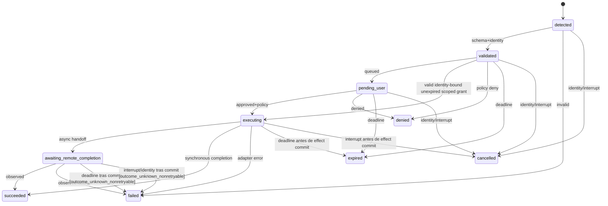

# PRD-LA-001: Broker foreground y autoridad local

**Estado:** Ready
**Depende de:** LA-000
**Normativa:** RFC 2119/8174.

## Problema y evidencia

La CLI sólo posee un tipo `LocalBrowserActionRequest` acoplado a auth y mantiene una única solicitud de browser en el foreground. No existe una máquina de estados común, deduplicación general, política de dispositivo ni resultado tipado. Extender directamente ese código haría que cada capacidad invente su propio consentimiento y fencing.

## Objetivos

- **G1.1:** una frontera común decide toda acción local.
- **G1.2:** un request remoto nunca equivale a permiso.
- **G1.3:** concurrencia, cancelación y cleanup son deterministas y acotados.

## No-objetivos

No daemon, policy remota autoritativa, grants secretos persistentes, aprobación por terminal text, ejecución shell, browser control, lectura de clipboard/keychain ni filesystem general.

## Interfaces públicas

```ts
type LocalActionState =
  | "detected" | "validated" | "pending_user" | "executing"
  | "awaiting_remote_completion" | "succeeded" | "failed"
  | "denied" | "expired" | "cancelled";

interface LocalActionSessionIdentity {
  readonly userId: string; readonly deviceId: string; readonly machineId: string;
  readonly workspaceBindingId: string | null; readonly workspaceBindingGeneration: number | null;
  readonly agentSessionId: string; readonly processEpoch: string; readonly fencingGeneration: number;
}

interface LocalActionRequest<K extends LocalActionKind = LocalActionKind> {
  readonly version: 1; readonly id: string; readonly identity: LocalActionSessionIdentity;
  readonly provider: "claude-code" | "codex" | "opencode"; readonly kind: K;
  readonly arguments: Readonly<Record<string, LocalActionArgument>>;
  readonly argumentsDigest: `sha256:${string}`; readonly requestedScope: string;
  readonly createdAt: number; readonly expiresAt: number; readonly nonce: string;
}

interface LocalActionResult<K extends LocalActionKind = LocalActionKind> {
  readonly version: 1; readonly requestId: string; readonly kind: K;
  readonly identity: LocalActionSessionIdentity;
  readonly status: "succeeded" | "failed" | "denied" | "expired" | "cancelled";
  readonly safeData?: Readonly<Record<string, LocalActionArgument>>;
  readonly safeReason?: LocalActionSafeReason; readonly completedAt: number;
}
```

`LocalActionKind` es una unión cerrada definida por los PRDs 002–007. Payloads SHALL rechazar propiedades desconocidas en fronteras de red. `argumentsDigest` SHALL ser SHA-256 de la serialización canónica del tipo validado. Los timestamps numéricos son epoch milliseconds.

La única fuente normativa del mapa cerrado `kind → args keys → success keys` es `src/local-actions/schemas.ts`; este PRD no mantiene una copia divergente. En síntesis: `browser.open:url`; `auth.device.present:verificationUri,userCode` sólo para Codex; `auth.callback.relay:provider,localPath,expectedStateDigest,expectedNonceDigest,exactLocalPort,remoteLoopbackPort,deadlineMs`; `auth.result.observe:{}`; `clipboard.write:text`; `port.forward:remoteHost,remotePort,requestedLocalPort,purpose,deadlineMs`; `file.select:purpose,accept,multiple,maximumFiles,maximumTotalBytes`; `attachment.import:opaqueId,expectedSha256`; `artifact.save:remoteArtifactId,expectedSha256,suggestedName,maximumBytes`; `preview.open:source,mediaType`; `diff.open:leftArtifactId,rightArtifactId,expectedDigests`; `editor.open:editor,connectionDescriptorId,workspaceBindingId,workspaceBindingGeneration`; `notification.show:category,title,body,focusRequestId`; `git.sign:objectType,canonicalPayloadBase64url,decodedLength,payloadSha256,keySelectorId`; `local_service.request:registrationId,operationId,bodyEncoding,body,decodedLength,bodySha256`; `device.select:deviceClass,purpose,requestedMetadata`. `opencode` permanece en el tipo de proveedor sólo para mantener el binding de sesión y el attach; su registry contiene cero kinds. Su estado de auth, si el supervisor puede observarlo, es remoto, privado y nunca concede un efecto de dispositivo ni transmite credenciales al broker.

Los `safeReason` emitibles por el cliente son una unión cerrada: `unsupported|denied_by_policy|denied_by_user|stale_identity|cancelled_by_foreground|foreground_stopped|terminal_detached|terminal_binding_changed|user_interrupt|execution_timeout|request_expired|adapter_failed|browser_open_failed|rate_limited|local_client_unavailable|outcome_unknown_nonretryable`. Un valor fuera de esta unión MUST fallar validación antes del wire.

La compatibilidad actual mapea `LocalBrowserActionRequest.state="pending_permission"` a `pending_user`; no cambia el detector en silencio. `processEpoch` y `fencingGeneration` reutilizan el fencing terminal existente; `fencingGeneration` representa la generación del attachment, no la del workspace. El par `workspaceBindingId/workspaceBindingGeneration` MAY ser `null/null` sólo mientras LA-003 no haya probado esa identidad; toda acción dependiente del workspace SHALL rechazarse en ese caso.

La política efectiva es:

```text
EffectivePermission(r) = ProjectRequestCeiling(r.kind)
                       ∧ LocalDevicePolicy(r.kind)
                       ∧ InteractiveUserDecision(r)
                       ∧ LiveSessionIdentity(r.identity)
```

`local-actions.json` vive bajo `PlatformAdapter.paths.configDirectory`; almacena sólo preferencias no secretas y límites más restrictivos. `.cuna` es únicamente un ceiling declarativo y jamás aumenta permisos.

## Requisitos EARS

| ID | Requisito | Fuerza | Goal |
|---|---|---:|---|
| R1.1 | WHEN se detecta un request, el broker SHALL validarlo antes de encolarlo. | MUST | G1.1 |
| R1.2 | WHEN un request alcanza la cabeza de la cola, el broker SHALL calcular `EffectivePermission` y mostrar como máximo una tarjeta de consentimiento. | MUST | G1.2, G1.3 |
| R1.3 | IF cualquier término de `EffectivePermission` es falso, THEN el broker SHALL terminar sin invocar un adaptador. | MUST | G1.2 |
| R1.4 | IF cambia cualquier campo de identidad, THEN el broker SHALL cancelar requests y grants ligados a la identidad previa. | MUST | G1.2 |
| R1.5 | WHILE un request está `executing`, el broker SHALL NOT volver a ejecutarlo con el mismo `id` y `argumentsDigest`. | MUST | G1.3 |
| R1.6 | WHEN el usuario pulsa Ctrl-C, el broker SHALL iniciar cleanup, renderizar `Closing…`, restaurar el terminal y terminar. | MUST | G1.3 |
| R1.7 | IF la cola está llena o el payload excede su cota, THEN el broker SHALL rechazarlo sin retener sus argumentos. | MUST | G1.3 |
| R1.8 | El broker SHALL redactar URL query, códigos, paths completos, clipboard, cuerpos y credenciales de todo mensaje seguro. | MUST | G1.2 |
| R1.9 | WHEN un efecto se compromete y produce un resultado, el broker SHALL conservarlo en un cache foreground acotado bajo `(requestId,argumentsDigest,identity)`, retransmitirlo sin reejecutar sólo tras una identidad nuevamente válida, y eliminarlo sólo con ACK exacto, expiry o fencing de esa identidad. | MUST | G1.2,G1.3 |
| R1.10 | WHERE el proveedor sea OpenCode, el broker SHALL rechazar todo `LocalActionRequest` antes de cola, consentimiento y adaptador; la CLI SHALL mantener sólo el attach de TUI remoto y no mostrará una tarjeta de consentimiento local. | MUST | G1.2 |

## State machine y CFG



Transiciones no listadas son ilegales. Los estados terminales no tienen salidas. `effectCommit∈{not_started,committed}` es monotónico: después de `committed`, cancel/expiry nunca se reportan como si el efecto no hubiese ocurrido. El CFG es `decode → validate → dedupe → fence → enqueue → recompute-policy → consent → acquire → execute → mark-commit → observe/cache → send/retransmit → exact-ACK|expiry|fence → cleanup` con ramas fail-closed en cada guard.

## Petri net, CSP y temporal logic

Plazas: `queue_free`, `queued`, `consent_free`, `prompting`, `adapter_free[k]`, `adapter_owned[k]`, estados lifecycle y `result_cache`. `enqueue` consume `queue_free`; `show` mueve un token `queued→prompting` y consume `consent_free`; `decide` devuelve `consent_free`; `acquire` consume `adapter_free[k]`; `finish` devuelve adapter sólo cuando existe `adapter_owned[k]`; `cancel` pre-adquisición no toca adapters. `ack` consume `result_cache`. Las aristas son exactamente esas pre/post-condiciones y todos sus pesos son uno salvo las capacidades iniciales.

Restricciones:

```text
0 <= queued <= Q_MAX
pending_user <= 1
∀id: executingCopies(id) <= 1
Effect(r) => live(r.identity) ∧ approved(r) ∧ policyAllows(r)
terminal(r) => ownedResources(r)=0
```

LTL: `G(Executing(r) -> ApprovedLatched(r))`, `G(identityChanged(i) -> F terminalRequestsBoundTo(i))`, `G(cancelled(r) -> G !effectCommitted(r))`, `G(interrupt(f) -> F terminalRestored(f))`, `G(queued(r) -> F terminalState(r))` bajo fairness, `G(ResultCached(r) ∧ ¬ExactAck(r) -> (ResultCached(r) U (ExactAck(r) ∨ Expired(r) ∨ Fenced(r))))`, y `G(Retransmit(r) -> SameRequestDigestIdentity(r) ∧ ¬Reexecute(r))`. CTL: `AG(Recoverable(r) -> AF Idle(r))` bajo fairness explícita.

P-invariantes: `consent_free + prompting = 1`; `adapter_free[k] + adapter_owned[k] = capacity(k)`; para cada request, la suma de sus estados lifecycle es 1. `result_count(request) <= 1` es una propiedad de seguridad, no un P-invariante.

Exploración acotada ejecutada por `npm run model-check:local-actions`: 3 requests, contador abstracto de 2 reconnects, cola 3 y 2 recursos; 97,941 estados y 429,092 transiciones; cero violaciones para las invariantes codificadas. Prueba únicamente seguridad acotada y `EF Terminal` desde cada estado alcanzable. No modela fairness/`AF`, identidad de reconnect, retransmisión RTP ni overflow por una cuarta solicitud.

## Aceptación

- **Given** una policy `.cuna` permisiva y política local denegada, **When** llega el request, **Then** no hay efecto.
- **Given** tres requests simultáneos, **When** se renderizan, **Then** sólo uno solicita consentimiento y el orden es FIFO.
- **Given** un request aprobado, **When** cambia el process epoch antes del efecto, **Then** queda `cancelled`.
- **Given** el mismo ID y digest duplicado, **When** el primero ejecuta, **Then** el segundo no ejecuta.
- **Given** un resultado post-commit sin ACK, **When** la misma identidad se reatacha, **Then** se retransmite el mismo resultado sin repetir el efecto; un ACK distinto, expiry o fencing no puede consumir el resultado de otra identidad.
- **Given** Ctrl-C durante consentimiento o efecto, **When** cleanup termina, **Then** el prompt vuelve tras un único interrupt.
- **Given** un request `auth.device.present` o `browser.open` atribuido a OpenCode, **When** llega al broker, **Then** no se encola, no se abre browser/device UI y no se muestra consentimiento.

## Trazabilidad

| Goal | Req | Diseño | Tarea | Test |
|---|---|---|---|---|
| G1.1 | R1.1–R1.2 | tipos + broker | T1-types, T1-broker | TC1-schema, TC1-queue |
| G1.2 | R1.3–R1.4, R1.8, R1.10 | policy/fence/redactor + registry sin kinds OpenCode | T1-policy | TC1-deny, TC1-fence, TC1-redact, `test/local-action-broker.test.mjs` |
| G1.3 | R1.5–R1.7,R1.9 | dedupe/cache-ACK/cleanup/cotas | T1-lifecycle | TC1-race, TC1-result-cache, TC1-ctrlc, TC1-bounds |

## Riesgos y calidad

El principal riesgo es que la configuración local sea confundida con un vault; el parser SHALL aceptar sólo booleans, allowlists y cotas, nunca secretos. Valores iniciales de cotas quedan como constantes internas y se fijarán mediante tests de borde, no como política remota.

Puntuación re-auditada: 2+2+2+2+1+1+2+2+1 = **15/18**. La factibilidad y trazabilidad pierden un punto hasta que todos los adaptadores anunciados tengan wiring foreground real.
