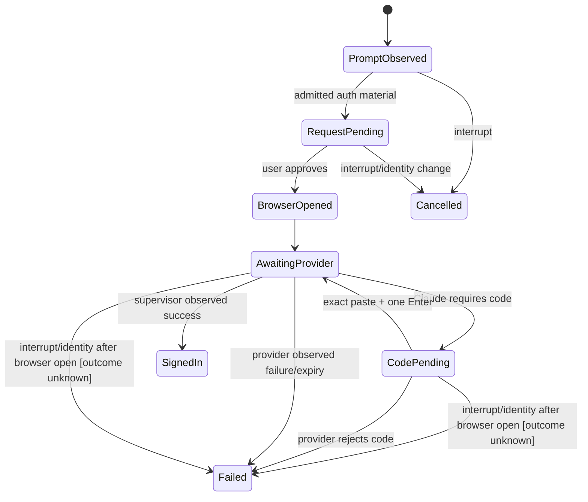

# PRD-LA-002: Handoffs de autenticación de proveedores

**Estado:** Ready
**Depende de:** LA-001; el subflujo Codex loopback depende además de LA-004
**Normativa:** RFC 2119/8174.

## Problema

Claude y Codex poseen topologías de login distintas. El checkout actual detecta URLs admitidas en bytes del PTY y puede abrirlas, pero `spawn` del navegador no prueba login, el guard de paste está acoplado a URL y OpenCode no pertenece al tipo `BrowserActionProvider`. Los errores observados incluyen paste fragmentado, códigos inválidos y estados visuales que confunden “browser abierto” con “signed in”.

## Objetivos

- **G2.1:** completar Claude y Codex sin perder, duplicar o revelar bytes de autenticación.
- **G2.2:** representar cada topología mediante un registry verificable, no ramas dispersas.
- **G2.3:** preparar OpenCode sin superar su gate ni producir efectos.

## No-objetivos

No almacenar credenciales del proveedor en CUNA, leer keychains, sincronizar auth files, automatizar browser control, asumir éxito por abrir una URL ni habilitar OpenCode.

## Diseño e interfaces

```ts
type ProviderId = "claude-code" | "codex" | "opencode";
type AuthTopology = "browser_paste_code" | "device_code" | "loopback_callback" | "provider_defined";

interface ProviderAuthDescriptor {
  provider: ProviderId;
  enabled: boolean;
  topologies: readonly AuthTopology[];
  admittedOrigins: readonly string[];
  completionProbe: "supervisor_observation";
}
```

Registry inicial:

| Provider | Estado | Topología |
|---|---|---|
| Claude | enabled | browser + paste code |
| Codex | enabled | device code; loopback callback sólo mediante LA-004 |
| OpenCode | disabled | descriptores configurables, sin action handler |

El detector PTY es un `provider_adapter` de compatibilidad, no un parser general de instrucciones. Las URLs se admiten por HTTPS, hostname y path exactos. `CapturedCodeBytes` se define como el input opaco tras retirar únicamente el framing completo de bracketed paste y los CR, LF o CRLF terminales; el interior se preserva byte por byte incluso si no es UTF-8. El commit transmite `CapturedCodeBytes || 0x0d` exactamente una vez. El guard actual sólo bloquea paste de URL y deberá ampliarse: no constituye hoy un capturador completo de código.

## Requisitos EARS

| ID | Requisito | Fuerza | Goal |
|---|---|---:|---|
| R2.1 | WHEN el PTY emite una URL de auth conocida y admitida, el adaptador SHALL producir `browser.open` ligado a la identidad terminal actual. | MUST | G2.1 |
| R2.2 | IF una URL no coincide exactamente con el descriptor del proveedor, THEN el adaptador SHALL dejarla como texto y SHALL NOT abrirla. | MUST | G2.1 |
| R2.3 | WHEN el usuario pega un código Claude, la CLI SHALL preservar los bytes del código y SHALL enviar exactamente un Enter. | MUST | G2.1 |
| R2.4 | WHEN se abre el navegador, el estado SHALL ser `awaiting_remote_completion`, no `succeeded`. | MUST | G2.1 |
| R2.5 | WHEN el supervisor prueba éxito o fallo mediante una acción fija de provider status, `auth.result.observe` SHALL publicar únicamente ese resultado observado; texto PTY jamás prueba `SignedIn`. | MUST | G2.1, G2.2 |
| R2.6 | WHERE Codex presenta device code, la CLI SHALL mostrar código, URL, expiración y acción de copiar sin leer el clipboard. | MUST | G2.1 |
| R2.7 | WHILE el gate de OpenCode esté cerrado, el registry SHALL devolver `enabled:false` y SHALL NOT registrar handlers ejecutables. | MUST | G2.3 |
| R2.8 | IF Ctrl-C ocurre durante auth, THEN la CLI SHALL cancelar el handoff sin consumir ni repetir input pendiente. | MUST | G2.1 |

## State machine, event/dataflow graph



```text
PTY bytes -> incremental detector -> admitted descriptor -> broker request
user approval -> OS browser opener -> provider flow -> PTY/supervisor observation
opaque user bytes -> paste guard -> PTY input -> provider result -> redacted UI
```

La precedencia de eventos SHALL ser `prompt < request < approval < open < observation < terminal-result`; los eventos pueden fragmentarse, pero no reordenarse por request.

Refinamiento hacia LA-001: `PromptObserved→detected`, `RequestPending→validated|pending_user`, `BrowserOpened→executing(effectCommit=committed)`, `AwaitingProvider|CodePending→awaiting_remote_completion`, `SignedIn→succeeded`, `Failed→failed`, `Cancelled→cancelled` sólo antes de commit; después de abrir el navegador, interrupt/expiry sin observación se refina a `failed(outcome_unknown_nonretryable)`.

## Causal y formal

- URL copiada como auth code → `Invalid code`; mitigación: guard exacto del URL y modo explícito de captura del código.
- browser spawn o texto PTY → falso “Signed in”; mitigación: estado awaiting + observación del supervisor.
- input fragmentado/Enter duplicado → código inválido; mitigación: acumulador byte-preserving y único commit.
- prompt viejo tras reconnect → acción cruzada; mitigación: identity fencing de LA-001.

LTL:

- `G(BrowserOpened -> F(SignedIn ∨ Failed))`; interrupt/expiry sin observación produce `Failed(outcome_unknown_nonretryable)`, nunca cancel/expired post-commit.
- `G(SignedIn -> SupervisorSuccessObserved)`.
- `G(CodeCommitted(r,n) -> ForwardedBytes(r,n)=CapturedCodeBytes(r,n)||0x0d)`.
- `G(OpenCodeGateClosed -> !OpenCodeHandlerRegistered)`.
- `G(UnadmittedUrl -> !BrowserEffect)`.

Plan de bounded model checking —no ejecutado todavía—: URL/paste dividido en 1–16 chunks; CR, LF y CRLF terminales; marcadores de bracketed paste parciales; UTF-8 inválido/opaco; dos prompts repetidos; reconnect; Enter incrustado; expiry; y Ctrl-C antes, durante y después de captura. Las metas adversarias que el modelo SHALL volver UNSAT son `SignedIn ∧ ¬SupervisorSuccessObserved` y `ForwardedBytes ≠ CapturedCodeBytes||0x0d`; no se afirma ese resultado sin artefacto y ejecución reproducibles.

## Aceptación

- **Given** un URL Claude válido dividido byte a byte, **When** termina de llegar, **Then** se crea un único request.
- **Given** el URL de auth pegado en el prompt de código, **When** el guard lo reconoce, **Then** ningún byte del URL llega al proveedor.
- **Given** un código largo válido, **When** se pega, **Then** el proveedor recibe exactamente sus bytes y un Enter.
- **Given** Codex device auth, **When** el navegador abre, **Then** la UI continúa en `Waiting for Codex sign-in…`.
- **Given** OpenCode deshabilitado, **When** aparece texto semejante a un prompt, **Then** no se crea una acción.
- **Given** Ctrl-C, **When** hay un código parcial, **Then** se descarta y el terminal se restaura.

## Trazabilidad

| Goal | Req | Diseño | Tarea | Test |
|---|---|---|---|---|
| G2.1 | R2.1–R2.6, R2.8 | adapters + paste guard + observer | T2-auth | TC2-fragment, TC2-paste, TC2-device, TC2-cancel |
| G2.2 | R2.2, R2.5 | descriptor registry | T2-registry | TC2-origin, TC2-observe |
| G2.3 | R2.7 | existing feature gate | T2-opencode | TC2-opencode-deny |

## Calidad

Puntuación re-auditada: claridad 2, completitud 2, consistencia 2, verificabilidad 2, factibilidad 1, trazabilidad 1, problem-first 2, no-goals 2, métricas 1 = **15/18**. Las cotas y oracles de aceptación son medibles; `auth.device.present`, callback Codex y `auth.result.observe` permanecen implementación pendiente y sus test IDs están `PLANNED`.
