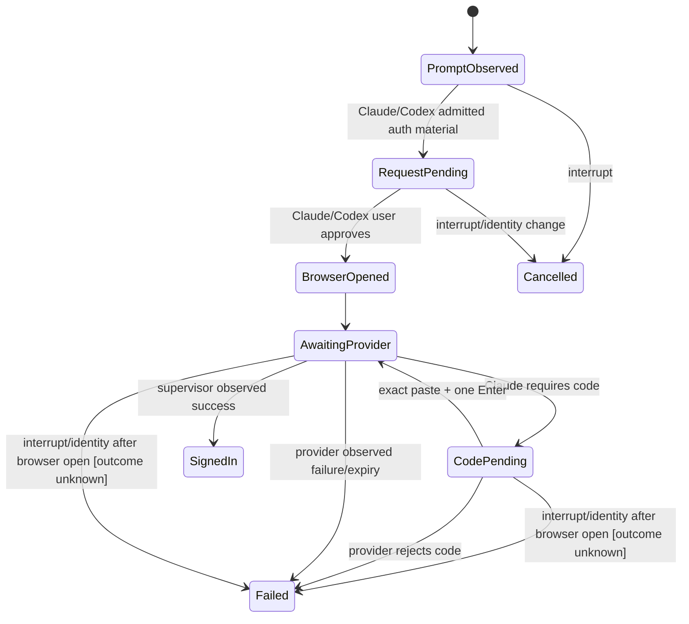

# PRD-LA-002: Handoffs de autenticación de proveedores

**Estado:** Ready
**Depende de:** LA-001; el subflujo Codex loopback depende además de LA-004
**Normativa:** RFC 2119/8174.

## Problema

Claude y Codex poseen topologías de login distintas. El checkout actual detecta URLs admitidas en bytes del PTY y puede abrirlas, pero `spawn` del navegador no prueba login y el guard de paste está acoplado a URL. OpenCode no es un `BrowserActionProvider` ni un proveedor de acciones locales: su TUI remoto guía al usuario por `/connect` para elegir/autenticar proveedor y `/models` para elegir modelo. Los errores observados incluyen paste fragmentado, códigos inválidos y estados visuales que confunden “browser abierto” con “signed in”.

## Objetivos

- **G2.1:** completar Claude y Codex sin perder, duplicar o revelar bytes de autenticación.
- **G2.2:** representar cada topología mediante un registry verificable, no ramas dispersas.
- **G2.3:** hacer visible y veraz el journey OpenCode: attach remoto, `/connect`, `/models` y estado remoto privado sin crear una acción local.

## No-objetivos

No almacenar credenciales del proveedor en CUNA, leer keychains, sincronizar auth files, automatizar browser control, asumir éxito por abrir una URL, ni habilitar para OpenCode browser, device UI, callbacks, paste, archivos, puertos, shell u otra acción local.

## Diseño e interfaces

```ts
type ProviderId = "claude-code" | "codex" | "opencode";
type AuthTopology = "browser_paste_code" | "device_code" | "loopback_callback" | "provider_defined";

interface ProviderAuthDescriptor {
  provider: ProviderId;
  enabled: boolean;
  topologies: readonly AuthTopology[];
  admittedOrigins: readonly string[];
  completionProbe: "supervisor_observation";
}
```

Registry inicial:

| Provider | Estado | Topología |
|---|---|---|
| Claude | enabled | browser + paste code |
| Codex | enabled | device code; loopback callback sólo mediante LA-004 |
| OpenCode | enabled para attach, sin acciones locales | `provider_defined`: TUI remoto `/connect`, luego `/models`; cero `LocalActionKind`, browser, device UI, paste o callback |

El detector PTY es un `provider_adapter` de compatibilidad, no un parser general de instrucciones. Las URLs de `browser.open` se admiten por HTTPS, hostname y path exactos para Claude/Codex. `CapturedCodeBytes` se define como el input opaco tras retirar únicamente el framing completo de bracketed paste y los CR, LF o CRLF terminales; el interior se preserva byte por byte incluso si no es UTF-8. El commit transmite `CapturedCodeBytes || 0x0d` exactamente una vez. El guard actual sólo bloquea paste de URL y deberá ampliarse: no constituye hoy un capturador completo de código.

OpenCode no tiene descriptor CUNA de device/browser. La CLI sólo conserva su identidad de AgentSession para adjuntar el terminal y para proyectar, si existe, una observación remota privada y redactada. El texto PTY —incluidos URL, código o instrucciones— es salida del TUI remoto, no una solicitud ni una autorización de acción local.

## Requisitos EARS

| ID | Requisito | Fuerza | Goal |
|---|---|---:|---|
| R2.1 | WHEN Claude o Codex emiten una URL de auth conocida y admitida, el adaptador SHALL producir `browser.open` ligado a la identidad terminal actual. | MUST | G2.1 |
| R2.2 | IF una URL no coincide exactamente con el descriptor del proveedor, THEN el adaptador SHALL dejarla como texto y SHALL NOT abrirla. | MUST | G2.1 |
| R2.3 | WHEN el usuario pega un código Claude, la CLI SHALL preservar los bytes del código y SHALL enviar exactamente un Enter. | MUST | G2.1 |
| R2.4 | WHEN Claude/Codex abren un navegador, el estado de auth SHALL ser `awaiting_remote_completion`, no `succeeded`. | MUST | G2.1 |
| R2.5 | WHEN el supervisor prueba éxito o fallo mediante `auth.result.observe`, esa operación SHALL permanecer remota y privada, publicar sólo el resultado agregado ligado a la sesión/epoch/generación exactos y jamás tratar texto PTY o apertura de browser como `SignedIn`. Para OpenCode, esta observación SHALL NOT cruzar el broker ni autorizar una acción local. | MUST | G2.1, G2.2,G2.3 |
| R2.6 | WHERE Codex presenta device code, la CLI SHALL mostrar código, URL, expiración y acción de copiar sin leer el clipboard. | MUST | G2.1 |
| R2.7 | WHERE el proveedor sea OpenCode, la CLI SHALL ofrecer sólo attach de TUI remoto y la guía `/connect` seguida de `/models`; el registry SHALL exponer cero `LocalActionKind` y SHALL rechazar cualquier request OpenCode antes de cola, consentimiento, browser, device UI o adaptador. | MUST | G2.3 |
| R2.8 | IF Ctrl-C ocurre durante auth, THEN la CLI SHALL cancelar el handoff sin consumir ni repetir input pendiente. | MUST | G2.1 |
| R2.9 | WHEN un handoff Claude/Codex post-commit produce un resultado, la CLI SHALL cachearlo y retransmitirlo sólo con el mismo request/digest/identidad hasta ACK exacto, expiry o fencing; jamás SHALL reejecutar el efecto por reconnect. | MUST | G2.1 |

## State machine, event/dataflow graph



```text
Claude/Codex PTY bytes -> incremental detector -> admitted descriptor -> broker request
user approval -> OS browser opener -> provider flow -> PTY/supervisor observation
opaque user bytes -> paste guard -> PTY input -> provider result -> redacted UI
OpenCode attach -> remote TUI `/connect` -> remote TUI `/models` -> optional private supervisor observation
```

La precedencia de eventos SHALL ser `prompt < request < approval < open < observation < terminal-result`; los eventos pueden fragmentarse, pero no reordenarse por request.

Refinamiento hacia LA-001: para Claude/Codex, `PromptObserved→detected`, `RequestPending→validated|pending_user`, `BrowserOpened→executing(effectCommit=committed)`, `AwaitingProvider|CodePending→awaiting_remote_completion`, `SignedIn→succeeded`, `Failed→failed`, `Cancelled→cancelled` sólo antes de commit. Tras abrir browser, interrupt/expiry sin observación se refina a `failed(outcome_unknown_nonretryable)` y su resultado queda cacheado/retransmitible según LA-001/003. OpenCode no entra en esta máquina de acciones: su attach deja el TUI remoto a cargo de `/connect` y `/models`; cualquier estado publicado por observación remota sigue fuera del broker.

## Causal y formal

- URL copiada como auth code → `Invalid code`; mitigación: guard exacto del URL y modo explícito de captura del código.
- browser spawn o texto PTY → falso “Signed in”; mitigación: estado awaiting + observación del supervisor.
- input fragmentado/Enter duplicado → código inválido; mitigación: acumulador byte-preserving y único commit.
- prompt viejo tras reconnect → acción cruzada; mitigación: identity fencing de LA-001.

LTL:

- `G(BrowserOpened -> F(SignedIn ∨ Failed))`; interrupt/expiry sin observación produce `Failed(outcome_unknown_nonretryable)`, nunca cancel/expired post-commit.
- `G(SignedIn -> SupervisorSuccessObserved)`.
- `G(CodeCommitted(r,n) -> ForwardedBytes(r,n)=CapturedCodeBytes(r,n)||0x0d)`.
- `G(OpenCodeLocalActionFrame(r) -> F(RejectedBeforeQueue(r) ∧ ¬LocalEffect(r)))`.
- `G(OpenCodePtyOutput -> ¬BrowserEffect ∧ ¬DeviceEffect ∧ ¬ConsentCard)`.
- `G(ResultCached(r) ∧ ¬ExactAck(r) -> (ResultCached(r) U (ExactAck(r) ∨ Expired(r) ∨ Fenced(r))))`.
- `G(UnadmittedUrl -> !BrowserEffect)`.

Plan de bounded model checking —no ejecutado todavía—: URL/paste dividido en 1–16 chunks; CR, LF y CRLF terminales; marcadores de bracketed paste parciales; UTF-8 inválido/opaco; dos prompts repetidos; reconnect; Enter incrustado; expiry; y Ctrl-C antes, durante y después de captura. Las metas adversarias que el modelo SHALL volver UNSAT son `SignedIn ∧ ¬SupervisorSuccessObserved` y `ForwardedBytes ≠ CapturedCodeBytes||0x0d`; no se afirma ese resultado sin artefacto y ejecución reproducibles.

## Aceptación

- **Given** un URL Claude válido dividido byte a byte, **When** termina de llegar, **Then** se crea un único request.
- **Given** el URL de auth pegado en el prompt de código, **When** el guard lo reconoce, **Then** ningún byte del URL llega al proveedor.
- **Given** un código largo válido, **When** se pega, **Then** el proveedor recibe exactamente sus bytes y un Enter.
- **Given** Codex device auth, **When** el navegador abre, **Then** la UI continúa en `Waiting for Codex sign-in…`.
- **Given** un terminal OpenCode adjunto, **When** el usuario necesita autenticarse, **Then** la CLI lo dirige a `/connect` y después a `/models` dentro del TUI remoto sin abrir browser o device UI local.
- **Given** cualquier request local atribuido a OpenCode, **When** llega, **Then** no se crea una acción, no se muestra consentimiento y no se abre browser o device UI.
- **Given** Ctrl-C, **When** hay un código parcial, **Then** se descarta y el terminal se restaura.

## Trazabilidad

| Goal | Req | Diseño | Tarea | Test |
|---|---|---|---|---|
| G2.1 | R2.1–R2.6, R2.8 | adapters + paste guard + observer | T2-auth | TC2-fragment, TC2-paste, TC2-device, TC2-cancel |
| G2.2 | R2.2, R2.5 | descriptor registry | T2-registry | TC2-origin, TC2-observe |
| G2.3 | R2.5,R2.7 | registry sin kinds OpenCode + guía de attach TUI + observación remota privada | T2-opencode-tui | `test/local-action-broker.test.mjs`, `test/local-browser-action.test.mjs`, `test/terminal-foreground.test.mjs`, `test/progressive-command-disclosure.test.mjs` |

## Calidad

Puntuación re-auditada: claridad 2, completitud 2, consistencia 2, verificabilidad 2, factibilidad 1, trazabilidad 2, problem-first 2, no-goals 2, métricas 1 = **16/18**. Las cotas y oracles de aceptación son medibles. El recorrido real de `/connect`/`/models` está delimitado como TUI remoto; la observación remota privada sigue como `TEST-TARGET` hasta ejecutarse contra un proceso OpenCode real.
