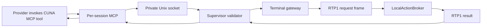
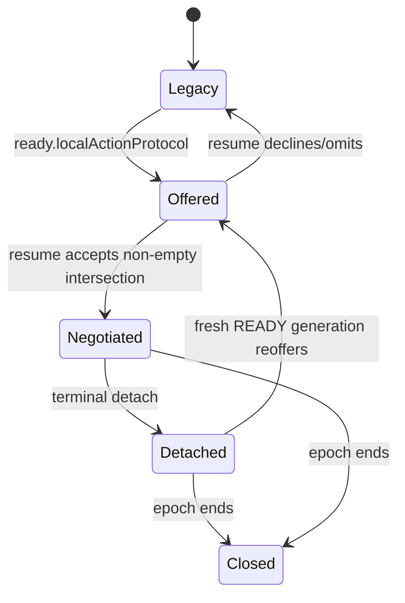

# PRD-LA-003: Adaptador MCP remoto y extensión RTP1

**Estado:** Implementado en fuente cross-repo; runtime/producción sin verificar
**Depende de:** LA-001
**Normativa:** RFC 2119/8174.

## Problema y estado actual

RTP1 ya encuadra terminal input/output y controles en frames con magic `RTP1`, versión 1, secuencia uint64, payload máximo de 1 MiB y tipos 1–10. Un frame crítico desconocido cierra fail-closed; uno no crítico se ignora. `ready` prueba AgentSession, process epoch y fencing generation. La fuente coordinada de CLI/gateway/supervisor ahora añade el canal negociado 11–16 para solicitudes y resultados locales; este PRD no lo trata como evidencia de una VM desplegada ni de un proveedor autenticado.

Existe además una ambigüedad bloqueante: el contrato API de AgentSession usa `workspaceGeneration:number` para la generación del WorkspaceBinding, mientras el dispatch/supervisor actual transporta `workspace_generation:string` derivado de `machine.version`. Ese valor no prueba el binding. La extensión no puede reutilizarlo ni convertirlo implícitamente.

Interpretar texto arbitrario del PTY para nuevas capacidades sería inseguro. A la vez, un MCP que ejecutara localmente dentro de la VM no puede operar el dispositivo del usuario. Se requiere una ruta estructurada donde el MCP sólo solicite, el supervisor transporte y el broker local decida.

## Objetivos

- **G3.1:** transportar requests/resultados tipados sin alterar bytes del PTY.
- **G3.2:** aislar un MCP por AgentSession y evitar autoridad local en VM/supervisor.
- **G3.3:** mantener compatibilidad con peers que no negocian la extensión.

## No-objetivos

No MCP genérico con shell/filesystem local, multiplexación entre usuarios, socket compartido entre sesiones, cambios de semántica de frames 1–10, protocolo alterno por texto ni ninguna superficie de acción local para OpenCode.

## Contratos

### Negociación

Campos aditivos en payload JSON:

```ts
interface LocalActionProtocolOffer {
  name: "cuna.local-actions.v1";
  maxRequestBytes: number;
  maxResultBytes: number;
  streamWindowBytes: number;
  kinds: readonly LocalActionKind[];
}

// server ready
localActionProtocol?: LocalActionProtocolOffer;
// client resume
localActionProtocol?: { name: "cuna.local-actions.v1"; acceptedKinds: readonly LocalActionKind[] };
```

Tipos RTP1 reservados:

| Código | Nombre | Dirección | Critical tras negociación |
|---:|---|---|---|
| 11 | `local_action_request` | server→client | sí |
| 12 | `local_action_result` | ambas: outcome client→server; ACK server→client | sí |
| 13 | `local_stream_open` | ambas | sí |
| 14 | `local_stream_data` | ambas | sí |
| 15 | `local_stream_close` | ambas | sí |
| 16 | `local_stream_window_update` | ambas | sí |

Antes de opt-in, los tipos 11–16 SHALL NOT emitirse. `ready` sólo ofrece y `resume` acepta; el gateway mantiene una bandera `localActionsNegotiated` separada de `attached`. `EnabledKinds = OfferedKinds ∩ ClientImplementedKinds ∩ ProjectRequestCeiling`. Un peer viejo jamás recibe un tipo desconocido. Después del opt-in bilateral, 11–16 son críticos y una dirección ilegal es error de protocolo. Esto exige implementación coordinada CLI/gateway/supervisor.

`ClientImplementedKinds` se calcula por attachment, no como un superset global del foreground: Claude admite `browser.open`; Codex admite `browser.open` y `auth.device.present`; OpenCode y cualquier sesión desconocida admiten `∅`. Por ello una oferta OpenCode no genera `resume.localActionProtocol`, los frames 11–16 permanecen ilegales para ese attachment y un frame posterior falla antes del broker.

Payloads cerrados adicionales:

```ts
type LocalActionResultFrame =
  | { message: "outcome"; requestId: string; argumentsDigest: string; result: LocalActionResult<LocalActionKind> }
  | { message: "ack"; requestId: string; argumentsDigest: string };
interface LocalStreamOpen { streamId: string; requestId: string; direction: "local_to_remote"|"remote_to_local"; initialCreditBytes: number; }
interface LocalStreamData { streamId: string; offset: number; bytesBase64url: string; decodedLength: number; chunkSha256: string; }
interface LocalStreamClose { streamId: string; finalOffset: number; reason: "completed"|"cancelled"|"failed"|"expired"; }
interface LocalStreamWindowUpdate { streamId: string; acknowledgedOffset: number; creditBytes: number; }
```

Todos rechazan campos desconocidos, valores fuera de cotas negociadas, IDs ajenos y offsets no contiguos.
Un ACK es **exacto** sólo si `requestId` y `argumentsDigest` coinciden con el
resultado cacheado y la conexión que lo transporta vuelve a probar la misma
identidad `(session,processEpoch,attachmentGeneration)`; un ACK no puede
consumir un resultado por coincidencia parcial.

### MCP por AgentSession

El supervisor crea el MCP broker bajo un principal dedicado sin credenciales de proveedor ni del dispositivo local; el proveedor usa un cliente stdio mínimo con una capability de socket impredecible y ligada a la sesión. Si la plataforma no puede probar principal dedicado, peer UID, capability y cleanup, el MCP local-action queda `unsupported`. El socket es privado para `(AgentSession,processEpoch)`, se nombra por ID opaco, no se reutiliza entre epochs y se elimina al terminar/cambiar process epoch. Config y capability son efímeras y se eliminan con el proceso.

- Claude: config efímera y argumentos `--mcp-config`/`--strict-mcp-config`.
- Codex: overlay efímero `mcp_servers` sin mutar config global.
- OpenCode: puede recibir configuración efímera de sesión para su runtime, pero no recibe herramientas MCP de acción local. Su autenticación y selección de modelo ocurren en su TUI remoto mediante `/connect` y `/models`. `auth.result.observe`, si se ofrece, permanece en el supervisor remoto privado y no es una capacidad del dispositivo ni un frame de broker.

El MCP expone una herramienta distinta por `LocalActionKind`, cada una generada desde su schema cerrado. No existe `invoke`, `exec`, URI genérica ni herramienta que acepte un nombre de capacidad arbitrario.

## Requisitos EARS

| ID | Requisito | Fuerza | Goal |
|---|---|---:|---|
| R3.1 | WHEN `ready` ofrece el protocolo, el cliente SHALL aceptar únicamente la intersección de kinds implementados y permitidos. | MUST | G3.1, G3.3 |
| R3.2 | WHILE no exista aceptación mutua, ambos peers SHALL NOT emitir frames 11–16. | MUST | G3.3 |
| R3.3 | WHEN llega un frame de acción, el receptor SHALL validar dirección, secuencia, tamaño, schema y la identidad completa —incluido workspace binding/generation— antes de entregarlo. | MUST | G3.1 |
| R3.4 | IF un frame está duplicado, regresivo o ligado a otra identidad, THEN el receptor SHALL cerrar el flujo afectado sin ejecutar efecto. | MUST | G3.1, G3.2 |
| R3.5 | El supervisor SHALL crear exactamente un endpoint MCP privado por AgentSession/epoch. | MUST | G3.2 |
| R3.6 | El proceso MCP SHALL NOT poseer credenciales o APIs del dispositivo local. | MUST | G3.2 |
| R3.7 | WHEN se desconecta el terminal, el protocolo SHALL cancelar requests pre-efecto y streams pendientes y el MCP SHALL responder `local_client_unavailable`; outcomes post-commit SHALL permanecer cacheados según R3.12; el endpoint MCP SHALL permanecer vivo para reattach y cerrará sólo al terminar/cambiar process epoch. | MUST | G3.2 |
| R3.8 | WHERE el proveedor sea OpenCode, el runtime SHALL anunciar cero `LocalActionKind`, el MCP SHALL exponer cero herramientas de acción local y el cliente SHALL rechazar cualquier request OpenCode antes de cola, consentimiento o adaptador. Ningún request OpenCode SHALL causar browser, device UI ni otro efecto local. La autenticación SHALL permanecer en el TUI remoto `/connect`/`/models`; `auth.result.observe`, si existe, SHALL ser una observación remota privada fuera del broker. | MUST | G3.2,G3.3 |
| R3.9 | El MCP SHALL exponer sólo herramientas cerradas por kind/schema y SHALL NOT exponer un dispatcher genérico. | MUST | G3.2 |
| R3.10 | El productor SHALL transportar campos no ambiguos `workspace_binding_id` y `workspace_binding_generation:number`; el campo actual SHALL renombrarse semánticamente a `machine_generation`/`machine_version`. | MUST | G3.1, G3.2 |
| R3.11 | WHILE esa identidad de binding no esté probada por supervisor/READY o evidencia enlazada, el broker SHALL NOT aceptar desde MCP acciones dependientes del workspace. | MUST | G3.2 |
| R3.12 | WHEN el CLI produce un resultado, SHALL cachearlo por `(requestId,argumentsDigest,identity)` hasta ACK exacto, expiry o fencing; reconnect con la misma identidad nuevamente probada SHALL retransmitir el mismo resultado sin reejecutar. | MUST | G3.1 |
| R3.13 | IF el resultado deja de estar disponible por expiry o fencing sin ACK, THEN el supervisor SHALL terminar la llamada como `outcome_unknown_nonretryable`; un retry explícito sólo puede reusar el mismo ID/digest mientras exista cache y coincida la identidad. | MUST | G3.1 |

## Call graph, CFG y event graph



CFG de request: `MCP decode → socket peer check → session/epoch bind → schema/cota → RTP sequence → broker → result → reverse validation → MCP response`. Cada error entra a `typed failure → stream cleanup`; nunca al PTY output.

Event graph: `mcp.started < socket.ready < terminal.ready < protocol.offered < protocol.accepted < tool.called < request.frame < effect.commit? < local.result < result.ack < tool.returned`. `detach` cancela requests pre-efecto y streams, pero conserva outcomes post-commit cacheados; no precede a `socket.closed`. `epoch.changed|process.terminated` sí precede a `socket.closed`. Un resultado pendiente no cruza identidad: se retransmite sólo bajo una generación nuevamente probada, con el mismo request ID/digest/identity y sin reejecución; ACK ajeno no lo consume y expiry o fencing sin ACK termina en `outcome_unknown_nonretryable`.



## CSP, temporal logic y model checking

Canales CSP por sesión: `mcp_s`, `supervisor_s`, `rtp_s`, `broker_s`; no existe canal compartido de request/result. Composición paralela sincroniza sólo eventos con el mismo `sessionId,epoch,generation`.

```text
AcceptedKinds = OfferedKinds ∩ ClientImplementedKinds ∩ PolicyKinds
provider = opencode => OfferedKinds = AcceptedKinds = ∅
frame.type ∈ {11..16} => Negotiated(frame.connection)
request.session = connection.session
request.workspaceBindingId = proven.workspaceBindingId
request.workspaceBindingGeneration = proven.workspaceBindingGeneration
activeSocket(session,epoch) <= 1
Σ unackedStreamBytes(stream) <= windowBytes
```

LTL: `G(Frame11to16 -> Negotiated)`, `G(RequestAccepted -> F ResultOrCancel)`, `G(ResultProduced ∧ !ExactAck -> (Cached U (ExactAck ∨ Expired ∨ Fenced)))`, `G(Retransmit -> SameRequestIdDigestIdentity ∧ !Reexecute)`, `G(EpochEnded -> F NoMcpSocketForEpoch)`, `G(SessionA != SessionB -> !Consumes(A,FrameOfB))`, `G(Detach -> F NoPendingStreams)`, `G(OpenCodeLocalActionFrame -> F(RejectedBeforeQueue ∧ ¬LocalEffect))`. CTL: `AG(Recoverable -> AF Idle)` bajo fairness para streams; detach conserva endpoint MCP y outcome cache post-commit.

Plan de bounded model checking —no ejecutado todavía—: 2 sesiones, 2 epochs, 2 connections por resume, secuencias 0–5, payload fragmentado, frame duplicado/reordenado, disconnect antes/después de outcome/ACK y unknown critical/non-critical. Propiedades por verificar: no cross-session delivery, no frame 11–16 pre-negociación, no socket huérfano, ventana nunca negativa/sobrepasada y ningún efecto reejecutado por pérdida de resultado. Ninguna se considera probada sin modelo y resultado reproducibles.

## Aceptación

- **Given** un peer sin oferta, **When** conecta, **Then** sólo usa frames 1–10.
- **Given** una oferta compatible, **When** el cliente acepta dos kinds, **Then** el servidor no emite otros kinds.
- **Given** dos AgentSessions, **When** llaman simultáneamente, **Then** cada resultado vuelve sólo a su MCP.
- **Given** un frame de generación anterior, **When** llega, **Then** no alcanza al broker.
- **Given** un resultado perdido antes de ACK, **When** reattach prueba la identidad, **Then** se retransmite con mismo ID/digest sin repetir el efecto.
- **Given** sólo el `workspace_generation` string legado del supervisor, **When** el MCP solicita una acción de workspace, **Then** se rechaza como identidad no probada.
- **Given** binding ID y generation numérica enlazados a READY, **When** llegan en el request, **Then** deben coincidir exactamente antes de encolarse.
- **Given** detach durante stream, **When** cleanup termina, **Then** los streams, requests y buffers del attachment quedan cerrados; el endpoint MCP del epoch permanece listening para reattach hasta que termine ese process epoch.
- **Given** una sesión OpenCode, **When** su runtime arranca, **Then** recibe cero herramientas MCP de acción local y el usuario usa `/connect`, seguido de `/models`, dentro de su TUI remoto.
- **Given** cualquier request/frame local atribuido a OpenCode, **When** llega al cliente o broker, **Then** se rechaza antes de cola, consentimiento, adaptador o efecto; `auth.result.observe`, si existe, permanece remoto y no crea una tarjeta de consentimiento local.

## Trazabilidad

| Goal | Req | Diseño | Tarea | Test |
|---|---|---|---|---|
| G3.1 | R3.1, R3.3–R3.4, R3.10, R3.12–R3.13 | codec 11–16 + identity/result validators | T3-codec, T3-binding-identity, T3-result-cache | TC3-fragment, TC3-sequence, TC3-binding, TC3-lost-result |
| G3.2 | R3.5–R3.7, R3.9–R3.11 | MCP/socket per session + closed tools | T3-mcp, T3-cleanup | TC3-isolation, TC3-detach, TC3-no-generic-tool, TC3-unproven-binding |
| G3.3 | R3.2,R3.8 | `acceptedKinds` por attachment + registry sin actions OpenCode | T3-negotiation | TC3-old-peer, `test/local-action-broker.test.mjs`, `test/terminal-foreground.test.mjs` |

## Dependencias y calidad

La fuente coordinada de Infra puede transportar `machineGeneration`,
`workspaceBindingId` y `workspaceBindingGeneration` y negociar RTP1 11–16 para
los proveedores que tengan kinds admitidos. Este PRD no afirma que esas fuentes
estén desplegadas, que una VM acepte el overlay MCP ni que el journey humano de
OpenCode haya pasado. La CLI no requiere ni registra un controlador OpenCode de
acción local: el adapter PTY de LA-002 sigue siendo compatible para Claude/Codex
y OpenCode no convierte texto PTY en acciones locales.

Puntuación re-auditada: 2+2+2+2+1+1+2+2+1 = **15/18**. Secuencias, tamaños, ventanas y deadlines son métricas verificables; el modelo RTP específico y cache/ACK/retransmit permanecen pendientes, y el checker LA-001 sólo cubre una abstracción de cache.
