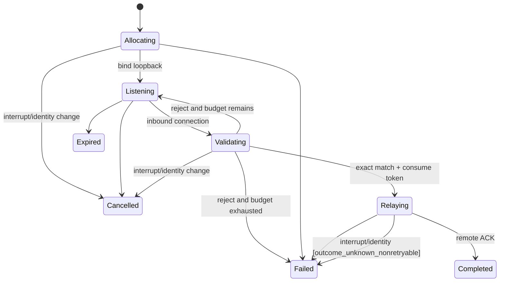

# PRD-LA-004: Callback relay y port forwarding privado

**Estado:** Ready con dependencia cross-repo
**Depende de:** LA-003
**Normativa:** RFC 2119/8174.

## Problema

Algunos logins y previews remotos anuncian `localhost`, pero ese loopback pertenece a la VM, no al equipo del usuario. Abrir el browser local sin relay deja al proveedor esperando en otro host. Resolverlo con un proxy genérico crearía un túnel reutilizable e impropio para una acción puntual.

## Objetivos

- **G4.1:** entregar un callback OAuth exacto desde loopback local al proceso remoto correcto.
- **G4.2:** permitir forwarding privado temporal sólo para destinos loopback remotos explícitos.
- **G4.3:** asegurar cierre, límites y aislamiento incluso bajo reconnect/cancelación.

## No-objetivos

No bind público, SOCKS, VPN, proxy HTTP general, forwarding local→red remota, selección arbitraria de host, redirects, reutilización de listener OAuth ni exposición después de detach.

## Contratos

```ts
interface AuthCallbackRelayArgs {
  provider: "codex" | "opencode";
  localPath: string;
  expectedStateDigest: string;
  expectedNonceDigest: string;
  exactLocalPort: number;
  remoteLoopbackPort: number;
  deadlineMs: number;
}

interface PortForwardArgs {
  remoteHost: "127.0.0.1" | "::1";
  remotePort: number;
  requestedLocalPort: 0 | number;
  purpose: "preview" | "provider_callback" | "registered_service";
  deadlineMs: number;
}
```

`requestedLocalPort:0` solicita asignación del SO. El resultado sólo contiene local host/port, expiración y stream ID; jamás secretos de query o body.
Para callback OAuth, `exactLocalPort` SHALL estar entre 1 y 65535 y coincidir con el redirect URI ya emitido; el valor 0 sólo es válido para forwarding genérico antes de publicar una URL. El orden fijo es `bind → probar dirección exacta → abrir browser → aceptar/consumir una vez → relay → close`.

El parser callback admite sólo `GET`, host/port/path exactos, request-line y headers con límite fijo, body vacío y percent-decoding estricto exactamente una vez. Requiere exactamente un `state` y exactamente uno de `code|error`; claves reservadas duplicadas, encoding inválido o fragmento son rechazo. Sólo el objeto normalizado `{state,code? ,error?}` cruza al remoto, nunca el HTTP crudo. `expectedNonceDigest` se revalida contra el envelope/listener almacenado antes de aceptar la conexión; no se compara contra bytes del callback ni inventa un parámetro OAuth adicional.

## Requisitos EARS

| ID | Requisito | Fuerza | Goal |
|---|---|---:|---|
| R4.1 | WHEN se aprueba un callback relay, el adaptador SHALL bindear antes de abrir el browser, sólo en `127.0.0.1` y opcionalmente `::1`, usando el puerto/path exactos del redirect URI y por una única solicitud válida. | MUST | G4.1 |
| R4.2 | WHEN llega el callback, el relay SHALL comparar path, método, state digest y deadline contra el request, y SHALL revalidar el nonce digest contra el envelope/listener almacenado, antes de transmitirlo. | MUST | G4.1 |
| R4.3 | IF el callback es inválido, duplicado o tardío, THEN el relay SHALL responder localmente con fallo y SHALL NOT enviarlo al remoto. | MUST | G4.1, G4.3 |
| R4.4 | WHEN se abre un port forward, ambos extremos SHALL ser loopback y el destino SHALL coincidir con el request aprobado. | MUST | G4.2 |
| R4.5 | WHILE un stream está abierto, el protocolo SHALL aplicar ventana de bytes, máximo de conexiones y deadline. | MUST | G4.2, G4.3 |
| R4.6 | WHEN ocurre detach, cambio de identidad, expiry o Ctrl-C, el adaptador SHALL cerrar listeners, sockets y streams. | MUST | G4.3 |
| R4.7 | El adaptador SHALL NOT seguir redirects ni reenviar headers hop-by-hop, cookies locales o credenciales no pertenecientes al callback. | MUST | G4.1 |
| R4.8 | WHEN un callback válido es aceptado, el relay SHALL consumir atómicamente el token one-shot antes de esperar al remoto; intentos y conexiones inválidos SHALL tener un presupuesto acotado. | MUST | G4.1, G4.3 |
| R4.9 | IF método, host, path, encoding, cardinalidad de parámetros, headers o body incumplen el parser exacto, THEN el relay SHALL rechazar antes de transmitir. | MUST | G4.1 |

## State machine y dataflow



```text
browser -> local loopback listener -> exact HTTP parser -> RTP stream
        -> remote supervisor -> remote loopback target -> response
        -> bounded RTP response -> local browser -> close all endpoints
```

## Petri net/CSP y lógica

Tokens: `port(localPort)`, `stream_slot`, `byte_window`, `request_lifecycle`. `bind` consume port; `open` consume stream; cada data frame consume ventana hasta ACK; `close` devuelve todos. P-invariantes: `port_free+port_bound=1`, `stream_free+stream_open=STREAM_MAX`, `window_free+unacked=WINDOW_MAX`, `lifecycle=1/request`.

```text
localBindHost ∈ {127.0.0.1, ::1}
remoteHost ∈ {127.0.0.1, ::1}
1 <= port <= 65535
inflightBytes <= windowBytes
acceptedCallbacks <= 1
invalidAttempts <= INVALID_ATTEMPT_MAX
```

LTL: `G(Forwarding(r) -> LocalLoopback(r) ∧ RemoteLoopback(r) ∧ Approved(r))`, `G(CallbackAccepted(r) -> ExactStateMatch(r))`, `G(Completed(r) -> G !CallbackAccepted(r))`, `G(CancelOrDetach(r) -> F NoOpenSockets(r))`. CTL: `AG(Recoverable(r) -> AF Closed(r))` bajo fairness.

Plan de bounded model checking —no ejecutado todavía—: 2 sesiones, 3 puertos, 2 conexiones, callback válido/incorrecto/duplicado, carrera de dos callbacks válidos, cancelación antes/durante relay, stream reorder y backpressure. Buscar port collision, cross-session bytes, segundo callback aceptado y socket huérfano; no se afirma ausencia de contraejemplos sin ejecución reproducible.

## Aceptación

- **Given** un callback válido, **When** llega una vez, **Then** se transmite al destino exacto y el listener cierra.
- **Given** state incorrecto, **When** llega, **Then** ningún byte cruza al remoto.
- **Given** un request de `0.0.0.0` o destino no loopback, **When** se valida, **Then** se rechaza antes de bind/connect.
- **Given** dos sesiones con el mismo puerto solicitado, **When** compiten, **Then** una obtiene el token y la otra recibe fallo seguro.
- **Given** Ctrl-C con streams activos, **When** cleanup termina, **Then** no queda listener o socket.

## Trazabilidad

| Goal | Req | Diseño | Tarea | Test |
|---|---|---|---|---|
| G4.1 | R4.1–R4.3, R4.7–R4.9 | one-shot relay | T4-callback | TC4-valid, TC4-state, TC4-duplicate, TC4-parser |
| G4.2 | R4.4–R4.5 | loopback stream adapter | T4-forward | TC4-host, TC4-window |
| G4.3 | R4.3, R4.5–R4.6 | tokens + cleanup | T4-lifecycle | TC4-race, TC4-cancel |

## Calidad

Puntuación re-auditada: 2+2+2+2+1+1+2+2+1 = **15/18**. Las cotas de puertos, streams, bytes e intentos son métricas verificables; la factibilidad runtime depende de LA-003 y los módulos aislados no equivalen a disponibilidad desde `cuna`.
